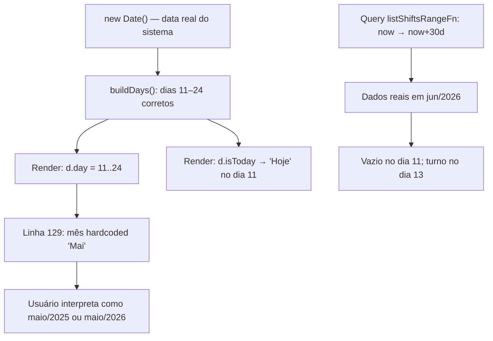

# Auditoria Forense — Página Escalas (Data “Congelada” em Maio)

**Data da auditoria:** 11/06/2026  
**Escopo:** Identificação de causa raiz — **sem alterações** em código, banco, staging ou configuração.  
**Ambiente investigado:** Repositório `MedFlow-IA` + staging `https://staging.medicflow.app.br` (consulta read-only)  
**Sintoma reportado:** `/escalas` exibe período aparente **11/05 → 24/05** mesmo com o calendário real em **junho/2026**.

---

## Resumo executivo

| Pergunta | Resposta |
|----------|----------|
| Existe bug? | **Sim** — rótulo de mês hardcoded como `"Mai"` no calendário |
| Existe seed congelada em maio? | **Não** — nenhum INSERT de `shifts` com datas fixas em maio |
| Existe cache congelando maio? | **Não** — TanStack Query usa `staleTime` de 10–12 s; sem persistência de datas |
| Existe regra de negócio intencional? | **Não** — a regra documentada é “próximos 14 dias” a partir de `new Date()` |
| Os dados existem só em maio? | **Não** — staging tem 1 turno em **13/06/2026**; zero registros em maio |

**Causa raiz:** bug de apresentação na UI (`escalas.tsx`, linha 129). Os **números do dia** (11–24) refletem a data real do sistema; o **nome do mês** está fixo em `"Mai"`, gerando a leitura visual **“Mai 11 … Mai 24”** = maio, independentemente do mês corrente.

**Severidade:** **Média** — impacto visual/comercial alto em demo; lógica de datas e queries operam corretamente.

---

## FASE 1 — Auditoria da UI

### 1.1 Componente que renderiza o calendário

| Item | Valor |
|------|-------|
| Rota | `/escalas` |
| Arquivo | `src/routes/escalas.tsx` |
| Componente | `EscalasPage` (exportado como `component` da rota TanStack Router) |
| Layout | Barra horizontal de 14 botões (`RANGE_DAYS = 14`) + listagem de turnos filtrada por dia selecionado |

### 1.2 Como o período é calculado

Função `buildDays()` — **dinâmica**, baseada em `new Date()`:

```39:52:src/routes/escalas.tsx
function buildDays(): { iso: string; day: number; isToday: boolean }[] {
  const out: { iso: string; day: number; isToday: boolean }[] = [];
  const today = new Date();
  today.setHours(0, 0, 0, 0);
  for (let i = 0; i < RANGE_DAYS; i++) {
    const d = new Date(today);
    d.setDate(today.getDate() + i);
    out.push({
      iso: d.toISOString().slice(0, 10),
      day: d.getDate(),
      isToday: i === 0,
    });
  }
  return out;
}
```

- **Início:** hoje (local, zerado à meia-noite).
- **Duração:** 14 dias consecutivos.
- **Subtitle fixo (correto):** `"Próximos 14 dias"`.

**Evidência cruzada (homologação 11/06/2026):** screenshot `07-escalas.png` mostra **“Hoje” no dia 11** — coerente com 11/06/2026, não com 11/05/2026.

### 1.3 Estado local

| Estado | Tipo | Origem | Persistência |
|--------|------|--------|--------------|
| `days` | `useMemo(buildDays, [])` | Calculado no mount | **Não persiste**; recalculado ao remontar a rota |
| `selectedISO` | `useState(days[0].iso)` | Dia selecionado no calendário | **Não persiste** |
| `opsFocus` | URL search (`?opsFocus=`) | Query string | URL apenas |

**Risco secundário (não causa do sintoma “maio”):** `useMemo(..., [])` congela o array de dias enquanto o componente permanece montado (ex.: aba aberta overnight). Isso atrasaria a virada de “Hoje”, mas **não** explicaria rótulo “Mai” em junho.

### 1.4 Data hardcoded — **ENCONTRADA (causa principal)**

```129:129:src/routes/escalas.tsx
                <span className="opacity-70">{d.isToday ? "Hoje" : "Mai"}</span>
```

- Para todo dia que **não** é “Hoje”, o mês exibido é **sempre** `"Mai"`.
- Introduzido no commit `e7db7916` em **01/06/2026** (`git blame` linha 129).
- Presente também no bundle compilado (`dist.bak.20260525175838/server/assets/escalas-CEoeVFwn.js`, linha 88).

**Contraste:** o projeto já possui utilitário correto em `src/lib/queries/adapters.ts`:

```49:78:src/lib/queries/adapters.ts
const MONTHS_PT_SHORT = [
  "Jan", "Fev", "Mar", "Abr", "Mai", "Jun", "Jul", "Ago", "Set", "Out", "Nov", "Dez",
] as const;

export function formatDayMonth(iso: string): string {
  const d = new Date(iso);
  if (Number.isNaN(d.getTime())) return "—";
  return `${pad2(d.getDate())} ${MONTHS_PT_SHORT[d.getMonth()]}`;
}
```

Esse helper **já é usado** na listagem de turnos abaixo do calendário (`formatDayMonth(s.startsAt)`), mas **não** nos botões do calendário.

### 1.5 localStorage / sessionStorage na página Escalas

**Nenhuma** leitura ou escrita de `localStorage`/`sessionStorage` em `escalas.tsx` ou hooks operacionais usados por ela.

Único uso de `sessionStorage` relacionado à app (não Escalas): demo guiada em `guided-demo-service.ts` (`medflow:guided_demo:*`).

---

## FASE 2 — Auditoria das queries

### 2.1 Fluxo de dados

```
EscalasPage
  └─ useShiftsRangeQuery()                    [src/hooks/use-operations.ts]
       └─ listShiftsRangeFn()                [src/lib/operations/api/queries/shifts.ts]
            └─ Supabase: FROM shifts
                 .eq("tenant_id", ctx.tenantId)
                 .gte("starts_at", from)
                 .lte("starts_at", to)
                 .order("starts_at")
                 .limit(200)
```

### 2.2 Hook e cache key

```84:92:src/hooks/use-operations.ts
export const shiftsRangeQueryOptions = (fromISO?: string, toISO?: string) =>
  queryOptions<ShiftListItem[]>({
    queryKey: opsKeys.shiftsRange(fromISO, toISO),
    queryFn: async () => unwrap(await listShiftsRangeFn({ data: { fromISO, toISO } })),
    staleTime: DEFAULT_STALE_MS,  // 10_000 ms
  });

export function useShiftsRangeQuery(fromISO?: string, toISO?: string, opts: ReadOpts = {}) {
  return useQuery({ ...shiftsRangeQueryOptions(fromISO, toISO), ...opts });
}
```

Chamada na página: `useShiftsRangeQuery()` **sem parâmetros** → intervalo default no servidor.

### 2.3 Filtros de data no servidor

```186:205:src/lib/operations/api/queries/shifts.ts
    return runQuery(async (ctx) => {
      const now = new Date();
      const from = data.fromISO ? new Date(data.fromISO) : now;
      const to = data.toISO
        ? new Date(data.toISO)
        : new Date(now.getTime() + 30 * 24 * 60 * 60 * 1000);

      const { data: rows, error } = await ctx.client
        .from("shifts")
        .select(SHIFT_LIST_SELECT)
        .eq("tenant_id", ctx.tenantId)
        .gte("starts_at", from.toISOString())
        .lte("starts_at", to.toISOString())
        // ...
    });
```

| Critério | Usado? |
|----------|--------|
| `CURRENT_DATE` / `NOW()` (SQL) | **Não** — filtro via JavaScript `new Date()` no server function |
| Período fixo (maio) | **Não** |
| Parâmetro manual (`fromISO`/`toISO`) | Opcional; Escalas **não envia** (usa default `now` → `now+30d`) |
| RPC dedicada | **Não** — query direta PostgREST em `shifts` |

### 2.4 Filtro client-side por dia selecionado

```74:77:src/routes/escalas.tsx
  const filtered = useMemo(() => {
    const list = shiftsQuery.data ?? [];
    const byDay = list.filter((s) => s.startsAt.slice(0, 10) === selectedISO);
    return filterShiftsForOpsFocus(byDay, opsFocus);
  }, [shiftsQuery.data, selectedISO, opsFocus]);
```

**Observação de desalinhamento (secundário):** calendário cobre 14 dias; query busca 30 dias. Não causa o sintoma de “maio”, mas é inconsistência de desenho.

---

## FASE 3 — Auditoria dos dados (staging, read-only)

Consulta executada em **11/06/2026** contra tenant demo `medflow-v1-demo` (`9cc7f6f1-4c34-4316-9e06-778f0cbc249e`):

```sql
-- equivalente via Supabase client
SELECT starts_at, ends_at, status FROM shifts
WHERE tenant_id = '<TENANT_ID>'
ORDER BY starts_at;
```

### Resultado

| Métrica | Valor |
|---------|-------|
| Total de registros | **1** |
| Menor `starts_at` | `2026-06-13T10:00:00+00:00` |
| Maior `starts_at` | `2026-06-13T10:00:00+00:00` |
| Registros em maio/2026 | **0** |
| Registros em junho/2026 | **1** |

**Conclusão:** os dados **não** estão congelados em maio. Existe turno futuro em **13/06/2026** (07:00–19:00 BRT), alinhado à homologação documentada em `docs/HOMOLOGACAO_COMPLETA_STAGING.md`.

### Por que o screenshot mostra “Sem plantões nesta data”?

- Dia selecionado por default: **hoje** (`days[0]` → 11/06/2026).
- Único turno: **13/06/2026**.
- Comportamento esperado: vazio no dia 11; turno visível ao clicar no dia **13** (desde que a query carregue o registro).

---

## FASE 4 — Auditoria de seed

| Fonte | Cria shifts? | Datas fixas em maio? |
|-------|--------------|----------------------|
| Migrations SQL (`supabase/migrations/`) | **Não** — apenas DDL/RLS de `shifts` | **Não** |
| `demo-seed-service.ts` | **Não** — só operadoras TISS | **Não** |
| `guided-demo-service.ts` | **Não** — navegação UI | **Não** |
| `scripts/seed-pilot-data.mjs` | **Não implementado** (spec em `PILOT_READY.md`) | Spec usa dias **relativos** |
| Homologação staging | **Manual** via Supabase/API | Turno criado em **13/06/2026** |

**Conclusão:** não há seed operacional congelando maio. Prefixos `202505` nos nomes de migration referem-se ao **timestamp da migration**, não a dados de turnos.

---

## FASE 5 — Auditoria de timezone

### 5.1 Pontos de geração/consumo de datas

| Camada | Mecanismo | Timezone |
|--------|-----------|----------|
| Calendário UI | `new Date()` local + `toISOString().slice(0,10)` | Local → **UTC** na chave ISO |
| Query servidor | `new Date()` + `toISOString()` | Relógio do **Worker Cloudflare** (UTC) |
| Supabase `timestamptz` | Armazenamento UTC | UTC |
| Filtro client | `startsAt.slice(0, 10)` | Prefixo string do ISO retornado |

### 5.2 Risco de deslocamento (secundário)

Em fusos negativos (ex.: BRT UTC−3), usar `toISOString()` para derivar **data civil** pode, em horários próximos à meia-noite, deslocar ±1 dia em relação ao calendário local. **Isso não explica** a exibição sistemática de “Mai” em junho.

### 5.3 Veredito timezone

**Não é causa raiz** do sintoma “maio congelado”. Contribui no máximo para edge cases de matching dia-turno.

---

## FASE 6 — Auditoria de cache

| Mecanismo | Config | Pode congelar “maio”? |
|-----------|--------|------------------------|
| TanStack Query global | `staleTime: 12_000` (`create-query-client.ts`) | **Não** — dados refreshed em ~10–12 s |
| `useShiftsRangeQuery` | `staleTime: 10_000` | **Não** |
| `gcTime` | Não configurado (default 5 min) | **Não** afeta rótulo de mês |
| Prefetch no loader | `shiftsRangeQueryOptions(undefined, undefined)` | **Não** — key sem datas fixas |
| localStorage / sessionStorage | Ausente em Escalas | **Não** |
| Service Worker / PWA | Não investigado em profundidade | Improvável — rótulo “Mai” está no JSX estático |

**Conclusão:** cache **não** explica o mês “congelado”. O texto `"Mai"` é literal no código-fonte.

---

## FASE 7 — Reprodução

### Passo a passo

1. **Login:** `https://staging.medicflow.app.br/login` — tenant `medflow-v1-demo`, usuário `admin.teste@medicflow.app.br`.
2. **Navegar:** menu lateral → **Escalas** (`/escalas`).
3. **Evidência visual:** `docs/screenshots/homologacao-staging/07-escalas.png`.
4. **Data exibida no calendário:**
   - Primeiro botão: **“Hoje”** + dia **11**.
   - Demais botões: **“Mai”** + dias **12 … 24**.
5. **Data real do sistema na homologação:** `2026-06-11T21:52:03Z` (`homologacao-staging-results.json`).

### Interpretação

| O que o usuário vê | O que o código faz |
|--------------------|--------------------|
| Mai 11, Mai 12 … Mai 24 | Jun 11, Jun 12 … Jun 24 (em 11/06/2026) |
| Período “congelado em maio” | Rótulo estático `"Mai"` + números corretos do dia |

### Evidências anexas

- Screenshot: [07-escalas.png](screenshots/homologacao-staging/07-escalas.png)
- Relatório homologação: [HOMOLOGACAO_COMPLETA_STAGING.md](HOMOLOGACAO_COMPLETA_STAGING.md)
- JSON: [evidence/homologacao-staging-results.json](evidence/homologacao-staging-results.json)

---

## FASE 8 — Causa raiz

### Classificação

| Campo | Valor |
|-------|-------|
| **Tipo** | **Bug** (apresentação UI — placeholder não substituído) |
| **Severidade** | **Média** |
| **Confiança** | **Alta** (evidência de código + screenshot + dados staging) |

### Cadeia causal



### O que **não** é causa raiz

- Seed SQL congelada em maio  
- Cache TanStack Query / localStorage  
- Regra de negócio “sempre maio”  
- Relógio do servidor ou Supabase defasado  
- Ausência total de dados (há 1 turno em 13/06/2026)

### Impacto

| Área | Impacto |
|------|---------|
| **UX / Demo comercial** | Alto — calendário transmite mês errado |
| **Operação real** | Baixo — filtros e queries usam ISO real |
| **Confiança do piloto** | Médio — sensação de “ambiente demo desatualizado” |
| **Integridade de dados** | Nenhum |

---

## FASE 9 — Proposta de correção (SEM IMPLEMENTAR)

### 9.1 O que precisa ser alterado

1. **Substituir `"Mai"` hardcoded** por mês derivado de `d.iso` ou de `d.day` + data calculada, reutilizando `MONTHS_PT_SHORT` de `adapters.ts` (ou `formatDayMonth`).
2. **(Recomendado)** Alinhar geração de `iso` em `buildDays()` para data local (ex.: `format` com `getFullYear/getMonth/getDate`) em vez de `toISOString().slice(0,10)`, evitando drift de timezone.
3. **(Recomendado)** Trocar `useMemo(buildDays, [])` por recálculo diário (`useMemo` com dependência de data local, ou invalidação ao focar janela).
4. **(Opcional)** Passar `fromISO`/`toISO` de `buildDays()` para `useShiftsRangeQuery` para alinhar janela de 14 dias entre UI e API.

### 9.2 Arquivos afetados

| Arquivo | Alteração |
|---------|-----------|
| `src/routes/escalas.tsx` | Corrigir rótulo de mês; possivelmente `buildDays` e parâmetros da query |
| `src/lib/queries/adapters.ts` | Opcional: exportar helper `monthShortFromISO(iso: string)` se evitar duplicação |

### 9.3 Risco de regressão

| Risco | Nível | Mitigação |
|-------|-------|-----------|
| Quebra visual do calendário | Baixo | Teste manual em `/escalas` |
| Virada de mês (ex.: 30 Jun → 1 Jul na faixa de 14 dias) | Médio | Validar faixa cruzando fim de mês |
| Match turno × dia (timezone) | Baio | Testar turno noturno 22:00–06:00 BRT |
| Regressão em listagem | Muito baixo | `formatDayMonth` já usado abaixo, inalterado |

### 9.4 Estimativa de esforço

| Item | Esforço |
|------|---------|
| Fix do rótulo “Mai” | **~15–30 min** |
| Ajustes timezone + memo + alinhamento query | **~1–2 h** |
| Teste manual + screenshot homologação | **~30 min** |
| **Total recomendado** | **~2–3 h** |

---

## Apêndice — Checklist das fases

| Fase | Status | Achado principal |
|------|--------|------------------|
| 1 — UI | ✅ | `"Mai"` hardcoded linha 129 |
| 2 — Queries | ✅ | `new Date()` dinâmico; sem maio fixo |
| 3 — Dados | ✅ | 1 turno em 13/06/2026; 0 em maio |
| 4 — Seed | ✅ | Sem seed de shifts |
| 5 — Timezone | ✅ | Risco secundário apenas |
| 6 — Cache | ✅ | Descartado |
| 7 — Reprodução | ✅ | Screenshot 11/06/2026 documentado |
| 8 — Causa raiz | ✅ | Bug UI |
| 9 — Correção | ✅ | Proposta acima (não implementada) |

---

*Auditoria concluída sem modificação de código, banco ou staging.*
