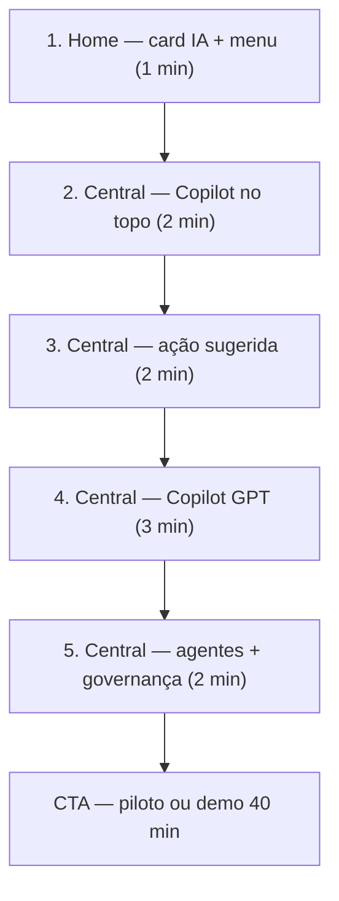

# Demo de IA — 10 Minutos — MedicFlow-AI

**Data:** 11 de junho de 2026  
**Objetivo:** Em 10 minutos, o cliente **percebe**, **entende** e **valoriza** a IA do MedicFlow-AI  
**Público:** Hospitais, cooperativas, escalistas, administradores  
**Base:** [AUDITORIA_UX_IA_MEDICFLOW.md](./AUDITORIA_UX_IA_MEDICFLOW.md)

---

## Por que este roteiro existe

O roteiro comercial padrão de 10 minutos (`MEDICFLOW_DEMO_COMERCIAL.md` §8.2) **corta explicitamente a IA operacional**. Este documento substitui essa lacuna com um fluxo dedicado à percepção de valor da inteligência artificial — sem exigir demo de 40 minutos.

---

## Pré-requisitos (obrigatórios)

| Item | Especificação | Por quê |
|------|---------------|---------|
| **Perfil** | `coordinator` (escalista) | Copilot, agentes e propostas exigem `isOperationalManager` |
| **Chave OpenAI** | `MEDFLOW_OPENAI_API_KEY` no ambiente | Copilot GPT inoperante sem chave — mensagem de erro explícita na UI |
| **Cenário vivo** | Tenant com ≥1 alerta (ideal: cobertura) e scoring ≠ “Saudável” | Demo vazia não vende IA |
| **URL** | `https://staging.medicflow.app.br` ou ambiente cliente | — |
| **Resolução** | 1920×1080 | Painéis legíveis na projeção |
| **Plano B** | Se OpenAI falhar: scoring + recomendações + agentes (sem chat) | `MEDICFLOW_DEMO_COMERCIAL.md` §1.5 |

### Acesso à Central de IA

`/central` está no menu lateral como **Central de IA** (perfis `coordinator`, `tenant_admin`, `super_admin`).

Caminhos alternativos:

1. **Home** → card **IA Operacional** ou link **“Central de IA →”**
2. **Executivo** → quick action “Central de IA Operacional”
3. **URL direta:** `/central`

---

## Mapa da demo (visão geral)

| # | Tela | Tempo | Objetivo de percepção |
|---|------|------:|----------------------|
| 1 | `/` | 1:00 | “Isso é MedicFlow-**AI**” — card IA + menu visível |
| 2 | `/central` | 2:00 | Copilot no topo + risco visível (scoring) |
| 3 | `/central` | 2:00 | “A IA **sugere** o que fazer” |
| 4 | `/central` | 3:00 | “Posso **conversar** com a operação” |
| 5 | `/central` | 2:00 | “Nada acontece sem **humano**” |
| | **Total** | **10:00** | |

---

## Roteiro detalhado

### Etapa 1 — Home: posicionamento (1 min)

**Tela:** `/` (Dashboard do dia)

#### O que mostrar

- Título do browser: “Home — MedicFlow-AI”
- **Menu lateral:** item **Central de IA** (ícone Brain)
- **Card IA Operacional** com alertas, recomendações e propostas pendentes
- Botão **“Abrir Central de IA”**
- Link **“Central de IA →”** no header
- Métricas do dia (plantões, confirmações) — contexto rápido

#### O que falar

> “Vocês estão vendo o MedicFlow-AI — plataforma de operação hospitalar **com inteligência artificial supervisionada**. A IA não fica escondida: o card **IA Operacional** e o menu **Central de IA** mostram sinais em tempo real.”

> “Pergunta rápida: quantas planilhas vocês consultam hoje para saber se o fim de semana está coberto?”

#### Benefício percebido

- Cliente associa marca **AI** ao produto nos **primeiros 30 segundos**
- Contexto operacional real antes do “wow”

#### Ação

Clicar em **“Abrir Central de IA”** (ou menu lateral)

---

### Etapa 2 — Central: Copilot + risco visível (2 min)

**Tela:** `/central` — **Copilot no topo** (logo após faixa de coordenação)

**Ancoras:** `#ops-anchor-copilot-gpt`, scoring, badges de alerta no header

#### O que mostrar

1. **Título:** “Central de IA Operacional”
2. **Copilot** visível sem rolar (contexto + GPT)
3. **Badges no header:** “N crít.” / “N alertas” (se houver)
4. **Pill de urgência:** “Urgência crítica” ou “Urgência elevada” (ideal para demo)
5. **Painel “Scoring operacional”** (rolar levemente se necessário)

#### O que falar

> “Esta é a **Central de IA Operacional**. O Copilot aparece no topo — visibilidade imediata. Atualiza em tempo real via Supabase Realtime.”

> “O **índice de risco** — aqui chamado scoring — consolida cobertura, coordenação e força de trabalho em um semáforo. Hoje está em **[estado]** porque **[ler 1 destaque de risco da tela]**.”

> “Antes do plantão ficar descoberto, o sistema já elevou a urgência para **[crítica/elevada]**. Isso é a IA heurística trabalhando — **sem precisar de ChatGPT**.”

#### Benefício percebido

- “A IA identifica riscos de falta de cobertura” (traduz “Scoring operacional”)
- Antecipação > reação

#### Se scoring estiver “Saudável” (plano B narrativo)

> “Neste ambiente de demo o cenário está estável — em produção, com plantões abertos e swaps pendentes, vocês veriam Atenção ou Crítico. Posso mostrar no material de screenshot do piloto.”

---

### Etapa 3 — Central: ação sugerida (2 min)

**Tela:** `/central` — painel “Recomendações operacionais”

**Rolar** até recomendações (logo abaixo do scoring)

#### O que mostrar

1. Lista de recomendações com badge **IA** e tipo: Mitigação, Pessoal e escalas, Coordenação, etc.
2. Estado: **Sugerido / Recomendado / Urgente** (priorizar Urgente se existir)
3. Badge de forecast com **IA**: **“deterioração”** ou **“projeção crítica”** (se visível)
4. (Opcional) Botões de feedback — Aceita / Dispensada — se `coordinator`

#### O que falar

> “A IA não só mede — **sugere ações**. Esta recomendação de **[tipo]** diz: **[ler título da recomendação]**.”

> “O estado **Urgente** significa que o motor de inteligência priorizou isso com base nos alertas e no scoring que vocês viram.”

> “A projeção de deterioração antecipa que, se nada for feito, a situação **piora na janela operacional** — é heurística explicável, não caixa preta.”

> “O escalista pode dar feedback — Aceita ou Dispensada — e o sistema aprende o que funciona no **seu** hospital.”

#### Benefício percebido

- IA = copiloto de decisão, não só painel
- Loop de melhoria contínua

---

### Etapa 4 — Central: Copilot GPT (3 min)

**Tela:** `/central` — painel **“Copiloto operacional (IA)”**

**Ancora:** `#ops-anchor-copilot-gpt` ou rolar até seção com ícone de chat

#### O que mostrar

1. Card **“Resumo determinístico (auditável)”** — headline + bullets
2. Botão **“Narrativa executiva”** (clicar se tempo permitir — ~15s)
3. Campo **“Pergunta ao copiloto”**
4. Chip de insight sugerido ou pergunta pré-definida
5. Resposta com **“Resposta explicável”** e, se houver, **“Contexto expandido (tools…)”**
6. Footer: “Modelo {model} · correlação {id}”

#### Perguntas sugeridas (escolher 1)

| Pergunta | Quando usar |
|----------|-------------|
| “Qual o maior risco operacional atual?” | Cenário com alertas ativos |
| “Quais turnos têm risco de cobertura neste fim de semana?” | Demo hospital fim de semana |
| “Resuma a pressão de coordenação e swaps pendentes” | Muitos swaps no tenant |
| “O que devo priorizar nas próximas 4 horas?” | Escalista como audiência |

#### O que falar

> “Agora a camada **GPT** — o Copiloto operacional. Ele lê o mesmo contexto que o scoring e as recomendações, mas responde em **linguagem natural**.”

> “Importante: é **read-only**. O copiloto **não confirma plantões**, **não aprova swaps**, **não acessa prontuário**. Foco em operação de escalas.”

> *(Digitar pergunta e enviar)* “Vou perguntar: **[pergunta escolhida]**.”

> *(Após resposta)* “Reparem: a resposta cita dados reais do tenant. O rodapé mostra o modelo e a correlação — **auditável**.”

> “O botão **Narrativa executiva** gera um resumo para diretoria — ideal para reunião de gestão.”

#### Benefício percebido

- “Posso conversar com minha operação em português”
- Diferencial memorável vs. concorrentes “só escala”

#### Plano B (OpenAI indisponível)

> “O Copilot GPT requer chave OpenAI — configuramos no piloto. O que vocês viram até aqui — scoring, recomendações, agentes — **funciona independentemente**. O GPT é o plus de linguagem natural.”

Mostrar painel de contexto do copiloto e agentes.

---

### Etapa 5 — Central: agentes e governança (2 min)

**Tela:** `/central` — **“Agentes operacionais ativos”** + menção a propostas

**Rolar** até agentes (ou ancora `#ops-anchor-operational-agents`)

#### O que mostrar

1. Quatro agentes: **Cobertura**, **Coordenação**, **Risco**, **Recomendações**
2. Estado do agente: Ocioso / Raciocínio / Aguardando revisão
3. Botão **“Atualizar raciocínio”** no agente de Cobertura (executar se tempo)
4. (Rápido) Menção ao painel **“Propostas operacionais (IA supervisionada)”** — estado “Sugerida (IA)”

#### O que falar

> “Por trás do Copilot, há **agentes especializados** — como uma equipe virtual. Este agente de **Cobertura** analisa lacunas de escala.”

> “Política do sistema: **no_autonomous_execution** — nenhum agente executa ação sozinho. Sempre **human-in-the-loop**.”

> “Quando a IA quer propor uma mudança, gera uma **proposta supervisionada** — estado ‘Sugerida (IA)’ — que passa por aprovação, simulação em sandbox e só então execução com rollback.”

> “Isso é o que nos permite vender IA para hospital e cooperativa com **governança** — não é automação selvagem.”

#### Benefício percebido

- Plataforma de IA madura, não “chatbot colado no ERP”
- Compliance e supervisão como diferencial

---

## CTA de fechamento (30 seg — após os 10 min)

### Para diretoria

> “Em 10 minutos vocês viram: risco antecipado, ação sugerida, conversa em português e governança humana. Proponho um **piloto de 30 dias** com KPIs de alertas críticos resolvidos — ou uma demo de 40 minutos com o ciclo financeiro completo.”

### Para escalista / operação

> “O MedicFlow-AI não substitui o escalista — **amplifica**. No piloto, seu time usa a Central de IA diariamente; medimos tempo de resposta a alertas.”

### Para cooperativa

> “Multi-tenant nativo: cada hospital vê sua IA; a cooperativa consolida no executivo. Podemos mapear isso no discovery.”

---

## Adaptação por audiência

| Audiência na sala | Ênfase | Reduzir |
|-------------------|--------|---------|
| **Diretoria / CFO** | Etapa 4 — Narrativa executiva; etapa 2 — risco | Detalhe de agentes |
| **Escalista / Operação** | Etapas 2–4 — scoring, recomendações, pergunta ao Copilot | Governança longa |
| **TI / Compliance** | Etapa 5 — human-in-the-loop, audit trail, read-only | Narrativa comercial |
| **Cooperativa** | Agente de Cobertura + forecast | TISS / financeiro |

---

## O que NÃO mostrar em 10 min

| Cortar | Motivo |
|--------|--------|
| Login / multi-tenant | Assume já logado |
| Plantões / Escalas CRUD | Foco IA; mostrar em demo 20+ min |
| Financeiro / TISS | Fora do escopo IA |
| Orquestração completa | Jargão; mencionar apenas |
| Executar proposta / sandbox | Risco em prod; mostrar estado “Sugerida (IA)” |
| Policy intelligence / memória | Baixa clareza; roadmap de demo 40 min |

---

## Checklist do apresentador

### Antes

- [ ] Menu **Central de IA** visível no sidebar
- [ ] Card **IA Operacional** na Home com contadores
- [ ] `/central` abre sem erro
- [ ] OpenAI responde (testar 1 pergunta)
- [ ] Cenário com alerta ou scoring ≠ Saudável
- [ ] Pergunta do Copilot escolhida
- [ ] Link direto `/central` nos favoritos

### Durante

- [ ] Falar “IA” ou “inteligência” nos primeiros 30 segundos (card Home)
- [ ] Mostrar menu **Central de IA** antes de entrar na rota
- [ ] Traduzir “scoring” → “índice de risco”
- [ ] Mostrar Copilot ao vivo (não só descrever)
- [ ] Reforçar read-only + human-in-the-loop
- [ ] Mencionar que central entrará no menu no piloto

### Depois

- [ ] Enviar `PLANO_COMERCIAL_IA_MEDICFLOW.md` (resumo executivo)
- [ ] Agendar demo 40 min ou piloto 30 dias
- [ ] Registrar objeções (Copilot GPT requer chave OpenAI)

---

## Comparativo: demo 10 min atual vs. demo IA 10 min

| Aspecto | Roteiro atual (`MEDICFLOW_DEMO_COMERCIAL.md`) | Este roteiro |
|---------|-----------------------------------------------|--------------|
| IA operacional | **Cortada** (§8.2 clássico) | **Foco principal** |
| Menu central | **Ausente** (clássico) | **Central de IA** no sidebar |
| `/central` | 2 min — alertas apenas | 7 min — scoring + recomendações + Copilot + agentes |
| Copilot GPT | Não aparece | 3 min dedicados |
| Perfil | Qualquer | `coordinator` obrigatório |
| Cliente percebe IA? | Improvável | **Objetivo explícito** |
| Próximo passo | Demo 40 min | Piloto IA ou demo 40 min |

---

## Evidências de suporte

| Elemento | Arquivo / estado |
|----------|------------------|
| Painéis na central | `src/components/operational/command-center-view.tsx` |
| Título Copilot | `src/components/operational/operational-copilot-gpt-panel.tsx` |
| Menu Central de IA | `src/components/app-shell.tsx` — visível para managers |
| Card IA na Home | `src/components/operational/operational-ia-home-card.tsx` |
| Demo 10 min com IA | `docs/MEDICFLOW_DEMO_COMERCIAL.md` §8.1 |
| Perguntas sugeridas Copilot | `src/lib/operations/copilot-gpt/operational-copilot-narrative-layer.ts` |

---

*Roteiro de demonstração comercial — IA como diferencial perceptível em 10 minutos.*
