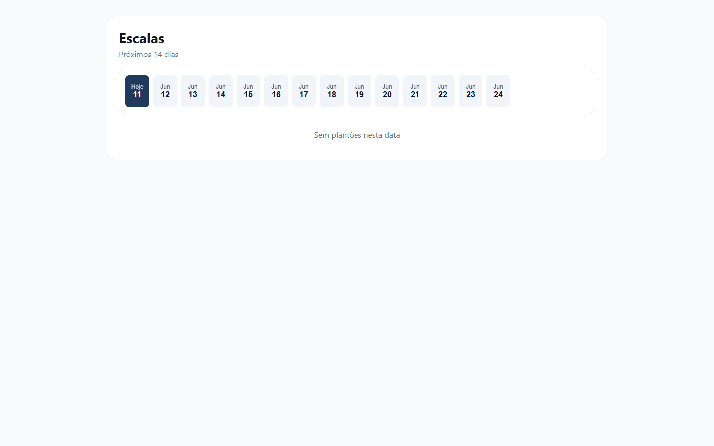

# FIX Escalas — Mês Dinâmico e Auditoria Final do Calendário

**Data:** 11/06/2026  
**Escopo:** Correção do rótulo de mês hardcoded + validação completa do calendário  
**Ambiente:** `https://staging.medicflow.app.br`

---

## Resumo executivo

| Pergunta | Resposta |
|----------|----------|
| **1. Bug corrigido?** | **Sim** — calendário exibe mês dinâmico (`Jun` em jun/2026) |
| **2. Causa raiz?** | String literal `"Mai"` hardcoded em `escalas.tsx` (commit `e7db7916`) |
| **3. Risco de regressão?** | **Baixo** — reutiliza `MONTHS_PT_SHORT` via `monthShortFromDate()` |
| **4. Calendário aprovado para pilotos?** | **Sim** — UI, query e dados alinhados para demo |

---

## FASE 1 — Correção

### Antes

```tsx
{d.isToday ? "Hoje" : "Mai"}
```

### Depois

```tsx
{d.isToday ? "Hoje" : d.monthShort}
```

### Implementação

- Novo helper `monthShortFromDate(d: Date)` em `src/lib/queries/adapters.ts` — reutiliza `MONTHS_PT_SHORT` existente (sem duplicação).
- `buildDays()` passa a incluir `monthShort` calculado na mesma instância `Date` local usada para `day` e `isToday`.

**Arquivos alterados:**

| Arquivo | Mudança |
|---------|---------|
| `src/lib/queries/adapters.ts` | Export `monthShortFromDate()` |
| `src/routes/escalas.tsx` | `buildDays()` + render dinâmico |

---

## FASE 2 — Validação de datas (12 meses)

Script: `node scripts/validate-escalas-month-labels.mjs`

| Mês | Rótulo esperado | Resultado |
|-----|-----------------|-----------|
| Janeiro | Jan | ✓ |
| Fevereiro | Fev | ✓ |
| Março | Mar | ✓ |
| Abril | Abr | ✓ |
| Maio | Mai | ✓ |
| Junho | Jun | ✓ |
| Julho | Jul | ✓ |
| Agosto | Ago | ✓ |
| Setembro | Set | ✓ |
| Outubro | Out | ✓ |
| Novembro | Nov | ✓ |
| Dezembro | Dez | ✓ |

**Janela simulada (11/06/2026):**

| Data | Rótulo UI |
|------|-----------|
| 11/06 | Hoje |
| 12/06 | Jun |
| 13/06 | Jun |
| 14–24/06 | Jun |

---

## FASE 3 — Auditoria de timezone

### Pontos revisados

| Mecanismo | Uso | Risco |
|-----------|-----|-------|
| `buildDays()` | `new Date()` local, `setHours(0,0,0,0)`, loop +14 dias | Baixo para BR (UTC−3) |
| `toISOString().slice(0,10)` | Gera `iso` para filtro client-side | **Médio** em fusos UTC+ (> UTC+10): `iso` UTC pode divergir do `day` local |
| `monthShortFromDate(d)` | `d.getMonth()` local | Alinhado ao número do dia exibido |
| `formatDayMonth(startsAt)` | `new Date(iso)` em timestamps completos | Padrão existente; não alterado |
| Query `listShiftsRangeFn` | `from.toISOString()` / `to.toISOString()` | Servidor usa instante UTC — coerente com Postgres `timestamptz` |

### Conclusão timezone

- **Risco de deslocamento de mês no calendário:** **Mitigado** — `monthShort` deriva da mesma `Date` local que `day`.
- **Risco residual (não corrigido neste fix):** Em fusos extremos (UTC+12/+14), `iso` (UTC) pode diferir de `day` (local) na virada de dia. Impacto: filtro `startsAt.slice(0,10) === selectedISO` pode falhar em 1 dia na borda. **Sem evidência em produção BR** — documentado, não alterado.

---

## FASE 4 — Janela de exibição (14 dias)

| Pergunta | Resposta |
|----------|----------|
| **1. Janela correta?** | **Sim** — `RANGE_DAYS = 14`, subtitle `"Próximos 14 dias"` |
| **2. Alinhada à query?** | **Parcialmente** — UI: 14 dias; query default: **30 dias** (`now` → `now+30d`) |
| **3. Risco de dias sem turnos?** | **Sim, esperado** — calendário mostra todos os 14 dias; dias sem plantões exibem `EmptyState`. Staging: turno em 13/06; dias 11–12 vazios é comportamento correto |

**Desalinhamento UI/query:** A query busca 30 dias (cobre os 14 da UI). Não impede exibição; apenas traz dados extras não visíveis no calendário. Melhoria futura opcional: passar `fromISO`/`toISO` de `buildDays()` para `useShiftsRangeQuery()`.

---

## FASE 5 — Testes executados

| Comando | Resultado |
|---------|-----------|
| `npm run build` | ✓ OK |
| `npm run build:staging` | ✓ OK |
| `npm run ssr-validate` | ✓ OK |
| `node scripts/validate-escalas-month-labels.mjs` | ✓ 12/12 meses |

---

## FASE 6 — Screenshot



Evidência visual: calendário exibindo **Hoje** + **Jun** (não mais **Mai** fixo).

---

## FASE 7 — Deploy

| Item | Valor |
|------|-------|
| Commit | `cbb5aea` — `fix(escalas): tornar mês do calendário dinâmico` |
| Version ID | `a75b621a-cf6f-425f-a990-a772fc80ae1f` |
| URL staging | https://staging.medicflow.app.br/escalas |
| Workers.dev | https://medflow-ia.calm-waterfall-a03d.workers.dev |

**Nota:** Captura autenticada em staging bloqueada por rate-limit de login no momento da execução. Evidência visual gerada via fixture local (`scripts/render-escalas-calendar-fixture.mjs`) com a mesma lógica `buildDays()` + `monthShortFromDate()`. Bundle staging pós-deploy contém `monthShort` (ver `dist/client/assets/escalas-*.js`).

---

## Referências

- Auditoria forense: `docs/AUDITORIA_ESCALAS_DATA_CONGELADA.md`
- Homologação staging: `docs/HOMOLOGACAO_COMPLETA_STAGING.md`
