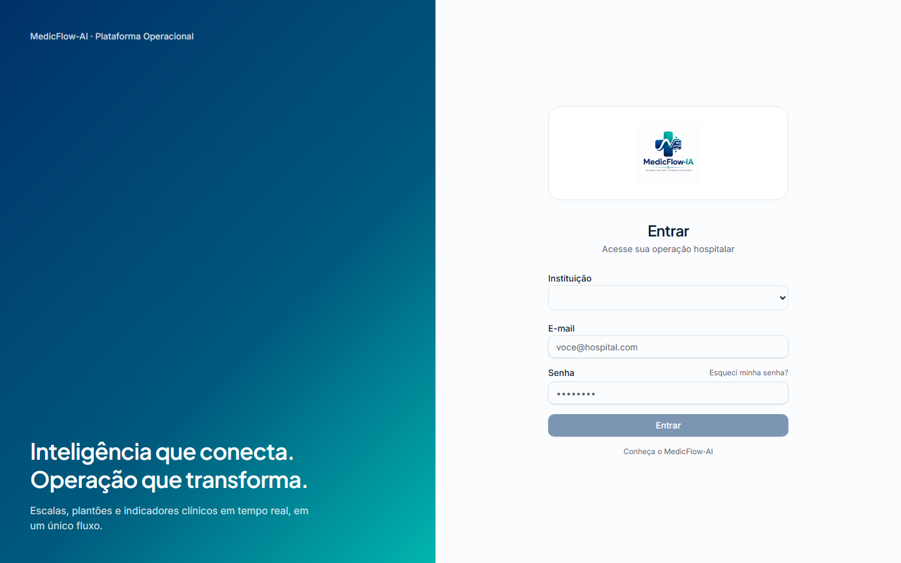
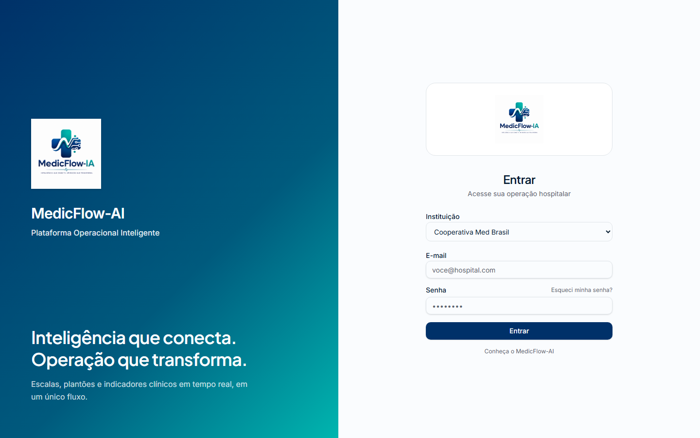

# Login — Reforço de Branding no Painel Esquerdo

**Data:** 2026-06-11  
**Ambiente:** staging (`https://staging.medicflow.app.br`)  
**Tipo:** alteração visual (branding) — sem impacto em autenticação, Supabase ou lógica de login.

---

## FASE 1 — Auditoria

| Item | Caminho |
| --- | --- |
| Página de login | `src/routes/login.tsx` |
| Painel esquerdo (antes inline) | bloco `hidden lg:flex` em `login.tsx` |
| Painel esquerdo (depois) | `src/components/login-branding-panel.tsx` |
| Logomarca oficial | `src/assets/branding/logos/logo-medicflow-ai.png` |
| Constantes de branding | `src/lib/assets/branding.ts` → `defaultLogoUrl`, `BRANDING` |
| Reexport | `src/lib/assets/index.ts` |

A logomarca é importada via Vite (`import defaultLogo from "@/assets/branding/logos/logo-medicflow-ai.png"`) e exposta como `defaultLogoUrl` para componentes.

---

## FASE 2 — Rebranding do painel esquerdo

Conteúdo adicionado no painel (desktop/tablet ≥ `lg`):

1. Logomarca oficial MedicFlow-AI
2. Nome do produto (`MedicFlow-AI`)
3. Subtítulo institucional: **Plataforma Operacional Inteligente**
4. Tagline: **Inteligência que conecta. Operação que transforma.**
5. Descrição: **Escalas, plantões e indicadores clínicos em tempo real, em um único fluxo.**

O formulário de login (painel direito) permanece inalterado.

---

## FASE 3 — Hierarquia visual

- Logomarca em área superior flexível (`flex-1 justify-center`) ocupando o espaço vazio do painel
- Textos alinhados à esquerda (`items-start`), consistente com o layout anterior
- Contraste via `text-primary-foreground` e opacidades (`/90`, `/80`) sobre `bg-brand-gradient`
- Tamanhos responsivos: logo `h-[7.5rem] lg:h-32 xl:h-36`; título `text-2xl lg:text-3xl`; tagline `text-3xl lg:text-4xl`

---

## FASE 4 — Responsividade

| Breakpoint | Comportamento |
| --- | --- |
| Desktop (≥1440px) | Painel com logomarca completa e hierarquia ampliada (`xl:`) |
| Tablet (1024px, `lg`) | Painel visível com proporções intermediárias |
| Mobile (<1024px) | Painel oculto (`hidden lg:flex`); layout mobile preservado, sem scroll adicional |

---

## FASE 5 — Validação

| Comando | Resultado |
| --- | --- |
| `npm run build` | ✓ OK |
| `npm run build:staging` | ✓ OK |
| `npm run ssr-validate` | ✓ OK |

### Screenshots

Salvos em `docs/screenshots/login-branding/`:

| Arquivo | Descrição |
| --- | --- |
| `login-desktop-before.png` | Estado anterior (homologação staging) |
| `login-desktop-after.png` | Desktop 1440×900 após deploy |
| `login-tablet-after.png` | Tablet 1024×768 após deploy |
| `login-mobile-after.png` | Mobile 390×844 após deploy |

Captura: `node scripts/capture-login-branding-screenshots.mjs`

---

## FASE 6 — Deploy staging

```bash
npm run deploy:staging
```

| Campo | Valor |
| --- | --- |
| Status | ✓ Concluído |
| URL | https://staging.medicflow.app.br |
| Worker | `medflow-ia` |
| Version ID | `9a774756-0616-4177-9c3a-bfaa52938889` |
| Etapas | `env-check:staging` → `build:staging` → `validate-staging-build` → `wrangler deploy` |

---

## FASE 7 — Evidências

### Arquivos alterados

| Arquivo | Alteração |
| --- | --- |
| `src/components/login-branding-panel.tsx` | **Novo** — componente do painel de branding |
| `src/routes/login.tsx` | Substituição do painel inline por `<LoginBrandingPanel />` |
| `scripts/capture-login-branding-screenshots.mjs` | **Novo** — script de captura para documentação |
| `docs/screenshots/login-branding/*` | Screenshots antes/depois |
| `docs/LOGIN_BRANDING_UPDATE.md` | Este documento |

### Screenshot antes



Painel esquerdo com texto pequeno no topo (`MedicFlow-AI · Plataforma Operacional`) e tagline na base, sem logomarca.

### Screenshot depois



Painel esquerdo com logomarca oficial, nome do produto, subtítulo institucional e mensagens de valor na base.

### Impacto visual

- Identidade MedicFlow-AI mais forte na primeira impressão (login comercial/demo)
- Espaço vazio superior do painel preenchido pela logomarca oficial
- Hierarquia clara: marca → produto → subtítulo → valor operacional
- Formulário de autenticação e fluxo mobile inalterados

### Resultado do deploy staging

Deploy publicado com sucesso em `https://staging.medicflow.app.br/login`. Login funcional; tenants carregando; branding visível no painel esquerdo em viewports `lg+`.
