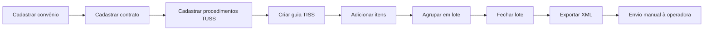

# Manual da Instituição — MedicFlow-AI

**Público-alvo:** administradores (`tenant_admin`, `super_admin`), coordenadores e equipe financeira  
**Versão:** V1 (baseada exclusivamente em recursos implementados)  
**Data:** 08/06/2026

---

## 1. Visão geral

Este manual orienta a **implantação**, **configuração** e **gestão operacional** do MedicFlow-AI em uma instituição de saúde.

O sistema cobre:

- Gestão de **escalas e plantões** de profissionais
- **Faturamento TISS** (MVP) com exportação XML
- **Fechamento financeiro** e **conciliação** operacional
- **Branding** multi-tenant
- **Piloto assistido** e go-live controlado

> **Limitações conhecidas:** não há módulo de Pacientes, Prontuário, cadastro self-service de usuários nem envio automático de TISS para operadoras.

---

## 2. Implantação

### 2.1 Pré-requisitos

| Item | Requisito |
|------|-----------|
| Projeto Supabase | URL + anon key configurados |
| Variáveis de ambiente | `VITE_SUPABASE_URL`, `VITE_SUPABASE_ANON_KEY` |
| Deploy | Cloudflare Workers ou Vercel |
| Usuário admin inicial | Bootstrap SQL (`20250517171500_bootstrap_system_admin.sql`) |

### 2.2 Sequência recomendada de implantação

Acesse **Piloto** no menu (requer `tenant_settings:read`).


| Fase | Ação | Rota |
|------|------|------|
| Dia 0 | Configurar branding e contato | `/instituicao` |
| Dia 0 | Aplicar seed demo (ambiente controlado) | `/instituicao` |
| Dia 1–2 | Cadastrar convênios reais | `/tiss` |
| Dia 1–2 | Provisionar usuários e papéis RBAC | Externo (Supabase) |
| Dia 3 | Abrir competência financeira | `/financeiro/fechamento-operacional` |
| Dia 3 | Executar smoke tests | `/lancamento` |
| Go-live | Monitorar health | `/operacao` |

### 2.3 Demo guiada (7 passos)

Disponível em **Piloto** → painel **Demonstração guiada**:

1. `/piloto` — Abertura executiva
2. `/` — Operação do dia
3. `/central` — Central operacional
4. `/executivo` — Walkthrough executivo
5. `/tiss` — TISS e faturamento
6. `/instituicao` — Multi-tenant e branding
7. `/operacao` — Confiança operacional

### 2.4 Checklist de go-live

Acesse **Go-live** (`/lancamento`):

- Checklist de release
- Smoke tests automatizados (login, dashboard, TISS, conciliação, onboarding)
- Export de backup operacional
- Indicadores de prontidão

---

## 3. Cadastro da instituição

Acesse **Instituição** no menu.


### 3.1 Branding

| Campo | Descrição | Permissão |
|-------|-----------|-----------|
| Logo | Upload para Supabase Storage | `tenant_settings:write` |
| Banner | Imagem institucional | `tenant_settings:write` |
| Favicon | Ícone do navegador | `tenant_settings:write` |
| Cor primária | Hexadecimal (ex.: `#1e3a5f`) | `tenant_settings:write` |
| Cor secundária | Hexadecimal (ex.: `#0d9488`) | `tenant_settings:write` |

### 3.2 Parametrização

| Campo | Descrição |
|-------|-----------|
| Nome da instituição | Exibido no menu e rodapé |
| E-mail de contato | Suporte institucional |
| Telefone de suporte | Contato operacional |
| Fuso horário | Padrão: `America/Sao_Paulo` |
| Moeda | Padrão: `BRL` |

### 3.3 Readiness operacional

O painel exibe indicadores de prontidão:

- Configuração de branding
- Convênios cadastrados
- Profissionais ativos
- Health operacional

### 3.4 Seed de catálogo demo

Disponível apenas para `super_admin` / `tenant_admin` com `demo_seed:apply`.

- Cria 2 operadoras fictícias + 1 contrato
- **Não cria** glosas, repasses ou dados clínicos
- Usar **somente** em ambiente de demonstração

---

## 4. Cadastro de profissionais

> **Importante:** não existe tela de cadastro de profissionais na V1.

### 4.1 Processo atual (manual)

1. Criar usuário no **Supabase Auth** (e-mail + senha)
2. Inserir registro em `profiles` com:
   - `tenant_id` da instituição
   - `role` (`professional`, `coordinator`, etc.)
   - `full_name`
3. Opcionalmente, vincular em `professionals` para disponibilidade e assignments

### 4.2 Papéis disponíveis

| Papel | Uso recomendado |
|-------|-----------------|
| `tenant_admin` | Gestor da instituição |
| `coordinator` | Coordenador de escalas |
| `professional` | Médico/enfermeiro de plantão |
| `financial` | Equipe de faturamento/repasses |

---

## 5. Gestão de usuários

### 5.1 Autenticação

- Login multi-tenant: instituição + e-mail + senha
- Recuperação de senha via Supabase Auth
- Gate anti brute-force com auditoria

### 5.2 Permissões (RBAC)

Matriz completa em `src/lib/auth/rbac.ts`. Resumo:

| Papel | Escalas | TISS | Financeiro | Instituição |
|-------|---------|------|------------|-------------|
| `tenant_admin` | Total | Total | Total + reabertura | Escrita |
| `coordinator` | Total | Escrita | Escrita | Leitura |
| `financial` | Leitura | Escrita | Escrita | Leitura |
| `professional` | Próprios | Leitura | — | Leitura |

### 5.3 Revogação de acesso

- Desativar usuário no Supabase Auth
- Ou remover/atualizar registro em `profiles`

### 5.4 Auditoria

- Logs de login: `security_audit_logs` (quando service role configurado)
- Eventos operacionais: `operational_events`

---

## 6. Gestão financeira

### 6.1 Hub financeiro


O hub (`/financeiro`) é uma **landing de navegação** com KPIs ilustrativos. Para dados reais, acesse as sub-rotas.

### 6.2 Dashboard executivo


Rota: `/financeiro/dashboard-executivo`

| Recurso | Status |
|---------|--------|
| KPIs de fechamento | **Implementado** |
| Alertas financeiros | **Implementado** |
| Export de dados | **Implementado** |
| Gráficos históricos | Conforme dados de competência |

### 6.3 Fechamento operacional

Rota: `/financeiro/fechamento-operacional`

| Ação | Descrição |
|------|-----------|
| Abrir competência | Inicia período de fechamento (mês) |
| Gerar snapshot | Captura estado financeiro |
| Travar competência | Impede alterações |
| Reabrir | Apenas `tenant_admin` / `super_admin` |

### 6.4 Conciliação operacional

Rota: `/financeiro/conciliacao-operacional`

| Recurso | Status |
|---------|--------|
| Criar conciliação | **Implementado** |
| Importar CSV | **Implementado** (delimitador `;` ou `,`) |
| Matching manual | **Implementado** |
| Divergências | **Implementado** |
| Integração bancária (OFX/CNAB) | **Não implementado** |

---

## 7. Faturamento TISS

Acesse **TISS** no menu.


### 7.1 Fluxo completo



### 7.2 Convênios (operadoras)

Aba **Convênios**:

- Nome da operadora
- Código ANS (opcional)
- Contratos vinculados
- Regras de faturamento (MVP)

### 7.3 Guias e lotes

| Etapa | Ação | Status |
|-------|------|--------|
| Criar guia | Status inicial: rascunho | **Implementado** |
| Adicionar itens | Procedimentos TUSS + valores | **Implementado** |
| Validar guia | Mudar status para validada | **Implementado** |
| Criar lote | Agrupar guias por competência | **Implementado** |
| Fechar lote | Bloqueia alterações | **Implementado** |
| Exportar XML | Download local | **Parcial** — XML MVP |

### 7.4 Glosas e recursos

| Recurso | Status |
|---------|--------|
| Registrar retorno da operadora | **Implementado** (manual) |
| Cadastrar glosas | **Implementado** |
| Abrir recurso de glosa | **Implementado** |
| Envio automático de recurso | **Não implementado** |

### 7.5 Produção e repasses

Abas **Produção** e **Repasses**:

- Produção médica por competência
- Regras de repasse (`payout_rules`)
- Pagamentos a profissionais (`medical_payouts`)

---

## 8. Envio para operadoras

> **Status: Não implementado** no sistema.

### O que existe hoje

1. Exportação de XML esquelético (namespace `urn:medflow:tiss:export:0.1`)
2. Download local do arquivo
3. Hash SHA-256 para auditoria

### O que NÃO existe

- Portal de envio integrado
- Webhooks de retorno automático
- Layout ANS TISS completo
- Protocolo de transação com operadoras

### Procedimento manual recomendado

1. Exportar XML do lote fechado
2. Validar estrutura internamente
3. Enviar pelo canal da operadora (portal, SFTP, e-mail)
4. Registrar retorno manualmente em **Glosas** → **Retornos**

---

## 9. Auditoria

### 9.1 Auditoria operacional

| Recurso | Localização | Status |
|---------|-------------|--------|
| Eventos operacionais | Tabela `operational_events` | **Implementado** |
| Timeline operacional | Central → painel timeline | **Implementado** |
| Logs de mutação | `operational_mutation_executions` | **Implementado** |
| Auditoria TISS | Triggers em migrations TISS | **Implementado** |
| Auditoria de fechamento | `financial_closing_audit` | **Implementado** |

### 9.2 Auditoria de segurança

| Recurso | Status |
|---------|--------|
| Logs de login (sucesso/falha) | **Implementado** (com service role) |
| Brute-force protection | **Implementado** |
| RLS multi-tenant | **Implementado** |
| Export de diagnóstico | **Implementado** (`/operacao`, `/piloto`) |

### 9.3 Painel operacional


Rota: `/operacao` (admin) e `/central` (todos)

- Health checks (DB, Auth, Realtime)
- Erros recentes
- Export de backup/diagnóstico

---

## 10. Relatórios

| Relatório | Rota | Dados | Status |
|-----------|------|-------|--------|
| Dashboard executivo | `/financeiro/dashboard-executivo` | Reais (competência) | **Implementado** |
| KPIs TISS | `/tiss` → Resumo | Reais | **Implementado** |
| Produção médica | `/tiss` → Produção | Reais | **Implementado** |
| Repasses | `/tiss` → Repasses | Reais | **Implementado** |
| Hub financeiro | `/financeiro` | Ilustrativos | **Parcial** |
| Relatório de pacientes | — | — | **Não implementado** |
| Relatório clínico | — | — | **Não implementado** |

---

## 11. Central operacional

Acesse via link na Home ou URL `/central`.


### Funcionalidades

- KPIs em tempo real (cobertura, swaps, conflitos)
- Feed de alertas com ações contextuais
- Painéis de copilot, agentes e orquestração
- Realtime via Supabase

### Alertas → ações automáticas

| Alerta | Destino |
|--------|---------|
| Cobertura baixa | Plantões abertos |
| Swaps pendentes | Swaps |
| Conflitos | Escalas (filtro conflitos) |
| Assignments pendentes | Escalas (sem confirmação) |

---

## 12. Casos de uso institucionais

### Caso 1: Implantar nova unidade hospitalar

```
Piloto → Instituição (branding) → TISS (convênios)
      → Provisionar coordenadores (SQL)
      → Escalas (criar turnos) → Go-live (smoke tests)
```

### Caso 2: Fechar competência mensal

```
Financeiro → Fechamento → Abrir competência
          → Gerar snapshot → Travar
          → Conciliação → Importar CSV
          → Dashboard executivo (validar KPIs)
```

### Caso 3: Faturar lote TISS

```
TISS → Guias (criar/validar) → Lotes (agrupar/fechar)
    → Exportar XML → Envio manual à operadora
    → Glosas (registrar retorno)
```

### Caso 4: Resolver conflito de escala

```
Central (alerta conflitos) → Escalas (?opsFocus=conflicts)
                          → Ajustar turno (coordenador)
```

---

## 13. GAPs e dependências externas

| GAP | Impacto | Workaround |
|-----|---------|------------|
| Sem cadastro UI de profissionais | Provisionamento manual | SQL / Supabase Dashboard |
| Sem envio TISS automático | Processo manual pós-export | Portal da operadora |
| XML não conforme ANS | Pode ser rejeitado | Validar com operadora antes |
| Sem integração bancária | Conciliação manual | Importar CSV |
| Sem módulo Pacientes/Prontuário | Escopo clínico ausente | Sistemas legados |

---

*Manual baseado em auditoria funcional de 08/06/2026. Recursos não listados neste documento não estão implementados.*
