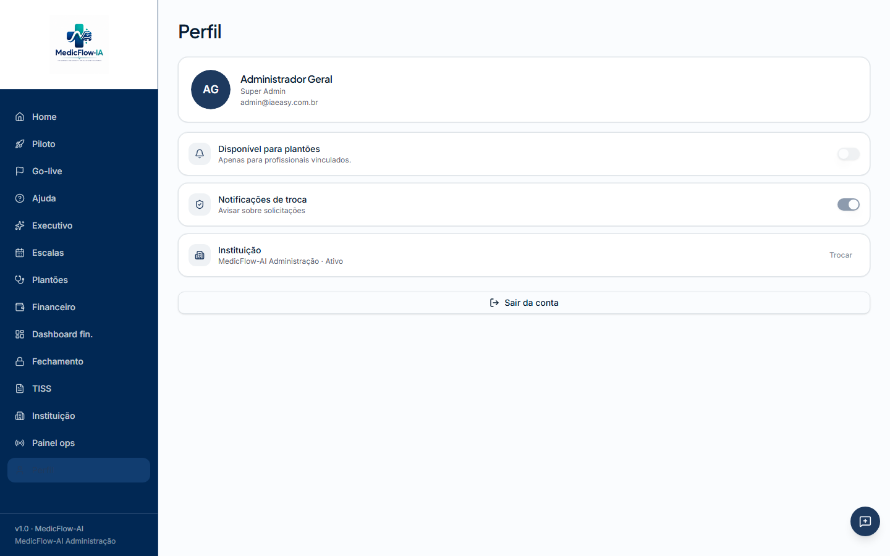
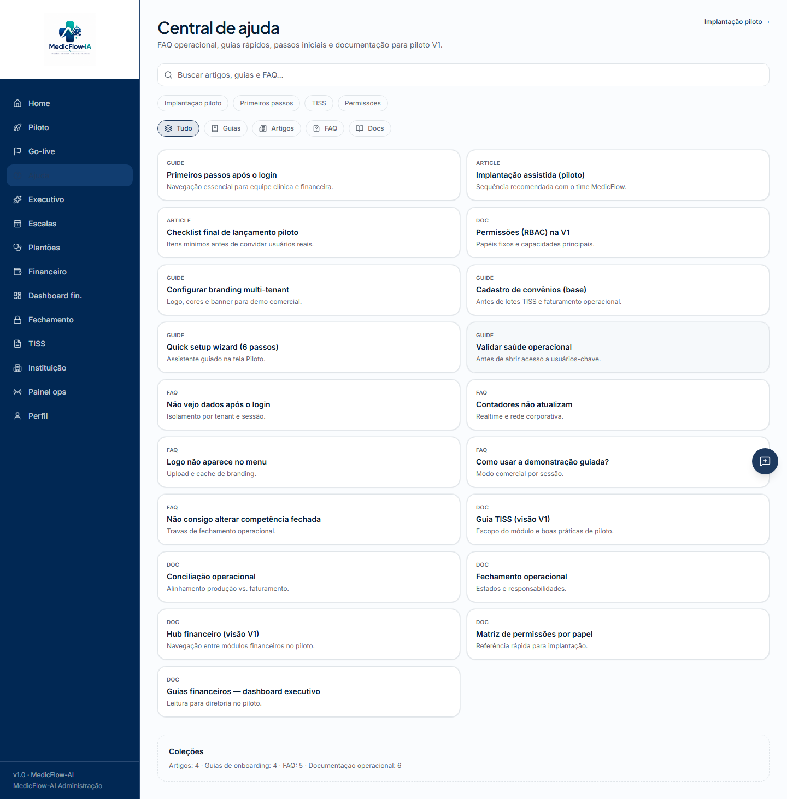
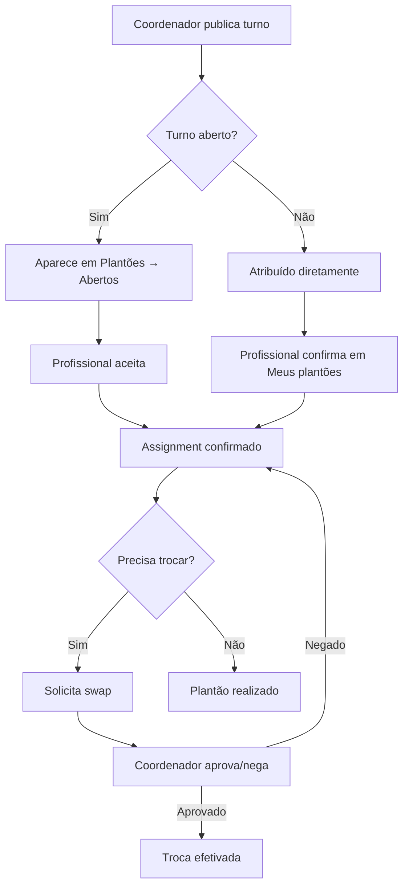

# Manual do Profissional — MedicFlow-AI

**Público-alvo:** médicos, enfermeiros e demais profissionais de saúde com perfil `professional`  
**Versão:** V1 (baseada exclusivamente em recursos implementados)  
**Data:** 08/06/2026

> **Aviso:** Este manual documenta apenas funcionalidades **implementadas**. Os módulos **Pacientes** e **Prontuário eletrônico** **não existem** na versão atual do sistema.

---

## 1. Visão geral

O MedicFlow-AI é uma plataforma operacional hospitalar focada em:

- Visualização e confirmação de **plantões**
- Gestão de **disponibilidade** para escalas
- Solicitação e acompanhamento de **trocas de turno**
- Consulta de informações **TISS** (somente leitura para profissionais)
- Acesso ao **dashboard operacional** do dia


---

## 2. Primeiro acesso

### 2.1 Recebendo suas credenciais

O sistema **não possui auto-cadastro**. O administrador da instituição cria sua conta no Supabase Auth e associa seu perfil na tabela `profiles` com o papel `professional`.

Se você não possui credenciais, solicite ao administrador da instituição.

### 2.2 Acessando o sistema

1. Abra o endereço da sua instituição (ex.: `https://staging.medicflow.app.br/login`)
2. Selecione sua **instituição** na lista
3. Informe **e-mail** e **senha**
4. Clique em **Entrar**


### 2.3 Esqueci minha senha

1. Na tela de login, clique em **Esqueci minha senha**
2. Informe o e-mail cadastrado
3. Acesse o link recebido por e-mail (enviado pelo Supabase Auth)
4. Defina uma nova senha na tela **Redefinir senha**

---

## 3. Dashboard (Home)

Após o login, você chega à **Home** — visão operacional do dia.


### O que você vê

| Elemento | Descrição |
|----------|-----------|
| Saudação personalizada | Com base no seu nome e horário |
| Contadores | Plantões abertos, confirmações pendentes, swaps |
| Escala do dia | Lista de turnos programados para hoje |
| Links rápidos | Ajuda e, se aplicável, módulos financeiros (não visíveis para `professional`) |

### Menu lateral (perfil profissional)

Como profissional, você tem acesso a:

- **Home**, **Escalas**, **Plantões**, **TISS** (leitura), **Instituição** (leitura), **Ajuda**, **Perfil**

Itens **não visíveis** para seu perfil: Piloto, Go-live, Executivo, Financeiro, Fechamento, Painel ops.

---

## 4. Configuração do perfil

Acesse **Perfil** no menu lateral.



### 4.1 Informações exibidas

- Nome completo
- E-mail
- Papel (professional)
- Instituição vinculada

### 4.2 Disponibilidade operacional

O switch **Disponível para plantões** controla se você aparece como disponível para escalas.

| Ação | Comportamento |
|------|---------------|
| Ativar | Cria janelas padrão (seg–sex, 07:00–19:00) |
| Desativar | Remove todas as janelas de disponibilidade |

> A disponibilidade é usada pela central operacional para identificar riscos de cobertura.

### 4.3 Sair do sistema

Clique em **Sair** para encerrar a sessão. Você será redirecionado ao login.

---

## 5. Escalas

Acesse **Escalas** no menu.


### 5.1 Calendário de 14 dias

- Barra horizontal com os próximos 14 dias
- Dia atual destacado
- Clique em um dia para ver a timeline de turnos

### 5.2 Timeline de turnos

Cada turno exibe:

- Horário (início–fim)
- Unidade/setor
- Status (aberto, confirmado, cancelado, etc.)
- Profissionais atribuídos

### 5.3 Filtros contextuais

Acessíveis via links da Central Operacional:

| Filtro | URL | Uso |
|--------|-----|-----|
| Conflitos | `/escalas?opsFocus=conflicts` | Turnos com sobreposição |
| Abertos | `/escalas?opsFocus=abertos` | Vagas sem profissional |
| Sem confirmação | `/escalas?opsFocus=sem-confirmacao` | Assignments pendentes |

> Profissionais têm **leitura** das escalas. Criação e edição de turnos é responsabilidade do **coordenador**.

---

## 6. Plantões — Atendimento operacional

Acesse **Plantões** no menu.


### 6.1 Abas disponíveis

| Aba | Descrição |
|-----|-----------|
| **Abertos** (`disponiveis`) | Plantões disponíveis para aceitar |
| **Meus plantões** (`meus`) | Turnos já atribuídos a você |
| **Swaps pendentes** (`swaps`) | Trocas aguardando sua ação ou de coordenadores |

### 6.2 Aceitar um plantão

1. Aba **Abertos**
2. Localize o turno desejado (unidade, horário, data)
3. Clique em **Aceitar**
4. O status muda para confirmado

### 6.3 Recusar um plantão

1. Em **Meus plantões**, localize o assignment pendente
2. Clique em **Recusar**
3. O turno volta para disponível

### 6.4 Solicitar troca (swap)

1. Em **Meus plantões**, localize o turno
2. Clique em **Solicitar troca**
3. Aguarde aprovação do coordenador na aba **Swaps pendentes**

### 6.5 Aprovar/negar swap (quando solicitado)

Se outro profissional solicitar troca envolvendo seu turno:

1. Aba **Swaps pendentes**
2. Revise detalhes (turno origem/destino)
3. Clique em **Aprovar** ou **Negar**

---

## 7. TISS (consulta)

Profissionais têm acesso **somente leitura** ao módulo TISS.


### O que você pode consultar

| Aba | Conteúdo |
|-----|----------|
| Resumo | KPIs de guias, lotes e glosas |
| Convênios | Operadoras cadastradas |
| TUSS | Catálogo de procedimentos |
| Guias | Guias TISS da instituição |
| Lotes | Lotes de faturamento |
| Produção | Produção médica por competência |
| Repasses | Valores de repasse |
| Glosas | Glosas e recursos |

> Você **não pode** criar guias, lotes ou exportar XML. Essas ações requerem perfil `coordinator` ou `financial`.

---

## 8. Central de Ajuda

Acesse **Ajuda** no menu.



### Conteúdo disponível

- **Guias** de primeiros passos
- **Artigos** sobre implantação e permissões
- **FAQ** operacional
- **Documentação** RBAC

Use a busca e filtros por aba (`Tudo`, `Guias`, `Artigos`, `FAQ`, `Docs`).

---

## 9. Casos de uso

### Caso 1: Confirmar plantão do fim de semana

```
Login → Home (ver contador "confirmações pendentes")
     → Plantões → Meus plantões
     → Aceitar assignment pendente
```

### Caso 2: Buscar plantão extra

```
Login → Plantões → Abertos
     → Filtrar por unidade/horário
     → Aceitar
```

### Caso 3: Indisponibilidade temporária

```
Login → Perfil
     → Desativar "Disponível para plantões"
```

### Caso 4: Consultar produção do mês

```
Login → TISS → Produção
     → Selecionar competência
     → Visualizar valores (somente leitura)
```

### Caso 5: Responder a alerta de confirmação

```
Notificação na Home → Escalas (?opsFocus=sem-confirmacao)
                   → Identificar turno → Plantões → Confirmar
```

---

## 10. Fluxo de plantões (diagrama)



---

## 11. O que NÃO está disponível para profissionais

| Recurso | Status | Alternativa |
|---------|--------|-------------|
| Prontuário eletrônico | **Não implementado** | Usar sistema clínico da instituição |
| Cadastro de pacientes | **Não implementado** | — |
| Agenda de consultas | **Não implementado** | Escalas cobrem turnos de plantão |
| Criação de guias TISS | Sem permissão | Solicitar ao coordenador/financeiro |
| Módulo financeiro | Sem permissão | Consultar TISS → Produção/Repasses |
| Gestão de escalas | Sem permissão | Solicitar ao coordenador |

---

## 12. Suporte

- **Central de Ajuda:** menu **Ajuda** → artigo "Primeiros passos após o login"
- **Problemas de acesso:** contate o administrador da instituição
- **Indisponibilidade do sistema:** o administrador pode verificar o **Painel ops** (não acessível ao profissional)

---

*Manual baseado em auditoria funcional de 08/06/2026. Recursos não listados neste documento não estão implementados.*
