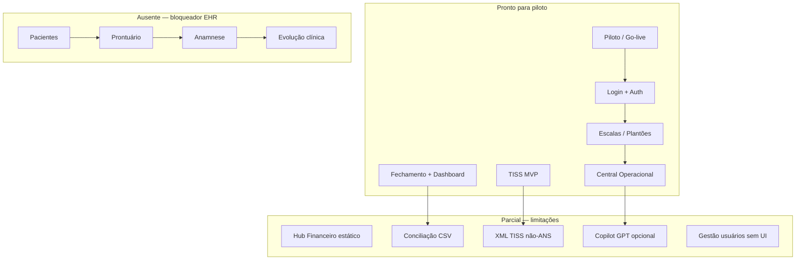

# Mapa de Maturidade — MedicFlow-AI

**Data:** 08/06/2026  
**Versão auditada:** commit `e7db791`  
**Referência completa:** [AUDITORIA_COMPLETA_MEDICFLOW.md](./AUDITORIA_COMPLETA_MEDICFLOW.md)

---

## Status geral

| Indicador | Valor |
|-----------|-------|
| **Percentual real de conclusão do produto** | **73%** |
| **Módulos concluídos** | **14 / 24** (58%) |
| **Módulos parciais** | **6 / 24** (25%) |
| **Módulos pendentes** | **4 / 24** (17%) |
| **Veredito escopo operacional** | ✅ Pronto para piloto/treinamento plantão-TISS |
| **Veredito escopo clínico (EHR)** | ❌ NO-GO — 0% implementado |
| **Veredito produção enterprise** | ⚠️ PARCIAL — 3–10 semanas de hardening |

---

## Matriz de maturidade por camada

```
                    Não iniciado   Iniciado   Parcial   Implementado   Produção-ready
Frontend            ████░░░░░░     ░░░░░░░░░░  ███░░░░░░  ████████░░     ░░░░░░░░░░  78%
Backend             ████░░░░░░     ░░░░░░░░░░  ██░░░░░░░  █████████░     ░░░░░░░░░░  82%
Infraestrutura      ██░░░░░░░░     ░░░░░░░░░░  ███░░░░░░  ███████░░░     ░░░░░░░░░░  74%
Testes              ████████░░     ░░░░░░░░░░  ██░░░░░░░  ░░░░░░░░░░     ░░░░░░░░░░  25%
Segurança           ░░░░░░░░░░     ░░░░░░░░░░  ████░░░░░  ███████░░░     ░░░░░░░░░░  72%
IA operacional      ░░░░░░░░░░     ░░░░░░░░░░  ███░░░░░░  ████████░░     ░░░░░░░░░░  75%
IA clínica          ██████████     ░░░░░░░░░░  ░░░░░░░░░░  ░░░░░░░░░░     ░░░░░░░░░░   0%
```

---

## Maturidade por módulo (24 módulos auditados)

| Módulo | FE | BE | DB | Testes | Docs | Score | Nível |
|--------|----|----|----|----|------|-------|-------|
| Login | ✅ | ✅ | ✅ | ⚠️ | ✅ | 90% | **L4 — Operacional** |
| Recuperação senha | ✅ | ✅ | ✅ | ⚠️ | ✅ | 88% | **L4 — Operacional** |
| Multi-tenant | ✅ | ✅ | ✅ | ⚠️ | ✅ | 92% | **L4 — Operacional** |
| Instituições | ✅ | ✅ | ✅ | ❌ | ✅ | 85% | **L4 — Operacional** |
| Agenda (escalas) | ✅ | ✅ | ✅ | ❌ | ✅ | 88% | **L4 — Operacional** |
| Fechamento | ✅ | ✅ | ✅ | ❌ | ✅ | 87% | **L4 — Operacional** |
| Dashboard executivo | ✅ | ✅ | ✅ | ❌ | ✅ | 86% | **L4 — Operacional** |
| Operação | ✅ | ✅ | ✅ | ❌ | ✅ | 85% | **L4 — Operacional** |
| Central operacional | ✅ | ✅ | ✅ | ❌ | ✅ | 84% | **L4 — Operacional** |
| Piloto | ✅ | ✅ | ✅ | ❌ | ✅ | 86% | **L4 — Operacional** |
| Ajuda | ✅ | ⚠️ | — | ❌ | ✅ | 80% | **L3 — Funcional** |
| Branding | ✅ | ✅ | ✅ | ❌ | ✅ | 85% | **L4 — Operacional** |
| Upload arquivos | ✅ | ✅ | ✅ | ❌ | ✅ | 83% | **L4 — Operacional** |
| Auditoria | ⚠️ | ✅ | ✅ | ⚠️ | ✅ | 78% | **L3 — Funcional** |
| Gestão usuários | ❌ | ⚠️ | ✅ | ❌ | ⚠️ | 35% | **L2 — Esboço** |
| TISS | ✅ | ⚠️ | ✅ | ⚠️ | ✅ | 68% | **L3 — Funcional** |
| Financeiro | ⚠️ | ✅ | ✅ | ❌ | ✅ | 62% | **L3 — Funcional** |
| Conciliação | ✅ | ⚠️ | ✅ | ⚠️ | ✅ | 65% | **L3 — Funcional** |
| Relatórios | ⚠️ | ⚠️ | ⚠️ | ❌ | ⚠️ | 45% | **L2 — Esboço** |
| Integrações IA | ✅ | ⚠️ | ✅ | ❌ | ✅ | 70% | **L3 — Funcional** |
| Pacientes | ❌ | ❌ | ❌ | ❌ | ❌ | 0% | **L0 — Inexistente** |
| Prontuário | ❌ | ❌ | ❌ | ❌ | ❌ | 0% | **L0 — Inexistente** |
| Anamnese | ❌ | ❌ | ❌ | ❌ | ❌ | 0% | **L0 — Inexistente** |
| Evolução clínica | ❌ | ❌ | ❌ | ❌ | ❌ | 0% | **L0 — Inexistente** |

**Legenda de níveis:**
- **L0** — Inexistente
- **L1** — Conceito / mock
- **L2** — Esboço (backend parcial ou UI mínima)
- **L3** — Funcional (uso com limitações conhecidas)
- **L4** — Operacional (piloto/staging validado)
- **L5** — Produção-ready (testes, observabilidade, compliance)

---

## Percentuais por camada (detalhado)

### 1. Frontend — 78%

| Área | Peso | % | Notas |
|------|------|---|-------|
| Rotas implementadas | 25% | 95% | 20/20 rotas do escopo operacional |
| Componentes e UX | 25% | 90% | 61 componentes; 0 órfãos |
| Módulos clínicos | 20% | 0% | 4 módulos ausentes |
| Parcialidades UI | 15% | 55% | Hub financeiro, perfil, TISS MVP |
| Acessibilidade / PWA | 15% | 75% | PWA scripts existem; não auditado E2E |

### 2. Backend — 82%

| Área | Peso | % | Notas |
|------|------|---|-------|
| Schema Postgres + RLS | 30% | 95% | 63 tabelas, 143 policies |
| Server Functions | 25% | 90% | ~173 endpoints |
| Integrações externas | 20% | 50% | Sem operadora TISS, sem banco |
| Módulo clínico | 15% | 0% | Zero tabelas EHR |
| Auth / segurança server | 10% | 85% | Gate brute-force, audit logs |

### 3. Infraestrutura — 74%

| Área | Peso | % | Notas |
|------|------|---|-------|
| Deploy (CF + Vercel) | 20% | 90% | wrangler + vercel.json |
| Supabase (migrations) | 25% | 92% | 28 migrations aplicáveis |
| CI/CD | 15% | 80% | GitHub Actions |
| Scripts validação | 15% | 85% | 27 scripts |
| Observabilidade | 15% | 45% | Error tracking stub |
| Testes automatizados | 10% | 5% | Zero unit tests |

---

## Mapa de dependências críticas



---

## Comparativo: escopo solicitado vs. entregue

| Dimensão | Solicitado (implícito) | Entregue | Gap |
|----------|------------------------|----------|-----|
| Gestão de plantões | Sim | ✅ Completo | — |
| Faturamento TISS | Sim | ⚠️ MVP | XML ANS, operadoras |
| Financeiro operacional | Sim | ⚠️ Parcial | Hub estático, conciliação CSV |
| Prontuário clínico | Sim | ❌ Zero | Módulo inteiro |
| Pacientes | Sim | ❌ Zero | Módulo inteiro |
| IA clínica | Possível expectativa | ❌ Zero | Apenas IA operacional |
| IA operacional | Sim | ⚠️ 75% | API key OpenAI |

---

## Heatmap de risco para go-live

| Risco | Probabilidade | Impacto | Mitigação |
|-------|---------------|---------|-----------|
| Escopo clínico prometido vs. real | Alta | Crítico | Formalizar escopo V1 operacional |
| Provisionamento manual de usuários | Alta | Alto | UI gestão usuários |
| XML TISS rejeitado por operadora | Média | Alto | Completar layout ANS ou processo manual |
| RLS não testado cross-tenant | Média | Crítico | `multi-tenant-auth-validate` em staging |
| Credenciais bootstrap em migration | Baixa | Crítico | Rotacionar antes de prod |
| Copilot indisponível sem API key | Alta | Baixo | Documentar como opcional |

---

## Resumo numérico final

```
┌─────────────────────────────────────────────────────────┐
│  MEDICFLOW-AI — MAPA DE MATURIDADE                     │
├─────────────────────────────────────────────────────────┤
│  Produto geral ............................  73%        │
│  Frontend .................................  78%        │
│  Backend ..................................  82%        │
│  Infraestrutura ...........................  74%        │
│  Testes ...................................  25%        │
│  Segurança (readiness report) .............  72%        │
├─────────────────────────────────────────────────────────┤
│  Módulos L4+ (operacional) ................  14        │
│  Módulos L2-L3 (parcial) ..................   6        │
│  Módulos L0 (inexistente) .................   4        │
└─────────────────────────────────────────────────────────┘
```

---

*Documento gerado por auditoria read-only em 08/06/2026.*
