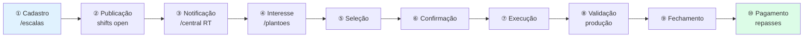
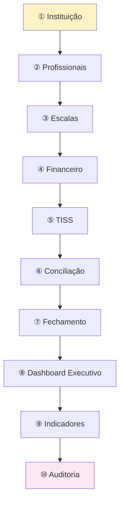
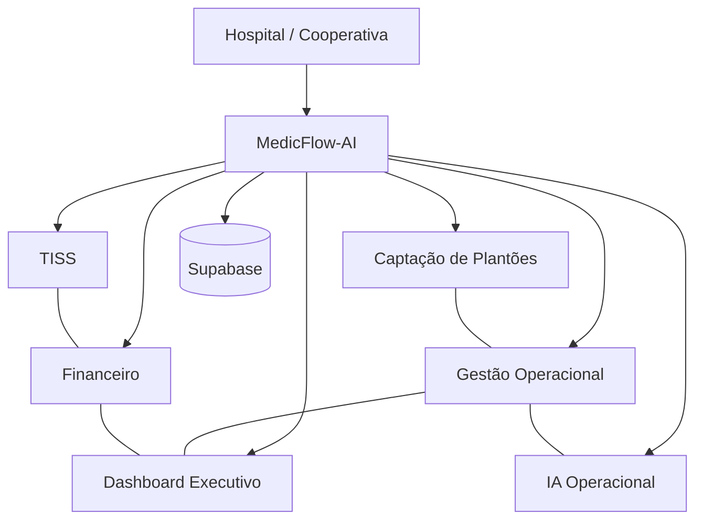
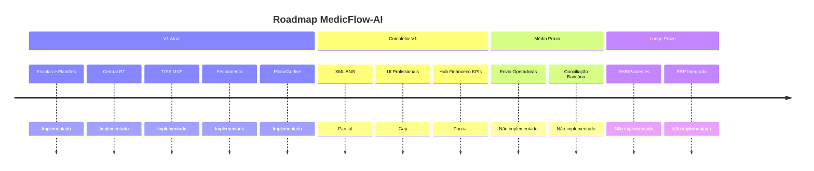

# MedicFlow-AI — Apresentação Executiva

**Documento:** material consolidado para apresentações comerciais, investidores e potenciais clientes  
**Data:** 11/06/2026  
**Ambiente:** `https://staging.medicflow.app.br`  
**Versão do produto:** V1 Operacional

---

## Sumário

1. [Visão do produto](#1-visão-do-produto)
2. [Fluxograma executivo — captação de plantões](#2-fluxograma-executivo--captação-de-plantões)
3. [Fluxograma executivo — hub administrativo](#3-fluxograma-executivo--hub-administrativo)
4. [Jornada dos usuários](#4-jornada-dos-usuários)
5. [Arquitetura operacional](#5-arquitetura-operacional)
6. [Resumo comercial](#6-resumo-comercial)
7. [Diferenciais competitivos](#7-diferenciais-competitivos)
8. [Roadmap da versão atual](#8-roadmap-da-versão-atual)
9. [Anexos e referências](#9-anexos-e-referências)

---

## 1. Visão do produto

### O que é

O **MedicFlow-AI** é uma plataforma operacional hospitalar **multi-tenant** que unifica:

- Gestão de **escalas e plantões** de profissionais de saúde
- **Central operacional** com indicadores em tempo real
- **Faturamento TISS** (MVP) com ciclo de guias, lotes e glosas
- **Fechamento financeiro** e conciliação operacional
- **Implantação assistida** com piloto, demo guiada e go-live


### Stack tecnológica

| Camada | Tecnologia |
|--------|------------|
| Frontend | React 19 + TanStack Start/Router/Query |
| Backend | TanStack Server Functions (~173) |
| Banco | Supabase Postgres (~63 tabelas, RLS) |
| Auth | Supabase Auth + RBAC (5 papéis) |
| Realtime | Supabase Realtime |
| Deploy | Cloudflare Workers (primário) / Vercel |
| IA | Copilot GPT + Agentes (opcional) |

### Público-alvo

| Segmento | Papel | Necessidade |
|----------|-------|-------------|
| Hospitais e clínicas | `tenant_admin` | Branding, go-live, KPIs |
| Coordenadores de escala | `coordinator` | Publicar turnos, resolver conflitos |
| Profissionais de plantão | `professional` | Confirmar plantões, trocas |
| Equipe financeira | `financial` | TISS, repasses, fechamento |
| Cooperativas | Tenant dedicado | Pool de profissionais, repasses |
| Diretoria | Dashboard executivo | Visão consolidada |

### O que NÃO é (V1)

- Prontuário eletrônico (EHR)
- Gestão de pacientes
- Envio automático TISS a operadoras
- ERP hospitalar completo

---

## 2. Fluxograma executivo — captação de plantões

### Visão em 10 etapas

```
 DEMANDA ──► PUBLICAÇÃO ──► NOTIFICAÇÃO ──► INTERESSE ──► SELEÇÃO
                                                              │
 PAGAMENTO ◄── FECHAMENTO ◄── VALIDAÇÃO ◄── EXECUÇÃO ◄── CONFIRMAÇÃO
```

### Diagrama executivo

```
┌──────────────────────────────────────────────────────────────────────────────┐
│                    CAPTAÇÃO DE PLANTÕES — 10 ETAPAS                           │
└──────────────────────────────────────────────────────────────────────────────┘

 ① Cadastro        ② Publicação      ③ Notificação     ④ Interesse
    oportunidade       da escala          médicos           médico
    /escalas           /escalas           / + /central      /plantoes
        │                  │                  │                 │
        ▼                  ▼                  ▼                 ▼
 ⑤ Seleção ──────► ⑥ Confirmação ────► ⑦ Execução ─────► ⑧ Validação
    escalista/         confirmed           plantão           produção
    self-service       /plantoes           /central          /tiss
        │                  │                  │                 │
        ▼                  ▼                  ▼                 ▼
 ⑨ Fechamento ────► ⑩ Pagamento
    competência         repasses
    /fechamento         /tiss Repasses
```

### Mermaid — fluxo completo



### Atores e responsabilidades

| Etapa | Hospital/Cooperativa | Escalista | Médico | Sistema |
|-------|---------------------|-----------|--------|---------|
| ① Cadastro | Define demanda | Cria shifts | — | `/escalas` |
| ② Publicação | — | Publica | Visualiza | Calendário 14d |
| ③ Notificação | — | Monitora | Recebe alertas | Realtime |
| ④ Interesse | — | — | Aceita | `/plantoes` |
| ⑤ Seleção | — | Atribui/aprova | Auto-aceita | assignments |
| ⑥ Confirmação | — | Monitora | Confirma | 1 confirmed/shift |
| ⑦ Execução | — | Monitora | Executa | `/central` |
| ⑧ Validação | — | — | — | `medical_production` |
| ⑨ Fechamento | Aprova | — | — | snapshot + trava |
| ⑩ Pagamento | Processa | — | Consulta | `medical_payouts` |

**Documento completo:** [MEDICFLOW_WORKFLOW_CAPTACAO_PLANTOES.md](./MEDICFLOW_WORKFLOW_CAPTACAO_PLANTOES.md)

---

## 3. Fluxograma executivo — hub administrativo

### Visão em 10 módulos

```
 INSTITUIÇÃO ──► PROFISSIONAIS ──► ESCALAS ──► FINANCEIRO ──► TISS
                                                                  │
 AUDITORIA ◄── INDICADORES ◄── DASHBOARD ◄── FECHAMENTO ◄── CONCILIAÇÃO
```

### Diagrama executivo

```
┌──────────────────────────────────────────────────────────────────────────────┐
│                    HUB ADMINISTRATIVO MÉDICO — 10 MÓDULOS                     │
└──────────────────────────────────────────────────────────────────────────────┘

 ┌────────────┐   ┌────────────┐   ┌────────────┐   ┌────────────┐
 │① Instituição│   │② Profiss.  │   │③ Escalas   │   │④ Financeiro│
 │ /instituicao│──►│ Auth+RBAC  │──►│ /escalas   │──►│ /financeiro│
 └────────────┘   └────────────┘   └─────┬──────┘   └─────┬──────┘
                                         │                  │
                                         ▼                  ▼
                                   ┌────────────┐   ┌────────────┐
                                   │⑤ TISS      │   │⑥ Conciliação│
                                   │ /tiss      │──►│ /conciliacao│
                                   └─────┬──────┘   └─────┬──────┘
                                         │                  │
                                         ▼                  ▼
                                   ┌────────────┐   ┌────────────┐
                                   │⑦ Fechamento│   │⑧ Dashboard │
                                   │ competência │──►│ /executivo │
                                   └─────┬──────┘   └─────┬──────┘
                                         │                  │
                                         ▼                  ▼
                                   ┌────────────┐   ┌────────────┐
                                   │⑨ Indicadores│   │⑩ Auditoria │
                                   │ KPIs       │──►│ /operacao  │
                                   └────────────┘   └────────────┘
```

### Mermaid — hub administrativo



**Documento completo:** [MEDICFLOW_WORKFLOW_HUB_ADMINISTRATIVO.md](./MEDICFLOW_WORKFLOW_HUB_ADMINISTRATIVO.md)

---

## 4. Jornada dos usuários

### Médico

```
ENTRADA ──► CAPTAÇÃO ──► ESCALA ──► PLANTÃO ──► PAGAMENTO
 /login      / + /central  /escalas   /plantoes   /tiss
```

### Administrador

```
ENTRADA ──► INSTITUIÇÃO ──► PROFISSIONAIS ──► FINANCEIRO ──► INDICADORES
 /login      /instituicao     Auth externo      /financeiro    /executivo
 /piloto                                          /tiss
```

### Escalista

```
ENTRADA ──► OFERTA ──► CONVOCAÇÃO ──► CONFIRMAÇÃO ──► MONITORAMENTO
 /login     /escalas    /central       /plantoes       /central
```

### Mermaid — jornadas comparadas

```mermaid
flowchart TB
    subgraph MED["Médico"]
        direction LR
        M1[Entrada] --> M2[Captação] --> M3[Escala] --> M4[Plantão] --> M5[Pagamento]
    end

    subgraph ADM["Administrador"]
        direction LR
        A1[Entrada] --> A2[Instituição] --> A3[Profissionais] --> A4[Financeiro] --> A5[Indicadores]
    end

    subgraph ESC["Escalista"]
        direction LR
        E1[Entrada] --> E2[Oferta] --> E3[Convocação] --> E4[Confirmação] --> E5[Monitoramento]
    end
```



**Documento completo:** [MEDICFLOW_JORNADA_USUARIOS.md](./MEDICFLOW_JORNADA_USUARIOS.md)

---

## 5. Arquitetura operacional

### Diagrama de módulos

```
                         HOSPITAL / COOPERATIVA
                                  │
                                  ▼
┌─────────────────────────────────────────────────────────────────┐
│                         MedicFlow-AI                             │
├─────────────┬─────────────┬─────────────┬─────────────┬─────────┤
│  Captação   │   Gestão    │  Financeiro │    TISS     │Dashboard│
│  Plantões   │ Operacional │             │             │Executivo│
│             │             │             │             │         │
│ /escalas    │ /central    │ /financeiro │ /tiss       │/executivo│
│ /plantoes   │ /operacao   │ /fechamento │ guias/lotes │/dash-exec│
│ /perfil     │ Realtime    │ /conciliacao│ glosas      │         │
├─────────────┴─────────────┴──────┬──────┴─────────────┴─────────┤
│                    IA Operacional │ Implantação                   │
│              Copilot · Agentes    │ /instituicao · /piloto        │
│              Orquestração         │ /lancamento · /ajuda          │
└───────────────────────────────────┴───────────────────────────────┘
                                  │
                                  ▼
                    Supabase (Postgres + Auth + RT)
```

### Mermaid — arquitetura



**Documento completo:** [MEDICFLOW_WORKFLOW_OPERACIONAL.md](./MEDICFLOW_WORKFLOW_OPERACIONAL.md)

---

## 6. Resumo comercial

### Problema

Hospitais e cooperativas operam plantões com **planilhas**, **WhatsApp** e sistemas **fragmentados** — sem visibilidade de cobertura, sem rastreio de confirmações e com faturamento TISS desconectado da operação.

### Solução

**MedicFlow-AI** digitaliza a operação de plantões e integra faturamento TISS em plataforma **multi-tenant white-label** — com central em tempo real, fechamento auditável e implantação assistida.

### Benefícios-chave

| Para quem | Benefício principal |
|-----------|---------------------|
| **Hospitais** | Visibilidade de cobertura + fechamento auditável |
| **Cooperativas** | Pool centralizado + repasses transparentes |
| **Médicos** | Confirmação simples + consulta de produção |
| **Escalistas** | Central RT + gestão formalizada de swaps |
| **Diretoria** | Dashboard executivo com KPIs reais |
| **Financeiro** | Ciclo TISS + fechamento + conciliação |

### Números do produto

| Métrica | Valor |
|---------|-------|
| Rotas implementadas | 20 |
| Server Functions | ~173 |
| Tabelas Postgres | ~63 |
| Papéis RBAC | 5 |
| Capabilities | 30+ |
| Screenshots staging | 12 |
| Demo guiada | 7 passos |

### Elevator pitch

> MedicFlow-AI substitui planilhas e WhatsApp na gestão de plantões hospitalares, integrando operação, TISS e fechamento financeiro em uma plataforma segura, white-label e pronta para demo comercial.

**Documento completo:** [MEDICFLOW_PROPOSTA_DE_VALOR.md](./MEDICFLOW_PROPOSTA_DE_VALOR.md)

---

## 7. Diferenciais competitivos

| # | Diferencial | Evidência |
|---|-------------|-----------|
| 1 | **Multi-tenant nativo** | RLS Postgres + branding `/instituicao` |
| 2 | **Operação + TISS integrados** | Mesmo tenant, mesma auditoria |
| 3 | **Central em tempo real** | Supabase Realtime + alertas |
| 4 | **RBAC granular** | 5 papéis, 30+ capabilities |
| 5 | **Implantação assistida** | Demo 7 passos + smoke tests |
| 6 | **IA operacional** | Copilot GPT + agentes (opcional) |
| 7 | **Fechamento auditável** | Snapshot + trava + reabertura controlada |
| 8 | **White-label rápido** | Logo, cores, banner sem rebuild |
| 9 | **Deploy flexível** | Cloudflare Workers ou Vercel |
| 10 | **Transparência de maturidade** | Documentação honesta sobre gaps |

### Posicionamento

```
MedicFlow-AI = Plataforma OPERACIONAL + FATURAMENTO TISS MVP
             ≠ Prontuário eletrônico
             ≠ ERP hospitalar completo
```

---

## 8. Roadmap da versão atual

> Reflete GAPs identificados na auditoria — **não são promessas de entrega**.

### V1 — Implementado (disponível hoje)

| Módulo | Status |
|--------|--------|
| Escalas e plantões (14 dias) | ✅ Implementado |
| Swaps e disponibilidade | ✅ Implementado |
| Central operacional + Realtime | ✅ Implementado |
| Dashboard executivo (KPIs reais) | ✅ Implementado |
| Fechamento de competência | ✅ Implementado |
| TISS — convênios, guias, lotes | ✅ Implementado |
| Repasses médicos | ✅ Implementado |
| Branding white-label | ✅ Implementado |
| Piloto + demo guiada + go-live | ✅ Implementado |
| IA operacional (Copilot, agentes) | ✅ Implementado (opcional) |
| RBAC + RLS multi-tenant | ✅ Implementado |

### V1 — Parcial (funciona com limitações)

| Item | Status | Gap |
|------|--------|-----|
| Hub financeiro | ⚠️ Parcial | KPIs ilustrativos na landing |
| Export XML TISS | ⚠️ Parcial | MVP, não conforme ANS completo |
| Glosas e recursos | ⚠️ Parcial | Registro manual, sem operadora |
| Conciliação | ⚠️ Parcial | CSV only, sem OFX/CNAB |
| Perfil profissional | ⚠️ Parcial | Funcional, campos limitados |

### Curto prazo — Completar V1

| Item | Prioridade |
|------|------------|
| XML TISS conforme ANS | Alta |
| Cadastro UI de profissionais | Alta |
| Hub financeiro com KPIs reais | Média |
| Error tracking (Sentry/Datadog) | Média |

### Médio prazo

| Item |
|------|
| Envio TISS para operadoras |
| Conciliação bancária (OFX/CNAB) |
| Webhooks de retorno de operadoras |
| Auto-cadastro / convite de usuários |
| Notificações push/e-mail |

### Longo prazo

| Item |
|------|
| Módulo de Pacientes |
| Prontuário eletrônico |
| Agenda de consultas ambulatoriais |
| Integração ERP/DRE |

### Mermaid — roadmap visual



---

## 9. Anexos e referências

### Documentação gerada

| Documento | Conteúdo |
|-----------|----------|
| [MEDICFLOW_WORKFLOW_OPERACIONAL.md](./MEDICFLOW_WORKFLOW_OPERACIONAL.md) | Mapeamento operacional + arquitetura |
| [MEDICFLOW_WORKFLOW_CAPTACAO_PLANTOES.md](./MEDICFLOW_WORKFLOW_CAPTACAO_PLANTOES.md) | Fluxo de captação (10 etapas) |
| [MEDICFLOW_WORKFLOW_HUB_ADMINISTRATIVO.md](./MEDICFLOW_WORKFLOW_HUB_ADMINISTRATIVO.md) | Hub administrativo (10 módulos) |
| [MEDICFLOW_JORNADA_USUARIOS.md](./MEDICFLOW_JORNADA_USUARIOS.md) | Jornadas Médico, Admin, Escalista |
| [MEDICFLOW_PROPOSTA_DE_VALOR.md](./MEDICFLOW_PROPOSTA_DE_VALOR.md) | Proposta comercial completa |

### Documentação existente (referência)

| Documento | Conteúdo |
|-----------|----------|
| [MAPA_FUNCIONAL_MEDICFLOW.md](./MAPA_FUNCIONAL_MEDICFLOW.md) | Mapa funcional completo |
| [APRESENTACAO_EXECUTIVA_MEDICFLOW.md](./APRESENTACAO_EXECUTIVA_MEDICFLOW.md) | Apresentação anterior |
| [MANUAL_PROFISSIONAL_MEDICFLOW.md](./MANUAL_PROFISSIONAL_MEDICFLOW.md) | Manual do médico |
| [MANUAL_INSTITUICAO_MEDICFLOW.md](./MANUAL_INSTITUICAO_MEDICFLOW.md) | Manual da instituição |

### Screenshots staging (12)

| # | Arquivo | Tela |
|---|---------|------|
| 1 | `screenshots/01-login.png` | Login |
| 2 | `screenshots/02-dashboard.png` | Dashboard |
| 3 | `screenshots/03-agenda-escalas.png` | Escalas |
| 4 | `screenshots/04-plantoes.png` | Plantões |
| 5 | `screenshots/05-financeiro.png` | Financeiro |
| 6 | `screenshots/06-relatorios-dashboard-executivo.png` | Dashboard Executivo |
| 7 | `screenshots/07-configuracoes-instituicao.png` | Instituição |
| 8 | `screenshots/08-administracao-piloto.png` | Piloto |
| 9 | `screenshots/09-tiss.png` | TISS |
| 10 | `screenshots/10-perfil.png` | Perfil |
| 11 | `screenshots/11-central-operacional.png` | Central |
| 12 | `screenshots/12-ajuda.png` | Ajuda |

### Demo guiada (7 passos)

1. `/piloto` — Abertura executiva
2. `/` — Operação do dia
3. `/central` — Central operacional
4. `/executivo` — Walkthrough executivo
5. `/tiss` — TISS e faturamento
6. `/instituicao` — Multi-tenant e branding
7. `/operacao` — Confiança operacional

### Ambiente

- **Staging:** `https://staging.medicflow.app.br`
- **Stack:** React 19 + TanStack Start + Supabase + Cloudflare Workers

---

## Conclusão executiva

O **MedicFlow-AI V1** entrega valor imediato para **gestão de plantões**, **visibilidade operacional em tempo real** e **faturamento TISS básico** em ambiente multi-tenant white-label. A implantação assistida (piloto, demo guiada, go-live) é um diferencial comercial sólido para apresentações a investidores e potenciais clientes.

Para uso em produção clínica completa (prontuário, pacientes) ou faturamento regulatório pleno (ANS, operadoras), a V1 atual **requer complementação** conforme roadmap documentado — com transparência total sobre maturidade e GAPs.

---

*Documento gerado com base na auditoria funcional do sistema MedicFlow-AI V1. Sem alterações de código, banco ou staging.*
