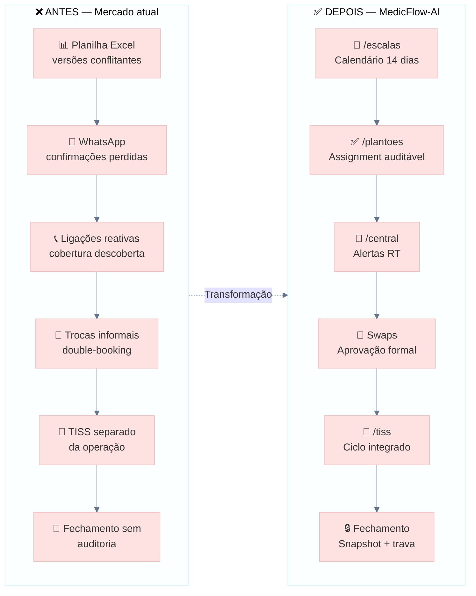

# MedicFlow-AI — Casos de Uso Executivos

**Documento:** material comercial para apresentações com diretoria, hospitais, cooperativas, grupos de plantonistas e empresas de gestão de escalas  
**Data:** 11/06/2026  
**Versão do produto:** V1 Operacional  
**Ambiente demo:** `https://staging.medicflow.app.br`  
**Base:** documentação executiva auditada do produto V1 — sem alterações de código

---

## Sumário

1. [Como usar este documento](#1-como-usar-este-documento)
2. [Caso 1 — Hospital de médio porte](#2-caso-1--hospital-de-médio-porte)
3. [Caso 2 — Cooperativa médica](#3-caso-2--cooperativa-médica)
4. [Caso 3 — Grupo de plantonistas](#4-caso-3--grupo-de-plantonistas)
5. [Caso 4 — Empresa de gestão de escalas](#5-caso-4--empresa-de-gestão-de-escalas)
6. [Antes x Depois — visão consolidada](#6-antes-x-depois--visão-consolidada)
7. [Storytelling comercial](#7-storytelling-comercial)
8. [Objeções comuns e respostas](#8-objeções-comuns-e-respostas)
9. [Perguntas do cliente e respostas recomendadas](#9-perguntas-do-cliente-e-respostas-recomendadas)
10. [Referências cruzadas](#10-referências-cruzadas)

---

## 1. Como usar este documento

| Situação | Seção recomendada |
|----------|-------------------|
| Reunião com diretoria hospitalar | Caso 1 + Antes x Depois + Storytelling §7.1 |
| Proposta para cooperativa | Caso 2 + ROI qualitativo §3.6 |
| Grupo informal de médicos plantonistas | Caso 3 + Storytelling §7.3 |
| Empresa B2B de escalas / terceirização | Caso 4 + Diferenciais multi-tenant |
| Q&A ou objeções na mesa | §8 e §9 |

**Posicionamento obrigatório em toda apresentação:**

> MedicFlow-AI **não é prontuário eletrônico**. É a camada operacional e financeira que conecta escalas, plantões, TISS e fechamento — entre planilhas e ERPs.

---

## 2. Caso 1 — Hospital de médio porte

**Perfil:** hospital com 150–350 leitos, operação 24h, 3–6 unidades/setores com plantão, equipe de escalista dedicada, faturamento TISS ativo e diretoria que cobra indicadores mensais.

**Papel no sistema:** `tenant_admin` (diretoria/TI), `coordinator` (escalista), `professional` (médicos), `financial` (faturamento).

---

### 2.1 Cenário atual

O hospital mantém cobertura médica em pronto-socorro, UTI e enfermarias por meio de escalas semanais e mensais. O escalista publica turnos em planilhas Excel compartilhadas por e-mail ou Google Drive. Médicos confirmam presença por WhatsApp, ligação ou grupo de mensagens. A central de operações descobre gaps de cobertura quando o plantonista não aparece ou quando alguém avisa em cima da hora.

O financeiro opera TISS em sistema separado — muitas vezes desconectado da escala real. Repasses aos médicos plantonistas são calculados em planilha paralela. O fechamento mensal depende de consolidação manual por e-mail, sem trava de competência. A diretoria recebe relatórios com defasagem e sem rastreabilidade entre operação e receita.

---

### 2.2 Problemas

| Área | Problema | Impacto |
|------|----------|---------|
| **Operação** | Versões conflitantes de planilha de escala | Plantões duplicados ou descobertos |
| **Operação** | Confirmações por WhatsApp sem registro | Sem auditoria em caso de incidente |
| **Operação** | Trocas informais entre médicos | Double-booking, conflitos de horário |
| **Operação** | Monitoramento reativo por telefone | Cobertura descoberta tardiamente |
| **Financeiro** | TISS desconectado da operação | Retrabalho, guias inconsistentes |
| **Financeiro** | Glosas sem rastreio estruturado | Receita recuperável perdida |
| **Financeiro** | Fechamento sem snapshot | Alterações retroativas sem controle |
| **Gestão** | KPIs operacionais e financeiros fragmentados | Decisão baseada em estimativa |
| **TI** | Múltiplas ferramentas sem integração | Custo de manutenção e risco de dados |

---

### 2.3 Fluxo atual (As-Is)

```
ESCALISTA                    MÉDICO                    FINANCEIRO                 DIRETORIA
    │                           │                           │                          │
    ▼                           ▼                           ▼                          ▼
Planilha Excel            WhatsApp / ligação          Sistema TISS isolado        Relatório manual
    │                           │                           │                          │
    ├─ Publica escala           ├─ Confirma (ou não)        ├─ Lotes manuais           ├─ Consolida planilhas
    ├─ Envia por e-mail         ├─ Troca informal           ├─ Glosas em pasta         ├─ KPIs com defasagem
    └─ Liga para cobrir gap     └─ Sem registro formal      └─ Repasse em Excel        └─ Sem auditoria cruzada
                                        │
                                        ▼
                              SEM INTEGRAÇÃO · SEM TEMPO REAL · SEM AUDITORIA
```

**Processos típicos hoje:**

| Processo | Ferramenta | Consequência |
|----------|------------|--------------|
| Publicar escala | Planilha compartilhada | Versões conflitantes |
| Confirmar plantão | WhatsApp / ligação | Sem registro auditável |
| Monitorar cobertura | Ligações reativas | Gap descoberto tarde |
| Trocar turno | Acordo informal | Double-booking |
| Faturar TISS | Sistema separado | Inconsistência com operação |
| Fechar mês | Planilha + e-mail | Alteração retroativa |
| Repassar médicos | Planilha paralela | Disputas e opacidade |

---

### 2.4 Fluxo com MedicFlow-AI (To-Be)

```
ESCALISTA                    MÉDICO                    FINANCEIRO                 DIRETORIA
    │                           │                           │                          │
    ▼                           ▼                           ▼                          ▼
/escalas                    /plantoes                     /tiss                    /executivo
    │                           │                           │                          │
    ├─ Calendário 14 dias       ├─ Aceita / recusa          ├─ Guias → Lotes           ├─ KPIs por competência
    ├─ Publica turnos           ├─ Confirma assignment      ├─ Glosas rastreadas       ├─ Dashboard executivo
    └─ Resolve conflitos          └─ Swap formalizado         └─ Repasses vinculados     └─ Fechamento auditável
            │                           │                           │
            └───────────────────────────┴───────────────────────────┘
                                    /central
                              Alertas em tempo real
                         operational_events + auditoria
```

**Módulos-chave:** `/escalas`, `/plantoes`, `/central`, `/tiss`, `/financeiro/fechamento-operacional`, `/executivo`, `/instituicao`.

---

### 2.5 Benefícios

| Benefício | Como o MedicFlow-AI entrega |
|-----------|----------------------------|
| Escala unificada | Calendário 14 dias por unidade e setor — elimina planilhas paralelas |
| Confirmação rastreável | Assignments com status auditável (`open` → `confirmed`) |
| Cobertura proativa | Central operacional com alertas Supabase Realtime |
| Trocas formalizadas | Swaps com aprovação e trilha de auditoria |
| TISS integrado à operação | Mesmo tenant, mesma competência — operação alimenta faturamento |
| Fechamento confiável | Snapshot + trava de competência + reabertura controlada |
| Visão executiva | Dashboard com KPIs operacionais e financeiros reais |
| Branding institucional | White-label em `/instituicao` — adesão dos médicos |
| Implantação previsível | Piloto assistido, demo 7 passos, smoke tests de go-live |

---

### 2.6 ROI qualitativo

| Dimensão | Retorno esperado (qualitativo — validar em piloto) |
|----------|-----------------------------------------------------|
| **Operacional** | Eliminação de planilhas paralelas; redução de tempo do escalista em confirmações manuais e ligações reativas |
| **Risco** | Detecção proativa de gaps de cobertura — menos incidentes de plantão descoberto |
| **Financeiro** | Glosas rastreadas com potencial de recuperação de receita; fechamento sem alteração retroativa |
| **Governança** | 100% das confirmações registradas — auditoria completa em `operational_events` |
| **Diretoria** | KPIs consolidados por competência — decisão baseada em snapshot, não estimativa |
| **Implantação** | Go-live em ~3 dias com piloto assistido vs. meses de projeto ERP customizado |

> **Nota comercial:** não prometer percentuais não auditados. Propor piloto institucional de 30 dias com KPIs baseline para medir ROI real.

---

### 2.7 Indicadores impactados

| Indicador | Antes | Com MedicFlow-AI |
|-----------|-------|------------------|
| Taxa de confirmação registrada | Desconhecida / parcial | 100% rastreável |
| Tempo médio para detectar gap de cobertura | Horas (reativo) | Minutos (alertas RT) |
| Plantões descobertos por mês | Alto (estimativa) | Redução esperada (proativo) |
| Conflitos de escala (double-booking) | Frequentes | Redução via swaps formalizados |
| Glosas sem rastreio | Alta proporção | Registro estruturado em `/tiss` |
| Tempo de fechamento mensal | Dias com retrabalho | Redução via snapshot + trava |
| Disputas de repasse médico | Frequentes | Transparência produção → payout |
| Versões conflitantes de escala | Semanal | Zero (fonte única) |

---

## 3. Caso 2 — Cooperativa médica

**Perfil:** cooperativa com 80–400 médicos associados, contratos com 5–15 instituições, escalista central que aloca profissionais em múltiplas unidades, repasses mensais por produção e glosas compartilhadas com associados.

**Papel no sistema:** cooperativa como **tenant dedicado** (ex.: `cooperativa-med`) — não é papel RBAC separado.

---

### 3.1 Cenário atual

A cooperativa mantém um pool de médicos associados e negocia plantões com hospitais, UPAs e clínicas. Cada contrato gera demanda de escala em planilhas distintas — uma por instituição ou por setor. O escalista da cooperativa coordena disponibilidade por telefone, WhatsApp e grupos de mensagens. Médicos associados não têm visibilidade unificada de oportunidades nem de produção acumulada.

Repasses são calculados em planilha, cruzando produção informada pelas instituições com regras internas da cooperativa. Glosas chegam de formas distintas (e-mail, portal da operadora, planilha do hospital) e ficam dispersas. A diretoria da cooperativa não tem visão consolidada de cobertura nem de receita por competência.

---

### 3.2 Problemas

| Área | Problema | Impacto |
|------|----------|---------|
| **Pool de profissionais** | Disponibilidade fragmentada | Alocação ineficiente, médicos ociosos ou sobrecarregados |
| **Multi-instituição** | Escalas em planilhas por contrato | Sem visão centralizada de cobertura |
| **Captação** | Oportunidades comunicadas informalmente | Plantões abertos demoram a preencher |
| **Repasses** | Produção desconectada do pagamento | Disputas entre associado e cooperativa |
| **Glosas** | Rastreio manual e disperso | Receita recuperável perdida |
| **Branding** | Ferramentas genéricas ou do hospital | Baixa identidade e adesão dos associados |
| **Auditoria** | Sem trilha entre escala e faturamento | Risco em assembleias e prestação de contas |

---

### 3.3 Fluxo atual (As-Is)

```
INSTITUIÇÃO A          INSTITUIÇÃO B          COOPERATIVA              ASSOCIADO
     │                      │                      │                       │
     ▼                      ▼                      ▼                       ▼
Planilha própria       Planilha própria      Planilha central        WhatsApp / grupo
     │                      │                      │                       │
     └────────── demanda ───┴──────────────────────┤                       │
                                                   ├─ Liga para alocar ────┤
                                                   ├─ Repasse em Excel ────┤
                                                   └─ Glosa por e-mail ────┘
```

---

### 3.4 Fluxo com MedicFlow-AI (To-Be)

```
                    COOPERATIVA (tenant dedicado)
                              │
        ┌─────────────────────┼─────────────────────┐
        ▼                     ▼                     ▼
    /escalas              /central               /tiss
  Multi-unidade         Pool + alertas RT      Produção + Repasses
        │                     │                     │
        └─────────────────────┴─────────────────────┘
                              │
                    ASSOCIADOS (professional)
                    /plantoes · /perfil · leitura TISS
```

**Jornada resumida:** Escalista publica turnos → Central monitora cobertura do pool → Médico captura plantão aberto → Produção alimenta repasse → Diretoria consulta KPIs.

---

### 3.5 Benefícios

| Benefício | Como o MedicFlow-AI entrega |
|-----------|----------------------------|
| Tenant dedicado | Cooperativa com branding próprio e dados isolados (RLS) |
| Pool centralizado | Múltiplos `professionals` vinculados ao mesmo tenant |
| Gestão multi-unidade | Escalas para várias unidades/contratos na mesma plataforma |
| Captação digital | Aba "Abertos" em `/plantoes` — oportunidades visíveis a todos os associados |
| Disponibilidade | Switch no perfil — escalista identifica quem está disponível |
| Repasses transparentes | `medical_production` → `medical_payouts` por competência |
| Operação compartilhada | Central monitora cobertura de todo o pool em tempo real |
| Prestação de contas | Auditoria completa para assembleias e diretoria |

---

### 3.6 ROI qualitativo

| Dimensão | Retorno esperado (qualitativo — validar em piloto) |
|----------|-----------------------------------------------------|
| **Alocação** | Redução de tempo para preencher plantões abertos — captação digital |
| **Transparência** | Menos disputas de repasse — produção vinculada ao payout |
| **Receita** | Glosas rastreadas — potencial de recuperação repassada aos associados |
| **Retenção** | Associados com visibilidade de oportunidades e produção — maior engajamento |
| **Escala** | Um escalista gerencia mais unidades com central unificada |
| **Governança** | Prestação de contas auditável — confiança em assembleias |

---

### 3.7 Indicadores impactados

| Indicador | Antes | Com MedicFlow-AI |
|-----------|-------|------------------|
| Tempo médio para preencher plantão aberto | Horas/dias | Redução via captação digital |
| Taxa de utilização do pool | Desconhecida | Visível na central |
| Disputas de repasse por mês | Frequentes | Redução via transparência |
| Glosas rastreadas | Baixa | Registro estruturado |
| Associados com visibilidade de produção | Poucos | 100% (leitura em `/tiss`) |
| Unidades monitoradas centralmente | Fragmentado | Visão unificada em `/central` |

---

## 4. Caso 3 — Grupo de plantonistas

**Perfil:** grupo informal ou formal de 15–80 médicos que atuam em plantões avulsos ou recorrentes em 2–5 instituições. Coordenação por um médico-líder ou pequena equipe administrativa. Sem ERP, sem cooperativa estruturada — operação baseada em confiança, WhatsApp e planilhas compartilhadas.

**Papel no sistema:** `coordinator` (líder do grupo), `professional` (plantonistas), eventualmente `tenant_admin` se o grupo evoluir para estrutura formal.

---

### 4.1 Cenário atual

Um médico-líder ou secretária do grupo recebe demandas de plantão por WhatsApp das instituições. Monta escala em planilha Google Sheets e envia no grupo. Plantonistas respondem com emoji, áudio ou mensagem — confirmação informal. Quando alguém desiste, o líder liga para outros até preencher. Pagamentos são acordados verbalmente ou por mensagem, sem vínculo com produção registrada.

Não há histórico auditável. Conflitos de horário entre instituições passam despercebidos até o dia do plantão. Novos médicos entram no grupo sem onboarding estruturado.

---

### 4.2 Problemas

| Área | Problema | Impacto |
|------|----------|---------|
| **Coordenação** | Dependência de uma pessoa (líder) | Gargalo e risco operacional |
| **Confirmação** | WhatsApp sem registro | "Ele disse que ia" vs. "não confirmei" |
| **Captação** | Oportunidades só no grupo | Plantonistas fora do grupo perdem turnos |
| **Conflitos** | Mesmo médico em dois plantões | Double-booking entre instituições |
| **Pagamento** | Sem consulta de produção | Desconfiança e atrito no grupo |
| **Crescimento** | Processo não escala | Limite de ~30 médicos no WhatsApp |
| **Profissionalização** | Imagem informal | Dificuldade em fechar contratos com hospitais |

---

### 4.3 Fluxo atual (As-Is)

```
INSTITUIÇÃO              LÍDER DO GRUPO              PLANTONISTAS
     │                          │                          │
     ▼                          ▼                          ▼
WhatsApp / ligação        Planilha Google Sheets      Grupo WhatsApp
     │                          │                          │
     └─ "Preciso de plantão" ───┤                          │
                                ├─ Monta escala ───────────┤
                                ├─ Envia no grupo ─────────┤
                                └─ Liga se ninguém aceita ─┘
```

---

### 4.4 Fluxo com MedicFlow-AI (To-Be)

```
INSTITUIÇÃO              MEDICFLOW (tenant do grupo)           PLANTONISTAS
     │                          │                                  │
     ▼                          ▼                                  ▼
Demanda de plantão         /escalas + /plantoes              App PWA no celular
     │                          │                                  │
     └─ Turno publicado ────────┤                                  │
                                ├─ Plantão aberto visível ─────────┤
                                ├─ Confirmação em 1 clique ────────┤
                                ├─ Swap se precisar trocar ────────┤
                                └─ Produção consultável ───────────┘
```

**Módulos prioritários:** `/escalas`, `/plantoes`, `/perfil` (disponibilidade), `/central` (alertas), leitura TISS para transparência de repasse.

---

### 4.5 Benefícios

| Benefício | Como o MedicFlow-AI entrega |
|-----------|----------------------------|
| Profissionalização | Plataforma com branding do grupo — credibilidade com hospitais |
| Captação democratizada | Todos os plantonistas veem oportunidades em `/plantoes` |
| Confirmação em 1 clique | Assignment auditável — fim do "ele disse que ia" |
| Disponibilidade | Médico controla quando pode ser convocado |
| Trocas formais | Swap com aprovação — sem mensagem perdida no grupo |
| Acesso mobile | PWA responsivo — sem app store |
| Escalabilidade | Grupo cresce sem depender só do WhatsApp |
| Transparência financeira | Consulta de produção e repasses (leitura) |

---

### 4.6 ROI qualitativo

| Dimensão | Retorno esperado (qualitativo — validar em piloto) |
|----------|-----------------------------------------------------|
| **Tempo do líder** | Redução drástica de ligações e mensagens para confirmar |
| **Preenchimento** | Plantões abertos preenchidos mais rápido — captação visível |
| **Confiança** | Menos conflitos internos — registro formal substitui acordo verbal |
| **Contratos** | Imagem profissional facilita negociação com novas instituições |
| **Retenção** | Plantonistas satisfeitos com transparência — menos rotatividade |
| **Custo** | SaaS acessível vs. contratar secretária dedicada à escala |

---

### 4.7 Indicadores impactados

| Indicador | Antes | Com MedicFlow-AI |
|-----------|-------|------------------|
| Ligações do líder por escala | Dezenas | Redução significativa |
| Tempo para preencher plantão aberto | Horas | Minutos a poucas horas |
| Conflitos de double-booking | Frequentes | Detecção em `/escalas?opsFocus=conflicts` |
| Plantonistas fora do grupo com acesso | Zero | 100% com credencial |
| Confirmações registradas | ~0% | 100% auditável |
| Consultas de produção pelo plantonista | Informal | Self-service em `/tiss` |

---

## 5. Caso 4 — Empresa de gestão de escalas

**Perfil:** empresa B2B que terceiriza ou gerencia escalas médicas para 3–20 clientes (hospitais, clínicas, UPAs). Equipe de escalistas, SLA de cobertura, faturamento por contrato e necessidade de white-label por cliente. Modelo de negócio baseado em eficiência operacional e margem por plantão gerenciado.

**Papel no sistema:** empresa como operadora multi-tenant — um tenant por cliente institucional, ou tenant da empresa com unidades segregadas por cliente.

---

### 5.1 Cenário atual

A empresa mantém planilhas e sistemas distintos por cliente — ou uma planilha gigante com abas por hospital. Escalistas alternam entre WhatsApp de cada instituição, grupos de médicos e planilhas. Não há padronização de processo entre clientes. Relatórios para cada hospital são montados manualmente. Branding é genérico — o hospital não vê a ferramenta como extensão da sua operação.

Faturamento da empresa (fee de gestão) é calculado à parte da operação real. Incidentes de cobertura geram penalidades contratuais difíceis de defender sem auditoria.

---

### 5.2 Problemas

| Área | Problema | Impacto |
|------|----------|---------|
| **Multi-cliente** | Processos diferentes por hospital | Custo operacional alto, erros |
| **Padronização** | Sem playbook digital | Dependência de pessoas-chave |
| **SLA** | Sem alertas proativos | Penalidades por plantão descoberto |
| **Relatórios** | Montagem manual por cliente | Horas de backoffice |
| **Branding** | Ferramenta genérica | Cliente não adota, empresa perde contrato |
| **Auditoria** | Sem trilha em disputas | Risco jurídico e contratual |
| **Escala do negócio** | Modelo não escala | Limite de clientes por escalista |
| **Diferenciação** | Commodity de planilha | Pressão de preço na concorrência |

---

### 5.3 Fluxo atual (As-Is)

```
CLIENTE A              CLIENTE B              EMPRESA DE ESCALAS
    │                      │                         │
    ▼                      ▼                         ▼
Planilha A             Planilha B              Escalista multitarefa
    │                      │                         │
    └─ Demanda ────────────┴─ WhatsApp médicos ──────┤
                                                     ├─ Relatório manual A
                                                     ├─ Relatório manual B
                                                     └─ Sem auditoria unificada
```

---

### 5.4 Fluxo com MedicFlow-AI (To-Be)

```
                    EMPRESA DE GESTÃO DE ESCALAS
                              │
              ┌───────────────┼───────────────┐
              ▼               ▼               ▼
         Tenant A         Tenant B         Tenant C
      (Hospital X)       (UPA Y)         (Clínica Z)
              │               │               │
         white-label      white-label      white-label
         /instituicao      /instituicao      /instituicao
              │               │               │
         /escalas           /escalas           /escalas
         /central           /central           /central
              │               │               │
              └───────────────┴───────────────┘
                              │
                    Central da empresa
              (visão multi-tenant operacional)
```

**Diferenciais para este segmento:** multi-tenant nativo, white-label por cliente, RBAC granular, central RT, implantação assistida (demo 7 passos replicável por cliente).

---

### 5.5 Benefícios

| Benefício | Como o MedicFlow-AI entrega |
|-----------|----------------------------|
| Multi-tenant nativo | Um tenant por cliente — dados isolados com RLS Postgres |
| White-label por cliente | Logo, cores e banner em `/instituicao` — hospital vê sua marca |
| Processo padronizado | Mesmo fluxo escala → plantão → central para todos os clientes |
| SLA defensável | Alertas RT + `operational_events` — prova em disputas |
| Relatórios por competência | Dashboard executivo por tenant — entrega ao cliente |
| Escala do negócio | Mais clientes por escalista com central unificada |
| Implantação replicável | Demo 7 passos + piloto — onboarding previsível por cliente |
| Diferenciação comercial | Plataforma própria vs. concorrentes em planilha |
| Upsell TISS | Add-on de faturamento para clientes com convênio |

---

### 5.6 ROI qualitativo

| Dimensão | Retorno esperado (qualitativo — validar em piloto) |
|----------|-----------------------------------------------------|
| **Margem** | Mais clientes por escalista — redução de custo operacional unitário |
| **Retenção** | White-label aumenta adesão do hospital — menos churn de contrato |
| **SLA** | Menos penalidades — cobertura proativa |
| **Vendas** | Diferencial tecnológico na proposta comercial B2B |
| **Auditoria** | Defesa em disputas contratuais — trilha completa |
| **Time-to-cliente** | Go-live em ~3 dias por novo hospital vs. semanas de setup manual |
| **Upsell** | Módulo TISS e IA operacional como receita adicional |

---

### 5.7 Indicadores impactados

| Indicador | Antes | Com MedicFlow-AI |
|-----------|-------|------------------|
| Clientes por escalista | 3–5 | Potencial de 8–12+ |
| Tempo de onboarding por cliente | Semanas | ~3 dias (piloto assistido) |
| Incidentes de SLA (plantão descoberto) | Recorrentes | Redução via alertas RT |
| Horas de relatório manual/mês | Alto | Redução via dashboard |
| Churn de contrato por insatisfação operacional | Risco alto | Redução via white-label + SLA |
| Disputas sem evidência auditável | Frequentes | Trilha em `operational_events` |
| Receita de upsell (TISS, IA) | Zero | Potencial por cliente |

---

## 6. Antes x Depois — visão consolidada

### 6.1 Comparativo por processo

| Processo | Antes (mercado) | Depois (MedicFlow-AI) |
|--------|-----------------|----------------------|
| Publicar escala | Planilha compartilhada | `/escalas` — calendário 14 dias |
| Confirmar plantão | WhatsApp / ligação | `/plantoes` — assignment auditável |
| Monitorar cobertura | Ligações reativas | `/central` — alertas em tempo real |
| Trocar turno | Acordo informal | Swap com aprovação formalizada |
| Faturar TISS | Sistema separado | `/tiss` — ciclo integrado no tenant |
| Fechar mês | Planilha + e-mail | Fechamento com snapshot + trava |
| Repassar médicos | Planilha paralela | Repasses vinculados à produção |
| Implantar software | Demo ad hoc | Demo guiada 7 passos + piloto |
| Branding | Logo genérico | White-label por tenant |
| Multi-cliente / multi-unidade | Planilhas por aba | Tenants isolados com RLS |

### 6.2 Diagrama Antes x Depois



### 6.3 Impacto por dimensão

| Dimensão | Antes | Depois |
|----------|-------|--------|
| **Operação** | Planilhas paralelas, confirmações perdidas | Fonte única, 100% rastreável |
| **Cobertura** | Reativa, descoberta tardia | Proativa, alertas em tempo real |
| **Financeiro** | TISS desconectado, glosas perdidas | Ciclo integrado, glosas rastreadas |
| **Governança** | Sem auditoria, alteração retroativa | Snapshot, trilha completa |
| **Implantação** | Demo improvisada, go-live arriscado | Piloto 7 passos, smoke tests |
| **Identidade** | Ferramenta genérica | White-label por instituição |

---

## 7. Storytelling comercial

### 7.1 Hospital de médio porte — "A escala que ninguém confiava"

> **Cena:** Sexta-feira, 18h. A coordenadora de escala, Mariana, descobre que o plantão da UTI do sábado não tem confirmação. Ela abre três planilhas diferentes — versões conflitantes. Liga para oito médicos. Três não atendem. Uma confirma por WhatsApp. Às 22h, ainda não sabe se o plantão está coberto.
>
> **Virada:** Com MedicFlow-AI, Mariana publicou a escala na segunda em `/escalas`. Os médicos confirmaram em `/plantoes` — cada assignment registrado. Às 17h de sexta, a `/central` alertou: um plantão ainda aberto. Um médico disponível aceitou em dois minutos pelo celular. Às 18h, Mariana foi para casa sabendo que a UTI está coberta — com auditoria completa.
>
> **Mensagem:** Não é sobre tecnologia. É sobre dormir tranquilo sabendo que a cobertura está garantida — e que, se algo der errado, há registro.

**Pergunta de engajamento:** *"Quantas vezes vocês descobriram plantão descoberto na véspera — e quantas planilhas consultaram até achar a versão certa?"*

---

### 7.2 Cooperativa médica — "O associado que não sabia quanto ia receber"

> **Cena:** Dr. Ricardo, associado há três anos, liga para a cooperativa no dia 10: "Quanto vou receber este mês?" A atendente cruza planilha de produção com regra de repasse. Demora dois dias. Ricardo desconfia do valor. Na assembleia, três associados questionam transparência.
>
> **Virada:** Com MedicFlow-AI, Ricardo abre `/tiss` no celular e vê produção e repasses da competência — leitura em tempo real. A cooperativa publica plantões abertos em `/plantoes`; Ricardo captura oportunidades sem depender de grupo de WhatsApp. A diretoria apresenta KPIs consolidados na assembleia — dados do dashboard, não estimativas.
>
> **Mensagem:** Transparência retém associados. Plataforma profissional fortalece a cooperativa.

**Pergunta de engajamento:** *"Quantas ligações de associados perguntando 'quanto vou receber' vocês atendem por mês?"*

---

### 7.3 Grupo de plantonistas — "O grupo que não escalava"

> **Cena:** O Dr. Felipe lidera um grupo de 40 plantonistas. Cada escala é uma maratona de mensagens no WhatsApp. Quando alguém desiste, ele liga para 15 colegas. O grupo estagnou em 40 — não dá para crescer sem contratar secretária. Um hospital novo exige "processo profissional" para fechar contrato.
>
> **Virada:** Felipe implanta MedicFlow-AI com branding do grupo. Publica plantões; plantonistas confirmam em 1 clique. O hospital vê relatório de cobertura. O grupo cresce para 65 médicos — sem secretária extra. Felipe fecha contrato com o hospital novo.
>
> **Mensagem:** Profissionalizar não é burocratizar. É escalar sem perder a agilidade.

**Pergunta de engajamento:** *"O que impede o grupo de crescer hoje — falta de médicos ou falta de processo?"*

---

### 7.4 Empresa de gestão de escalas — "O cliente que quase foi embora"

> **Cena:** A EscalMed gerencia 8 hospitais. O Hospital São Lucas ameaça rescindir: "Vocês entregam planilha, não solução." Concorrente oferece preço menor. A diretora do hospital quer ver a operação na marca do hospital — não em planilha genérica.
>
> **Virada:** EscalMed implanta MedicFlow-AI com white-label do São Lucas. O hospital acessa sua própria instância — logo, cores, central em tempo real. Incidentes de cobertura caem. O diretor recebe dashboard mensal. São Lucas renova e indica outro hospital.
>
> **Mensagem:** White-label transforma commodity em parceria. Plataforma é o diferencial na proposta B2B.

**Pergunta de engajamento:** *"Quantos contratos vocês já perderam porque o cliente queria 'algo mais profissional' que planilha?"*

---

### 7.5 Elevator pitch universal

> **MedicFlow-AI** digitaliza a operação de plantões hospitalares e integra faturamento TISS em uma plataforma multi-tenant white-label — com central operacional em tempo real, fechamento financeiro auditável e implantação assistida. Não é prontuário eletrônico: é a camada operacional e financeira que faltava entre planilhas e ERPs.

---

## 8. Objeções comuns e respostas

| # | Objeção | Resposta recomendada |
|---|---------|---------------------|
| 1 | **"Já temos planilha que funciona."** | Planilha funciona até o primeiro conflito de versão, plantão descoberto ou disputa de repasse. MedicFlow não substitui o que funciona — elimina o que não escala e não audita. Proponha piloto de 30 dias com KPIs baseline. |
| 2 | **"Nossos médicos não vão adotar mais um sistema."** | PWA no celular, confirmação em 1 clique, branding da instituição. A jornada do médico é: ver plantão aberto → aceitar. Menos fricção que grupo de WhatsApp com 200 mensagens. |
| 3 | **"É caro para o nosso porte."** | Compare com custo de plantão descoberto, glosa não contestada, horas do escalista em ligações e risco de SLA. SaaS com piloto de 30 dias reduz risco — ROI mensurável antes de contrato anual. |
| 4 | **"Precisamos de prontuário eletrônico."** | MedicFlow não é EHR — é complemento operacional. Integra com o que vocês já têm. Posicionamento: operação + TISS + fechamento, não substitui prontuário. |
| 5 | **"O TISS não envia para operadoras automaticamente."** | Correto na V1: export XML + registro manual. Envio automático está no roadmap médio prazo. O valor imediato é ciclo integrado, glosas rastreadas e fechamento auditável — não envio automático. |
| 6 | **"Temos medo de mais um projeto de implantação."** | Go-live em ~3 dias com piloto assistido, demo 7 passos e smoke tests. Não é projeto ERP de 6 meses — é SaaS com implantação documentada. |
| 7 | **"E se a empresa fechar? Perdemos os dados?"** | Multi-tenant com RLS Postgres, export diagnóstico, snapshots de fechamento. Dados isolados por instituição. Transparência de arquitetura na demo técnica. |
| 8 | **"Não temos equipe de TI."** | SaaS gerenciado — sem servidor on-premise. Piloto assistido inclui provisionamento e branding. Suporte por tier. |
| 9 | **"WhatsApp é mais rápido."** | WhatsApp é rápido para confirmar — e impossível para auditar. Quando o plantonista não aparece, "ele disse no WhatsApp" não protege ninguém. MedicFlow é rápido *e* rastreável. |
| 10 | **"Já tentamos outro sistema e não deu certo."** | Pergunte o que falhou: adoção, implantação, escopo errado? MedicFlow é operacional + TISS MVP — escopo transparente. Piloto de 30 dias valida antes de compromisso longo. |
| 11 | **"Cooperativa/grupo pequeno não precisa disso."** | Grupos pequenos são os que mais sofrem com dependência de uma pessoa e WhatsApp. Custo de SaaS vs. secretária ou incidente de cobertura. Escala quando crescer — sem trocar de ferramenta. |
| 12 | **"Empresa de escalas: nosso diferencial é o relacionamento."** | Relacionamento continua — a plataforma profissionaliza a entrega. White-label faz o hospital ver *sua* operação, não planilha da terceirizada. Diferencial comercial na próxima proposta. |
| 13 | **"E a LGPD?"** | RLS Postgres, RBAC granular (5 papéis, 30+ capabilities), audit logs, isolamento por tenant. Workshop técnico para TI e compliance. |
| 14 | **"Não tem notificação push/e-mail."** | V1: in-app + Realtime na central. Médicos acessam PWA; escalista vê alertas em tempo real. Push/e-mail no roadmap médio prazo. |
| 15 | **"Queremos customização total."** | White-label (logo, cores, banner) incluso. Customização de fluxo além do produto vira projeto — posicionar pacotes Operacional / +TISS / Enterprise. |

---

## 9. Perguntas do cliente e respostas recomendadas

### 9.1 Produto e escopo

| Pergunta | Resposta recomendada |
|----------|---------------------|
| É prontuário eletrônico? | Não. É plataforma operacional + TISS MVP. Complementa EHR, não substitui. |
| Substitui nosso ERP? | Não. É a camada entre operação de plantões e financeiro/TISS — não ERP hospitalar completo. |
| Quantas instituições na mesma instância? | Multi-tenant com RLS — cada instituição (tenant) isolada. Cooperativa ou empresa de escalas pode ter múltiplos tenants. |
| Funciona para UPA, clínica, hospital? | Sim. Tipos de unidade: `hospital`, `clinic`, `upa`, `operational`. |
| Tem app para celular? | PWA responsivo — acesso mobile sem app store. |
| Quantos usuários simultâneos? | Arquitetura cloud (Cloudflare Workers + Supabase) — escala por tenant. |

### 9.2 Operação e escalas

| Pergunta | Resposta recomendada |
|----------|---------------------|
| Como o médico confirma plantão? | `/plantoes` — aceitar ou recusar em 1 clique. Status auditável. |
| Como funcionam trocas de turno? | Swap request com aprovação — trilha em `shift_swap_requests`. |
| A central alerta em tempo real? | Sim — Supabase Realtime em `/central`. Alertas proativos de gaps. |
| Quantos dias de escala visíveis? | Calendário de 14 dias em `/escalas`. |
| Médico controla disponibilidade? | Sim — switch em `/perfil`. |
| Detecta conflito de horário? | Sim — foco em conflitos em `/escalas?opsFocus=conflicts`. |

### 9.3 Financeiro e TISS

| Pergunta | Resposta recomendada |
|----------|---------------------|
| Envia TISS para operadoras? | V1: export XML + registro manual. Envio automático no roadmap médio prazo. |
| Como funciona o fechamento? | Competência com snapshot + trava. Reabertura controlada. |
| Médico vê quanto vai receber? | Leitura em `/tiss` — Produção e Repasses. Pagamento efetivo fora do sistema. |
| Concilia bancária? | V1: import CSV. OFX/CNAB no roadmap. |
| Rastreia glosas? | Sim — registro e recurso em `/tiss` → Glosas. |

### 9.4 Implantação e comercial

| Pergunta | Resposta recomendada |
|----------|---------------------|
| Quanto tempo para go-live? | ~3 dias com piloto assistido e smoke tests. |
| Como é a demo? | Staging live + demo guiada 7 passos em `/piloto`. 12 screenshots validados. |
| Existe piloto antes de contratar? | Sim — piloto institucional de 30 dias com KPIs baseline para medir ROI. |
| Qual o pacote para nosso perfil? | Operacional (UPA/clínica), Operacional + TISS (hospital 24h), Enterprise (cooperativa, multi-unidade, IA). |
| White-label está incluso? | Sim — branding em `/instituicao` sem rebuild. |
| Qual o próximo passo? | Discovery 30 min → Demo 45 min → Piloto 30 dias → Proposta → Go-live. |

### 9.5 Segurança e compliance

| Pergunta | Resposta recomendada |
|----------|---------------------|
| Como é a segurança dos dados? | RLS Postgres, RBAC (5 papéis, 30+ capabilities), isolamento por `tenant_id`. |
| Atende LGPD? | Isolamento por tenant, audit logs, controle de acesso granular. Workshop para DPO. |
| Onde ficam os dados? | Supabase (Postgres) — detalhes de região na proposta técnica. |
| Tem auditoria de operações? | Sim — `operational_events` + timeline. |

### 9.6 Segmentos específicos

| Pergunta | Resposta recomendada |
|----------|---------------------|
| Cooperativa é um papel no sistema? | Não — cooperativa é **tenant** dedicado com pool de profissionais. |
| Empresa de escalas gerencia vários hospitais? | Sim — um tenant por cliente, white-label cada um, processo padronizado. |
| Grupo informal de plantonistas pode usar? | Sim — tenant do grupo, captação digital, confirmação em 1 clique. Escala quando formalizar. |
| Hospital médio porte precisa de todos os módulos? | Recomendado: Operacional + TISS + Fechamento. IA operacional como add-on. |

---

## 10. Referências cruzadas

| Documento | Uso |
|-----------|-----|
| [MEDICFLOW_PROPOSTA_DE_VALOR.md](./MEDICFLOW_PROPOSTA_DE_VALOR.md) | Argumentação comercial detalhada |
| [MEDICFLOW_APRESENTACAO_EXECUTIVA.md](./MEDICFLOW_APRESENTACAO_EXECUTIVA.md) | Material executivo consolidado |
| [MEDICFLOW_PRESENTACAO_COMERCIAL_V1.md](./MEDICFLOW_PRESENTACAO_COMERCIAL_V1.md) | Deck comercial completo |
| [MEDICFLOW_JORNADA_USUARIOS.md](./MEDICFLOW_JORNADA_USUARIOS.md) | Jornadas por persona |
| [MEDICFLOW_SLIDES_COMERCIAIS.md](./MEDICFLOW_SLIDES_COMERCIAIS.md) | Slides Antes/Depois e ROI |
| [MEDICFLOW_PITCH_15_MINUTOS.md](./MEDICFLOW_PITCH_15_MINUTOS.md) | Roteiro de apresentação média |
| [MEDICFLOW_WORKFLOW_OPERACIONAL.md](./MEDICFLOW_WORKFLOW_OPERACIONAL.md) | Mapeamento técnico-operacional |
| [MEDICFLOW_WORKFLOW_CAPTACAO_PLANTOES.md](./MEDICFLOW_WORKFLOW_CAPTACAO_PLANTOES.md) | Fluxo de captação |
| [MEDICFLOW_DEMO_SCRIPT_APRESENTADOR.md](./MEDICFLOW_DEMO_SCRIPT_APRESENTADOR.md) | Roteiro de demo ao vivo |

---

**Call to action padrão**

| Ação | Público | Próximo passo |
|------|---------|---------------|
| Demo executiva (45 min) | Diretoria, sponsors | Agendar com roteiro 7 passos em staging |
| Piloto institucional (30 dias) | Operação + financeiro | KPIs baseline + go-live assistido |
| Workshop técnico | TI, compliance | Arquitetura, RLS, RBAC, auditoria |

**Staging:** `https://staging.medicflow.app.br`

---

*Documento gerado com base na documentação executiva MedicFlow-AI V1. Sem alterações de código, banco ou staging.*
