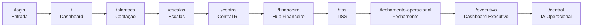

# MedicFlow-AI — Roteiro Completo de Demonstração Comercial

**Documento:** guia operacional para demos comerciais ao vivo  
**Data:** 11/06/2026  
**Versão:** V1 Comercial  
**Ambiente demo:** `https://staging.medicflow.app.br`  
**Script do apresentador:** [MEDICFLOW_DEMO_SCRIPT_APRESENTADOR.md](./MEDICFLOW_DEMO_SCRIPT_APRESENTADOR.md)

---

## Sumário

1. [Preparação da demonstração](#1-preparação-da-demonstração)
2. [Dados de demonstração](#2-dados-de-demonstração)
3. [Ordem das telas](#3-ordem-das-telas)
4. [O que falar em cada tela](#4-o-que-falar-em-cada-tela)
5. [Benefício percebido pelo cliente](#5-benefício-percebido-pelo-cliente)
6. [Perguntas esperadas](#6-perguntas-esperadas)
7. [Respostas recomendadas](#7-respostas-recomendadas)
8. [Demonstração de 10 minutos](#8-demonstração-de-10-minutos)
9. [Demonstração de 20 minutos](#9-demonstração-de-20-minutos)
10. [Demonstração de 40 minutos](#10-demonstração-de-40-minutos)

---

## 1. Preparação da demonstração

### 1.1 Checklist pré-demo (D-1 e D-0)

| Item | Responsável | Status |
|------|-------------|:------:|
| Staging acessível (`staging.medicflow.app.br`) | Comercial / TI | ☐ |
| Credenciais demo testadas (3 perfis) | Comercial | ☐ |
| Seed demo aplicado (se necessário) | TI / super_admin | ☐ |
| Navegador limpo (Chrome/Edge, janela anônima) | Apresentador | ☐ |
| Segunda tela ou projeção configurada | Apresentador | ☐ |
| Roteiro ensaiado (10 / 20 / 40 min) | Apresentador | ☐ |
| Script do apresentador impresso ou em tablet | Apresentador | ☐ |
| Q&A sheet preparado (seção 6–7 deste doc) | Apresentador | ☐ |
| Material de follow-up pronto (deck + proposta de valor) | Comercial | ☐ |
| Calendly / agenda aberta para próximo passo | Comercial | ☐ |

### 1.2 Requisitos técnicos

| Requisito | Especificação |
|-----------|---------------|
| **URL** | `https://staging.medicflow.app.br` |
| **Navegador** | Chrome 120+ ou Edge 120+ (recomendado) |
| **Resolução** | 1920×1080 (16:9) para projeção |
| **Conexão** | Mínimo 10 Mbps estável |
| **Dispositivo backup** | Celular com PWA (demonstrar responsividade) |
| **IA operacional** | Requer `MEDFLOW_OPENAI_API_KEY` no ambiente — confirmar com TI antes da demo |

### 1.3 Perfis de acesso para a demo

| Perfil | Papel RBAC | Uso na demo | Rotas principais |
|--------|------------|-------------|------------------|
| **Administrador** | `tenant_admin` | Visão completa, financeiro, executivo | `/`, `/financeiro`, `/executivo`, `/instituicao` |
| **Escalista** | `coordinator` | Escalas, plantões, central, IA | `/escalas`, `/plantoes`, `/central` |
| **Médico** | `professional` | Captação, confirmação, repasses (leitura) | `/`, `/plantoes`, `/tiss` |

> **Nota:** credenciais demo são provisionadas pelo time comercial/TI. Nunca compartilhar senhas em material externo.

### 1.4 Abertura da reunião (antes de abrir o sistema)

| Elemento | Orientação |
|----------|------------|
| **Duração anunciada** | Confirmar tempo disponível (10 / 20 / 40 min + Q&A) |
| **Agenda** | Operação → Financeiro → Executivo → Próximo passo |
| **Posicionamento** | Plataforma operacional + TISS MVP — **não é prontuário eletrônico** |
| **Pergunta de engajamento** | *"Quantas planilhas diferentes vocês usam hoje para escala, confirmação e faturamento?"* |
| **Audiência** | Identificar quem está na sala (diretoria, operação, financeiro, TI) e adaptar ênfase |

### 1.5 Plano B (contingências)

| Problema | Ação |
|----------|------|
| Staging indisponível | Usar screenshots em `docs/screenshots/` (12 telas validadas) |
| Login falha | Segunda credencial de backup; modo offline com deck comercial |
| IA não responde | Mostrar painel de agentes e contexto sem LLM; explicar dependência de API key |
| Internet lenta | Reduzir para roteiro 10 min; focar dashboard + central + executivo |
| Pergunta técnica profunda | Encaminhar para workshop técnico pós-demo |

---

## 2. Dados de demonstração

### 2.1 Tenant de demonstração

| Campo | Valor sugerido |
|-------|----------------|
| **Instituição** | Hospital Demo / Clínica Demo (seletor no login) |
| **Tipo de tenant** | `hospital` ou `clinic` |
| **Unidades** | UTI, Pronto-Socorro, Enfermaria |
| **Setores** | Plantão diurno, noturno, fim de semana |
| **Branding** | Logo e cores configurados em `/instituicao` |

### 2.2 Cenário narrativo (história da demo)

> **Contexto:** Sexta-feira, 14h. O hospital precisa garantir cobertura de UTI para o fim de semana. Um plantão está aberto, outro aguarda confirmação, e a central já emitiu alerta de cobertura baixa. O escalista age antes do problema. Após execução, a produção alimenta TISS e repasses. A diretoria consulta KPIs no dashboard executivo.

### 2.3 Dados operacionais pré-carregados

| Artefato | Quantidade sugerida | Status esperado |
|----------|--------------------:|-----------------|
| Escalas (schedules) | 2–3 | Publicadas |
| Turnos (shifts) | 15–20 | Mix: `open`, `confirmed`, `pending` |
| Plantões abertos | 3–5 | Visíveis em `/plantoes` → Abertos |
| Confirmações pendentes | 2–3 | Contador no dashboard |
| Swaps pendentes | 1–2 | Aba Swaps em `/plantoes` |
| Alertas na central | 2–4 | Cobertura, sem confirmação, conflitos |
| Profissionais | 8–12 | Vinculados ao tenant |
| Disponibilidade | 5–8 ativos | Perfil com switch "Disponível" |

### 2.4 Dados financeiros pré-carregados

| Artefato | Detalhe |
|----------|---------|
| **Convênios TISS** | 2 operadoras fictícias (seed demo) |
| **Guias TISS** | 5–10 guias em status variados |
| **Lotes** | 1–2 lotes com export XML |
| **Glosas** | 2–3 registros para demonstrar rastreio |
| **Produção médica** | Vinculada a plantões executados |
| **Repasses** | Calculados na aba Repasses |
| **Competência** | Mês corrente aberta ou parcialmente fechada |
| **Fechamento** | Snapshot disponível para demonstrar trava |

### 2.5 Seed demo (super_admin)

Se o ambiente estiver vazio, aplicar seed demo via `/instituicao` (perfil `super_admin`). O seed popula:

- Unidades e departamentos
- Escalas e turnos de exemplo
- Convênios TISS fictícios
- Dados operacionais mínimos para demo

> Executar seed **no mínimo 2 horas antes** da demo e validar todas as telas.

---

## 3. Ordem das telas

### 3.1 Sequência padrão (roteiro completo — 40 min)

```
/login → / → /plantoes → /escalas → /central → /financeiro → /tiss → /financeiro/fechamento-operacional → /executivo → /financeiro/dashboard-executivo → /central (IA)
```

### 3.2 Mapa visual do fluxo



### 3.3 Rotas e screenshots de referência

| # | Módulo | Rota | Screenshot |
|---|--------|------|------------|
| 1 | Login | `/login` | `screenshots/01-login.png` |
| 2 | Dashboard | `/` | `screenshots/02-dashboard.png` |
| 3 | Captação de Plantões | `/plantoes` | `screenshots/04-plantoes.png` |
| 4 | Escalas | `/escalas` | `screenshots/03-agenda-escalas.png` |
| 5 | Central de IA Operacional | `/central` | `screenshots/11-central-operacional.png` |
| 6 | Financeiro | `/financeiro` | `screenshots/05-financeiro.png` |
| 7 | TISS | `/tiss` | `screenshots/09-tiss.png` |
| 8 | Dashboard Executivo | `/executivo`, `/dashboard-executivo` | `screenshots/06-relatorios-dashboard-executivo.png` |
| 9 | IA Operacional | `/central` (painel Copilot) | — |

---

## 4. O que falar em cada tela

### Etapa 1 — Login

| Campo | Conteúdo |
|-------|----------|
| **Tela** | `/login` |
| **Mensagem principal** | *"Acesso seguro multi-tenant: cada instituição vê apenas seus dados, com a marca do hospital desde o primeiro clique."* |
| **Valor para o cliente** | Segurança (RLS Postgres), white-label, recuperação de senha integrada |
| **Tempo estimado** | 1 min |

**Pontos a demonstrar:**
- Seletor de instituição (multi-tenant)
- Branding da instituição no login
- Recuperação de senha (`/login/esqueci-senha`)

**O que NÃO prometer:** cadastro self-service de usuários (provisionamento via Auth).

---

### Etapa 2 — Dashboard

| Campo | Conteúdo |
|-------|----------|
| **Tela** | `/` |
| **Mensagem principal** | *"Visão do dia em um só lugar: plantões abertos, confirmações pendentes e alertas operacionais — sem abrir planilha ou WhatsApp."* |
| **Valor para o cliente** | Visibilidade imediata, redução de ligações reativas, ponto de partida para todos os papéis |
| **Tempo estimado** | 2 min |

**Pontos a demonstrar:**
- Contadores: plantões abertos, confirmações pendentes, swaps
- Links contextuais para ações
- Diferença de visão por papel (admin vs. médico vs. escalista)

---

### Etapa 3 — Captação de Plantões

| Campo | Conteúdo |
|-------|----------|
| **Tela** | `/plantoes` |
| **Mensagem principal** | *"Do plantão aberto à confirmação auditável: o médico aceita em um clique, o escalista aprova swaps, e tudo fica registrado — anti double-booking."* |
| **Valor para o cliente** | 100% confirmações rastreáveis, eliminação de WhatsApp, swaps formalizados |
| **Tempo estimado** | 4 min |

**Pontos a demonstrar:**
- Aba **Abertos** → Aceitar plantão (self-service)
- Aba **Meus plantões** → Confirmar assignment pendente
- Aba **Swaps** → Aprovar/nega troca formalizada
- Regra: 1 confirmado por turno

**Cenário narrativo:** *"Plantão de UTI aberto para sábado — médico aceita agora, escalista vê confirmação em tempo real."*

---

### Etapa 4 — Escalas

| Campo | Conteúdo |
|-------|----------|
| **Tela** | `/escalas` |
| **Mensagem principal** | *"Calendário de 14 dias com timeline por unidade e setor — substitui planilhas com versões conflitantes."* |
| **Valor para o cliente** | Centralização, filtros operacionais (conflitos, sem confirmação), histórico auditável |
| **Tempo estimado** | 3 min |

**Pontos a demonstrar:**
- Calendário 14 dias
- Timeline por unidade/setor/horário
- Filtros: `?opsFocus=conflicts`, `?opsFocus=sem-confirmacao`
- Status visual dos turnos (open, confirmed, pending)

---

### Etapa 5 — Central de IA Operacional

| Campo | Conteúdo |
|-------|----------|
| **Tela** | `/central` |
| **Mensagem principal** | *"Command center em tempo real: alertas de cobertura, KPIs operacionais e links para ação — antes do plantão virar problema."* |
| **Valor para o cliente** | Detecção proativa de gaps, operação 24/7 visível, Supabase Realtime |
| **Tempo estimado** | 4 min |

**Pontos a demonstrar:**
- Widgets de cobertura e indicadores
- Alertas contextuais com links para resolução
- Atualização em tempo real (Realtime)
- Timeline de eventos operacionais

**Cenário narrativo:** *"Sexta, 14h — central alerta plantão de UTI sem confirmação. Escalista age antes das 18h."*

---

### Etapa 6 — Financeiro

| Campo | Conteúdo |
|-------|----------|
| **Tela** | `/financeiro` |
| **Mensagem principal** | *"Hub financeiro operacional: fechamento de competência, conciliação e visão consolidada — conectado à produção real dos plantões."* |
| **Valor para o cliente** | Ciclo financeiro estruturado, conciliação CSV, trilha de auditoria |
| **Tempo estimado** | 3 min |

**Pontos a demonstrar:**
- Hub financeiro com navegação para submódulos
- Link para fechamento operacional
- Link para conciliação operacional
- Visão por competência

---

### Etapa 7 — TISS

| Campo | Conteúdo |
|-------|----------|
| **Tela** | `/tiss` |
| **Mensagem principal** | *"Operação alimenta faturamento: produção do plantão vira guia TISS, lote e repasse — no mesmo tenant, mesma auditoria."* |
| **Valor para o cliente** | Integração operação-financeiro, repasses vinculados à produção, glosas rastreadas |
| **Tempo estimado** | 5 min |

**Pontos a demonstrar:**
- Convênios e catálogo TUSS
- Guias e itens
- Lotes com export XML (MVP)
- Aba **Produção** → plantões executados
- Aba **Repasses** → cálculo vinculado
- Aba **Glosas** → registro e rastreio

**Transparência V1:** export XML MVP; envio automático a operadoras no roadmap médio prazo.

---

### Etapa 8 — Dashboard Executivo

| Campo | Conteúdo |
|-------|----------|
| **Tela** | `/executivo` + `/financeiro/dashboard-executivo` |
| **Mensagem principal** | *"KPIs reais para diretoria — operação e financeiro consolidados por competência, baseados em snapshots auditáveis."* |
| **Valor para o cliente** | Decisão baseada em dados, governança, compliance financeiro |
| **Tempo estimado** | 4 min |

**Pontos a demonstrar:**
- `/executivo` — narrativa executiva para sponsors
- `/financeiro/dashboard-executivo` — KPIs numéricos por competência
- Alertas financeiros e operacionais consolidados
- Fechamento com snapshot (link para `/financeiro/fechamento-operacional`)

**Pergunta para diretoria:** *"Hoje, quanto tempo leva para saber se o mês fechou no azul?"*

---

### Etapa 9 — IA Operacional

| Campo | Conteúdo |
|-------|----------|
| **Tela** | `/central` (painel Copilot GPT + agentes) |
| **Mensagem principal** | *"IA operacional supervisionada: copiloto read-only interpreta cobertura, alertas e recomendações — sem substituir o escalista, amplificando a decisão."* |
| **Valor para o cliente** | Inovação diferenciada, análise explicável, human-in-the-loop |
| **Tempo estimado** | 4 min |

**Pontos a demonstrar:**
- Painel Copilot GPT na central
- Pergunta de exemplo: *"Quais turnos têm risco de cobertura neste fim de semana?"*
- Agentes operacionais e orquestração (visão geral)
- Guardrails: read-only, sem diagnóstico clínico, sem ações automáticas

**Transparência:** IA é add-on opcional; requer API key OpenAI; não é requisito para operação.

---

## 5. Benefício percebido pelo cliente

### 5.1 Matriz benefício × persona

| Etapa | Escalista / Operação | Diretoria / CFO | Médico | TI / Compliance |
|-------|---------------------|-----------------|--------|-----------------|
| Login | Acesso rápido por papel | White-label institucional | Simples, mobile | Multi-tenant + RLS |
| Dashboard | Visão do dia centralizada | KPIs operacionais imediatos | Pendências visíveis | — |
| Captação | Confirmações auditáveis | Redução de risco de cobertura | 1 clique vs. WhatsApp | Trilha de auditoria |
| Escalas | Calendário unificado 14d | — | Planejamento pessoal | — |
| Central | Alertas proativos RT | Visibilidade 24/7 | Alertas contextuais | Realtime Supabase |
| Financeiro | — | Fechamento estruturado | — | Conciliação auditável |
| TISS | Produção → guias | Receita rastreável | Repasses transparentes | 14 tabelas TISS |
| Executivo | — | KPIs reais por competência | — | Snapshots travados |
| IA | Recomendações explicáveis | Inovação diferenciada | — | Supervisionada, read-only |

### 5.2 Mensagem de valor consolidada (elevator pitch)

> **MedicFlow-AI** substitui planilhas e WhatsApp na gestão de plantões hospitalares, integrando operação, TISS e fechamento financeiro em plataforma segura, white-label e pronta para demo comercial. Não é prontuário eletrônico — é a camada operacional e financeira que faltava entre planilhas e ERPs.

### 5.3 Antes vs. Depois (para reforço durante a demo)

| Processo | Antes | Depois (MedicFlow) |
|--------|-------|-------------------|
| Publicar escala | Planilha compartilhada | `/escalas` — 14 dias |
| Confirmar plantão | WhatsApp/ligação | `/plantoes` — auditável |
| Monitorar cobertura | Ligações reativas | `/central` — alertas RT |
| Trocar turno | Acordo informal | Swap com aprovação |
| Faturar TISS | Sistema separado | `/tiss` — integrado |
| Fechar mês | Planilha + e-mail | Snapshot + trava |
| Repassar médicos | Planilha paralela | Repasses vinculados à produção |

---

## 6. Perguntas esperadas

### 6.1 Produto e escopo

| # | Pergunta |
|---|----------|
| 1 | É prontuário eletrônico? |
| 2 | É ERP hospitalar completo? |
| 3 | Integra com nosso EHR/ERP atual? |
| 4 | Funciona para cooperativas médicas? |
| 5 | Quantas unidades/hospitais suporta? |

### 6.2 Operação

| # | Pergunta |
|---|----------|
| 6 | Como o médico é notificado de plantão aberto? |
| 7 | Funciona no celular? |
| 8 | Como funciona troca de turno (swap)? |
| 9 | E se dois médicos aceitarem o mesmo plantão? |
| 10 | Posso importar escala de planilha Excel? |

### 6.3 Financeiro e TISS

| # | Pergunta |
|---|----------|
| 11 | Envia TISS automaticamente para operadoras? |
| 12 | O XML TISS é conforme ANS? |
| 13 | Como funciona o fechamento mensal? |
| 14 | Médicos conseguem ver repasses? |
| 15 | Como funciona conciliação bancária? |

### 6.4 Segurança e implantação

| # | Pergunta |
|---|----------|
| 16 | Quanto tempo para go-live? |
| 17 | Como funciona LGPD e isolamento de dados? |
| 18 | Quantos papéis de acesso existem? |
| 19 | Onde ficam os dados (cloud/on-premise)? |
| 20 | Quanto custa? |

### 6.5 IA

| # | Pergunta |
|---|----------|
| 21 | A IA substitui o escalista? |
| 22 | A IA acessa dados de pacientes? |
| 23 | A IA pode confirmar plantões automaticamente? |

---

## 7. Respostas recomendadas

### 7.1 Produto e escopo

| Pergunta | Resposta recomendada |
|----------|---------------------|
| É prontuário eletrônico? | **Não.** MedicFlow-AI é plataforma operacional + TISS MVP. Complementa o EHR existente — não substitui prontuário, pacientes ou agenda ambulatorial. |
| É ERP hospitalar completo? | **Não.** Somos a camada operacional e financeira entre planilhas e ERPs. Foco: plantões, escalas, TISS e fechamento. |
| Integra com EHR/ERP? | **V1:** conciliação via import CSV. Integração ERP/DRE está no roadmap longo prazo. Podemos mapear APIs no discovery. |
| Funciona para cooperativas? | **Sim.** Cooperativa opera como tenant dedicado com pool de profissionais, escalas centralizadas e repasses transparentes. |
| Quantas unidades suporta? | **Multi-tenant nativo** com RLS Postgres — cada instituição isolada. Unidades e departamentos configuráveis por tenant. Escala horizontal cloud-native. |

### 7.2 Operação

| Pergunta | Resposta recomendada |
|----------|---------------------|
| Como notifica o médico? | **V1:** notificação in-app + Supabase Realtime (dashboard e central). Push/e-mail no roadmap médio prazo. Médicos veem plantões abertos ao acessar o sistema ou via PWA no celular. |
| Funciona no celular? | **Sim.** PWA responsivo — acessível no navegador mobile sem app store. Ideal para confirmação rápida de plantões. |
| Como funciona swap? | Médico solicita troca em `/plantoes` → escalista aprova/nega em `/plantoes?tab=swaps`. Reatribuição automática com trilha de auditoria. |
| Dois médicos no mesmo plantão? | **Regra de negócio:** apenas 1 assignment `confirmed` por shift. Sistema impede double-booking — diferencial vs. planilhas. |
| Importar de Excel? | **V1:** não há import de escala. Cadastro via `/escalas`. Importação em massa no roadmap curto prazo. |

### 7.3 Financeiro e TISS

| Pergunta | Resposta recomendada |
|----------|---------------------|
| Envia TISS para operadoras? | **V1:** export XML + registro manual de retorno. Envio automático a operadoras no roadmap médio prazo. |
| XML conforme ANS? | **V1:** export XML MVP — funcional para demonstração e ciclo interno. Conformidade ANS completa no roadmap curto prazo. |
| Fechamento mensal? | Competência mensal com **snapshot e trava** em `/financeiro/fechamento-operacional`. Impede alteração retroativa. Reabertura só com permissão de admin. |
| Médicos veem repasses? | **Sim.** `/tiss` → Produção e Repasses (leitura para `professional`). Transparência reduz disputas. |
| Conciliação bancária? | **V1:** import CSV estruturado em `/financeiro/conciliacao-operacional`. OFX/CNAB no roadmap médio prazo. |

### 7.4 Segurança e implantação

| Pergunta | Resposta recomendada |
|----------|---------------------|
| Tempo para go-live? | **~3 dias** com piloto assistido: dia 0 branding, dias 1–2 TISS e usuários, dia 3 competência e smoke tests. |
| LGPD e isolamento? | RLS Postgres (Row Level Security), RBAC com 5 papéis e 30+ capabilities, audit logs, isolamento total por tenant. Dados segregados por instituição. |
| Papéis de acesso? | 5 papéis: `super_admin`, `tenant_admin`, `coordinator`, `financial`, `professional`. Cada um vê apenas o necessário. |
| Onde ficam os dados? | Cloud-native: Supabase (Postgres) + Cloudflare Workers. Deploy alternativo Vercel. On-premise não disponível em V1. |
| Quanto custa? | SaaS por tenant — pacotes Operacional, +TISS, Enterprise. Proposta comercial após discovery de 30 min. |

### 7.5 IA

| Pergunta | Resposta recomendada |
|----------|---------------------|
| IA substitui escalista? | **Não.** IA operacional é copiloto read-only — interpreta dados, destaca riscos e recomendações. Decisão sempre humana (human-in-the-loop). |
| IA acessa dados de pacientes? | **Não.** IA foca em operação de escalas, cobertura e coordenação. Sem diagnóstico clínico, sem prontuário. |
| IA confirma plantões? | **Não.** Guardrails impedem ações automáticas. IA não executa workflows, não confirma plantões, não aprova swaps. |

---

## 8. Demonstração de 10 minutos

**Público ideal:** primeiro contato, diretoria com agenda apertada, elevator demo.  
**Objetivo:** gerar interesse e agendar demo completa de 40 min.

### 8.1 Roteiro (com IA nos primeiros 3 minutos)

| # | Tela | Mensagem-chave | Tempo |
|---|------|----------------|------:|
| 0 | Abertura | Problema + posicionamento (não é EHR) | 0:30 |
| 1 | `/login` | Multi-tenant seguro + white-label | 0:30 |
| 2 | `/` | **Card IA Operacional** + menu **Central de IA** | 1:00 |
| 3 | `/central` | Copilot no topo + alertas inteligentes | 1:00 |
| 4 | `/plantoes` | Captação — aceitar plantão em 1 clique | 2:00 |
| 5 | `/central` | Recomendações + scoring (badges IA) | 2:00 |
| 6 | `/executivo` | KPIs para diretoria | 2:00 |
| 7 | CTA | Agendar demo 40 min ou piloto 30 dias | 1:00 |
| | **Total** | | **10:00** |

> **Primeiros 3 min:** Home (card IA + menu) → Central (Copilot visível) — cliente percebe IA antes da captação.

### 8.1b Roteiro clássico (sem ênfase IA)

| # | Tela | Mensagem-chave | Tempo |
|---|------|----------------|------:|
| 0 | Abertura | Problema + posicionamento (não é EHR) | 1:00 |
| 1 | `/login` | Multi-tenant seguro + white-label | 0:30 |
| 2 | `/` | Dashboard do dia — visão imediata | 1:30 |
| 3 | `/plantoes` | Captação — aceitar plantão em 1 clique | 2:00 |
| 4 | `/central` | Central RT — alertas proativos | 2:00 |
| 5 | `/executivo` | KPIs para diretoria | 2:00 |
| 6 | CTA | Agendar demo 40 min ou piloto 30 dias | 1:00 |
| | **Total** | | **10:00** |

### 8.2 O que cortar (roteiro IA 10 min)

- Escalas detalhadas (`/escalas`)
- Financeiro hub (`/financeiro`)
- TISS completo (`/tiss`)
- Fechamento operacional
- Swaps e disponibilidade (mencionar apenas)

> Roteiro dedicado à IA: [DEMO_IA_10_MINUTOS.md](./DEMO_IA_10_MINUTOS.md)

### 8.3 CTA de fechamento

> *"Isso foi um resumo de 10 minutos. Proponho uma demo completa de 40 minutos — da captação ao fechamento financeiro — ou um piloto institucional de 30 dias com KPIs baseline. Podemos agendar para [data]?"*

---

## 9. Demonstração de 20 minutos

**Público ideal:** comitê operacional + financeiro, segunda reunião, demo pós-pitch.  
**Objetivo:** demonstrar integração operação → financeiro.

### 9.1 Roteiro

| # | Tela | Mensagem-chave | Tempo |
|---|------|----------------|------:|
| 0 | Abertura + problema | Planilhas vs. plataforma integrada | 2:00 |
| 1 | `/login` | Multi-tenant + branding | 1:00 |
| 2 | `/` | Dashboard do dia | 1:30 |
| 3 | `/plantoes` | Captação + swap rápido | 3:00 |
| 4 | `/escalas` | Calendário 14 dias | 2:00 |
| 5 | `/central` | Central RT + alertas | 3:00 |
| 6 | `/tiss` | Produção → Repasses | 3:00 |
| 7 | `/executivo` | Dashboard executivo | 2:30 |
| 8 | CTA + Q&A | Próximo passo | 2:00 |
| | **Total** | | **20:00** |

### 9.2 Ênfase por audiência

| Se na sala... | Priorizar | Reduzir |
|---------------|-----------|---------|
| Diretoria / CFO | Etapas 6–7 (TISS + Executivo) | Detalhe de swaps |
| Operação / Escalista | Etapas 3–5 (Captação + Escalas + Central) | TISS detalhado |
| Médico / Cooperativa | Etapas 3–4 (Captação + Escalas) | Executivo |

### 9.3 O que cortar vs. roteiro 40 min

- Hub financeiro completo (`/financeiro`)
- Fechamento com snapshot (mencionar, não demonstrar)
- IA operacional (mencionar como add-on)
- Conciliação CSV

---

## 10. Demonstração de 40 minutos

**Público ideal:** decisores completos (diretoria + operação + financeiro + TI), demo executiva, pré-piloto.  
**Objetivo:** demonstrar ciclo completo — da captação ao fechamento — com IA como diferencial.

### 10.1 Roteiro

| # | Tela | Mensagem-chave | Tempo |
|---|------|----------------|------:|
| 0 | Abertura + problema + solução | 3 pilares: Operação, Financeiro, Implantação | 3:00 |
| 1 | `/login` | Multi-tenant seguro + white-label | 1:30 |
| 2 | `/` | Dashboard do dia | 2:00 |
| 3 | `/plantoes` | Captação completa (Abertos + Meus + Swaps) | 5:00 |
| 4 | `/escalas` | Calendário 14 dias + filtros operacionais | 3:00 |
| 5 | `/central` | Central RT + alertas + timeline | 4:00 |
| 6 | `/financeiro` | Hub financeiro operacional | 2:00 |
| 7 | `/tiss` | Ciclo TISS: convênios → guias → lotes → repasses → glosas | 5:00 |
| 8 | `/financeiro/fechamento-operacional` | Snapshot + trava de competência | 3:00 |
| 9 | `/executivo` + `/dashboard-executivo` | KPIs reais para diretoria | 4:00 |
| 10 | `/central` (IA) | Copilot GPT + agentes operacionais | 4:00 |
| 11 | CTA + Q&A | Demo 40 min → Piloto 30 dias → Contrato | 3:30 |
| | **Total** | | **40:00** |

### 10.2 Alternância de perfis durante a demo

| Momento | Perfil | Por quê |
|---------|--------|---------|
| Etapas 1–2 | `tenant_admin` ou `coordinator` | Visão completa |
| Etapa 3 (aceitar plantão) | `professional` | Mostrar experiência do médico |
| Etapas 4–5 | `coordinator` | Escalista opera |
| Etapas 6–9 | `tenant_admin` ou `financial` | Financeiro e executivo |
| Etapa 10 | `coordinator` | IA visível para operational managers |

> **Dica:** preparar 2 abas logadas (escalista + médico) para alternar sem relogar.

### 10.3 Demo guiada alternativa (`/piloto`)

Se preferir roteiro assistido pelo sistema:

| Passo | Rota | Conteúdo |
|------:|------|----------|
| 1 | `/piloto` | Abertura executiva |
| 2 | `/` | Operação do dia |
| 3 | `/central` | Central de IA Operacional |
| 4 | `/executivo` | Walkthrough executivo |
| 5 | `/tiss` | TISS e faturamento |
| 6 | `/instituicao` | Multi-tenant e branding |
| 7 | `/operacao` | Confiança operacional |

### 10.4 CTA de fechamento

| Opção | Para quem | Próximo passo |
|-------|-----------|---------------|
| **Piloto institucional (30 dias)** | Operação + financeiro | KPIs baseline + go-live assistido |
| **Workshop técnico (2h)** | TI + compliance | Arquitetura, RLS, RBAC, auditoria |
| **Proposta comercial** | Diretoria / procurement | Discovery + pacote (Operacional / +TISS / Enterprise) |

### 10.5 Follow-up pós-demo (template)

**Assunto:** MedicFlow-AI — material da demo + próximos passos

> Olá [nome],
>
> Obrigado pela demo de hoje. Conforme apresentado:
>
> **Demo live:** https://staging.medicflow.app.br  
> **Demo guiada:** `/piloto` (7 passos)
>
> **Material anexo:**
> - Roteiro de demonstração comercial
> - Script do apresentador
> - Proposta de valor executiva
> - Apresentação comercial V1
>
> **Próximo passo sugerido:** [Piloto 30 dias em DATA / Workshop técnico / Proposta comercial]
>
> Fico à disposição para dúvidas.
>
> Abraço,  
> [nome] — [contato]

---

## Apêndice — Referências cruzadas

| Documento | Uso |
|-----------|-----|
| [MEDICFLOW_DEMO_SCRIPT_APRESENTADOR.md](./MEDICFLOW_DEMO_SCRIPT_APRESENTADOR.md) | Texto falado pelo apresentador |
| [MEDICFLOW_PROPOSTA_DE_VALOR.md](./MEDICFLOW_PROPOSTA_DE_VALOR.md) | Argumentação comercial |
| [MEDICFLOW_PITCH_15_MINUTOS.md](./MEDICFLOW_PITCH_15_MINUTOS.md) | Pitch com slides |
| [MEDICFLOW_PRESENTACAO_COMERCIAL_V1.md](./MEDICFLOW_PRESENTACAO_COMERCIAL_V1.md) | Deck completo (15 slides) |
| [MEDICFLOW_JORNADA_USUARIOS.md](./MEDICFLOW_JORNADA_USUARIOS.md) | Jornadas por persona |
| [MEDICFLOW_WORKFLOW_CAPTACAO_PLANTOES.md](./MEDICFLOW_WORKFLOW_CAPTACAO_PLANTOES.md) | Workflow 10 etapas |

---

*Documento gerado com base na documentação executiva MedicFlow-AI V1. Sem alterações de código, banco ou staging.*
