# MedicFlow-AI — Diagramas Executivos

**Documento:** material visual para apresentações comerciais e conversão em PowerPoint  
**Data:** 11/06/2026  
**Ambiente:** `https://staging.medicflow.app.br`  
**Base:** documentação operacional V1 ([MEDICFLOW_APRESENTACAO_EXECUTIVA.md](./MEDICFLOW_APRESENTACAO_EXECUTIVA.md))

---

## Guia de uso

### Conversão para PowerPoint

| Método | Passo |
|--------|-------|
| **Mermaid Live** | Copiar bloco → [mermaid.live](https://mermaid.live) → Export PNG/SVG |
| **CLI** | `npx @mermaid-js/mermaid-cli -i diagrama.mmd -o slide.png -b transparent` |
| **Plugin PPT** | Mermaid Chart, Think-Cell ou add-ins compatíveis com SVG |

### Recomendações para slides

- Exportar em **1920×1080** ou **1280×720** (16:9)
- Fundo transparente para sobreposição em template corporativo
- Um diagrama por slide — evitar overcrowding
- Manter legenda de cores abaixo do diagrama (paleta deste documento)

### Paleta corporativa MedicFlow-AI

| Token | Hex | Uso |
|-------|-----|-----|
| **Primary** | `#0369A1` | Bordas, setas, títulos |
| **Primary Light** | `#E0F2FE` | Módulos operacionais |
| **Teal** | `#0D9488` | Saúde, fluxos de plantão |
| **Teal Light** | `#CCFBF1` | Etapas de captação |
| **Navy** | `#1E3A5F` | Texto executivo, atores |
| **Success** | `#059669` | Resultados, pagamento, go-live |
| **Success Light** | `#D1FAE5` | Fechamento, KPIs positivos |
| **Accent** | `#D97706` | Alertas, implantação |
| **Accent Light** | `#FEF3C7` | Instituição, branding |
| **IA** | `#7C3AED` | Copilot, agentes |
| **IA Light** | `#EDE9FE` | IA operacional |
| **Audit** | `#DB2777` | Auditoria, compliance |

### Init padrão (copiar no topo de cada diagrama)

```mermaid
%%{init: {
  'theme': 'base',
  'themeVariables': {
    'fontFamily': 'Segoe UI, Arial, sans-serif',
    'fontSize': '14px',
    'primaryColor': '#E0F2FE',
    'primaryTextColor': '#1E3A5F',
    'primaryBorderColor': '#0369A1',
    'secondaryColor': '#CCFBF1',
    'secondaryTextColor': '#1E3A5F',
    'secondaryBorderColor': '#0D9488',
    'tertiaryColor': '#FEF3C7',
    'tertiaryTextColor': '#1E3A5F',
    'tertiaryBorderColor': '#D97706',
    'lineColor': '#0369A1',
    'textColor': '#1E3A5F',
    'mainBkg': '#FFFFFF',
    'nodeBorder': '#0369A1',
    'clusterBkg': '#F8FAFC',
    'clusterBorder': '#0369A1',
    'titleColor': '#0369A1'
  }
}}%%
```

---

## 1. Diagrama Executivo — Visão da Plataforma

**Slide sugerido:** abertura / visão geral do produto  
**Público:** diretoria, investidores, sponsors de implantação

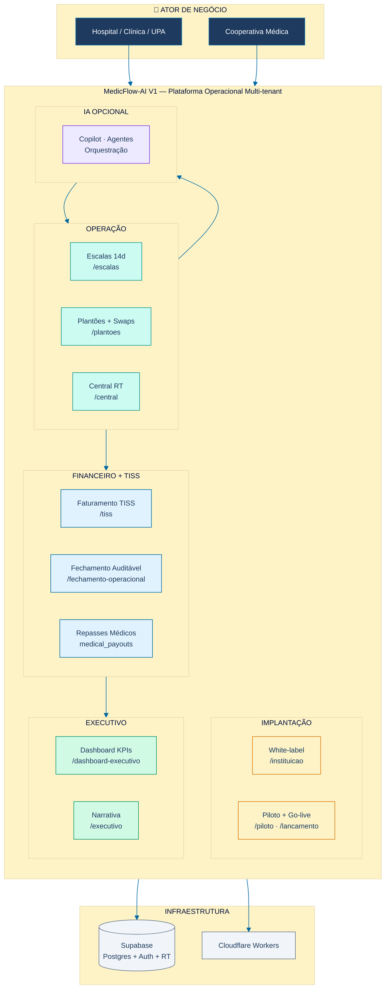

**Mensagem executiva:** MedicFlow-AI unifica operação de plantões, TISS e fechamento financeiro em plataforma white-label — com central em tempo real e implantação assistida.

---

## 2. Fluxograma — Captação de Plantões

**Slide sugerido:** processo operacional core (10 etapas)  
**Documento base:** [MEDICFLOW_WORKFLOW_CAPTACAO_PLANTOES.md](./MEDICFLOW_WORKFLOW_CAPTACAO_PLANTOES.md)

```mermaid
%%{init: {'theme': 'base', 'themeVariables': {'primaryColor': '#CCFBF1', 'primaryBorderColor': '#0D9488', 'lineColor': '#0369A1', 'fontSize': '12px'}}}%%
flowchart LR
    subgraph DEMANDA["①② DEMANDA E PUBLICAÇÃO"]
        A1["① Cadastro<br/>/escalas<br/>shifts: open"]
        A2["② Publicação<br/>Calendário 14d"]
        A1 --> A2
    end

    subgraph ENGAJ["③④ ENGAJAMENTO"]
        B1["③ Notificação<br/>/ + /central RT"]
        B2["④ Interesse<br/>/plantoes Abertos"]
        B1 --> B2
    end

    subgraph ALOC["⑤⑥ ALOCAÇÃO"]
        C1["⑤ Seleção<br/>Escalista ou self-service"]
        C2["⑥ Confirmação<br/>1 confirmed/shift"]
        C1 --> C2
    end

    subgraph EXEC["⑦⑧ EXECUÇÃO"]
        D1["⑦ Execução<br/>Plantão realizado"]
        D2["⑧ Validação<br/>medical_production"]
        D1 --> D2
    end

    subgraph FIN["⑨⑩ FINANCEIRO"]
        E1["⑨ Fechamento<br/>Snapshot + trava"]
        E2["⑩ Pagamento<br/>Repasses /tiss"]
        E1 --> E2
    end

    A2 --> B1
    B2 --> C1
    C2 --> D1
    D2 --> E1

    classDef etapa1 fill:#FEF3C7,stroke:#D97706,color:#1E3A5F
    classDef etapa2 fill:#E0F2FE,stroke:#0369A1,color:#1E3A5F
    classDef etapa3 fill:#CCFBF1,stroke:#0D9488,color:#1E3A5F
    classDef etapa4 fill:#EDE9FE,stroke:#7C3AED,color:#1E3A5F
    classDef etapa5 fill:#D1FAE5,stroke:#059669,color:#1E3A5F

    class A1,A2 etapa1
    class B1,B2 etapa2
    class C1,C2 etapa3
    class D1,D2 etapa4
    class E1,E2 etapa5
```

### Fluxograma detalhado — decisões e exceções

```mermaid
%%{init: {'theme': 'base', 'themeVariables': {'primaryColor': '#CCFBF1', 'primaryBorderColor': '#0D9488', 'lineColor': '#0369A1'}}}%%
flowchart TD
    START(["Demanda de cobertura<br/>Hospital / Cooperativa"]) --> A

    subgraph E1["① Cadastro"]
        A["Admin: /instituicao"] --> B["Escalista: /escalas"]
        B --> C[("shifts open")]
    end

    C --> D["② Publicação<br/>Calendário 14d"]
    D --> E["③ Notificação RT<br/>/central"]
    E --> F{Disponível?}
    F -->|Não| G["/perfil indisponível"]
    F -->|Sim| H["④ /plantoes Abertos"]
    G --> E

    H --> I{Modo alocação}
    I -->|Self-service| J["Aceitar vaga"]
    I -->|Escalista| K["Atribuir coordinator"]
    I -->|Swap| L["shift_swap_requests"]
    L --> M{Aprovado?}
    M -->|Não| C
    M -->|Sim| N["⑥ Confirmed"]
    J --> N
    K --> N

    N --> O["⑦ Execução plantão"]
    O --> P["⑧ medical_production"]
    P --> Q["⑨ Fechamento competência"]
    Q --> R["⑩ Repasses médicos"]
    R --> END(["Ciclo completo"])

    classDef start fill:#1E3A5F,color:#FFF,stroke:#0369A1
    classDef process fill:#E0F2FE,stroke:#0369A1,color:#1E3A5F
    classDef decision fill:#FEF3C7,stroke:#D97706,color:#1E3A5F
    classDef end fill:#D1FAE5,stroke:#059669,color:#1E3A5F

    class START,END start
    class A,B,C,D,E,G,H,J,K,L,N,O,P,Q,R process
    class F,I,M decision
```

### Swimlane — atores do fluxo

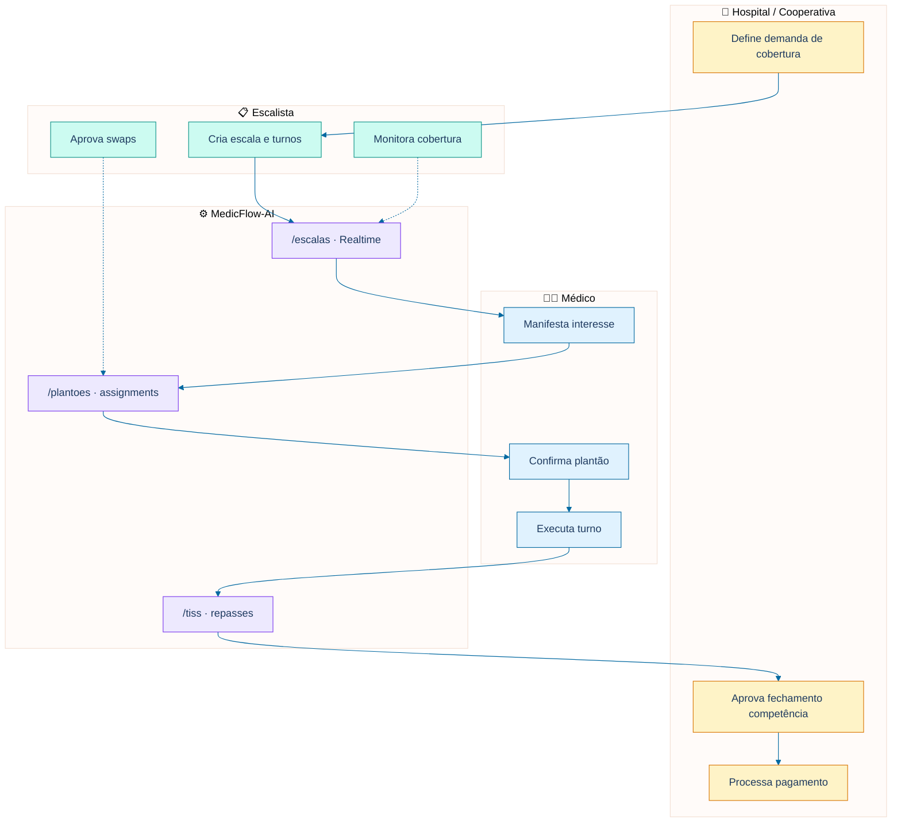

---

## 3. Fluxograma — Hub Administrativo Médico

**Slide sugerido:** gestão institucional (10 módulos)  
**Documento base:** [MEDICFLOW_WORKFLOW_HUB_ADMINISTRATIVO.md](./MEDICFLOW_WORKFLOW_HUB_ADMINISTRATIVO.md)

```mermaid
%%{init: {'theme': 'base', 'themeVariables': {'primaryColor': '#FEF3C7', 'primaryBorderColor': '#D97706', 'lineColor': '#0369A1', 'fontSize': '12px'}}}%%
flowchart TD
    START(["Nova instituição<br/>Hospital / Cooperativa"]) --> M1

    subgraph MOD1["① Instituição"]
        M1["/instituicao<br/>Branding + Parametrização"]
    end

    subgraph MOD2["② Profissionais"]
        M2["Auth + RBAC<br/>5 papéis · 30+ capabilities"]
    end

    subgraph MOD3["③ Escalas"]
        M3["/escalas · /plantoes<br/>/central"]
    end

    subgraph MOD4["④ Financeiro"]
        M4["/financeiro<br/>Hub navegação"]
    end

    subgraph MOD5["⑤ TISS"]
        M5["/tiss<br/>Convênios · Guias · Lotes"]
    end

    subgraph MOD6["⑥ Conciliação"]
        M6["/conciliacao-operacional<br/>Import CSV"]
    end

    subgraph MOD7["⑦ Fechamento"]
        M7["Competência<br/>Snapshot + Trava"]
    end

    subgraph MOD8["⑧ Dashboard"]
        M8["/dashboard-executivo<br/>/executivo"]
    end

    subgraph MOD9["⑨ Indicadores"]
        M9["KPIs Operacionais<br/>TISS · Financeiro"]
    end

    subgraph MOD10["⑩ Auditoria"]
        M10["/operacao<br/>Events + Logs"]
    end

    M1 --> M2 --> M3 --> M4
    M4 --> M5 --> M6 --> M7
    M7 --> M8 --> M9 --> M10
    M10 --> END(["Hub operacional"])

    classDef inst fill:#FEF3C7,stroke:#D97706,color:#1E3A5F
    classDef prof fill:#E0F2FE,stroke:#0369A1,color:#1E3A5F
    classDef esc fill:#CCFBF1,stroke:#0D9488,color:#1E3A5F
    classDef fin fill:#D1FAE5,stroke:#059669,color:#1E3A5F
    classDef tiss fill:#EDE9FE,stroke:#7C3AED,color:#1E3A5F
    classDef audit fill:#FCE7F3,stroke:#DB2777,color:#1E3A5F

    class M1 inst
    class M2 prof
    class M3 esc
    class M4,M6,M7 fin
    class M5 tiss
    class M8,M9 fin
    class M10 audit
    class START,END inst
```

### Implantação do Hub — sequência comercial

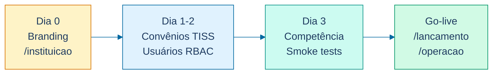

---

## 4. Jornada do Médico

**Slide sugerido:** experiência do profissional de plantão  
**Papel técnico:** `professional`

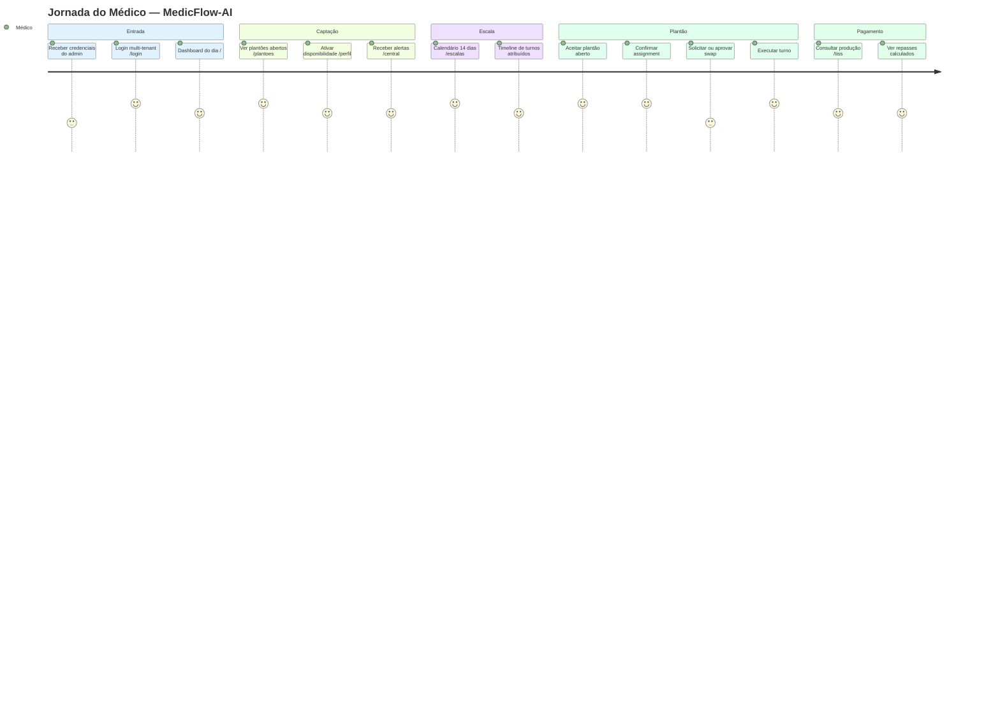

### Fluxo linear com rotas

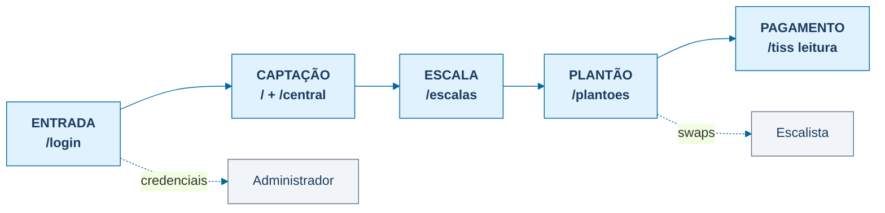

---

## 5. Jornada do Hospital

**Slide sugerido:** valor para instituição hospitalar (tenant)  
**Entidade:** hospital, clínica ou UPA como tenant multi-tenant

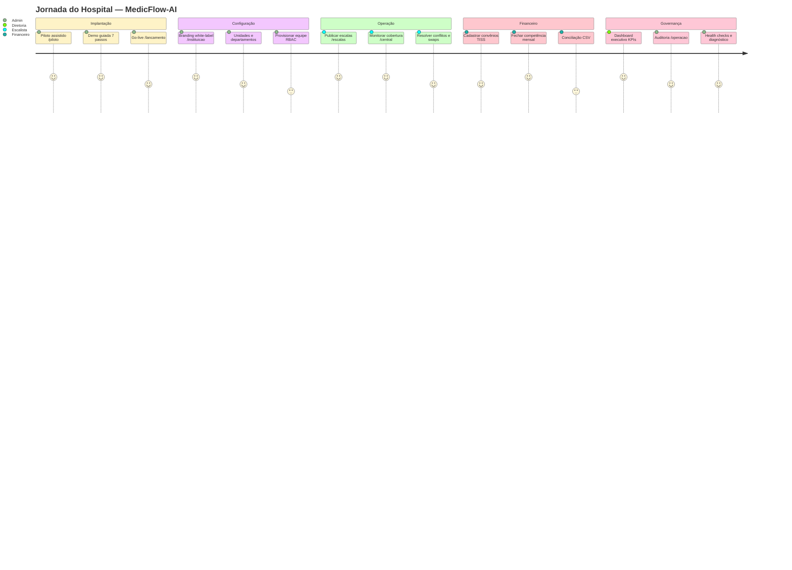

### Fluxo institucional do hospital

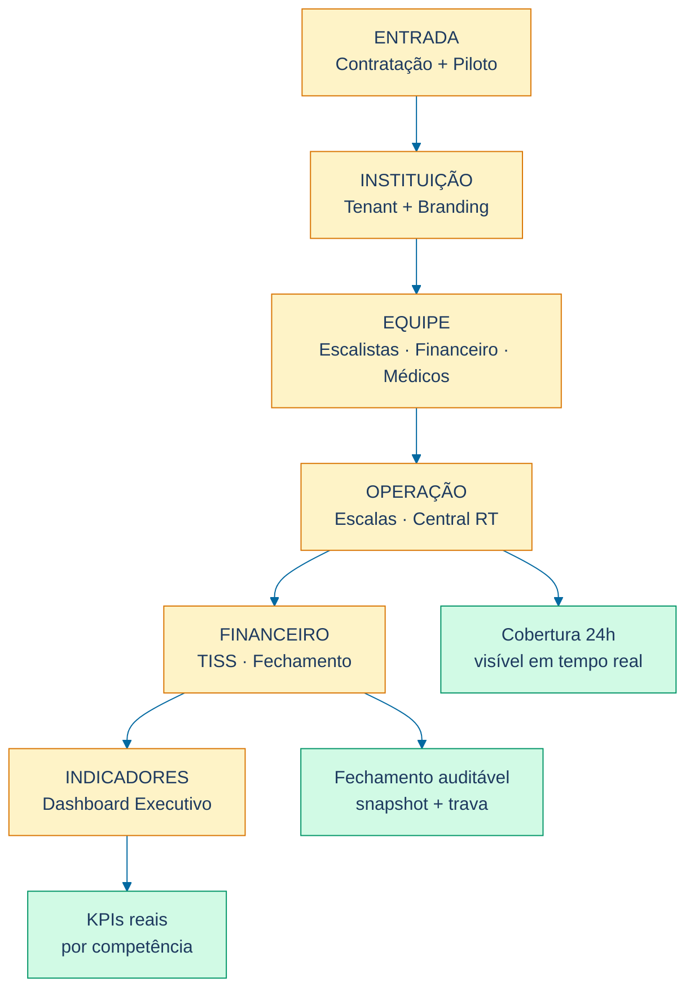

---

## 6. Jornada da Cooperativa

**Slide sugerido:** valor para cooperativa médica (tenant dedicado)  
**Nota:** cooperativa opera como tenant — não é papel RBAC separado

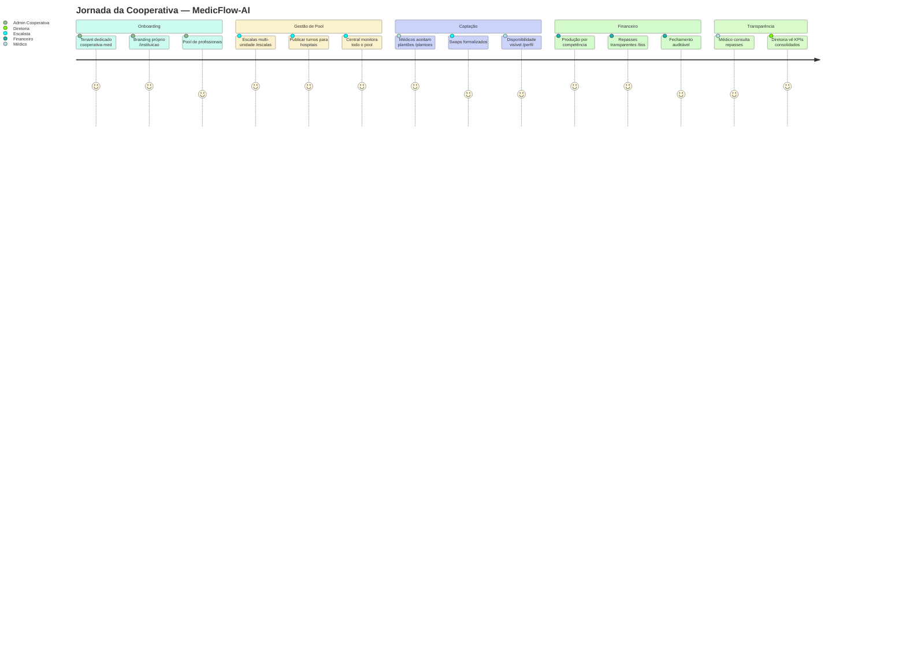

### Fluxo cooperativa — pool centralizado

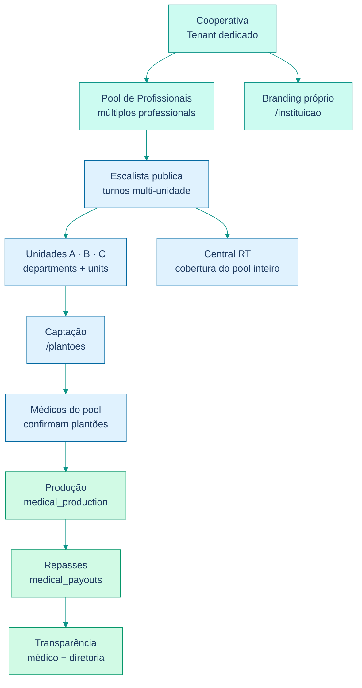

---

## 7. Arquitetura da Plataforma

**Slide sugerido:** arquitetura técnica e módulos  
**Documento base:** [MEDICFLOW_WORKFLOW_OPERACIONAL.md](./MEDICFLOW_WORKFLOW_OPERACIONAL.md)

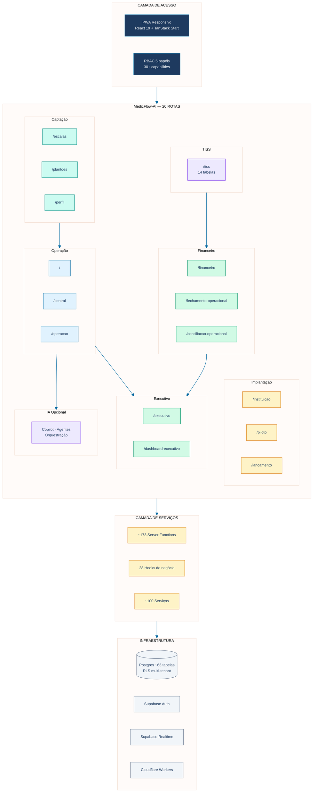

### Relacionamento entre módulos

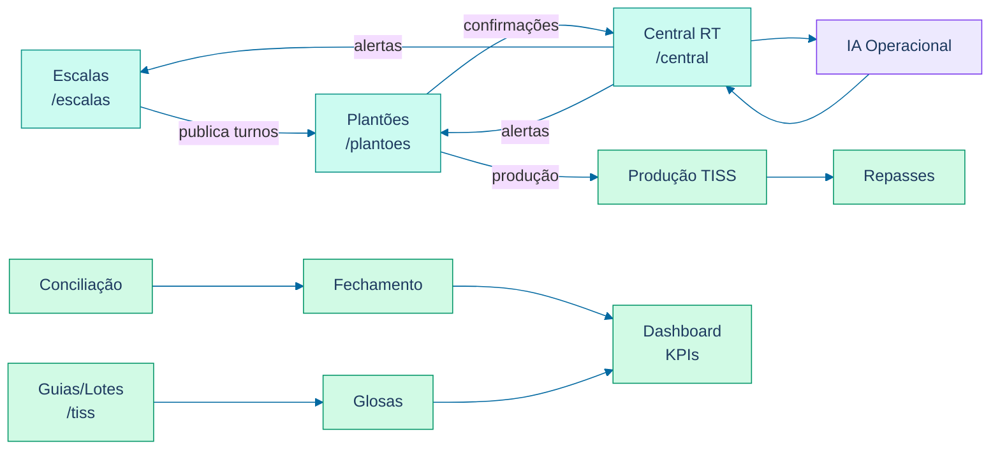

### Stack tecnológica — camadas

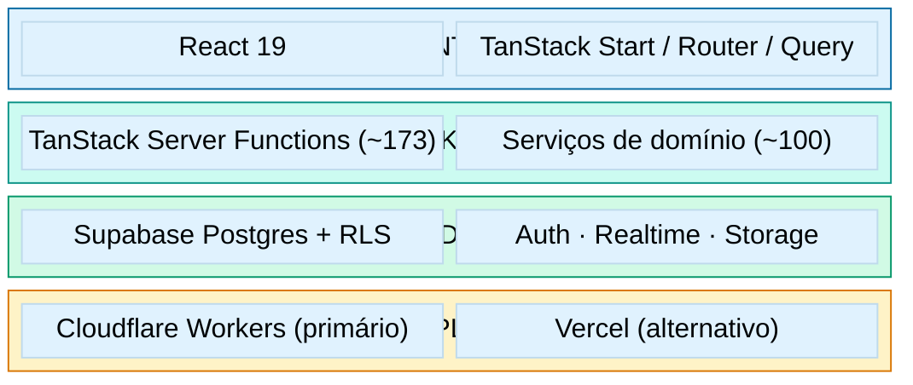

---

## Índice de diagramas

| # | Diagrama | Tipo Mermaid | Slide sugerido |
|---|----------|--------------|----------------|
| 1 | Visão da Plataforma | flowchart | Abertura |
| 2 | Captação de Plantões (3 variações) | flowchart | Operação |
| 3 | Hub Administrativo (2 variações) | flowchart | Gestão |
| 4 | Jornada do Médico (2 variações) | journey + flowchart | Persona médico |
| 5 | Jornada do Hospital (2 variações) | journey + flowchart | Persona hospital |
| 6 | Jornada da Cooperativa (2 variações) | journey + flowchart | Persona cooperativa |
| 7 | Arquitetura (3 variações) | flowchart + block-beta | Técnico / CTO |

---

## Referências

| Documento | Conteúdo |
|-----------|----------|
| [MEDICFLOW_SLIDES_COMERCIAIS.md](./MEDICFLOW_SLIDES_COMERCIAIS.md) | Slides Antes/Depois, ROI, Diferenciais |
| [MEDICFLOW_INFOGRAFICO.md](./MEDICFLOW_INFOGRAFICO.md) | Infográfico consolidado |
| [MEDICFLOW_PROPOSTA_DE_VALOR.md](./MEDICFLOW_PROPOSTA_DE_VALOR.md) | Proposta comercial completa |

---

*Diagramas compatíveis com Mermaid 10+. Testar renderização em [mermaid.live](https://mermaid.live) antes da exportação para PowerPoint.*
