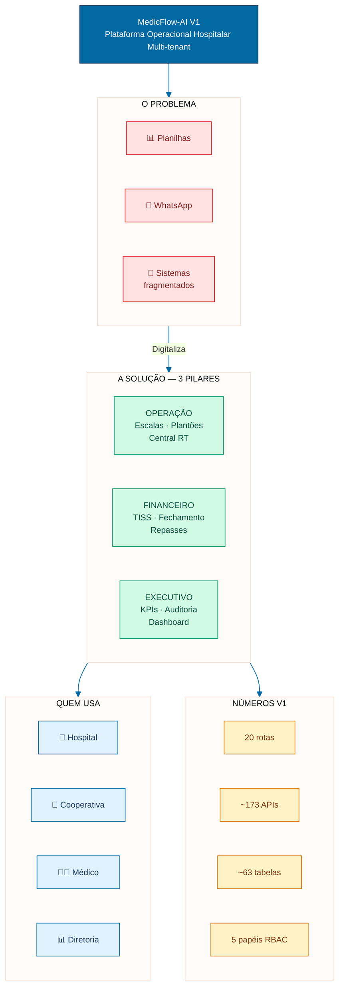
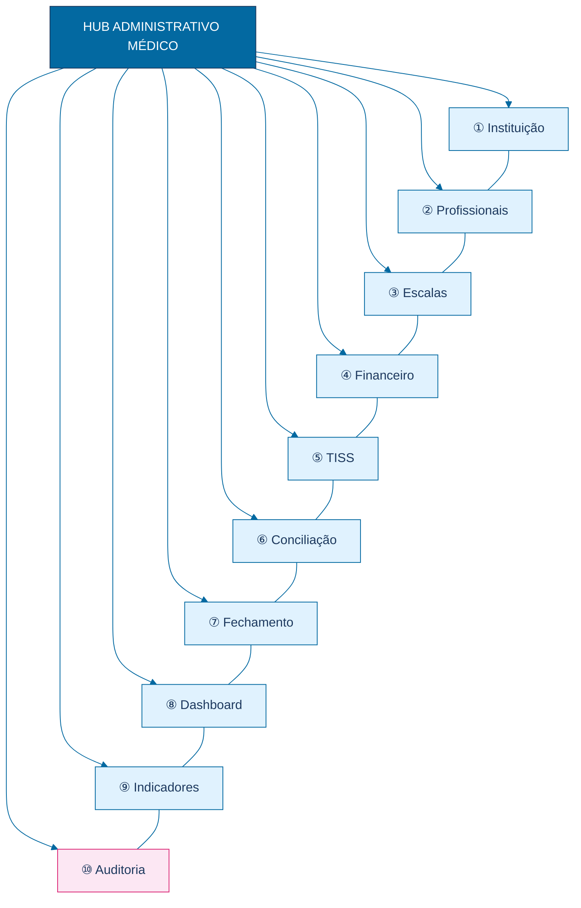
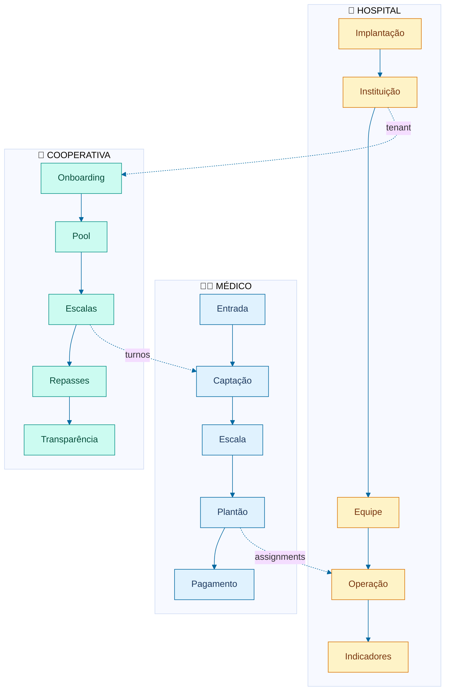
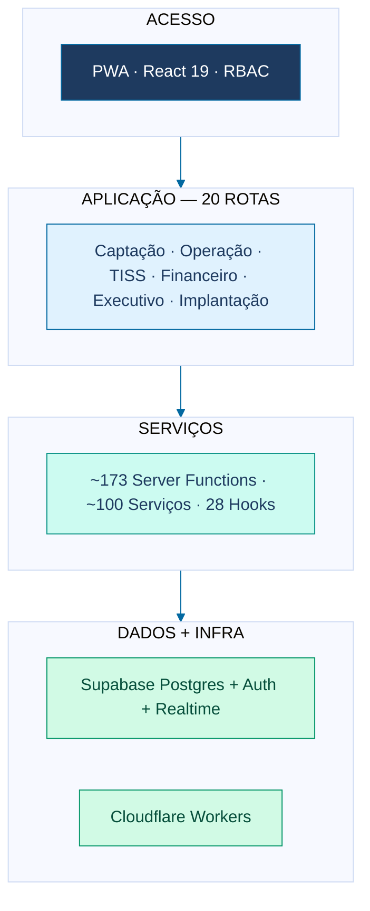
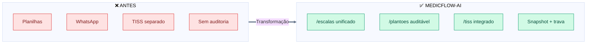
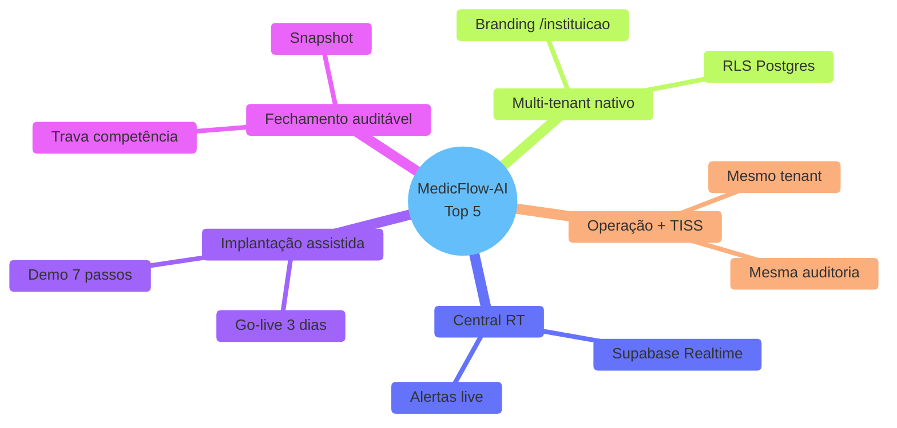
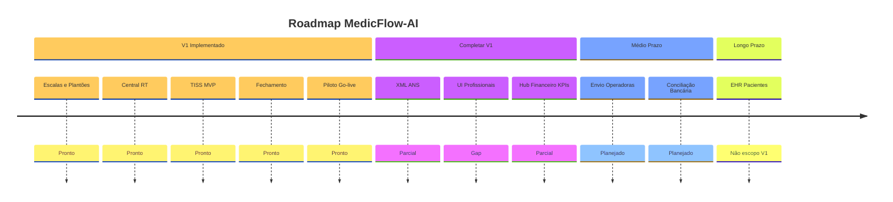
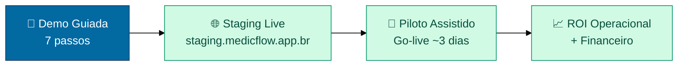

# MedicFlow-AI — Infográfico Executivo

**Documento:** infográfico consolidado para apresentações comerciais  
**Data:** 11/06/2026  
**Formato:** Mermaid (exportável para PNG/SVG/PowerPoint)  
**Base:** documentação operacional V1

---

## Guia de uso

Este documento consolida a narrativa visual do MedicFlow-AI em diagramas de alto impacto para:

- **Capa de apresentação** — infográfico principal (§1)
- **One-pager comercial** — ecossistema + números (§2–3)
- **Poster executivo** — pilares + jornadas (§4–5)

**Exportação:** [mermaid.live](https://mermaid.live) → PNG 1920×1080 ou SVG vetorial.

### Paleta corporativa

| Cor | Hex | Uso |
|-----|-----|-----|
| Primary | `#0369A1` | Títulos, bordas |
| Teal | `#0D9488` | Operação, saúde |
| Success | `#059669` | Resultados, ROI |
| Accent | `#D97706` | Implantação |
| Navy | `#1E3A5F` | Texto executivo |

---

## 1. Infográfico Principal — Ecossistema MedicFlow-AI

**Uso:** slide de abertura ou poster A4/A3

---

## 2. Ciclo de Valor — Da Demanda ao Pagamento

**Uso:** slide central da narrativa comercial

```mermaid
%%{init: {'theme': 'base', 'themeVariables': {'lineColor': '#0369A1'}}}%%
flowchart LR
    D["DEMANDA<br/>Cobertura<br/>necessária"] --> P["PUBLICAÇÃO<br/>/escalas<br/>14 dias"]
    P --> N["NOTIFICAÇÃO<br/>/central<br/>Realtime"]
    N --> I["INTERESSE<br/>/plantoes<br/>Abertos"]
    I --> S["SELEÇÃO<br/>Escalista ou<br/>self-service"]
    S --> C["CONFIRMAÇÃO<br/>1 confirmed<br/>por shift"]
    C --> E["EXECUÇÃO<br/>Plantão<br/>realizado"]
    E --> V["VALIDAÇÃO<br/>Produção<br/>médica"]
    V --> F["FECHAMENTO<br/>Snapshot<br/>+ trava"]
    F --> PG["PAGAMENTO<br/>Repasses<br/>/tiss"]

    classDef step fill:#CCFBF1,stroke:#0D9488,color:#1E3A5F
    classDef fin fill:#D1FAE5,stroke:#059669,color:#064E3B

    class D,P,N,I,S,C,E,V step
    class F,PG fin
```

---

## 3. Hub Administrativo — 10 Módulos em Um Olhar

---

## 4. Jornadas — 3 Personas em Paralelo

---

## 5. Arquitetura — Stack em Camadas

---

## 6. Antes x Depois — Resumo Visual

---

## 7. Diferenciais — Top 5 em Destaque

---

## 8. Roadmap Visual — Maturidade V1

---

## 9. CTA Comercial — Call to Action

---

## Índice de infográficos

| # | Infográfico | Melhor uso |
|---|-------------|------------|
| 1 | Ecossistema principal | Capa / abertura |
| 2 | Ciclo de valor 10 etapas | Slide operacional |
| 3 | Hub 10 módulos | Slide gestão |
| 4 | 3 jornadas paralelas | Slide personas |
| 5 | Stack em camadas | Slide técnico |
| 6 | Antes x Depois resumo | Slide transformação |
| 7 | Top 5 diferenciais | Slide competitivo |
| 8 | Roadmap maturidade | Slide transparência |
| 9 | CTA comercial | Slide fechamento |

---

## Referências cruzadas

| Documento | Conteúdo |
|-----------|----------|
| [MEDICFLOW_DIAGRAMAS_EXECUTIVOS.md](./MEDICFLOW_DIAGRAMAS_EXECUTIVOS.md) | Diagramas detalhados (10 itens) |
| [MEDICFLOW_SLIDES_COMERCIAIS.md](./MEDICFLOW_SLIDES_COMERCIAIS.md) | Slides Antes/Depois, ROI, Diferenciais |
| [MEDICFLOW_APRESENTACAO_EXECUTIVA.md](./MEDICFLOW_APRESENTACAO_EXECUTIVA.md) | Material executivo consolidado |
| [MEDICFLOW_PROPOSTA_DE_VALOR.md](./MEDICFLOW_PROPOSTA_DE_VALOR.md) | Proposta de valor completa |

---

*Infográficos em Mermaid 10+ — testar em [mermaid.live](https://mermaid.live) antes de exportar para PowerPoint.*
