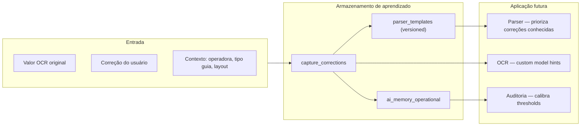

# MEDICFLOW-INTELLIGENT-CAPTURE-01 — Arquitetura Definitiva da Captura Inteligente de Guias TISS

**Sprint ID:** MEDICFLOW-INTELLIGENT-CAPTURE-01  
**Date:** 03/07/2026  
**Status:** Architecture approved — specification only, NOT IMPLEMENTED  
**Constraint:** Sem OCR, sem alteração de banco, frontend, RAG ou Copilot  
**Predecessors:**
- `docs/MF_FOUNDATION_02_DOCUMENT_SCHEMA.md`
- `docs/MF_AUDIT_01_CAPTURE_READINESS.md`
- `docs/MF_DOMAIN_VALIDATION_01_GUIDE_TYPES.md`
- `docs/MF_DATA_FOUNDATION_01_AUDIT_RULES_V1.md`

---

## Respostas Obrigatórias

| # | Pergunta | Resposta |
|---|----------|----------|
| 1 | **Arquitetura aprovada?** | **SIM** — arquitetura híbrida em 9 estágios com orquestração por `capture_sessions`, OCR em camadas e auditoria preventiva integrada ao Rule Engine existente (spec). |
| 2 | **Tecnologia OCR recomendada?** | **Azure Document Intelligence** (primário) + **GPT-4o Vision** (camada semântica) + **Tesseract 5.x** (fallback de custo). Detalhes em `docs/MEDICFLOW_OCR_STRATEGY.md`. |
| 3 | **Fluxo completo definido?** | **SIM** — pipeline Câmera → Pré-processamento → OCR → Parser → Validação TISS → Auditoria Preventiva → Correções → Confirmação → Persistência, com contratos de serviço e estados documentados. |
| 4 | **Preparado para MVP?** | **SIM** — escopo MVP delimitado: 3 tipos de guia billing (`consulta`, `sadt`, `honorario_individual`), canal mobile camera + file upload, 14 regras de auditoria, parser v1 com 28 campos estruturais. |

---

## 1. Executive Summary

A Captura Inteligente de Guias TISS transforma o fluxo atual de **entrada manual** (`/tiss`) em um pipeline supervisionado:

```
Capture → Preprocess → OCR → Parse → Validate TISS → Preventive Audit → Suggest Corrections → User Confirm → Persist
```

A arquitetura reutiliza padrões já especificados no MedicFlow:

| Padrão existente | Reuso na captura |
|------------------|-----------------|
| `capture_sessions` state machine | Orquestração do pipeline |
| `document_attachments` + `clinical-documents` bucket | Armazenamento PHI |
| `extraction_results` | Saída OCR/parser |
| `audit_runs` + `audit_findings` | Auditoria preventiva |
| `operational_action_proposals` | Correções supervisionadas |
| `guide-service.ts` | Persistência final em `tiss_guides` |
| `operational_events` | Timeline e observabilidade |

**Princípio arquitetural:** OCR extrai; Parser estrutura; Auditoria valida; Humano confirma; Sistema persiste. Nenhuma escrita em dados reais sem confirmação explícita.

---

## 2. FASE 1 — Fluxo Completo

### 2.1 Diagrama de alto nível

```mermaid
flowchart TB
    subgraph CAPTURE["1. Captura"]
        CAM["Câmera mobile PWA"]
        UPL["Upload arquivo"]
        SCN["Scanner / API ingest"]
    end

    subgraph PREP["2. Pré-processamento"]
        VAL["Validação MIME/tamanho"]
        ENH["Deskew / crop / contrast"]
        THM["Thumbnail + checksum SHA-256"]
    end

    subgraph OCR["3. OCR"]
        T1["Tier 1: Azure Document Intelligence"]
        T2["Tier 2: GPT-4o Vision (fallback semântico)"]
        T3["Tier 3: Tesseract (fallback custo)"]
    end

    subgraph PARSE["4. Parser Inteligente"]
        DET["Detecção tipo de guia"]
        MAP["Mapeamento campos TISS"]
        NORM["Normalização (datas, CRM, TUSS)"]
        CONF["Scores de confiança + coordenadas"]
    end

    subgraph VALID["5. Validação TISS"]
        STRUCT["Campos obrigatórios"]
        FORMAT["Formatos ANS (CRM, TUSS, datas)"]
        CROSS["Validação cruzada entre campos"]
    end

    subgraph AUDIT["6. Auditoria Preventiva"]
        CTX["AuditContext Builder"]
        REG["RuleRegistry (14 regras MVP)"]
        EVAL["RuleEvaluator"]
        RISK["DenialRiskScorer"]
    end

    subgraph CORR["7–8. Correção + Confirmação"]
        SUG["Sugestões de correção"]
        PROP["operational_action_proposals"]
        UI["Review UI (futuro — fora do escopo desta sprint)"]
        CONFIRM["Confirmação explícita do usuário"]
    end

    subgraph PERSIST["9. Persistência"]
        GUIDE["tiss_guides + tiss_guide_items"]
        ATTACH["document_attachments link"]
        EVENT["operational_events"]
    end

    CAPTURE --> PREP --> OCR --> PARSE --> VALID --> AUDIT --> CORR --> PERSIST
```



### 2.2 Estados da sessão de captura

Alinhado a `capture_session_status` em `MF_FOUNDATION_02_DOCUMENT_SCHEMA.md`:

| Estado | Etapa do pipeline | Transição |
|--------|-------------------|-----------|
| `capturing` | Câmera / upload em andamento | → `extracting` quando blob confirmado |
| `extracting` | Pré-processamento + OCR + Parser | → `auditing` quando `extraction_results.status = completed` |
| `auditing` | Validação TISS + Auditoria preventiva | → `correcting` se findings `open` |
| `correcting` | Usuário revisa campos e findings | → `saved` após confirmação |
| `saved` | Persistência concluída | terminal |
| `abandoned` | Sessão cancelada / timeout 24h | terminal |

### 2.3 Contrato por estágio

#### Estágio 1 — Câmera

| Aspecto | Especificação |
|---------|---------------|
| Canais MVP | `mobile_camera`, `file_upload` |
| Canais P2+ | `scanner_folder`, `api_ingest`, `twain` |
| Entrada | `image/jpeg`, `image/png`, `image/webp`, `application/pdf` |
| Saída | Blob em `clinical-documents/{tenant_id}/{yyyy}/{attachment_id}/original.{ext}` |
| Serviço | `capture-intake-service.ts` (novo) |
| Evento | `document_captured` |

**Restrições:** PWA `getUserMedia` no cliente; upload via signed URL gerada por server function; sem PHI em object keys.

#### Estágio 2 — Pré-processamento

| Aspecto | Especificação |
|---------|---------------|
| Validação | Extensão de `upload-validation.ts` — MIME, magic bytes, max 25MB |
| Transformações | Deskew, crop automático de bordas, normalização de contraste, redução de ruído |
| Multi-página | PDF → páginas individuais; `manifest.json` com ordem |
| Saída | Imagem otimizada para OCR + `thumbnail.jpg` + `checksum_sha256` |
| Serviço | `capture-preprocess-service.ts` (novo) |
| Worker | Cloudflare Worker assíncrono ou Supabase Edge Function |

#### Estágio 3 — OCR

| Aspecto | Especificação |
|---------|---------------|
| Estratégia | Híbrida em 3 tiers — ver `MEDICFLOW_OCR_STRATEGY.md` |
| Saída | `raw_text` + blocos com bounding boxes + confidence por token |
| Persistência | `extraction_results.raw_text` + `extracted_fields` (parcial) |
| Serviço | `capture-ocr-service.ts` (novo) |
| SLA MVP | p95 < 8s para imagem single-page |

#### Estágio 4 — Parser Inteligente

| Aspecto | Especificação |
|---------|---------------|
| Entrada | OCR output + imagem original |
| Saída | `ParsedGuideDocument` — ver §4 deste documento |
| Serviço | `capture-parser-service.ts` (novo) |
| Versão | `parser_v1` |

#### Estágio 5 — Validação TISS

| Aspecto | Especificação |
|---------|---------------|
| Escopo | Validação estrutural ANS — campos, formatos, obrigatoriedade por tipo |
| Não inclui | Regras contratuais do operador (delegadas à auditoria) |
| Serviço | `capture-tiss-validator-service.ts` (novo) |
| Saída | `TissValidationResult` com erros/warnings por campo |

#### Estágio 6 — Auditoria Preventiva

| Aspecto | Especificação |
|---------|---------------|
| Motor | Rule Engine spec (`MF_FOUNDATION_02_RULE_ENGINE_SPEC.md`) |
| Regras MVP | 14 regras (`MF_DATA_FOUNDATION_01_AUDIT_RULES_V1.md`) |
| Trigger | `capture_pipeline` |
| Serviço | `capture-audit-orchestrator-service.ts` (novo) — delega ao `audit-engine-service.ts` |
| Detalhes | `docs/MEDICFLOW_PREVENTIVE_AUDIT_ARCHITECTURE.md` |

#### Estágio 7 — Correções sugeridas

| Aspecto | Especificação |
|---------|---------------|
| Fonte | `audit_findings` com `suggestedCorrection` |
| Mecanismo | `operational_action_proposals` — padrão supervisionado existente |
| Tipos | `fix_field`, `link_authorization`, `upload_document`, `run_eligibility_check` |
| Serviço | Reuso de `operational-action-proposal-service.ts` |

#### Estágio 8 — Confirmação do usuário

| Aspecto | Especificação |
|---------|---------------|
| Gate obrigatório | Nenhuma persistência sem `user_confirmed_at` |
| Exibição | Campos com confidence < 0.85 destacados; findings críticos bloqueiam save |
| Auditoria | `document_attachment_audit` action `verified` |
| Evento | `capture_confirmed` |

#### Estágio 9 — Persistência

| Aspecto | Especificação |
|---------|---------------|
| Destino | `tiss_guides` (status `draft`) + `tiss_guide_items` |
| Vínculo | `document_attachments.parent_type = tiss_guide` |
| Integridade | Checksum do documento preservado; `correlation_id` na sessão |
| Serviço | Reuso de `guide-service.ts` via `capture-persist-service.ts` (novo adapter) |
| Evento | `guide_created` + `capture_session_completed` |

### 2.4 Arquitetura de serviços (novos módulos — spec only)

```
src/lib/capture/
  api/
    capture-server.ts              ← TanStack Start server functions
  services/
    capture-intake-service.ts
    capture-preprocess-service.ts
    capture-ocr-service.ts
    capture-parser-service.ts
    capture-tiss-validator-service.ts
    capture-audit-orchestrator-service.ts
    capture-persist-service.ts
    capture-learning-service.ts    ← Learning loop (FASE 6)
  domain/
    parsed-guide-document.ts       ← Tipos do parser
    tiss-field-catalog.ts          ← Catálogo de campos por tipo
    capture-pipeline-states.ts     ← State machine
  adapters/
    azure-document-intelligence-adapter.ts
    gpt-vision-adapter.ts
    tesseract-adapter.ts
```

**Padrão de integração:** Cada serviço recebe `ServiceCtx` (`tenantId`, Supabase client, `role`) — mesma convenção de `guide-service.ts`.

---

## 3. FASE 2 — Tipos de Documentos Suportados

### 3.1 Taxonomia completa

| Categoria | Tipo | Código interno | Prioridade MVP | Parser template |
|-----------|------|----------------|:--------------:|-----------------|
| **Guias TISS — Billing** | Guia Consulta | `guia_consulta` | P0 | `template_consulta_v1` |
| | Guia SP/SADT | `guia_sadt` | P0 | `template_sadt_v1` |
| | Guia Honorário Individual | `guia_honorario` | P0 | `template_honorario_v1` |
| | Guia Internação | `guia_internacao` | P2 | `template_internacao_v1` |
| | Guia Resumo de Internação | `guia_resumo_internacao` | P2 | `template_resumo_internacao_v1` |
| **Guias TISS — Autorização** | Guia SP/SADT (autorização) | `guia_autorizacao_sadt` | P1 | `template_auth_sadt_v1` |
| | Guia Consulta (autorização) | `guia_autorizacao_consulta` | P1 | `template_auth_consulta_v1` |
| | Guia Internação (autorização) | `guia_autorizacao_internacao` | P2 | `template_auth_internacao_v1` |
| **Demonstrativos** | Demonstrativo de Pagamento | `demonstrativo_pagamento` | P3 | `template_demonstrativo_v1` |
| | Demonstrativo de Análise de Conta | `demonstrativo_analise` | P3 | `template_demonstrativo_analise_v1` |
| | Extrato de Glosas | `extrato_glosa` | P2 | `template_extrato_glosa_v1` |
| **Anexos clínicos** | Laudo / Relatório de exame | `laudo` | P1 | `template_laudo_v1` |
| | Pedido médico | `pedido_medico` | P1 | `template_pedido_v1` |
| | Carta de autorização (senha) | `autorizacao` | P1 | `template_autorizacao_v1` |
| | Carteirinha / identidade | `identidade` | P1 | `template_identidade_v1` |
| | Relatório cirúrgico | `relatorio_cirurgico` | P2 | `template_relatorio_cirurgico_v1` |
| | Boletim anestésico | `boletim_anestesico` | P2 | `template_boletim_anestesico_v1` |
| | Evolução clínica | `evolucao` | P3 | `template_evolucao_v1` |
| | Outros | `outros` | P3 | `template_generic_v1` |

### 3.2 Mapeamento documento → entidade MedicFlow

| Tipo documento | Entidade alvo | `document_type` enum | `parent_type` |
|----------------|---------------|------------------------|---------------|
| Guias billing (consulta, sadt, honorário) | `tiss_guides` | `guia_tiss` | `tiss_guide` |
| Guias autorização | `authorizations` (futuro) | `guia_tiss` | `authorization` |
| Laudo, pedido, autorização print | Anexo de guia | `laudo` / `pedido_medico` / `autorizacao` | `tiss_guide` |
| Carteirinha | Beneficiário | `identidade` | `beneficiary` |
| Demonstrativos | Reconciliação (futuro) | `outros` | `capture_session` |

### 3.3 Detecção automática de tipo

O parser executa classificação em 3 camadas:

1. **Heurística de layout** — proporção, cabeçalho, palavras-chave ("GUIA DE CONSULTA", "SP/SADT", "HONORÁRIOS")
2. **OCR header matching** — regex em região superior (coordenadas normalizadas 0–1)
3. **Fallback semântico** — GPT-4o Vision quando confidence de classificação < 0.75

```typescript
interface DocumentClassification {
  detectedType: TissDocumentType;
  confidence: number;
  alternativeTypes: Array<{ type: TissDocumentType; confidence: number }>;
  detectionMethod: 'layout_heuristic' | 'header_regex' | 'vision_semantic';
}
```

### 3.4 Escopo MVP vs. roadmap

| Fase | Tipos suportados | Canal |
|------|------------------|-------|
| **MVP (P0)** | `guia_consulta`, `guia_sadt`, `guia_honorario` | mobile_camera, file_upload |
| **P1** | Anexos (`laudo`, `pedido_medico`, `autorizacao`, `identidade`) | + scanner_folder |
| **P2** | `guia_internacao`, `guia_resumo_internacao`, `extrato_glosa` | + api_ingest |
| **P3** | Demonstrativos, evolução, odontologia, quimio, OPME | + twain |

---

## 4. FASE 4 — Parser Inteligente (Design)

### 4.1 Modelo de saída — `ParsedGuideDocument`

```typescript
interface ParsedGuideDocument {
  version: 'parser_v1';
  documentType: TissDocumentType;
  classification: DocumentClassification;
  fields: Record<string, ParsedField>;
  items: ParsedGuideItem[];
  metadata: {
    pageCount: number;
    parserDurationMs: number;
    ocrEngineUsed: string;
    overallConfidence: number;
  };
}

interface ParsedField {
  fieldCode: string;           // TISS field code (ex: 'beneficiary_card_number')
  value: string | number | null;
  rawValue: string;            // Valor antes da normalização
  confidence: number;        // 0.0 – 1.0
  coordinates: FieldCoordinates;
  validationStatus: 'valid' | 'warning' | 'error' | 'missing';
  validationMessages: string[];
  required: boolean;
  normalized: boolean;
}

interface FieldCoordinates {
  page: number;
  boundingBox: { x: number; y: number; width: number; height: number }; // normalizado 0–1
  sourceBlockId?: string;      // Referência ao bloco OCR
}

interface ParsedGuideItem {
  lineNumber: number;
  procedureCode: ParsedField;  // TUSS
  description: ParsedField;
  quantity: ParsedField;
  unitValue: ParsedField;
  totalValue: ParsedField;
  executionDate: ParsedField;
  confidence: number;
}
```

### 4.2 Catálogo de campos TISS por tipo de guia

#### Guia Consulta — campos obrigatórios MVP

| Código campo | Label ANS | Obrigatório | Normalização | Regra validação |
|--------------|-----------|:-----------:|--------------|-----------------|
| `operator_ans_code` | Registro ANS operadora | ✅ | Trim, 6 dígitos | Regex `^\d{6}$` |
| `provider_cnpj` | CNPJ contratado | ✅ | Remove máscara | Validador CNPJ |
| `beneficiary_card_number` | Número carteirinha | ✅ | Alfanumérico uppercase | Min 4 chars |
| `beneficiary_name` | Nome beneficiário | ✅ | Title case, trim | Min 3 chars |
| `attendance_date` | Data atendimento | ✅ | ISO 8601 | Não futuro; max 180 dias passado |
| `procedure_code` | Código TUSS | ✅ | 8 dígitos zero-pad | FK `tuss_procedures` |
| `executing_crm` | CRM executante | ✅ | `UF-NNNNNN` | Regex CRM ANS |
| `executing_crm_uf` | UF CRM | ✅ | 2 letras uppercase | Lista UFs válidas |
| `guide_number` | Número guia prestador | ⚠️ | Numérico | Único por tenant+operadora |
| `authorization_password` | Senha autorização | ⚠️ | Alfanumérico | Condicional — operadora |
| `total_value` | Valor total | ✅ | Decimal 2 casas | > 0 |
| `cid_code` | CID-10 | ⚠️ | `X00.0` format | Condicional — operadora |

#### Guia SP/SADT — campos adicionais

| Código campo | Label ANS | Obrigatório | Normalização |
|--------------|-----------|:-----------:|--------------|
| `requesting_crm` | CRM solicitante | ✅ | `UF-NNNNNN` |
| `requesting_crm_uf` | UF CRM solicitante | ✅ | 2 letras |
| `requesting_name` | Nome solicitante | ✅ | Title case |
| `execution_date` | Data execução | ✅ | ISO 8601 |
| `items[]` | Procedimentos (multi-linha) | ✅ | Array ParsedGuideItem |
| `clinical_indication` | Indicação clínica | ⚠️ | Texto livre |

#### Guia Honorário Individual — campos adicionais

| Código campo | Label ANS | Obrigatório | Normalização |
|--------------|-----------|:-----------:|--------------|
| `parent_guide_number` | Guia origem | ⚠️ | Numérico | Referência SADT/internação |
| `participation_degree` | Grau participação | ✅ | Enum ANS | `cirurgiao`, `anestesista`, `auxiliar`, etc. |
| `items[]` | Honorários (multi-linha) | ✅ | Array ParsedGuideItem |

### 4.3 Normalização automática

| Tipo dado | Transformação | Exemplo |
|-----------|---------------|---------|
| Datas | `DD/MM/YYYY` → `YYYY-MM-DD` | `15/03/2026` → `2026-03-15` |
| CRM | Pad UF + número | `12345/CE` → `CE-012345` |
| TUSS | Zero-pad 8 dígitos | `101012` → `01010120` |
| CNPJ | Remove `.`, `/`, `-` | `12.345.678/0001-90` → `12345678000190` |
| Valores | `R$ 1.234,56` → `1234.56` | Locale pt-BR |
| Nomes | Title case, remove espaços duplos | `MARIA  SILVA` → `Maria Silva` |
| Carteirinha | Uppercase, trim | `abc-123` → `ABC-123` |

### 4.4 Thresholds de confiança

| Nível | Range | Comportamento |
|-------|-------|---------------|
| Alta | ≥ 0.90 | Auto-aceito; exibido sem destaque |
| Média | 0.70 – 0.89 | Exibido com aviso; requer revisão se obrigatório |
| Baixa | 0.50 – 0.69 | Destacado em vermelho; bloqueia save se obrigatório |
| Crítica | < 0.50 | Campo marcado `missing`; OCR tier escalation |

**Escalation:** Se > 3 campos obrigatórios com confidence < 0.70, re-executar OCR com tier superior (Azure → GPT Vision).

### 4.5 Validação automática no parser

```typescript
interface TissValidationResult {
  isStructurallyValid: boolean;
  fieldErrors: Array<{
    fieldCode: string;
    severity: 'error' | 'warning';
    code: string;           // ex: 'TISS_DATE_FUTURE', 'TISS_CRM_INVALID'
    message: string;
  }>;
  missingRequired: string[];
  crossFieldErrors: Array<{
    fields: string[];
    code: string;
    message: string;
  }>;
}
```

**Validações cruzadas MVP:**

| Código | Campos | Regra |
|--------|--------|-------|
| `CROSS_DATE_EXECUTION_AFTER_ATTENDANCE` | `attendance_date`, `execution_date` | Execução ≥ atendimento |
| `CROSS_TOTAL_MISMATCH` | `items[].totalValue`, `total_value` | Soma itens ≈ total (±0.01) |
| `CROSS_CRM_UF_MISMATCH` | `executing_crm`, `executing_crm_uf` | UF no CRM = campo UF |
| `CROSS_AUTH_DATE_RANGE` | `attendance_date`, `authorization_valid_to` | Atendimento dentro validade senha |

---

## 5. FASE 6 — Learning Loop

### 5.1 Princípio

Toda correção feita pelo usuário durante a etapa de confirmação alimenta conhecimento futuro **sem alterar dados reais de produção**. O learning loop opera exclusivamente sobre artefatos de captura e memória de extração.

### 5.2 Diagrama



### 5.3 Tabela proposta — `capture_corrections` (spec only)

| Column | Type | Purpose |
|--------|------|---------|
| `id` | uuid | PK |
| `tenant_id` | uuid | Isolamento |
| `capture_session_id` | uuid | FK sessão |
| `document_type` | text | Tipo de guia |
| `operator_ans_code` | text | Operadora (nullable) |
| `field_code` | text | Campo corrigido |
| `original_value` | text | Valor OCR |
| `corrected_value` | text | Valor confirmado |
| `original_confidence` | numeric | Confidence OCR |
| `correction_reason` | text | `ocr_error`, `normalization`, `missing_field`, `wrong_field` |
| `coordinates` | jsonb | Bounding box original |
| `created_by_profile_id` | uuid | Quem corrigiu |
| `created_at` | timestamptz | Timestamp |

**Regra de ouro:** Correções NUNCA retroagem em `tiss_guides` existentes. Apenas influenciam parser templates e thresholds para capturas futuras do mesmo tenant + operadora.

### 5.4 Mecanismos de aprendizado

| Mecanismo | Escopo | Aplicação |
|-----------|--------|-----------|
| **Field correction memory** | Tenant + operadora + field_code | Se mesmo campo corrigido 3+ vezes com mesmo padrão, ajustar regex de normalização |
| **Layout fingerprint** | Operadora + tipo guia | Hash de posições de campos → selecionar template correto |
| **Confidence calibration** | Global por tenant | Recalibrar thresholds baseado em taxa de correção |
| **Operator field aliases** | Operadora | Mapear labels alternativos ("Nº Carteirinha" vs "Matrícula") |
| **Audit false-positive tracking** | Regra + operadora | Se usuário dispensa finding 5+ vezes, sugerir calibração da regra |

### 5.4 Integração com memória IA

Reuso do modelo `AI_MEMORY_MODEL.md` — memória operacional:

```typescript
interface CaptureLearningMemory {
  tenantId: string;
  operatorAnsCode?: string;
  documentType: TissDocumentType;
  fieldCorrections: Map<string, CorrectionPattern[]>;
  layoutFingerprint?: string;
  confidenceCalibration: Record<string, number>;  // field → adjusted threshold
  lastUpdatedAt: string;
}
```

**TTL:** 90 dias rolling; agregação mensal em `parser_templates` versionados.

### 5.5 Guardrails do learning loop

| Guardrail | Descrição |
|-----------|-----------|
| `no_production_mutation` | Correções não alteram guias já persistidas |
| `tenant_isolation` | Aprendizado isolado por tenant |
| `human_in_the_loop` | Apenas correções confirmadas pelo usuário entram no loop |
| `versioned_templates` | Templates de parser versionados; rollback possível |
| `audit_trail` | Toda correção gera `operational_event` tipo `capture_correction_recorded` |
| `PII_handling` | Valores armazenados com hash opcional para campos sensíveis (CPF) |

---

## 6. Observabilidade e eventos

| Evento | Trigger | Payload mínimo |
|--------|---------|----------------|
| `document_captured` | Upload confirmado | `attachment_id`, `channel`, `mime_type` |
| `capture_preprocess_completed` | Pré-processamento OK | `duration_ms`, `page_count` |
| `capture_ocr_completed` | OCR finalizado | `engine`, `confidence_avg`, `duration_ms` |
| `capture_parse_completed` | Parser finalizado | `document_type`, `fields_extracted`, `overall_confidence` |
| `capture_validation_completed` | Validação TISS | `errors_count`, `warnings_count` |
| `capture_audit_completed` | Auditoria | `findings_count`, `risk_band` |
| `capture_correction_recorded` | Usuário corrigiu campo | `field_code`, `correction_reason` |
| `capture_confirmed` | Usuário confirmou | `fields_corrected_count` |
| `capture_session_completed` | Persistência OK | `guide_id`, `duration_total_ms` |
| `capture_session_abandoned` | Timeout/cancelamento | `last_status`, `reason` |

---

## 7. Segurança e compliance

| Requisito | Implementação |
|-----------|---------------|
| PHI em repouso | Bucket `clinical-documents` privado + RLS |
| PHI em trânsito | TLS; signed URLs TTL 15min |
| PHI em OCR | Dados enviados a Azure/OpenAI com BAA/DPA; sem persistência no provider |
| LGPD | `retention_until` por attachment; direito ao esquecimento via purge job |
| Auditoria | Append-only `document_attachment_audit` + `operational_events` |
| RBAC | `capture:read`, `capture:write` capabilities |
| Multi-tenant | Todos os artefatos escopados por `tenant_id` |

---

## 8. MVP — Definition of Ready

### 8.1 Critérios de prontidão

| Critério | Status |
|----------|:------:|
| Fluxo de 9 estágios documentado | ✅ |
| Tipos de documento catalogados | ✅ |
| Estratégia OCR definida | ✅ |
| Parser field catalog MVP | ✅ |
| 14 regras de auditoria mapeadas | ✅ |
| Learning loop especificado | ✅ |
| Contratos de serviço definidos | ✅ |
| Eventos de observabilidade definidos | ✅ |

### 8.2 Sequência de implementação (pós-arquitetura)

| Ordem | Entrega | Dependência |
|:-----:|---------|-------------|
| 1 | Storage foundation (`clinical-documents`, `capture_sessions`) | Migration |
| 2 | `capture-intake-service` + mobile camera UI | Storage |
| 3 | `capture-preprocess-service` | Intake |
| 4 | `capture-ocr-service` (Azure tier) | Preprocess |
| 5 | `capture-parser-service` (3 templates) | OCR |
| 6 | `capture-tiss-validator-service` | Parser |
| 7 | Audit engine + `capture-audit-orchestrator` | Validator + audit schema |
| 8 | Correction UI + proposals | Audit |
| 9 | `capture-persist-service` | Confirmation |
| 10 | `capture-learning-service` | Persist + corrections |

### 8.3 Métricas de sucesso MVP

| Métrica | Target |
|---------|--------|
| Taxa de extração correta (campos obrigatórios) | ≥ 85% sem correção |
| Tempo médio captura → confirmação | < 60s |
| Findings críticos detectados antes do save | ≥ 90% recall |
| Taxa de abandono de sessão | < 15% |
| Correções por guia (média) | < 3 campos |

---

## 9. Referências cruzadas

| Documento | Conteúdo |
|-----------|----------|
| `docs/MEDICFLOW_OCR_STRATEGY.md` | FASE 3 — Comparativo OCR e recomendação |
| `docs/MEDICFLOW_PREVENTIVE_AUDIT_ARCHITECTURE.md` | FASE 5 — Motor de auditoria preventiva |
| `docs/MF_FOUNDATION_02_DOCUMENT_SCHEMA.md` | Schema de captura e armazenamento |
| `docs/MF_FOUNDATION_02_RULE_ENGINE_SPEC.md` | Contrato do Rule Engine |
| `docs/MF_DATA_FOUNDATION_01_AUDIT_RULES_V1.md` | Catálogo de 14 regras MVP |
| `docs/MF_AUDIT_01_CAPTURE_READINESS.md` | Readiness baseline (12/100) |

---

*MEDICFLOW-INTELLIGENT-CAPTURE-01 complete. Architecture approved — specification only, no implementation.*
