# MedicFlow-AI — Jornada dos Usuários

**Documento:** mapeamento das jornadas por persona de negócio  
**Data:** 11/06/2026  
**Ambiente:** `https://staging.medicflow.app.br`  
**Base:** rotas, RBAC, manuais operacionais e screenshots de staging

---

## 1. Visão geral das personas

| Persona de negócio | Papel técnico | Rotas principais |
|--------------------|---------------|------------------|
| **Médico** | `professional` | `/`, `/escalas`, `/plantoes`, `/perfil`, `/tiss` (leitura) |
| **Administrador** | `tenant_admin` / `super_admin` | `/instituicao`, `/piloto`, `/lancamento`, `/financeiro`, `/executivo` |
| **Escalista** | `coordinator` | `/escalas`, `/plantoes`, `/central`, `/tiss` |

---

## 2. Jornada do Médico

### 2.1 Fluxo linear

```
ENTRADA
   │
   ▼
CAPTAÇÃO
   │
   ▼
ESCALA
   │
   ▼
PLANTÃO
   │
   ▼
PAGAMENTO
```

### 2.2 Detalhamento por fase

#### ENTRADA — Acesso ao sistema

| Passo | Ação | Artefato |
|-------|------|----------|
| 1 | Recebe credenciais do administrador | Supabase Auth (externo) |
| 2 | Acessa URL da instituição | `/login` |
| 3 | Seleciona instituição + e-mail + senha | Multi-tenant gate |
| 4 | Chega ao dashboard do dia | `/` |

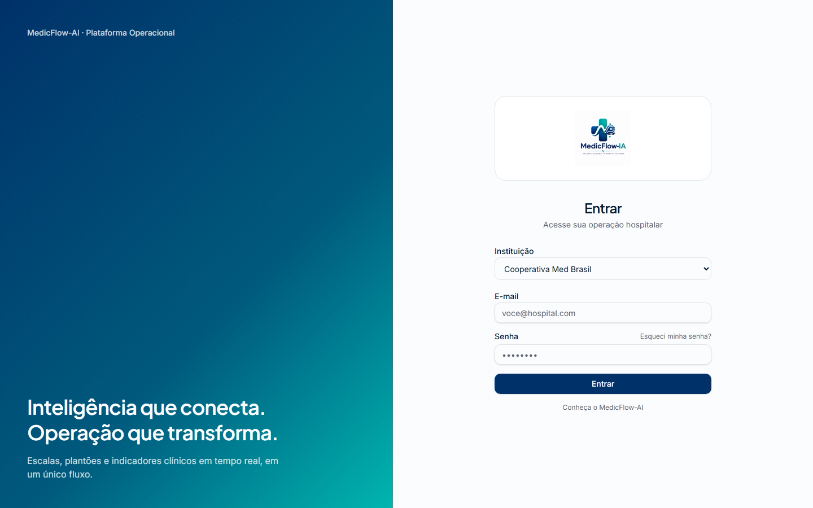

**Touchpoints:** login, recuperação de senha (`/login/esqueci-senha`), perfil (`/perfil`).

---

#### CAPTAÇÃO — Descoberta de oportunidades

| Passo | Ação | Artefato |
|-------|------|----------|
| 1 | Visualiza contadores no dashboard | Plantões abertos, confirmações pendentes |
| 2 | Recebe alertas da central | `/central` (links contextuais) |
| 3 | Ativa disponibilidade | `/perfil` → switch "Disponível" |
| 4 | Navega plantões abertos | `/plantoes` → aba Abertos |

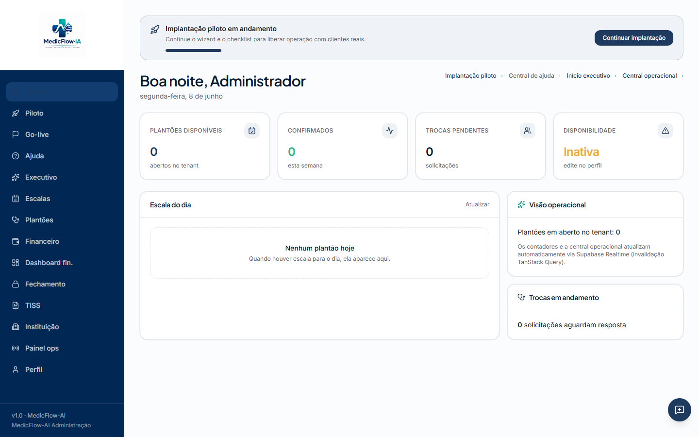

**Regra de negócio:** disponibilidade alimenta janelas em `availability`; central identifica riscos de cobertura.

---

#### ESCALA — Visualização e planejamento

| Passo | Ação | Artefato |
|-------|------|----------|
| 1 | Abre calendário de 14 dias | `/escalas` |
| 2 | Seleciona dia e vê timeline | Unidade, setor, horário, status |
| 3 | Identifica turnos atribuídos | Assignments vinculados |
| 4 | Consulta conflitos (se alertado) | `/escalas?opsFocus=conflicts` |

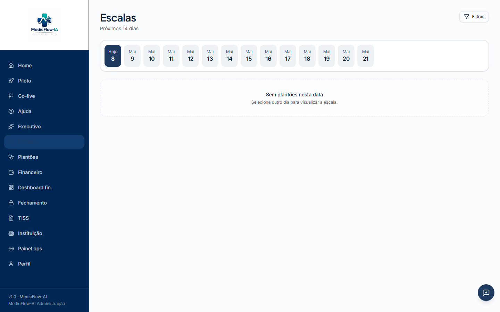

**Permissão:** leitura de escalas; criação/edição é do escalista.

---

#### PLANTÃO — Confirmação e execução

| Passo | Ação | Artefato |
|-------|------|----------|
| 1 | Aceita plantão aberto | `/plantoes` → Aceitar |
| 2 | Confirma assignment pendente | Status → `confirmed` |
| 3 | Solicita troca (se necessário) | Swap request |
| 4 | Responde swaps envolvendo seu turno | Aprovar/Negar |
| 5 | Executa plantão no horário | `starts_at` → `ends_at` |

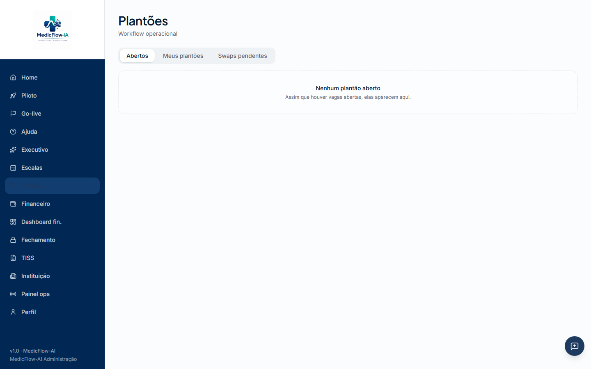

**Subfluxos:**
- Recusar plantão → turno volta para `open`
- Swap aprovado → reatribuição automática

---

#### PAGAMENTO — Consulta financeira

| Passo | Ação | Artefato |
|-------|------|----------|
| 1 | Consulta produção do mês | `/tiss` → Produção |
| 2 | Visualiza repasses calculados | `/tiss` → Repasses |
| 3 | Acompanha glosas (leitura) | `/tiss` → Glosas |

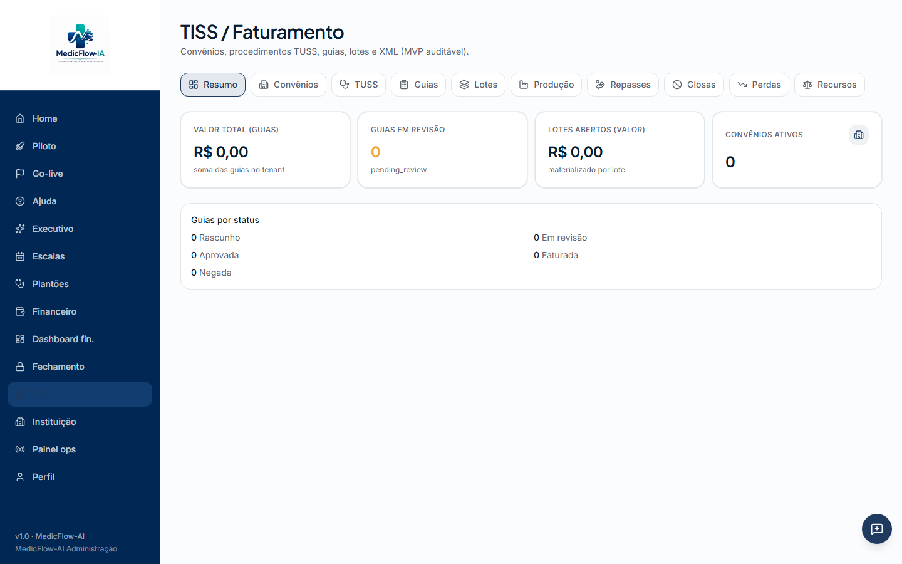

**Permissão:** somente leitura para `professional`. Pagamento efetivo ocorre fora do sistema (repasses registrados).

---

### 2.3 Diagrama Mermaid — jornada do médico

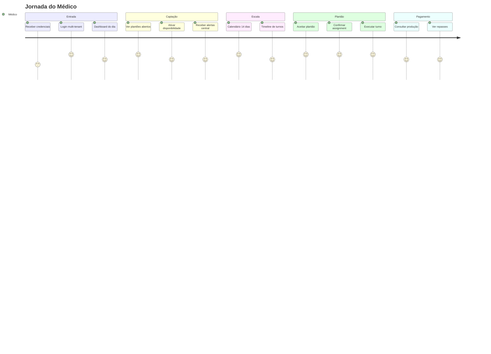

---

## 3. Jornada do Administrador

### 3.1 Fluxo linear

```
ENTRADA
   │
   ▼
INSTITUIÇÃO
   │
   ▼
PROFISSIONAIS
   │
   ▼
FINANCEIRO
   │
   ▼
INDICADORES
```

### 3.2 Detalhamento por fase

#### ENTRADA — Acesso e implantação

| Passo | Ação | Artefato |
|-------|------|----------|
| 1 | Login como tenant_admin | `/login` |
| 2 | Inicia piloto assistido | `/piloto` |
| 3 | Executa demo guiada (7 passos) | Wizard em `/piloto` |
| 4 | Valida go-live | `/lancamento` (smoke tests) |

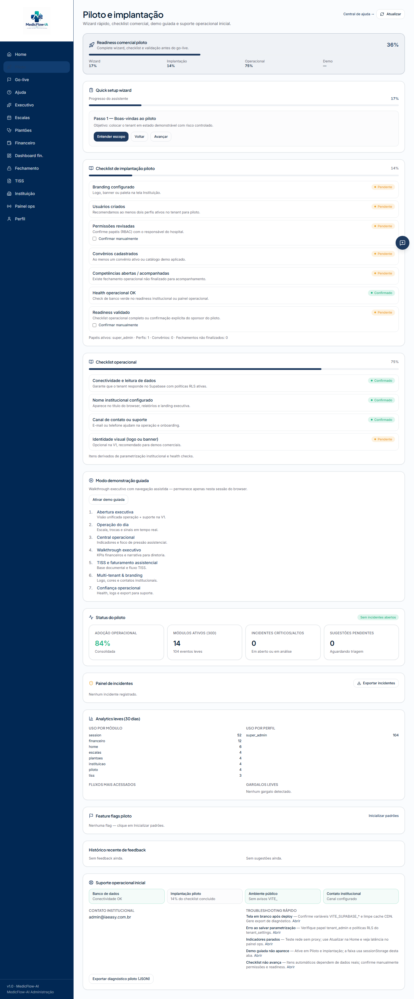

---

#### INSTITUIÇÃO — Configuração do tenant

| Passo | Ação | Artefato |
|-------|------|----------|
| 1 | Configura branding (logo, cores) | `/instituicao` |
| 2 | Parametriza contato e fuso | `tenant_settings` |
| 3 | Verifica readiness operacional | Painel de prontidão |
| 4 | Aplica seed demo (se ambiente demo) | super_admin only |

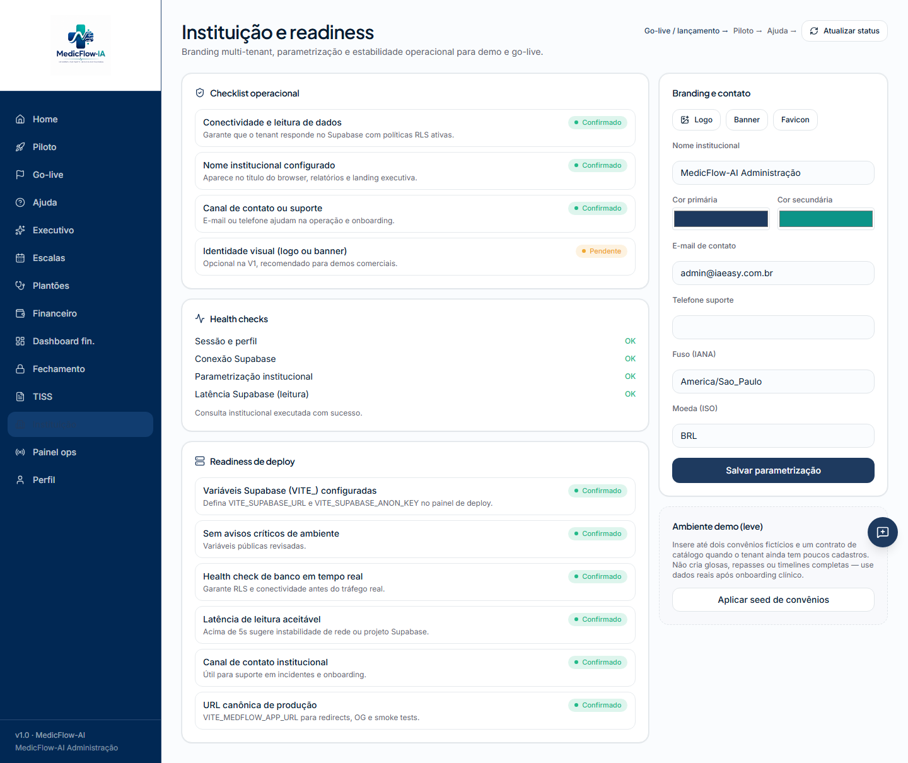

---

#### PROFISSIONAIS — Provisionamento

| Passo | Ação | Artefato |
|-------|------|----------|
| 1 | Cria usuários no Supabase Auth | Externo |
| 2 | Define papéis RBAC | `profiles.role` |
| 3 | Vincula profissionais | `professionals` (opcional) |
| 4 | Revoga acesso quando necessário | Desativar Auth / profiles |

⚠️ **Gap V1:** não existe UI de cadastro de profissionais.

---

#### FINANCEIRO — Gestão financeira

| Passo | Ação | Artefato |
|-------|------|----------|
| 1 | Cadastra convênios TISS | `/tiss` |
| 2 | Abre competência de fechamento | `/financeiro/fechamento-operacional` |
| 3 | Gera snapshot e trava | `financial_closings` |
| 4 | Importa conciliação CSV | `/financeiro/conciliacao-operacional` |
| 5 | Aprova repasses médicos | `/tiss` → Repasses |

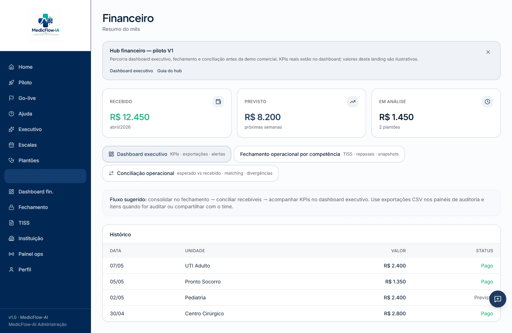

---

#### INDICADORES — Visão executiva

| Passo | Ação | Artefato |
|-------|------|----------|
| 1 | Acessa narrativa executiva | `/executivo` |
| 2 | Consulta KPIs reais | `/financeiro/dashboard-executivo` |
| 3 | Monitora saúde da plataforma | `/operacao` |
| 4 | Exporta diagnóstico | Backup JSON |


---

### 3.3 Diagrama Mermaid — jornada do administrador

```mermaid
flowchart TD
    A[ENTRADA<br/>Login + Piloto] --> B[INSTITUIÇÃO<br/>Branding + Parametrização]
    B --> C[PROFISSIONAIS<br/>Auth + RBAC]
    C --> D[FINANCEIRO<br/>TISS + Fechamento + Conciliação]
    D --> E[INDICADORES<br/>Dashboard Executivo + /operacao]

    subgraph Entrada
        A1[/login] --> A2[/piloto]
        A2 --> A3[/lancamento]
    end

    subgraph Instituicao
        B1[/instituicao] --> B2[tenant_settings]
    end

    subgraph Profissionais
        C1[Supabase Auth] --> C2[profiles + professionals]
    end

    subgraph Financeiro
        D1[/tiss] --> D2[/fechamento-operacional]
        D2 --> D3[/conciliacao-operacional]
    end

    subgraph Indicadores
        E1[/executivo] --> E2[/dashboard-executivo]
        E2 --> E3[/operacao]
    end
```

---

## 4. Jornada do Escalista

### 4.1 Fluxo linear

```
ENTRADA
   │
   ▼
OFERTA
   │
   ▼
CONVOCAÇÃO
   │
   ▼
CONFIRMAÇÃO
   │
   ▼
MONITORAMENTO
```

### 4.2 Detalhamento por fase

#### ENTRADA — Acesso operacional

| Passo | Ação | Artefato |
|-------|------|----------|
| 1 | Login como coordinator | `/login` |
| 2 | Dashboard com KPIs do dia | `/` |
| 3 | Acesso a escalas e plantões | Menu lateral filtrado |

---

#### OFERTA — Publicação de turnos

| Passo | Ação | Artefato |
|-------|------|----------|
| 1 | Cria schedule (escala) | `/escalas` |
| 2 | Adiciona shifts (turnos) | Status `open` |
| 3 | Define unidade, setor, horário | `departments`, `units` |
| 4 | Publica no calendário 14 dias | Visível para profissionais |


---

#### CONVOCAÇÃO — Engajamento de profissionais

| Passo | Ação | Artefato |
|-------|------|----------|
| 1 | Monitora plantões sem confirmação | `/escalas?opsFocus=sem-confirmacao` |
| 2 | Identifica cobertura baixa | `/central` alertas |
| 3 | Verifica disponibilidade dos profissionais | `availability` |
| 4 | Atribui profissional diretamente (se necessário) | assignments API |

**Nota:** notificação push/e-mail não implementada — convocação via visibilidade in-app + Realtime.

---

#### CONFIRMAÇÃO — Gestão de assignments e swaps

| Passo | Ação | Artefato |
|-------|------|----------|
| 1 | Acompanha confirmações pendentes | `/plantoes`, `/central` |
| 2 | Aprova/nega swaps | `/plantoes?tab=swaps` |
| 3 | Resolve conflitos de horário | `/escalas?opsFocus=conflicts` |
| 4 | Garante 1 confirmed por shift | Regra de negócio |


---

#### MONITORAMENTO — Central operacional

| Passo | Ação | Artefato |
|-------|------|----------|
| 1 | Acessa command center | `/central` |
| 2 | Monitora KPIs em tempo real | Cobertura, swaps, conflitos |
| 3 | Responde a alertas contextuais | Links para ações |
| 4 | Usa IA operacional (opcional) | Copilot, agentes, orquestração |

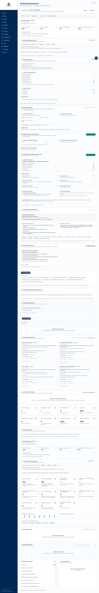

---

### 4.3 Diagrama Mermaid — jornada do escalista

```mermaid
flowchart LR
    subgraph Entrada
        E1[Login coordinator] --> E2[Dashboard /]
    end

    subgraph Oferta
        O1[Criar schedule] --> O2[Publicar shifts open]
        O2 --> O3[/escalas 14d]
    end

    subgraph Convocacao
        C1[Alertas /central] --> C2[Sem confirmação]
        C2 --> C3[Verificar availability]
    end

    subgraph Confirmacao
        F1[Acompanhar assignments] --> F2[Aprovar swaps]
        F2 --> F3[Resolver conflitos]
    end

    subgraph Monitoramento
        M1[Central RT] --> M2[KPIs cobertura]
        M2 --> M3[IA operacional]
    end

    E2 --> O1
    O3 --> C1
    C3 --> F1
    F3 --> M1
```

---

## 5. Mapa comparativo de jornadas

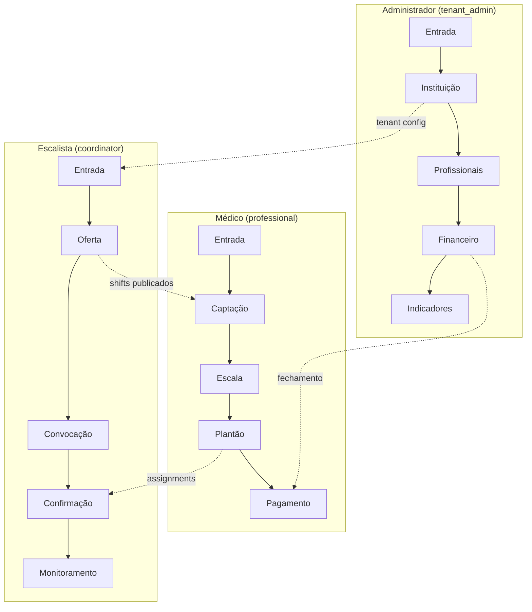

| Fase | Médico | Administrador | Escalista |
|------|--------|---------------|-----------|
| Entrada | Login + dashboard | Login + piloto + go-live | Login + dashboard |
| Operação core | Aceitar plantões | Configurar instituição | Publicar turnos |
| Interação cruzada | Confirma assignments | Provisiona usuários | Aprova swaps |
| Financeiro | Consulta repasses | Fecha competência | TISS escrita |
| Visibilidade | Perfil + TISS leitura | Dashboard executivo | Central RT |

---

## 6. Pontos de contato compartilhados

| Touchpoint | Médico | Escalista | Administrador |
|------------|:------:|:---------:|:-------------:|
| `/` Dashboard | ✅ | ✅ | ✅ |
| `/escalas` | Leitura | Escrita | Leitura |
| `/plantoes` | Próprios | Gestão | — |
| `/central` | Alertas | Monitoramento | — |
| `/tiss` | Leitura | Escrita | Total |
| `/instituicao` | Leitura | Leitura | Escrita |
| `/financeiro` | — | Parcial | Total |
| `/executivo` | — | ✅ | ✅ |
| `/ajuda` | ✅ | ✅ | ✅ |

---

## 7. Casos de uso por jornada

### Médico — Confirmar plantão do fim de semana
```
Login → Home (contador pendente) → Plantões → Meus plantões → Aceitar
```

### Médico — Buscar plantão extra
```
Login → Plantões → Abertos → Aceitar
```

### Administrador — Fechar competência mensal
```
Financeiro → Fechamento → Abrir → Snapshot → Travar → Dashboard executivo
```

### Escalista — Resolver conflito de escala
```
Central (alerta) → Escalas (?opsFocus=conflicts) → Ajustar turno
```

### Escalista — Aprovar swap
```
Plantões → Swaps pendentes → Revisar → Aprovar
```

---

*Documento baseado exclusivamente no sistema MedicFlow-AI V1. Ver manuais [MANUAL_PROFISSIONAL_MEDICFLOW.md](./MANUAL_PROFISSIONAL_MEDICFLOW.md) e [MANUAL_INSTITUICAO_MEDICFLOW.md](./MANUAL_INSTITUICAO_MEDICFLOW.md).*
