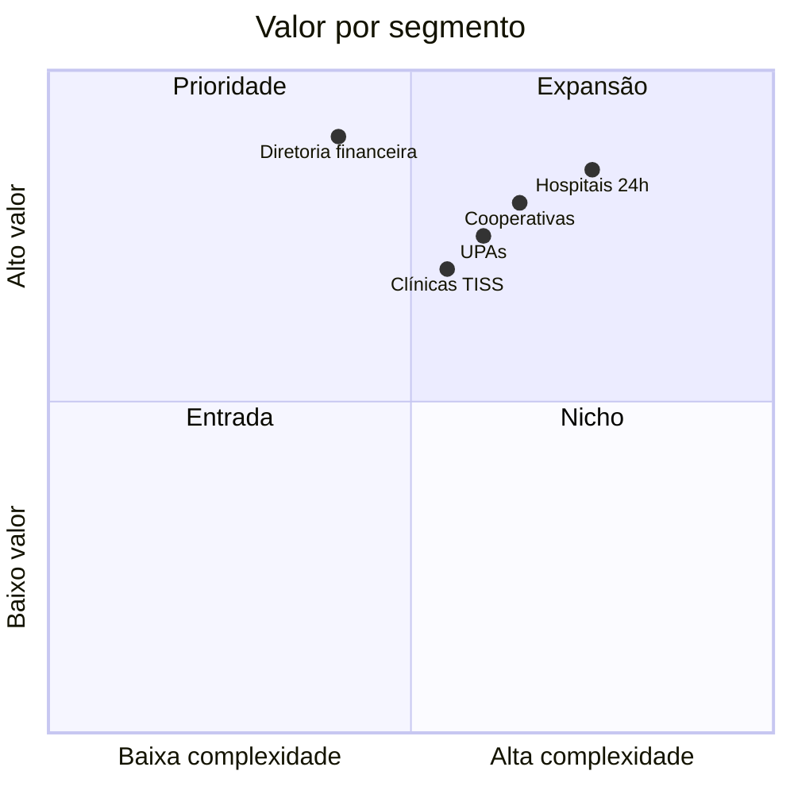

# MedicFlow-AI — Proposta de Valor

**Documento:** proposta executiva e comercial  
**Data:** 11/06/2026  
**Público:** diretoria, investidores, hospitais, cooperativas e potenciais clientes  
**Base:** auditoria funcional do sistema implementado (V1)

---

## 1. Resumo executivo

O **MedicFlow-AI** é uma plataforma operacional hospitalar multi-tenant que digitaliza a gestão de plantões, centraliza o faturamento TISS e oferece fechamento financeiro auditável — com implantação assistida e camada opcional de IA operacional.

**Proposta central:** substituir planilhas, WhatsApp e sistemas fragmentados por uma plataforma única, segura e white-label que conecta operação, faturamento e diretoria.

---

## 2. Problema atual do mercado

### 2.1 Operação de plantões

| Dor | Impacto |
|-----|---------|
| Escalas em planilhas Excel/Google Sheets | Erros de versão, sem histórico auditável |
| Confirmações via WhatsApp e ligações | Perda de confirmações, sem rastreio |
| Falta de visibilidade de cobertura | Plantões descobertos em cima da hora |
| Trocas informais entre médicos | Conflitos de horário, double-booking |
| Múltiplas instituições sem segregação | Risco de vazamento de dados |

### 2.2 Faturamento e financeiro

| Dor | Impacto |
|-----|---------|
| Guias TISS dispersas em sistemas distintos | Retrabalho, perda de receita |
| Lotes manuais e exportação ad hoc | Atraso no faturamento |
| Glosas sem rastreio estruturado | Perda de receita recuperável |
| Fechamento mensal sem snapshot | Alterações retroativas sem auditoria |
| Repasses médicos desconectados da produção | Disputas, falta de transparência |

### 2.3 Implantação de software hospitalar

| Dor | Impacto |
|-----|---------|
| Demos desorganizadas | Perda de oportunidades comerciais |
| Go-live sem validação técnica | Incidentes pós-implantação |
| Branding genérico | Baixa adesão dos usuários finais |
| Provisionamento manual opaco | Atraso na operacionalização |

---

## 3. Solução MedicFlow-AI

```
┌─────────────────────────────────────────────────────────────────┐
│                     MedicFlow-AI V1                              │
│                                                                  │
│   OPERAÇÃO          FINANCEIRO         IMPLANTAÇÃO               │
│   ────────          ──────────         ───────────               │
│   Escalas           TISS MVP           Piloto assistido          │
│   Plantões          Fechamento         Demo 7 passos             │
│   Central RT        Conciliação        Go-live controlado        │
│   Swaps             Repasses           White-label               │
│   IA operacional    Dashboard exec.    Smoke tests               │
└─────────────────────────────────────────────────────────────────┘
```

### O que a plataforma entrega hoje

| Capacidade | Evidência |
|------------|-----------|
| Gestão de escalas e plantões | `/escalas`, `/plantoes` — 20 rotas operacionais |
| Central operacional em tempo real | `/central` + Supabase Realtime |
| Ciclo TISS integrado | `/tiss` — convênios, guias, lotes, glosas, repasses |
| Fechamento financeiro auditável | `/financeiro/fechamento-operacional` |
| Multi-tenant com branding | `/instituicao` — logo, cores, parametrização |
| RBAC granular (5 papéis) | 30+ capabilities, RLS Postgres |
| Implantação assistida | `/piloto`, `/lancamento` |
| IA operacional (opcional) | Copilot GPT, agentes, orquestração |

### O que NÃO é (transparência comercial)

- Prontuário eletrônico (EHR)
- Gestão de pacientes e agenda ambulatorial
- Envio automático TISS a operadoras
- ERP hospitalar completo

---

## 4. Benefícios operacionais

| Benefício | Como o MedicFlow-AI entrega | Métrica esperada |
|-----------|----------------------------|------------------|
| **Centralização de escalas** | Calendário 14 dias + timeline por unidade | Eliminação de planilhas paralelas |
| **Confirmação rastreável** | Assignments com status auditável | 100% das confirmações registradas |
| **Visibilidade de cobertura** | Central com alertas RT | Detecção proativa de gaps |
| **Gestão de trocas formalizada** | Swaps com aprovação | Redução de conflitos de horário |
| **Operação em tempo real** | Supabase Realtime | Atualização instantânea |
| **Auditoria operacional** | `operational_events` + timeline | Rastreabilidade completa |
| **Disponibilidade visível** | Perfil do profissional | Escalista identifica riscos |

---

## 5. Benefícios financeiros

| Benefício | Como o MedicFlow-AI entrega | Evidência |
|-----------|----------------------------|-----------|
| **Ciclo TISS documentado** | Guias → Lotes → Glosas no mesmo tenant | 14 tabelas TISS |
| **Fechamento com snapshot** | Competência travada com auditoria | `financial_closing_snapshots` |
| **Repasses vinculados à produção** | `medical_production` → `medical_payouts` | Aba Repasses |
| **Dashboard executivo** | KPIs reais por competência | `/dashboard-executivo` |
| **Conciliação estruturada** | Import CSV + matching + divergências | `/conciliacao-operacional` |
| **Redução de glosas não rastreadas** | Registro e recurso de glosas | `/tiss` → Glosas |

---

## 6. Benefícios para médicos

| Benefício | Experiência |
|-----------|-------------|
| **Visibilidade de plantões** | Aba "Abertos" com turnos disponíveis por unidade e horário |
| **Confirmação simples** | Um clique para aceitar ou recusar |
| **Gestão de disponibilidade** | Switch no perfil — controle sobre convocações |
| **Trocas formalizadas** | Solicitar swap com aprovação transparente |
| **Consulta de produção** | TISS → Produção e Repasses (leitura) |
| **Acesso mobile** | PWA responsivo — sem app nativo, mas acessível |
| **Central de ajuda** | FAQ, guias e documentação integrada |

**Jornada resumida:** Login → Captação → Escala → Plantão → Pagamento (consulta).

---

## 7. Benefícios para hospitais

| Benefício | Experiência |
|-----------|-------------|
| **White-label rápido** | Branding sem rebuild — logo, cores, banner |
| **Multi-unidade** | Units e departments por tenant |
| **Visão executiva** | Dashboard com KPIs operacionais e financeiros |
| **Segurança multi-tenant** | RLS Postgres — dados isolados por instituição |
| **Implantação previsível** | Demo guiada 7 passos + smoke tests |
| **Observabilidade** | Health checks, export diagnóstico, timeline |
| **Go-live controlado** | Checklist, backup, validação técnica |
| **RBAC por função** | Admin, escalista, financeiro, médico — acessos distintos |

**Jornada resumida:** Entrada → Instituição → Profissionais → Financeiro → Indicadores.

---

## 8. Benefícios para cooperativas

| Benefício | Experiência |
|-----------|-------------|
| **Tenant dedicado** | Cooperativa como instituição separada (ex.: `cooperativa-med`) |
| **Pool de profissionais** | Múltiplos `professionals` vinculados ao tenant |
| **Gestão centralizada de escalas** | Escalista publica turnos para múltiplas unidades |
| **Repasses transparentes** | Produção e pagamentos rastreáveis por competência |
| **Operação compartilhada** | Central monitora cobertura de todo o pool |
| **Branding próprio** | Identidade visual da cooperativa no sistema |

**Nota:** cooperativa opera como tenant no sistema — não como papel RBAC separado.

---

## 9. Diferenciais competitivos

| # | Diferencial | Por que importa |
|---|-------------|-----------------|
| 1 | **Multi-tenant nativo** | Hospitais e cooperativas isolados com branding próprio |
| 2 | **Operação + TISS integrados** | Mesmo tenant, mesma auditoria — operação alimenta faturamento |
| 3 | **Central em tempo real** | Supabase Realtime — não é dashboard estático |
| 4 | **RBAC granular (30+ capabilities)** | Segurança em rota, serviço e banco |
| 5 | **Implantação assistida** | Demo 7 passos, piloto, go-live — reduz time-to-value |
| 6 | **IA operacional (opcional)** | Copilot, agentes, orquestração supervisionada |
| 7 | **Fechamento auditável** | Snapshot + trava + reabertura controlada |
| 8 | **Deploy flexível** | Cloudflare Workers ou Vercel |
| 9 | **PWA** | Acesso mobile sem app store |
| 10 | **Transparência de maturidade** | Documentação honesta sobre gaps — confiança comercial |

### Posicionamento competitivo

```
                    OPERACIONAL
                        ▲
                        │
         MedicFlow-AI ● │     (operação + TISS + financeiro)
                        │
    ────────────────────┼────────────────────► FINANCEIRO/TISS
                        │
         Planilhas ●    │    ● ERPs genéricos
                        │
                        ▼
                    CLÍNICO/EHR

MedicFlow-AI NÃO compete em EHR — compete em OPERAÇÃO + FATURAMENTO TISS MVP
```

---

## 10. Comparativo: antes vs. depois

| Processo | Antes (mercado) | Depois (MedicFlow-AI) |
|--------|-----------------|----------------------|
| Publicar escala | Planilha compartilhada | `/escalas` — calendário 14 dias |
| Confirmar plantão | WhatsApp/ligação | `/plantoes` — assignment auditável |
| Monitorar cobertura | Ligações reativas | `/central` — alertas RT |
| Trocar turno | Acordo informal | Swap com aprovação |
| Faturar TISS | Sistema separado | `/tiss` — ciclo integrado |
| Fechar mês | Planilha + e-mail | Fechamento com snapshot |
| Repassar médicos | Planilha paralela | Repasses vinculados à produção |
| Implantar software | Demo ad hoc | Demo guiada 7 passos |
| Branding | Logo genérico | White-label por tenant |

---

## 11. Modelo de valor por segmento



| Segmento | Proposta de valor principal | Módulos-chave |
|----------|----------------------------|---------------|
| **Hospital 24h** | Cobertura de plantões + visibilidade RT | Escalas, Central, Plantões |
| **Cooperativa médica** | Pool de profissionais + repasses | Escalas, Repasses, Central |
| **Clínica com TISS** | Faturamento integrado à operação | TISS, Fechamento, Repasses |
| **Diretoria** | KPIs consolidados + auditoria | Dashboard Executivo, Fechamento |
| **UPA** | Escala rápida + confirmação | Escalas, Plantões, Central |

---

## 12. Prova social técnica (evidências do produto)

| Evidência | Detalhe |
|-----------|---------|
| 20 rotas implementadas | Frontend completo operacional |
| ~173 server functions | Backend robusto |
| ~63 tabelas Postgres | Schema enterprise com RLS |
| 5 papéis RBAC | Segurança granular |
| 12 screenshots staging | Demo visual validada |
| Staging live | `staging.medicflow.app.br` |
| Demo guiada 7 passos | Roteiro comercial pronto |
| Smoke tests automatizados | Validação técnica de go-live |

---

## 13. Limitações para comunicar com transparência

| Limitação | Impacto comercial | Mitigação |
|-----------|-------------------|-----------|
| Sem EHR/prontuário | Não substitui prontuário | Posicionar como complemento operacional |
| TISS sem envio operadoras | Processo manual de envio | Export XML + registro manual de retorno |
| Cadastro UI profissionais | Provisionamento manual | Roadmap curto prazo |
| Sem push/e-mail | Notificação in-app only | Dashboard + Central RT |
| Conciliação só CSV | Sem OFX/CNAB | Import manual estruturado |

---

## 14. Mensagem comercial (elevator pitch)

> **MedicFlow-AI** digitaliza a operação de plantões hospitalares e integra faturamento TISS em uma plataforma multi-tenant white-label — com central operacional em tempo real, fechamento financeiro auditável e implantação assistida. Não é prontuário eletrônico: é a camada operacional e financeira que faltava entre planilhas e ERPs.

---

*Documento baseado exclusivamente no sistema MedicFlow-AI V1 implementado. Ver [MEDICFLOW_APRESENTACAO_EXECUTIVA.md](./MEDICFLOW_APRESENTACAO_EXECUTIVA.md) para material consolidado de apresentação.*
