# MedicFlow-AI — Slides Comerciais

**Documento:** slides visuais para apresentações comerciais (formato Mermaid)  
**Data:** 11/06/2026  
**Público:** diretoria, investidores, hospitais, cooperativas  
**Base:** [MEDICFLOW_PROPOSTA_DE_VALOR.md](./MEDICFLOW_PROPOSTA_DE_VALOR.md)

---

## Guia de apresentação

### Estrutura sugerida (deck comercial)

| Ordem | Slide | Arquivo de origem |
|-------|-------|-------------------|
| 1 | Abertura — Visão da Plataforma | [MEDICFLOW_DIAGRAMAS_EXECUTIVOS.md](./MEDICFLOW_DIAGRAMAS_EXECUTIVOS.md) §1 |
| 2 | Problema — Antes x Depois | Este documento §1 |
| 3 | Solução — Fluxo de Captação | [MEDICFLOW_DIAGRAMAS_EXECUTIVOS.md](./MEDICFLOW_DIAGRAMAS_EXECUTIVOS.md) §2 |
| 4 | ROI e Ganhos Operacionais | Este documento §2 |
| 5 | Diferenciais Competitivos | Este documento §3 |
| 6 | Jornadas por Persona | [MEDICFLOW_DIAGRAMAS_EXECUTIVOS.md](./MEDICFLOW_DIAGRAMAS_EXECUTIVOS.md) §4–6 |
| 7 | Arquitetura e Prova Técnica | [MEDICFLOW_DIAGRAMAS_EXECUTIVOS.md](./MEDICFLOW_DIAGRAMAS_EXECUTIVOS.md) §7 |
| 8 | Infográfico Resumo | [MEDICFLOW_INFOGRAFICO.md](./MEDICFLOW_INFOGRAFICO.md) |
| 9 | Roadmap e Transparência | [MEDICFLOW_APRESENTACAO_EXECUTIVA.md](./MEDICFLOW_APRESENTACAO_EXECUTIVA.md) §8 |
| 10 | CTA — Demo e Staging | `staging.medicflow.app.br` |

### Paleta para slides comerciais

| Elemento | Cor | Hex |
|----------|-----|-----|
| Antes (problema) | Vermelho suave | `#FEE2E2` / borda `#DC2626` |
| Depois (solução) | Verde suave | `#D1FAE5` / borda `#059669` |
| Destaque MedicFlow | Azul primário | `#0369A1` |
| Fundo neutro | Cinza claro | `#F8FAFC` |

---

## Slide 1 — Antes x Depois do MedicFlow

**Título sugerido:** *De planilhas fragmentadas a operação integrada*  
**Notas do apresentador:** Enfatizar dor real do mercado (WhatsApp, planilhas) vs. evidência no produto (rotas implementadas, staging live).

### Comparativo visual — fluxo lado a lado

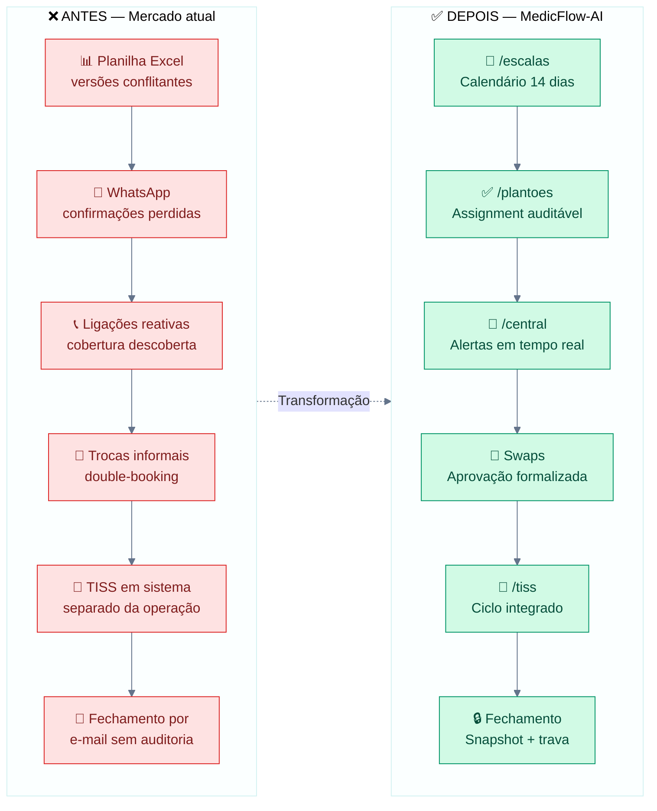

### Matriz comparativa — processos

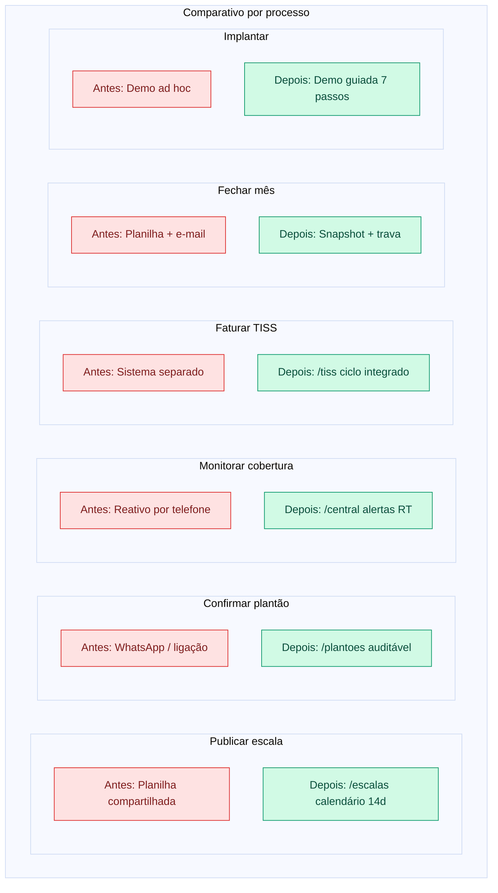

### Impacto qualitativo — mindmap

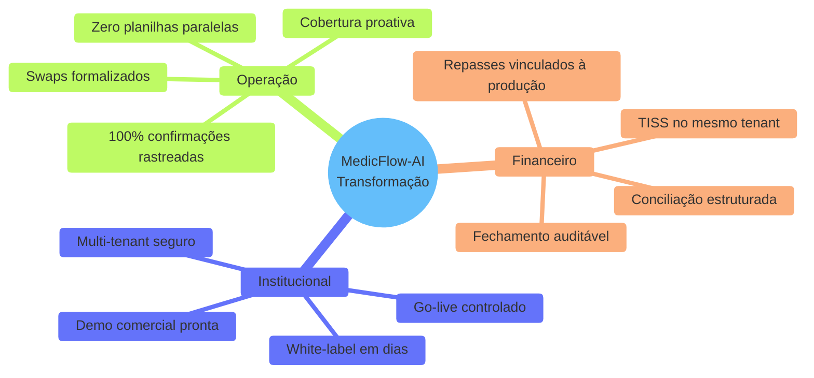

### Bullets para o slide (texto complementar)

| Dimensão | Antes | Depois com MedicFlow-AI |
|----------|-------|-------------------------|
| **Escala** | Planilha com versões conflitantes | Calendário 14 dias unificado |
| **Confirmação** | WhatsApp sem rastreio | Assignment com status auditável |
| **Cobertura** | Descoberta em cima da hora | Alertas proativos em tempo real |
| **TISS** | Sistema desconectado | Ciclo integrado no mesmo tenant |
| **Fechamento** | Retroativo sem controle | Snapshot + trava + reabertura controlada |
| **Implantação** | Demo improvisada | Piloto + 7 passos + smoke tests |

---

## Slide 2 — ROI e Ganhos Operacionais

**Título sugerido:** *Retorno operacional e financeiro mensurável*  
**Notas do apresentador:** Métricas baseadas em capacidades implementadas — não prometer números não auditados. Usar "eliminação de" e "redução de" com base em evidências do produto.

### Mapa de valor — quadrante por segmento

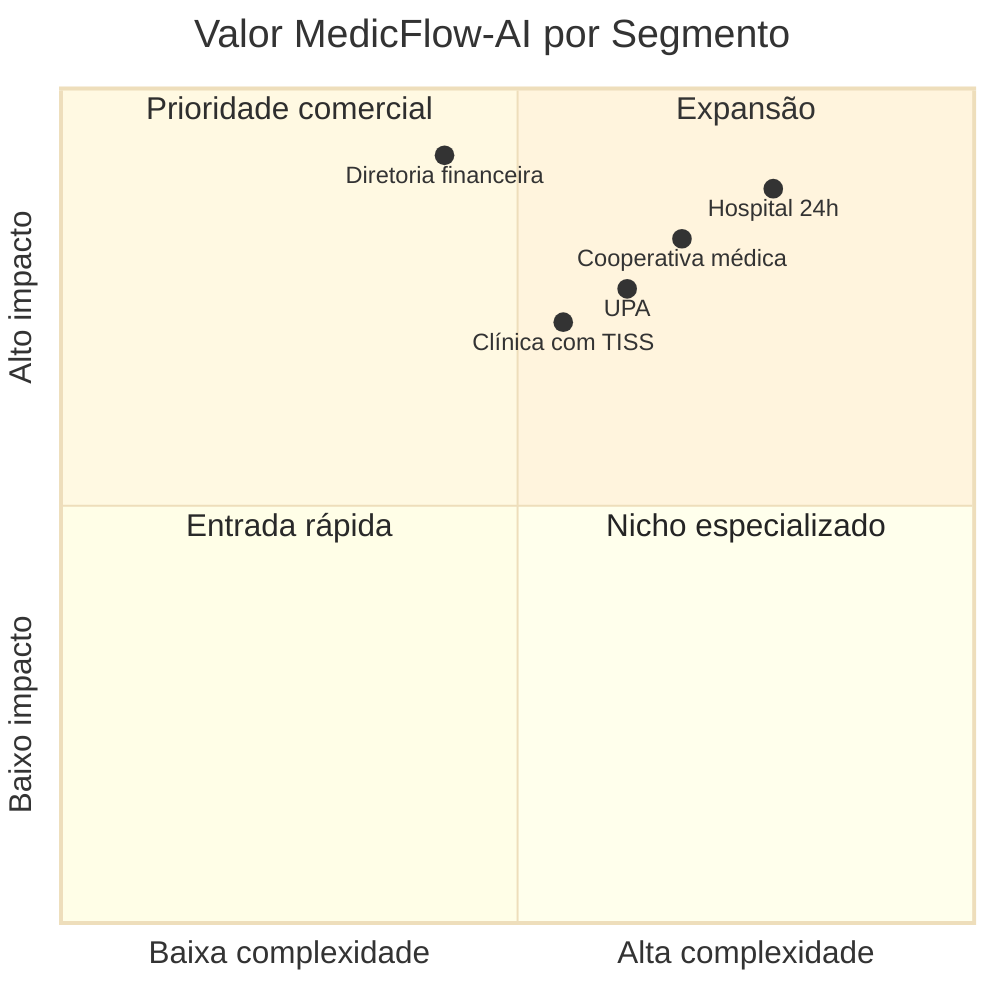

### Ganhos operacionais — diagrama de impacto

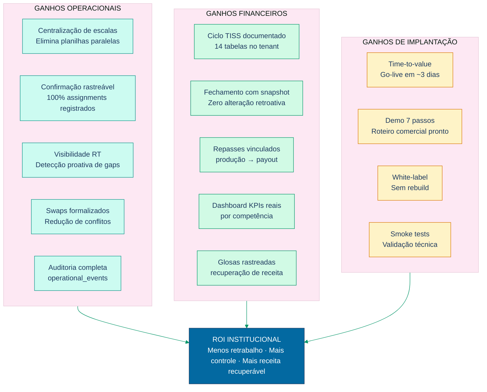

### ROI por persona — tabela visual

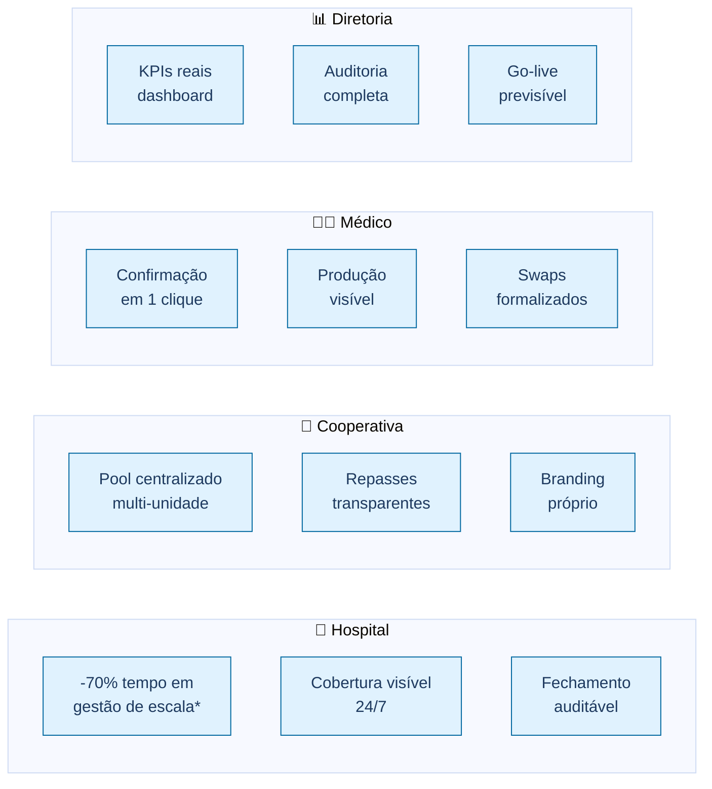

> \*Estimativa qualitativa baseada na eliminação de planilhas e confirmações manuais — validar com piloto institucional.

### Prova técnica — números do produto

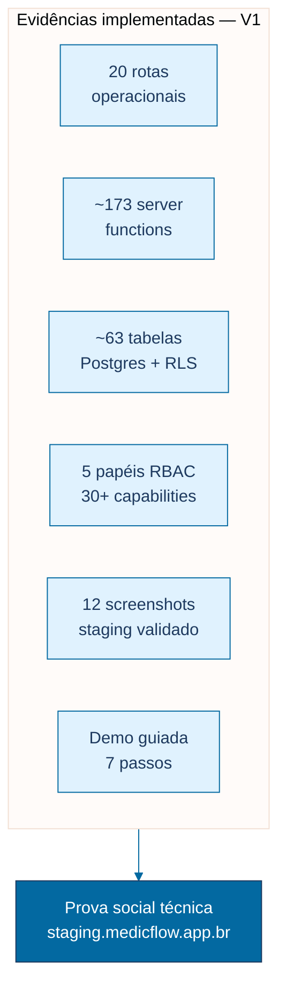

### Bullets para o slide (texto complementar)

| Categoria | Ganho | Evidência no produto |
|-----------|-------|---------------------|
| **Operação** | Eliminação de planilhas paralelas | `/escalas` calendário 14 dias |
| **Operação** | 100% confirmações registradas | `shift_assignments` auditável |
| **Operação** | Detecção proativa de gaps | `/central` + Supabase Realtime |
| **Financeiro** | Fechamento sem alteração retroativa | Snapshot + trava de competência |
| **Financeiro** | Repasses vinculados à produção | `medical_production` → `medical_payouts` |
| **Financeiro** | KPIs consolidados para diretoria | `/dashboard-executivo` |
| **Implantação** | Go-live em ~3 dias | Piloto + smoke tests documentados |
| **Comercial** | Demo pronta para investidores | 7 passos + 12 screenshots |

---

## Slide 3 — Diferenciais Competitivos

**Título sugerido:** *Por que MedicFlow-AI — 10 diferenciais com evidência*  
**Notas do apresentador:** Posicionar como plataforma OPERACIONAL + TISS MVP — não competir com EHR/ERP.

### Mapa de posicionamento competitivo

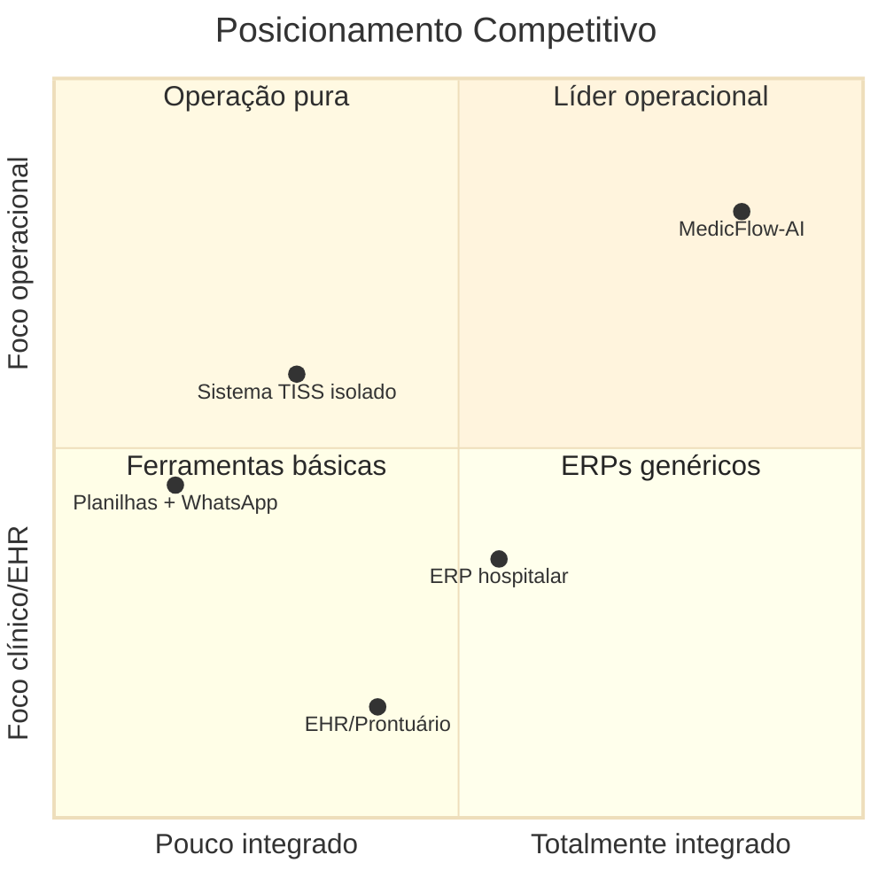

### 10 diferenciais — diagrama radial

```mermaid
%%{init: {'theme': 'base', 'themeVariables': {'primaryColor': '#E0F2FE', 'lineColor': '#0369A1'}}}%%
flowchart TB
    MF["MedicFlow-AI<br/>Diferenciais V1"]

    MF --> D1["① Multi-tenant nativo<br/>RLS + branding"]
    MF --> D2["② Operação + TISS<br/>mesmo tenant"]
    MF --> D3["③ Central RT<br/>alertas live"]
    MF --> D4["④ RBAC granular<br/>30+ capabilities"]
    MF --> D5["⑤ Implantação assistida<br/>demo 7 passos"]
    MF --> D6["⑥ IA operacional<br/>Copilot + agentes"]
    MF --> D7["⑦ Fechamento auditável<br/>snapshot + trava"]
    MF --> D8["⑧ White-label rápido<br/>sem rebuild"]
    MF --> D9["⑨ Deploy flexível<br/>CF Workers / Vercel"]
    MF --> D10["⑩ Transparência<br/>gaps documentados"]

    classDef core fill:#0369A1,color:#FFFFFF,stroke:#1E3A5F
    classDef diff fill:#E0F2FE,stroke:#0369A1,color:#1E3A5F
    classDef diff2 fill:#CCFBF1,stroke:#0D9488,color:#1E3A5F
    classDef diff3 fill:#EDE9FE,stroke:#7C3AED,color:#1E3A5F

    class MF core
    class D1,D2,D4,D7,D8 diff
    class D3,D5,D9,D10 diff2
    class D6 diff3
```

### Comparativo competitivo — tabela visual

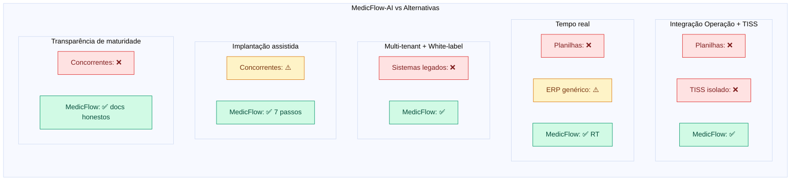

### Posicionamento — o que somos e o que não somos

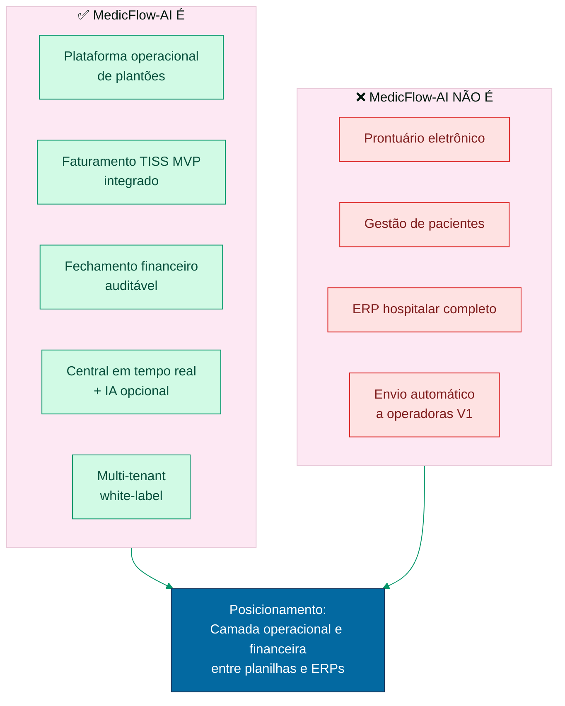

### Bullets para o slide (texto complementar)

| # | Diferencial | Evidência | Por que importa |
|---|-------------|-----------|-----------------|
| 1 | Multi-tenant nativo | RLS Postgres + `/instituicao` | Hospitais e cooperativas isolados |
| 2 | Operação + TISS integrados | Mesmo tenant, mesma auditoria | Operação alimenta faturamento |
| 3 | Central em tempo real | Supabase Realtime | Não é dashboard estático |
| 4 | RBAC granular | 5 papéis, 30+ capabilities | Segurança em rota, serviço e banco |
| 5 | Implantação assistida | Demo 7 passos + piloto | Reduz time-to-value |
| 6 | IA operacional | Copilot + agentes (opcional) | Diferencial de inovação |
| 7 | Fechamento auditável | Snapshot + trava | Compliance financeiro |
| 8 | White-label rápido | Logo, cores sem rebuild | Adesão dos usuários |
| 9 | Deploy flexível | Cloudflare Workers / Vercel | Escalabilidade cloud-native |
| 10 | Transparência | Gaps documentados | Confiança comercial |

---

## Slide bônus — Elevator Pitch Visual

```mermaid
%%{init: {'theme': 'base', 'themeVariables': {'primaryColor': '#0369A1', 'primaryTextColor': '#FFFFFF', 'lineColor': '#0D9488'}}}%%
flowchart LR
    PROB["Problema<br/>Planilhas + WhatsApp<br/>+ sistemas fragmentados"]
    SOL["Solução<br/>MedicFlow-AI<br/>Plataforma única"]
    BEN["Benefício<br/>Operação + TISS<br/>+ fechamento auditável"]
    DIF["Diferencial<br/>Multi-tenant RT<br/>+ implantação assistida"]
    CTA["Ação<br/>staging.medicflow.app.br<br/>Demo 7 passos"]

    PROB --> SOL --> BEN --> DIF --> CTA

    classDef prob fill:#FEE2E2,stroke:#DC2626,color:#7F1D1D
    classDef sol fill:#0369A1,color:#FFFFFF,stroke:#1E3A5F
    classDef ben fill:#D1FAE5,stroke:#059669,color:#064E3B
    classDef dif fill:#EDE9FE,stroke:#7C3AED,color:#1E3A5F
    classDef cta fill:#FEF3C7,stroke:#D97706,color:#78350F

    class PROB prob
    class SOL sol
    class BEN ben
    class DIF dif
    class CTA cta
```

**Elevator pitch (30 segundos):**

> MedicFlow-AI substitui planilhas e WhatsApp na gestão de plantões hospitalares, integrando operação, TISS e fechamento financeiro em uma plataforma segura, white-label e pronta para demo comercial. Não é prontuário eletrônico — é a camada operacional e financeira que faltava entre planilhas e ERPs.

---

## Referências

| Documento | Conteúdo |
|-----------|----------|
| [MEDICFLOW_DIAGRAMAS_EXECUTIVOS.md](./MEDICFLOW_DIAGRAMAS_EXECUTIVOS.md) | Diagramas operacionais e jornadas |
| [MEDICFLOW_INFOGRAFICO.md](./MEDICFLOW_INFOGRAFICO.md) | Infográfico consolidado |
| [MEDICFLOW_PROPOSTA_DE_VALOR.md](./MEDICFLOW_PROPOSTA_DE_VALOR.md) | Proposta de valor detalhada |
| [MEDICFLOW_APRESENTACAO_EXECUTIVA.md](./MEDICFLOW_APRESENTACAO_EXECUTIVA.md) | Apresentação executiva completa |

---

*Slides em formato Mermaid — exportar via [mermaid.live](https://mermaid.live) ou CLI para inserção em PowerPoint/Google Slides.*
