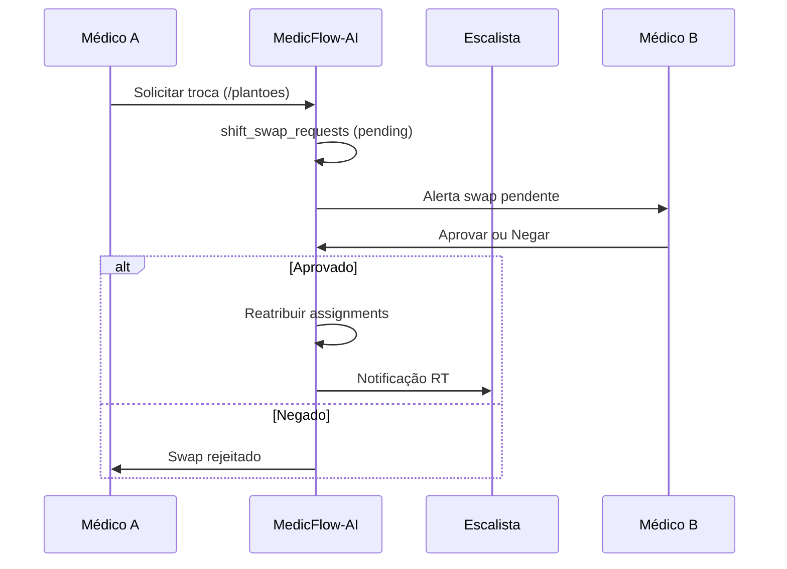

# MedicFlow-AI — Workflow de Captação de Plantões

**Documento:** fluxo operacional completo de captação, escala e pagamento de plantões  
**Data:** 11/06/2026  
**Ambiente:** `https://staging.medicflow.app.br`  
**Base:** recursos implementados em `/escalas`, `/plantoes`, `/central`, `/perfil`, TISS e financeiro

---

## 1. Contexto e atores

### 1.1 Atores de negócio

| Ator | Papel no sistema | Responsabilidade no fluxo |
|------|------------------|---------------------------|
| **Hospital** | Tenant (`hospital`, `clinic`, `upa`) | Define demanda de cobertura, parametriza unidades e setores |
| **Cooperativa** | Tenant (`cooperativa-med`) | Gerencia pool de profissionais e escalas compartilhadas |
| **Escalista** | `coordinator` | Cria escalas, publica turnos, aprova swaps, monitora cobertura |
| **Médico** | `professional` | Manifesta interesse, confirma plantões, gerencia disponibilidade |
| **Administrador** | `tenant_admin` / `super_admin` | Implantação, branding, provisionamento, go-live |

### 1.2 Evidências visuais (staging)

| Etapa | Screenshot | Rota |
|-------|------------|------|
| Login e seleção de instituição | `screenshots/01-login.png` | `/login` |
| Dashboard com KPIs do dia | `screenshots/02-dashboard.png` | `/` |
| Calendário de escalas | `screenshots/03-agenda-escalas.png` | `/escalas` |
| Plantões abertos e confirmações | `screenshots/04-plantoes.png` | `/plantoes` |
| Central operacional e alertas | `screenshots/11-central-operacional.png` | `/central` |
| Perfil e disponibilidade | `screenshots/10-perfil.png` | `/perfil` |

---

## 2. Fluxo operacional completo (10 etapas)

### 2.1 Fluxograma textual

```
[HOSPITAL / COOPERATIVA]
        │
        ▼
(1) CADASTRO DA OPORTUNIDADE DE PLANTÃO
    • Administrador configura tenant, unidades e departamentos (/instituicao)
    • Escalista cria schedule (escala) e shifts (turnos) em /escalas
    • Turno nasce com status "open" — vaga disponível
    • Tabelas: schedules, shifts, departments, units
        │
        ▼
(2) PUBLICAÇÃO DA ESCALA
    • Turnos ficam visíveis no calendário de 14 dias (/escalas)
    • Profissionais veem timeline por unidade/setor/horário
    • Filtros operacionais: conflitos, abertos, sem confirmação
        │
        ▼
(3) NOTIFICAÇÃO DOS MÉDICOS
    • Dashboard exibe contadores: plantões abertos, confirmações pendentes
    • Central operacional (/central) emite alertas de cobertura baixa
    • Supabase Realtime propaga mudanças de shifts e assignments
    ⚠️ Push/e-mail não implementados — notificação in-app + RT
        │
        ▼
(4) MANIFESTAÇÃO DE INTERESSE
    • Médico acessa /plantoes → aba "Abertos" (disponiveis)
    • Visualiza turnos por unidade, horário e data
    • Clica "Aceitar" para manifestar interesse
    • Tabela: shift_assignments (status: pending)
        │
        ▼
(5) SELEÇÃO
    • Escalista pode atribuir profissional diretamente (coordinator)
    • Ou médico auto-aceita vaga aberta (self-service)
    • Regra: apenas 1 assignment "confirmed" por shift
    • Swaps permitem realocar profissional entre turnos
        │
        ▼
(6) CONFIRMAÇÃO
    • Médico confirma assignment pendente → status "confirmed"
    • Ou recusa → turno volta para "open"
    • Escalista monitora "sem confirmação" via /escalas?opsFocus=sem-confirmacao
        │
        ▼
(7) EXECUÇÃO DO PLANTÃO
    • Turno ocorre conforme starts_at / ends_at
    • Status do shift evolui operacionalmente
    • Central monitora cobertura em tempo real
    • Swaps pendentes tratados em /plantoes?tab=swaps
        │
        ▼
(8) VALIDAÇÃO
    • Produção médica registrada (medical_production)
    • Vinculação com guias TISS quando aplicável
    • Eventos operacionais auditados (operational_events)
        │
        ▼
(9) FECHAMENTO
    • Competência financeira aberta (/financeiro/fechamento-operacional)
    • Snapshot captura estado consolidado
    • Competência travada impede alterações
        │
        ▼
(10) PAGAMENTO
    • Regras de repasse aplicadas (payout_rules)
    • Cálculo e aprovação de repasses (/tiss → Repasses)
    • medical_payouts + medical_payout_items
    • Dashboard executivo consolida KPIs
```

---

## 3. Fluxograma Mermaid — captação de plantões

```mermaid
flowchart TD
    START([Demanda de cobertura<br/>Hospital / Cooperativa]) --> A

    subgraph ETAPA1["1. Cadastro da oportunidade"]
        A[Admin configura tenant<br/>/instituicao] --> B[Escalista cria schedule<br/>e shifts em /escalas]
        B --> C[(schedules + shifts<br/>status: open)]
    end

    C --> D

    subgraph ETAPA2["2. Publicação da escala"]
        D[Turnos visíveis<br/>calendário 14 dias] --> E[Filtros: abertos,<br/>conflitos, sem confirmação]
    end

    E --> F

    subgraph ETAPA3["3. Notificação"]
        F[Dashboard: contadores<br/>pendentes] --> G[Central: alertas RT<br/>/central]
        G --> H{Profissional<br/>disponível?}
        H -->|Não| I[/perfil: indisponível]
        H -->|Sim| J[Pronto para manifestação]
    end

    I --> G
    J --> K

    subgraph ETAPA4["4. Manifestação de interesse"]
        K[Médico: /plantoes<br/>aba Abertos] --> L[Clica Aceitar]
        L --> M[(shift_assignments<br/>status: pending)]
    end

    M --> N

    subgraph ETAPA5["5. Seleção"]
        N{Modo de alocação}
        N -->|Self-service| O[Médico aceita vaga]
        N -->|Escalista| P[Coordinator atribui]
        N -->|Swap| Q[Solicitação de troca<br/>shift_swap_requests]
    end

    O --> R
    P --> R
    Q --> S{Aprovação<br/>swap?}
    S -->|Sim| R
    S -->|Não| C

    subgraph ETAPA6["6. Confirmação"]
        R[Assignment confirmado<br/>status: confirmed] --> T[1 confirmed por shift<br/>regra de negócio]
    end

    T --> U

    subgraph ETAPA7["7. Execução"]
        U[Plantão executado<br/>starts_at → ends_at] --> V[Central monitora<br/>cobertura RT]
    end

    V --> W

    subgraph ETAPA8["8. Validação"]
        W[Produção registrada<br/>medical_production] --> X[Eventos auditados<br/>operational_events]
    end

    X --> Y

    subgraph ETAPA9["9. Fechamento"]
        Y[Abrir competência<br/>/fechamento-operacional] --> Z[Gerar snapshot<br/>Travar competência]
    end

    Z --> AA

    subgraph ETAPA10["10. Pagamento"]
        AA[Regras payout_rules] --> AB[Cálculo repasses<br/>/tiss → Repasses]
        AB --> AC[Dashboard executivo<br/>KPIs consolidados]
    end

    AC --> END([Fim do ciclo])
```

---

## 4. Diagrama executivo — captação de plantões

```
┌──────────────────────────────────────────────────────────────────────────────┐
│                    WORKFLOW DE CAPTAÇÃO DE PLANTÕES                           │
│                         MedicFlow-AI V1                                      │
└──────────────────────────────────────────────────────────────────────────────┘

  HOSPITAL          ESCALISTA           MÉDICO           SISTEMA
  ────────          ─────────           ──────           ───────
      │                 │                  │                 │
      │  Demanda        │                  │                 │
      │  de cobertura   │                  │                 │
      ├────────────────►│                  │                 │
      │                 │  Cria escala     │                 │
      │                 ├─────────────────────────────────►│ /escalas
      │                 │                  │                 │ shifts: open
      │                 │  Publica turnos  │                 │
      │                 ├─────────────────────────────────►│ Realtime
      │                 │                  │  Vê alertas     │
      │                 │                  │◄────────────────┤ / + /central
      │                 │                  │                 │
      │                 │                  │  Aceita plantão │
      │                 │                  ├────────────────►│ /plantoes
      │                 │                  │                 │ assignment: pending
      │                 │  Monitora        │  Confirma       │
      │                 │◄─────────────────────────────────┤ status: confirmed
      │                 │                  │                 │
      │                 │                  │  Executa plantão│
      │                 │                  ├────────────────►│ medical_production
      │                 │                  │                 │
      │  Fechamento     │                  │                 │
      ├─────────────────┼──────────────────┼────────────────►│ /fechamento
      │                 │                  │                 │
      │  Pagamento      │                  │  Recebe repasse │
      ├─────────────────┼──────────────────┼────────────────►│ /tiss Repasses
      │                 │                  │◄────────────────┤ medical_payouts
      ▼                 ▼                  ▼                 ▼
```

---

## 5. Detalhamento por etapa e artefatos do sistema

| # | Etapa | Rota | Hook / Serviço | Tabela |
|---|-------|------|----------------|--------|
| 1 | Cadastro oportunidade | `/escalas` | `use-operations`, schedules API | `schedules`, `shifts` |
| 2 | Publicação | `/escalas` | schedules queries | `shifts` (status `open`) |
| 3 | Notificação | `/`, `/central` | `use-operational-alerts`, `use-operational-realtime` | Realtime pub |
| 4 | Manifestação | `/plantoes` | `use-operational-mutations` | `shift_assignments` |
| 5 | Seleção | `/plantoes`, `/escalas` | assignments API, swaps API | `shift_assignments`, `shift_swap_requests` |
| 6 | Confirmação | `/plantoes` | accept/reject assignment | `assignment_status` |
| 7 | Execução | `/central` | `use-operational-metrics` | `shifts`, `operational_events` |
| 8 | Validação | `/tiss` | medical-payout services | `medical_production` |
| 9 | Fechamento | `/financeiro/fechamento-operacional` | `use-financial-closing` | `financial_closings` |
| 10 | Pagamento | `/tiss` (Repasses) | `use-medical-payout-foundation` | `medical_payouts` |

---

## 6. Regras de negócio do fluxo

| Regra | Descrição | Impacto |
|-------|-----------|---------|
| **Um confirmado por turno** | Índice parcial único em `shift_assignments` | Evita double-booking |
| **Turno aberto = vaga** | `shift_status = open` sem assignment confirmed | Aparece em "Abertos" |
| **Swap requer aprovação** | `swap_request_status`: pending → approved/denied | Coordenador ou par envolvido |
| **Disponibilidade** | Switch em `/perfil` alimenta janelas em `availability` | Central identifica riscos |
| **Conflitos de horário** | Filtro `/escalas?opsFocus=conflicts` | Escalista resolve sobreposições |
| **Isolamento multi-tenant** | RLS por `tenant_id` | Hospital e cooperativa segregados |
| **Auditoria** | `operational_events` + mutation executions | Rastreabilidade completa |

---

## 7. Swaps — subfluxo de exceção



---

## 8. Gaps conhecidos (transparência comercial)

| Gap | Status | Workaround atual |
|-----|--------|------------------|
| Notificação push/e-mail | Não implementado | Dashboard + Central RT |
| Captação externa (portal público) | Não implementado | Fluxo interno via login |
| Matching automático médico-turno | Não implementado | Aceite manual ou escalista |
| Integração bancária de pagamento | Não implementado | Repasses registrados no sistema |
| App mobile nativo | Não implementado | PWA responsivo |

---

## 9. Métricas operacionais disponíveis

| Indicador | Onde visualizar |
|-----------|-----------------|
| Plantões abertos | `/` (dashboard), `/central` |
| Confirmações pendentes | `/`, `/plantoes`, alertas |
| Swaps pendentes | `/plantoes?tab=swaps`, `/central` |
| Cobertura baixa | `/central` (alertas) |
| Conflitos de escala | `/escalas?opsFocus=conflicts` |
| Produção por competência | `/tiss` → Produção |
| Repasses calculados | `/tiss` → Repasses |

---

*Documento baseado exclusivamente no sistema MedicFlow-AI V1 implementado. Ver também [MEDICFLOW_WORKFLOW_OPERACIONAL.md](./MEDICFLOW_WORKFLOW_OPERACIONAL.md) e [MEDICFLOW_JORNADA_USUARIOS.md](./MEDICFLOW_JORNADA_USUARIOS.md).*
