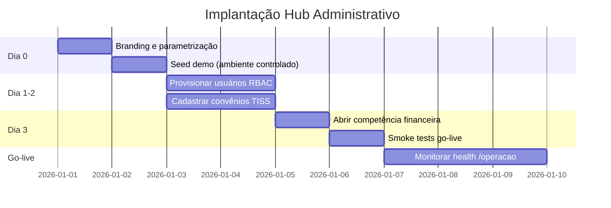

# MedicFlow-AI — Workflow Hub Administrativo Médico

**Documento:** fluxo operacional do hub administrativo para gestão institucional  
**Data:** 11/06/2026  
**Ambiente:** `https://staging.medicflow.app.br`  
**Público:** administradores, equipe financeira, coordenadores e diretoria

---

## 1. Contexto

O **Hub Administrativo Médico** do MedicFlow-AI concentra a gestão institucional, financeira e operacional de hospitais, clínicas, UPAs e cooperativas — em ambiente multi-tenant com RBAC granular e auditoria integrada.

**Papéis envolvidos:**

| Papel | Acesso ao hub |
|-------|---------------|
| `tenant_admin` | Total — branding, piloto, go-live, reabertura de competência |
| `coordinator` | Escalas, plantões, TISS escrita, fechamento |
| `financial` | Financeiro, TISS, repasses, conciliação |
| `super_admin` | Plataforma + seed demo + operações globais |

---

## 2. Fluxo operacional completo (10 etapas)

### 2.1 Fluxograma textual

```
(1) CADASTRO DA INSTITUIÇÃO
    • Tenant criado no Supabase (multi-tenant)
    • Branding: logo, banner, favicon, cores (/instituicao)
    • Parametrização: nome, contato, fuso, moeda
    • Tabelas: tenants, tenant_settings
        │
        ▼
(2) CADASTRO DOS PROFISSIONAIS
    • Provisionamento via Supabase Auth (externo à UI)
    • Profile com role (professional, coordinator, financial)
    • Vínculo opcional em professionals (CRM, especialidade)
    ⚠️ UI de cadastro não implementada na V1
        │
        ▼
(3) GESTÃO DE ESCALAS
    • Criação de schedules e shifts (/escalas)
    • Calendário 14 dias, filtros operacionais
    • Resolução de conflitos e cobertura
    • Tabelas: schedules, shifts, shift_assignments
        │
        ▼
(4) GESTÃO FINANCEIRA
    • Hub financeiro (/financeiro) — navegação
    • Fechamento por competência (/fechamento-operacional)
    • Repasses médicos (/tiss → Repasses)
    • Tabelas: financial_closings, medical_payouts
        │
        ▼
(5) CONTROLE TISS
    • Convênios, contratos, TUSS (/tiss)
    • Guias → Lotes → Export XML
    • Glosas e recursos (registro manual)
    • 14 tabelas TISS
        │
        ▼
(6) CONCILIAÇÃO OPERACIONAL
    • Importação CSV (/conciliacao-operacional)
    • Matching manual e divergências
    ⚠️ Integração bancária OFX/CNAB não implementada
        │
        ▼
(7) FECHAMENTO OPERACIONAL
    • Abrir competência → snapshot → travar
    • Reabertura restrita a tenant_admin/super_admin
    • Auditoria: financial_closing_audit
        │
        ▼
(8) DASHBOARD EXECUTIVO
    • KPIs reais por competência (/dashboard-executivo)
    • Narrativa comercial (/executivo)
    • Alertas financeiros consolidados
        │
        ▼
(9) INDICADORES
    • KPIs operacionais: /central, /
    • KPIs TISS: /tiss → Resumo
    • KPIs financeiros: dashboard executivo
    • Readiness: /instituicao
        │
        ▼
(10) AUDITORIA
    • Eventos operacionais (operational_events)
    • Logs de login (security_audit_logs)
    • Auditoria TISS, fechamento, repasses
    • Export diagnóstico (/operacao, /piloto)
```

---

## 3. Fluxograma Mermaid — hub administrativo

```mermaid
flowchart TD
    START([Nova instituição<br/>Hospital / Cooperativa]) --> A

    subgraph E1["1. Cadastro da instituição"]
        A[/instituicao — Branding] --> B[Parametrização<br/>tenant_settings]
        B --> C[Readiness operacional]
    end

    C --> D

    subgraph E2["2. Cadastro de profissionais"]
        D[Supabase Auth<br/>provisionamento] --> E[profiles + professionals]
        E --> F{Papel RBAC}
        F --> G[coordinator]
        F --> H[professional]
        F --> I[financial]
    end

    G --> J
    H --> J
    I --> J

    subgraph E3["3. Gestão de escalas"]
        J[/escalas — Schedules] --> K[Criar shifts<br/>publicar turnos]
        K --> L[/central — Monitorar]
        L --> M{Conflitos?}
        M -->|Sim| N[Resolver em /escalas]
        M -->|Não| O[Cobertura OK]
        N --> L
    end

    O --> P

    subgraph E4["4. Gestão financeira"]
        P[/financeiro — Hub] --> Q[/fechamento-operacional]
        Q --> R[/tiss — Repasses]
    end

    R --> S

    subgraph E5["5. Controle TISS"]
        S[Convênios + TUSS] --> T[Guias TISS]
        T --> U[Lotes + Export XML]
        U --> V[Glosas e Recursos]
    end

    V --> W

    subgraph E6["6. Conciliação"]
        W[/conciliacao-operacional] --> X[Import CSV]
        X --> Y[Matching + Divergências]
    end

    Y --> Z

    subgraph E7["7. Fechamento operacional"]
        Z[Abrir competência] --> AA[Snapshot]
        AA --> AB[Travar competência]
    end

    AB --> AC

    subgraph E8["8. Dashboard executivo"]
        AC[/dashboard-executivo] --> AD[/executivo — Narrativa]
    end

    AD --> AE

    subgraph E9["9. Indicadores"]
        AE[KPIs operacionais] --> AF[KPIs TISS]
        AF --> AG[KPIs financeiros]
    end

    AG --> AH

    subgraph E10["10. Auditoria"]
        AH[operational_events] --> AI[security_audit_logs]
        AI --> AJ[Export diagnóstico<br/>/operacao]
    end

    AJ --> END([Hub administrativo<br/>operacional])
```

---

## 4. Diagrama executivo — hub administrativo

```
┌──────────────────────────────────────────────────────────────────────────────┐
│                  HUB ADMINISTRATIVO MÉDICO — MedicFlow-AI                     │
└──────────────────────────────────────────────────────────────────────────────┘

┌─────────────┐   ┌─────────────┐   ┌─────────────┐   ┌─────────────┐
│ INSTITUIÇÃO │   │PROFISSIONAIS│   │   ESCALAS   │   │  FINANCEIRO │
│ /instituicao│──►│ Auth externo │──►│  /escalas   │──►│ /financeiro │
│ Branding    │   │ RBAC 5 papéis│   │ /plantoes  │   │ Fechamento  │
│ Readiness   │   │ professionals│   │ /central   │   │ Conciliação │
└─────────────┘   └─────────────┘   └──────┬──────┘   └──────┬──────┘
                                           │                  │
                                           ▼                  ▼
                                    ┌─────────────┐   ┌─────────────┐
                                    │    TISS     │   │  EXECUTIVO  │
                                    │   /tiss     │──►│ /executivo  │
                                    │ Guias/Lotes │   │ Dashboard   │
                                    │ Glosas      │   │ KPIs reais  │
                                    └──────┬──────┘   └──────┬──────┘
                                           │                  │
                                           ▼                  ▼
                                    ┌─────────────┐   ┌─────────────┐
                                    │  REPASSSES  │   │  AUDITORIA  │
                                    │ medical_    │   │ /operacao   │
                                    │ payouts     │   │ Events +    │
                                    └─────────────┘   │ Logs        │
                                                      └─────────────┘

┌──────────────────────────────────────────────────────────────────────────────┐
│ IMPLANTAÇÃO: /piloto (demo 7 passos) → /lancamento (smoke tests + go-live)  │
└──────────────────────────────────────────────────────────────────────────────┘
```

---

## 5. Detalhamento por módulo

### 5.1 Cadastro da instituição


| Recurso | Rota | Status |
|---------|------|--------|
| Logo, banner, favicon | `/instituicao` | Implementado |
| Cores primária/secundária | `/instituicao` | Implementado |
| Nome, contato, fuso, moeda | `/instituicao` | Implementado |
| Readiness operacional | `/instituicao` | Implementado |
| Seed demo (super_admin) | `/instituicao` | Implementado |

### 5.2 Cadastro de profissionais

| Recurso | Status | Procedimento |
|---------|--------|--------------|
| UI de cadastro | Não implementado | Supabase Auth + SQL em `profiles` |
| Vínculo CRM/especialidade | Parcial | Tabela `professionals` |
| Atribuição de papéis | Implementado | RBAC via `profiles.role` |

### 5.3 Gestão de escalas


| Recurso | Rota | Status |
|---------|------|--------|
| Calendário 14 dias | `/escalas` | Implementado |
| CRUD schedules/shifts | `/escalas` | Implementado (coordinator) |
| Filtros operacionais | `/escalas?opsFocus=*` | Implementado |
| Central com alertas | `/central` | Implementado |

### 5.4 Gestão financeira


| Recurso | Rota | Status |
|---------|------|--------|
| Hub financeiro | `/financeiro` | Parcial (KPIs ilustrativos) |
| Fechamento competência | `/financeiro/fechamento-operacional` | Implementado |
| Repasses médicos | `/tiss` → Repasses | Implementado |
| Conciliação CSV | `/financeiro/conciliacao-operacional` | Parcial |

### 5.5 Controle TISS


| Aba | Status |
|-----|--------|
| Convênios e contratos | Implementado |
| Catálogo TUSS | Implementado |
| Guias e itens | Implementado |
| Lotes e export XML | Parcial (MVP) |
| Glosas e recursos | Parcial (manual) |
| Produção e repasses | Implementado |
| Envio a operadoras | Não implementado |

### 5.6 Dashboard executivo e indicadores


| Indicador | Fonte | Status |
|-----------|-------|--------|
| KPIs fechamento | `financial_closings` | Implementado |
| Alertas financeiros | executive-dashboard | Implementado |
| KPIs TISS | rollups TISS | Implementado |
| Cobertura operacional | `/central` | Implementado |
| Readiness institucional | `/instituicao` | Implementado |

### 5.7 Auditoria

| Tipo | Localização | Status |
|------|-------------|--------|
| Eventos operacionais | `operational_events`, `/central` | Implementado |
| Mutações IA | `operational_mutation_executions` | Implementado |
| Login/segurança | `security_audit_logs` | Implementado |
| Fechamento | `financial_closing_audit` | Implementado |
| TISS | Triggers em migrations | Implementado |
| Export diagnóstico | `/operacao`, `/piloto` | Implementado |

---

## 6. Sequência de implantação recomendada



| Fase | Ação | Rota |
|------|------|------|
| Dia 0 | Branding e contato | `/instituicao` |
| Dia 0 | Seed demo | `/instituicao` |
| Dia 1–2 | Convênios reais | `/tiss` |
| Dia 1–2 | Usuários e papéis | Externo (Supabase) |
| Dia 3 | Competência financeira | `/financeiro/fechamento-operacional` |
| Dia 3 | Smoke tests | `/lancamento` |
| Go-live | Monitoramento | `/operacao` |

---

## 7. Demo guiada (7 passos)

Disponível em `/piloto`:

1. `/piloto` — Abertura executiva
2. `/` — Operação do dia
3. `/central` — Central operacional
4. `/executivo` — Walkthrough executivo
5. `/tiss` — TISS e faturamento
6. `/instituicao` — Multi-tenant e branding
7. `/operacao` — Confiança operacional


---

## 8. Matriz de permissões do hub

| Módulo | tenant_admin | coordinator | financial | professional |
|--------|:------------:|:-----------:|:---------:|:------------:|
| Instituição (escrita) | ✅ | — | — | — |
| Instituição (leitura) | ✅ | ✅ | ✅ | ✅ |
| Escalas (CRUD) | ✅ | ✅ | — | — |
| Plantões (gestão) | ✅ | ✅ | — | Próprios |
| TISS (escrita) | ✅ | ✅ | ✅ | — |
| TISS (leitura) | ✅ | ✅ | ✅ | ✅ |
| Fechamento | ✅ | ✅ | ✅ | — |
| Conciliação | ✅ | — | ✅ | — |
| Reabertura competência | ✅ | — | — | — |
| Piloto / Go-live | ✅ | — | — | — |
| Dashboard executivo | ✅ | ✅ | ✅ | — |

---

## 9. Gaps conhecidos

| Gap | Impacto | Roadmap |
|-----|---------|---------|
| UI cadastro profissionais | Provisionamento manual | Curto prazo |
| Hub financeiro KPIs reais | Landing ilustrativa | Curto prazo |
| Envio TISS operadoras | Processo manual | Médio prazo |
| Conciliação bancária | Só CSV | Médio prazo |
| ERP/DRE integrado | Sem integração | Longo prazo |

---

*Documento baseado exclusivamente no sistema MedicFlow-AI V1 implementado. Ver [MEDICFLOW_WORKFLOW_OPERACIONAL.md](./MEDICFLOW_WORKFLOW_OPERACIONAL.md) para arquitetura geral.*
