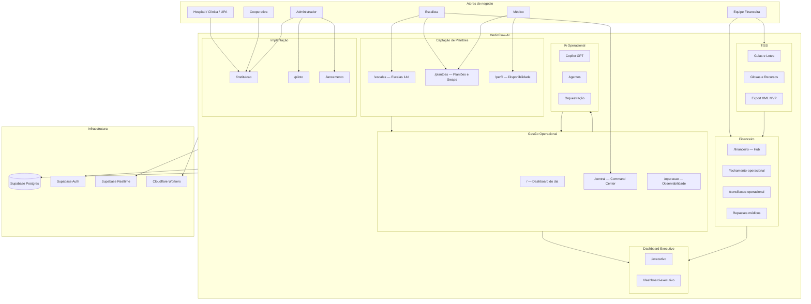
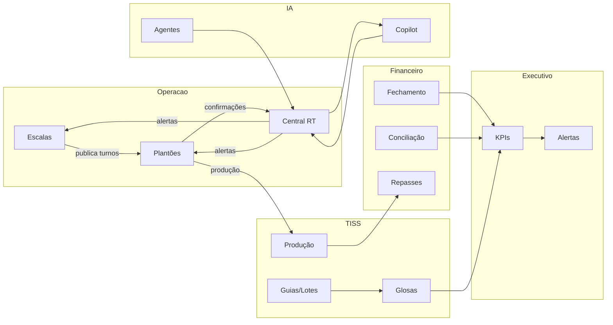

# MedicFlow-AI — Workflow Operacional e Arquitetura

**Documento:** mapeamento operacional do sistema existente  
**Data:** 11/06/2026  
**Ambiente de referência:** `https://staging.medicflow.app.br`  
**Base:** auditoria de código, rotas, serviços, hooks, tabelas e screenshots de staging

> **Escopo:** documentação exclusivamente sobre recursos **implementados**. Nenhuma alteração de código, banco ou staging foi realizada.

---

## 1. Visão executiva

O **MedicFlow-AI** é uma plataforma operacional hospitalar **multi-tenant** que unifica gestão de escalas e plantões, central operacional em tempo real, faturamento TISS (MVP), fechamento financeiro, conciliação operacional e implantação assistida — com camada opcional de IA operacional.

**Stack:** React 19 + TanStack Start/Router/Query + Supabase (Postgres, Auth, Realtime, Storage) + Cloudflare Workers.

**Posicionamento V1:** plataforma operacional + faturamento TISS MVP. **Não** é prontuário eletrônico (EHR) nem ERP hospitalar completo.

---

## 2. Mapeamento operacional (Fase 1)

### 2.1 Fluxos existentes

| Fluxo | Rotas | Status |
|-------|-------|--------|
| Autenticação multi-tenant | `/login`, `/login/esqueci-senha`, `/login/redefinir-senha` | Implementado |
| Dashboard operacional do dia | `/` | Implementado |
| Gestão de escalas (14 dias) | `/escalas` | Implementado |
| Captação e confirmação de plantões | `/plantoes` | Implementado |
| Trocas de turno (swaps) | `/plantoes?tab=swaps` | Implementado |
| Central operacional + alertas | `/central` | Implementado |
| Disponibilidade do profissional | `/perfil` | Implementado |
| Hub e fechamento financeiro | `/financeiro`, `/financeiro/fechamento-operacional` | Implementado |
| Dashboard executivo | `/financeiro/dashboard-executivo`, `/executivo` | Implementado |
| Conciliação operacional (CSV) | `/financeiro/conciliacao-operacional` | Parcial |
| Ciclo TISS completo (MVP) | `/tiss` | Parcial |
| Repasses médicos | `/tiss` (aba Repasses) | Implementado |
| Branding e parametrização | `/instituicao` | Implementado |
| Piloto e demo guiada | `/piloto` | Implementado |
| Go-live e smoke tests | `/lancamento` | Implementado |
| Observabilidade da plataforma | `/operacao` | Implementado |
| Central de ajuda | `/ajuda` | Implementado |
| Landing comercial | `/site` | Implementado |

### 2.2 Módulos existentes

```
┌─────────────────────────────────────────────────────────────────────────┐
│                        MedicFlow-AI V1 (Operacional)                     │
├──────────────┬──────────────┬──────────────┬──────────────┬─────────────┤
│ Autenticação │   Operação   │  Financeiro  │    TISS      │ Implantação │
│ Multi-tenant │ Escalas/Plant│ Fechamento   │ Faturamento  │ Piloto/Go-  │
│ RBAC (5)     │ Central + IA │ Conciliação  │ Repasses     │ live        │
├──────────────┴──────────────┴──────────────┴──────────────┴─────────────┤
│  ❌ Clínico/EHR: Pacientes · Prontuário · Consultas · Agenda             │
└─────────────────────────────────────────────────────────────────────────┘
```

| Módulo | Componentes-chave | Serviços | Tabelas principais |
|--------|-------------------|----------|-------------------|
| **Escalas & Plantões** | `operational/`, routes `/escalas`, `/plantoes` | `services/operations/` | `schedules`, `shifts`, `shift_assignments`, `shift_swap_requests`, `availability` |
| **Central operacional** | `operational/command-center` | `operational-*` queries | `operational_events`, Realtime |
| **IA operacional** | painéis em `/central` | `agents`, `orchestration`, `copilot-gpt` | 16 tabelas `operational_*` |
| **TISS / Faturamento** | `tiss/` | `services/tiss/` | 14 tabelas TISS |
| **Repasses médicos** | aba Repasses em `/tiss` | `medical-payout/` | `medical_production`, `medical_payouts`, `payout_rules` |
| **Fechamento financeiro** | `financial/` | `financial-closing/` | `financial_closings`, `financial_closing_snapshots` |
| **Conciliação** | `reconciliation/` | `reconciliation/` | `operational_reconciliation_*` |
| **Instituição** | `commercial/`, `/instituicao` | `tenant-settings/` | `tenants`, `tenant_settings` |
| **Piloto & Go-live** | `pilot/`, `release/` | `pilot-execution/`, `production-release/` | `pilot_*` |
| **Observabilidade** | `/operacao` | `operational-monitoring/` | `operational_logs`, `operational_errors` |

### 2.3 Usuários e papéis existentes

| Papel técnico (RBAC) | Equivalente de negócio | Acesso principal |
|----------------------|------------------------|------------------|
| `super_admin` | Administrador da plataforma | Acesso total, seed demo, reabertura de competência |
| `tenant_admin` | Administrador da instituição | Branding, piloto, go-live, parametrização |
| `coordinator` | **Escalista** / coordenador de escala | Escalas, plantões, swaps, TISS escrita |
| `professional` | **Médico** / profissional de plantão | Plantões próprios, disponibilidade, TISS leitura |
| `financial` | Equipe financeira | TISS, repasses, fechamento, conciliação |

**Entidades de negócio (não são papéis de usuário):**

| Entidade | Representação no sistema |
|----------|--------------------------|
| **Hospital** | Tenant com `UnitType: hospital` (ex.: `hospital-saojose`) |
| **Cooperativa** | Tenant tipo cooperativa (ex.: `cooperativa-med`) |

**Tipos de unidade:** `hospital`, `clinic`, `upa`, `operational` — tabela `units`.

### 2.4 Regras de negócio existentes

| Domínio | Regra | Evidência |
|---------|-------|-----------|
| **Multi-tenant** | Isolamento por `tenant_id` com RLS Postgres | Migrations + `profiles` |
| **Escalas** | Calendário de 14 dias; turnos vinculados a `schedules` e `departments` | `/escalas`, tabela `shifts` |
| **Plantões** | Status: `open`, `confirmed`, `cancelled`, etc. | Enum `shift_status` |
| **Atribuições** | Um profissional `confirmed` por plantão (índice parcial único) | `shift_assignments` |
| **Confirmação** | Profissional aceita/recusa via `/plantoes`; status `pending` → `confirmed`/`rejected` | `assignment_status` enum |
| **Swaps** | Troca entre profissionais requer aprovação; status `pending` → `approved`/`denied` | `shift_swap_requests` |
| **Disponibilidade** | Switch no perfil cria/remove janelas; usado na central para riscos de cobertura | `availability` |
| **RBAC** | 30+ capabilities; menu filtrado por `navForRole()` | `src/lib/auth/rbac.ts` |
| **TISS** | Ciclo guia → lote → export XML → glosas manuais | `/tiss` |
| **Fechamento** | Competência mensal com snapshot e trava; reabertura só admin | `financial_closings` |
| **Repasses** | Produção médica + regras de repasse → pagamentos | `medical_payouts` |
| **Auditoria** | Eventos operacionais, logs de login, auditoria de fechamento/TISS | `operational_events`, `security_audit_logs` |
| **Realtime** | Atualização live de shifts, assignments e swaps | Supabase Realtime |

**Limitações documentadas (não implementadas):**

- Auto-cadastro de usuários
- Notificações push/e-mail para plantões
- Envio automático TISS a operadoras
- Cadastro UI de profissionais
- Módulo clínico (pacientes, prontuário)

### 2.5 Inventário técnico resumido

| Camada | Quantidade | Localização |
|--------|------------|-------------|
| Rotas | 20 | `src/routes/` |
| Server Functions | ~173 | `src/lib/*/api/` |
| Hooks de negócio | 28 | `src/hooks/` |
| Serviços | ~100 | `src/lib/services/` |
| Tabelas DB | ~59–63 | `supabase/migrations/` |
| Screenshots staging | 12 | `docs/screenshots/` |

### 2.6 Screenshots de staging

| Arquivo | Tela |
|---------|------|
| `screenshots/01-login.png` | Login multi-tenant |
| `screenshots/02-dashboard.png` | Dashboard operacional |
| `screenshots/03-agenda-escalas.png` | Calendário de escalas |
| `screenshots/04-plantoes.png` | Plantões e confirmações |
| `screenshots/05-financeiro.png` | Hub financeiro |
| `screenshots/06-relatorios-dashboard-executivo.png` | Dashboard executivo |
| `screenshots/07-configuracoes-instituicao.png` | Instituição e branding |
| `screenshots/08-administracao-piloto.png` | Piloto e demo guiada |
| `screenshots/09-tiss.png` | Módulo TISS |
| `screenshots/10-perfil.png` | Perfil e disponibilidade |
| `screenshots/11-central-operacional.png` | Central operacional |
| `screenshots/12-ajuda.png` | Central de ajuda |

---

## 3. Arquitetura operacional (Fase 5)

### 3.1 Diagrama executivo

```
                              ┌─────────────────────┐
                              │      HOSPITAL       │
                              │  (Tenant multi-     │
                              │   tenant: hospital, │
                              │   clínica, UPA ou   │
                              │   cooperativa)      │
                              └──────────┬──────────┘
                                         │
                                         ▼
┌────────────────────────────────────────────────────────────────────────────┐
│                            MedicFlow-AI                                      │
│                     staging.medicflow.app.br                                 │
├────────────────────────────────────────────────────────────────────────────┤
│                                                                              │
│  ┌─────────────────────┐    ┌─────────────────────┐    ┌───────────────┐  │
│  │ Captação de Plantões│    │ Gestão Operacional  │    │  Financeiro   │  │
│  │ /escalas /plantoes  │◄──►│ /central /operacao  │◄──►│ /financeiro   │  │
│  │ swaps, availability │    │ Realtime + alertas  │    │ fechamento    │  │
│  └──────────┬──────────┘    └──────────┬──────────┘    │ conciliação   │  │
│             │                            │               └───────┬───────┘  │
│             │                            │                       │          │
│             ▼                            ▼                       ▼          │
│  ┌─────────────────────┐    ┌─────────────────────┐    ┌───────────────┐  │
│  │        TISS         │    │ Dashboard Executivo │    │ IA Operacional│  │
│  │ /tiss (10 abas)     │───►│ /executivo          │    │ Copilot GPT   │  │
│  │ guias, lotes, glosas│    │ /dashboard-executivo│    │ Agentes       │  │
│  │ repasses médicos    │    │ KPIs reais          │    │ Orquestração  │  │
│  └─────────────────────┘    └─────────────────────┘    └───────────────┘  │
│                                                                              │
│  ┌─────────────────────────────────────────────────────────────────────┐  │
│  │ Implantação: /instituicao · /piloto · /lancamento · /ajuda            │  │
│  └─────────────────────────────────────────────────────────────────────┘  │
└────────────────────────────────────────────────────────────────────────────┘
                                         │
                                         ▼
                              ┌─────────────────────┐
                              │     Supabase        │
                              │ Postgres + Auth +   │
                              │ Realtime + Storage  │
                              └─────────────────────┘
```

### 3.2 Diagrama Mermaid — arquitetura operacional



### 3.3 Relacionamento entre módulos



| Origem | Destino | Relacionamento |
|--------|---------|----------------|
| Escalas | Plantões | Turnos publicados geram vagas abertas |
| Plantões | Central | Confirmações e swaps alimentam alertas RT |
| Plantões | Produção TISS | Execução registrada em `medical_production` |
| TISS | Repasses | Produção gera base de cálculo de repasse |
| Fechamento | Dashboard Executivo | Snapshots consolidam KPIs por competência |
| Conciliação | Fechamento | Divergências impactam fechamento da competência |
| IA Operacional | Central | Propostas e orquestração supervisionada |
| Instituição | Todos | Branding e parametrização por tenant |

---

## 4. Referências cruzadas

| Documento | Conteúdo |
|-----------|----------|
| [MEDICFLOW_WORKFLOW_CAPTACAO_PLANTOES.md](./MEDICFLOW_WORKFLOW_CAPTACAO_PLANTOES.md) | Fluxo completo de captação de plantões |
| [MEDICFLOW_WORKFLOW_HUB_ADMINISTRATIVO.md](./MEDICFLOW_WORKFLOW_HUB_ADMINISTRATIVO.md) | Hub administrativo médico |
| [MEDICFLOW_JORNADA_USUARIOS.md](./MEDICFLOW_JORNADA_USUARIOS.md) | Jornadas por persona |
| [MEDICFLOW_PROPOSTA_DE_VALOR.md](./MEDICFLOW_PROPOSTA_DE_VALOR.md) | Proposta comercial |
| [MEDICFLOW_APRESENTACAO_EXECUTIVA.md](./MEDICFLOW_APRESENTACAO_EXECUTIVA.md) | Material consolidado para apresentações |

---

*Documento gerado com base na auditoria funcional do sistema MedicFlow-AI V1. Sem alterações de código, banco ou staging.*
