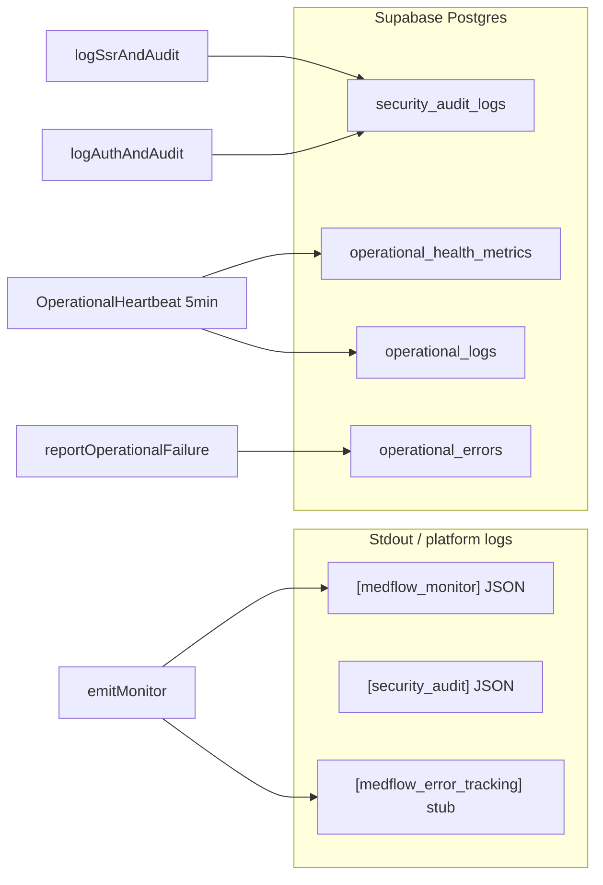

# Relatório Observability — MedFlow-IA

**Data:** 25/05/2026  
**Escopo:** healthchecks HTTP, monitoramento de erros, logs operacionais, validações estáticas e readiness cloud  
**Projeto:** `MedFlow-IA/` (TanStack Start · Cloudflare Workers · Supabase)

---

## Resumo executivo

| Indicador | Status | Nota |
|-----------|--------|------|
| **Healthchecks (código + wiring)** | ✅ | `/health`, `/health/db`, `/health/auth` implementados e roteados em `server.ts` |
| **Healthchecks HTTP (runtime)** | ⚠️ | Não executado — sem `SMOKE_BASE_URL` / deploy ativo nesta sessão |
| **Monitoramento de erros (estático)** | ✅ | `monitoring-validate` — 65+ checks + harness emit |
| **Error handling (estático + comportamento)** | ✅ | `error-handling-validate` — 40 testes comportamentais |
| **Smoke estrutural** | ✅ | `smoke-check` — env + serviços TISS/reconciliation |
| **Logs ativos** | ✅ | Console `[medflow_monitor]`, audit `security_audit_logs`, tabelas `operational_*` |
| **APM externo (Sentry/Datadog/Prometheus)** | ❌ | Não integrado — DSN existe como stub |
| **Readiness cloud (staging)** | ⚠️ | Artefatos OK; `.env.staging` com placeholders |
| **CI observability gates** | ⚠️ | `smoke-check` estrutural apenas; sem `monitoring-validate` nem health HTTP |

**Veredito:** a stack de observabilidade está **implementada em três camadas** (infra pública, erros/segurança, operacional por tenant). O bloqueio para go-live com probes reais é **operacional** (credenciais Supabase staging, smoke HTTP pós-deploy), não ausência de instrumentação no código.

---

## 1. Status dos healthchecks

### 1.1 Endpoints HTTP públicos (infra)

| Endpoint | Escopo | HTTP quando OK | HTTP quando falha |
|----------|--------|----------------|---------------------|
| `/health` | Config + Postgres + GoTrue | `200` | `503` |
| `/health/db` | Config + Postgres | `200` | `503` |
| `/health/auth` | Config + GoTrue | `200` | `503` |

**Agregação de status:** `ok` → `degraded` → `error` (qualquer check `error` derruba o agregado para `error`).

**Implementação:** `src/lib/server/health-checks.ts`  
**Roteamento:** `src/server.ts` (intercepta antes de SSR/rate-limit)  
**Cache:** `nitro.config.ts` — `Cache-Control: no-store` em `/health/**`

#### Checks individuais

| Check | O que valida | Timeout / detalhe |
|-------|--------------|-------------------|
| **config** | `VITE_SUPABASE_URL` + `VITE_SUPABASE_ANON_KEY` | Degraded se ausentes |
| **database** | PostgREST — `profiles` (service role) ou `tenant_settings` (anon) | Latência reportada em ms |
| **auth** | `GET {supabase}/auth/v1/health` com anon key | Abort 8s |

#### Probe HTTP nesta sessão

```
Status: NÃO EXECUTADO
Motivo: SMOKE_BASE_URL não definido; servidor local não iniciado.
```

**Comando pós-deploy:**

```bash
npm run smoke-check -- --url=https://staging.medicflow.app.br
# ou
SMOKE_BASE_URL=https://staging.medicflow.app.br npm run smoke-check
```

Esperado: HTTP `200` e `body.status === "ok"` em `/health`, `/health/db`, `/health/auth`.

### 1.2 Health operacional (autenticado, in-app)

| Componente | Local | Requisito |
|------------|-------|-----------|
| `runOperationalHealthChecks` | `operational-health-service.ts` | RBAC `tenant_settings:read` |
| Painel | `/operacao` | Sessão + tenant |
| Checks | session, `tenant_settings`, latência Supabase | Latência &lt; 5000 ms |

### 1.3 Startup readiness (console, não HTTP)

| Componente | Output | Produção client |
|------------|--------|-----------------|
| `logStartupDiagnostics` | `[MedFlow] readiness (server\|client, …)` | Suprimido em `PROD` + scope client |
| `startup-checks.ts` | Avisos env Supabase, domínio staging | — |

### 1.4 Ausências relevantes

| Item | Status |
|------|--------|
| Endpoint `/ready` | ❌ Não existe |
| Probes Docker/K8s | ❌ Sem manifests |
| Health HTTP no CI | ❌ `smoke-check` sem URL |

---

## 2. Falhas encontradas

### 2.1 Validações executadas (25/05/2026)

| Script | Resultado | Detalhe |
|--------|-----------|---------|
| `npm run smoke-check` | ✅ PASS | Estrutura + env base; sem HTTP |
| `npm run monitoring-validate` | ✅ PASS | Estático + emit 4 canais |
| `npm run error-handling-validate` | ✅ PASS | 24 estáticos + 40 comportamentais |
| `npm run staging-validate:fast` | ❌ FAIL | Placeholders em `.env.staging` |

### 2.2 Falhas de staging / cloud (bloqueadores operacionais)

| Falha | Severidade | Impacto |
|-------|------------|---------|
| `VITE_SUPABASE_URL` placeholder em `.env.staging` | Alta | Health HTTP e auth remoto não validáveis |
| `VITE_SUPABASE_ANON_KEY` placeholder em `.env.staging` | Alta | Mesmo |
| Smoke HTTP não executado | Média | Probes `/health*` sem evidência runtime |
| `monitoring-validate` fora do CI | Baixa | Regressão de wiring só detectada manualmente |

### 2.3 Falhas documentadas (outros relatórios)

| Fonte | Achado | Severidade |
|-------|--------|------------|
| `BUILD-HEALTH-REPORT.md` | 78 erros TypeScript (`tsc --noEmit`) | Média — não bloqueia Vite build |
| `BUILD-HEALTH-REPORT.md` | 11 erros ESLint (prettier) | Baixa |
| `SECURITY-READINESS-REPORT.md` | Auth remoto Supabase indisponível (placeholders) | Alta (go-live) |
| `SECURITY-READINESS-REPORT.md` | `security-logs-validate` — 1 falso negativo estático | Baixa |
| `SECURITY-READINESS-REPORT.md` | npm audit — 4 moderadas (`ws` via wrangler) | Baixa em prod |

### 2.4 Falhas potenciais em runtime (sem evidência nesta sessão)

Sem servidor/deploy ativo, estes cenários **não foram reproduzidos**, mas o código os classifica:

- Config Supabase ausente → health `degraded` / `503`
- GoTrue inacessível → check `auth` = `error`
- Postgres/RLS sem service role → probe anon pode falhar em `tenant_settings`
- `operational_health_metrics` insert falha → log `[operational_health_metrics]` no console

---

## 3. Logs ativos

### 3.1 Mapa de destinos



### 3.2 Monitor de erros — console estruturado

| Atributo | Valor |
|----------|-------|
| **Prefixo** | `[medflow_monitor]` |
| **Formato** | JSON por linha |
| **Sink** | `src/lib/monitoring/sinks/console.ts` |
| **Níveis** | `debug`, `info`, `warn`, `error` |
| **Produção default** | `warn` + `error` apenas |
| **Debug completo** | `VITE_MEDFLOW_DEBUG=1` ou `import.meta.env.DEV` |

### 3.3 Auditoria de segurança

| Atributo | Valor |
|----------|-------|
| **Tabela** | `security_audit_logs` |
| **Writer** | `security-audit-writer.ts` |
| **Fallback** | `console.info("[security_audit]", …)` |
| **Eventos SSR** | `ssr_catastrophic`, `ssr_middleware_error`, `ssr_worker_uncaught` |
| **Eventos auth** | `get_user_failed`, `login_page_rate_limited` |

### 3.4 Logs operacionais (produto / tenant)

| Tabela | Níveis / tipos | RLS |
|--------|----------------|-----|
| `operational_logs` | `info`, `warning`, `error` | Por `tenant_id` |
| `operational_errors` | `operational`, `critical` | Por `tenant_id` |
| `operational_health_metrics` | heartbeat, latência | Por `tenant_id` |

**Migration:** `supabase/migrations/20250515130000_operational_observability_v1.sql`

**Heartbeat:** `OperationalHeartbeat` — intervalo 5 min (`OPERATIONAL_HEARTBEAT_INTERVAL_MS`), ativo com sessão em `__root.tsx`.

**Reporting client:** `report-operational-failure-client.ts` → usado em fechamento financeiro, reconciliação, instituição.

### 3.5 Error tracking externo (stub)

| Variável | Efeito atual |
|----------|--------------|
| `MEDFLOW_ERROR_TRACKING_DSN` | `console.warn("[medflow_error_tracking]", …)` |
| `VITE_MEDFLOW_ERROR_TRACKING_DSN` | Idem no client |

> Não há SDK Sentry/Datadog — substituir corpo em `sinks/error-tracker.ts` conforme `docs/MONITORING.md`.

### 3.6 O que não está ativo

| Item | Status |
|------|--------|
| Winston / Pino | ❌ |
| Arquivo de log em disco | ❌ |
| OpenTelemetry | ❌ (documentado como extensão) |
| Agregador central (ELK, Loki) | ❌ — depende da plataforma (CF/Vercel logs) |

---

## 4. Monitoramentos ativos

### 4.1 Pilares de monitoramento de erros

Manifesto: `src/lib/monitoring/registry.ts` (`MONITORING_REGISTRY`)

| Pilar | Canal | API | Eventos principais | Persistência |
|-------|-------|-----|-------------------|--------------|
| **Runtime** | `runtime` | `logRuntime` | `uncaught_exception` | Console |
| **SSR** | `ssr` | `logSsrAndAudit` | `ssr_catastrophic`, `ssr_middleware_error`, `ssr_worker_uncaught` | Console + audit |
| **Auth** | `auth` | `logAuthAndAudit` | `get_user_failed`, `login_page_rate_limited` | Console + audit |
| **Client / tracking** | `client` | `emitMonitor` | `window_error`, `unhandled_rejection`, `react_error_boundary`, `route_error_component` | Console + DSN stub |

**Bootstrap:**

| Camada | Arquivo |
|--------|---------|
| Worker global | `error-capture.ts` → import em `server.ts` |
| SSR middleware | `start.ts` |
| Client | `__root.tsx` → `initClientErrorMonitoring()` |
| UI errors | `GlobalErrorBoundary`, route `errorComponent` |

**Validação:** `npm run monitoring-validate` — ✅ **PASS** (25/05/2026)

### 4.2 Observabilidade operacional (produto)

| Recurso | Descrição |
|---------|-----------|
| `/operacao` | Painel operacional — bundle de monitoramento |
| `operational-observability-server.ts` | API server — métricas, logs, erros, health |
| Command center / scoring | Métricas de negócio (não infra) |
| Realtime manager | “Health pills” de status UI |

### 4.3 Plataforma cloud

| Provedor | Observabilidade nativa | Config |
|----------|------------------------|--------|
| **Cloudflare Workers** | Logs + métricas CF | `wrangler.jsonc` → `"observability": { "enabled": true }` |
| **Vercel** (alternativo) | Function logs | `vercel.json` região `gru1`; headers via `nitro.config.ts` |

### 4.4 Não integrado

| Ferramenta | Status |
|------------|--------|
| Prometheus / Grafana | ❌ |
| Sentry (SDK) | ❌ (env + stub apenas) |
| Datadog | ❌ |
| APM | ❌ |
| PagerDuty / alertas infra | ❌ |

### 4.5 Scripts de validação (manuais, fora do CI)

| npm script | Propósito | No CI? |
|------------|-----------|--------|
| `monitoring-validate` | Wiring + emit harness | ❌ |
| `error-handling-validate` | Boundaries + classify | ❌ |
| `security-logs-validate` | Audit touchpoints | ❌ |
| `security-headers-validate` | Headers + health anon | ❌ |

---

## 5. Readiness cloud

### 5.1 Targets de deploy

| Target | Entry | Health exposto | Observabilidade |
|--------|-------|----------------|-----------------|
| **Cloudflare Workers** (primário) | `src/server.ts` | `/health*` no Worker | CF observability enabled |
| **Vercel** (alternativo) | Nitro preset `vercel` | Mesmos paths via SSR | Logs de function |
| **Staging** | `build:staging` + `wrangler deploy` | `https://staging.medicflow.app.br` | Smoke documentado |

### 5.2 Resultado `staging-validate:fast` (25/05/2026)

| Área | Status |
|------|--------|
| `.env.staging` credenciais reais | ❌ Placeholders |
| Artefatos `dist/client` + `dist/server` | ✅ |
| Domínio staging no bundle | ✅ |
| `ssr-validate` | ✅ (32 APIs browser para revisão manual) |
| Build staging nesta execução | ⏭️ Ignorado (`--skip-build`) |

### 5.3 Readiness por checklist (produto)

| Serviço | Escopo |
|---------|--------|
| `deployment-readiness-service` | Env Supabase, health DB/latência, contato, URL canônica |
| `release-readiness-service` | Checklist de release |
| `backup-readiness-service` | Backup operacional |
| `readiness-check-service` | Itens genéricos de prontidão |

Estes são **checklists de go-live**, não probes Kubernetes.

### 5.4 CI/CD vs observability

**Workflow:** `.github/workflows/ci.yml`

| Step | Cobre observability? |
|------|---------------------|
| `npm run lint` | Parcial (inclui `health-checks.ts`) |
| `npm run env-check:prod` | Env placeholders CI |
| `npm run release-check` | Artefatos + SQL |
| `npm run smoke-check` | Estrutura apenas — **sem HTTP health** |
| `npm run build` | Build SSR |

**Gap recomendado:** adicionar `monitoring-validate` ao CI; smoke HTTP opcional com secret `SMOKE_BASE_URL` em workflow pós-deploy.

### 5.5 Variáveis de ambiente (observability)

| Variável | Efeito |
|----------|--------|
| `VITE_SUPABASE_URL` / `VITE_SUPABASE_ANON_KEY` | Health config + probes |
| `SUPABASE_SERVICE_ROLE_KEY` | Probe DB mais forte + audit persist |
| `VITE_MEDFLOW_DEBUG=1` | Mais níveis em `[medflow_monitor]` |
| `MEDFLOW_ERROR_TRACKING_DSN` | Sink error-tracker (stub) |
| `VITE_MEDFLOW_ERROR_TRACKING_DSN` | Idem client |
| `SMOKE_BASE_URL` | Health HTTP no `smoke-check` |
| `VITE_MEDFLOW_APP_URL` | URL canônica + readiness |

### 5.6 Matriz readiness cloud

| Critério | Staging | Produção |
|----------|---------|----------|
| Código health `/health*` | ✅ | ✅ |
| Worker observability CF | ✅ | ✅ (após deploy) |
| Credenciais Supabase reais | ❌ | ⚠️ Validar no painel |
| Smoke HTTP pós-deploy | ❌ Pendente | ❌ Pendente |
| Error tracking vendor | ❌ Stub | ❌ Stub |
| Probes K8s `/ready` | N/A | N/A |
| CI monitoring-validate | ❌ | ❌ |

**Readiness cloud estimado:** **~65%** — infra de código pronta; validação runtime e secrets pendentes.

---

## 6. Arquitetura consolidada

```
┌─────────────────────────────────────────────────────────────────┐
│                     CAMADA PÚBLICA (INFRA)                       │
│  GET /health  /health/db  /health/auth  → 200/503 JSON          │
│  Probes: Supabase config · PostgREST · GoTrue /auth/v1/health   │
└─────────────────────────────────────────────────────────────────┘
                              │
┌─────────────────────────────────────────────────────────────────┐
│              CAMADA ERROS + SEGURANÇA (MONITORING)               │
│  error-capture · emitMonitor · [medflow_monitor] · audit logs   │
│  Canais: runtime · ssr · auth · client                          │
└─────────────────────────────────────────────────────────────────┘
                              │
┌─────────────────────────────────────────────────────────────────┐
│           CAMADA OPERACIONAL (TENANT / PRODUTO)                  │
│  /operacao · heartbeat 5min · operational_logs/errors/metrics     │
└─────────────────────────────────────────────────────────────────┘
                              │
┌─────────────────────────────────────────────────────────────────┐
│                    PLATAFORMA CLOUD                              │
│  Cloudflare observability:true · Vercel logs (alt)               │
└─────────────────────────────────────────────────────────────────┘
```

---

## 7. Ações recomendadas (prioridade)

| # | Ação | Prioridade |
|---|------|------------|
| 1 | Preencher `.env.staging` com credenciais Supabase reais | Alta |
| 2 | `npm run smoke-check -- --url=https://staging.medicflow.app.br` após deploy | Alta |
| 3 | Adicionar `monitoring-validate` ao job CI | Média |
| 4 | Implementar Sentry (ou similar) em `sinks/error-tracker.ts` | Média |
| 5 | Considerar `GET /ready` leve (sem DB) para orquestradores | Baixa |
| 6 | Corrigir 78 erros TS e placeholders antes de go-live prod | Média |

---

## 8. Referências

| Documento / arquivo | Conteúdo |
|-------------------|----------|
| `docs/MONITORING.md` | Pilares, wiring, extensão Sentry/OTel |
| `docs/SECURITY-READINESS-REPORT.md` | Segurança staging 72% |
| `docs/BUILD-HEALTH-REPORT.md` | Build, TS, lint |
| `src/lib/server/health-checks.ts` | Implementação health HTTP |
| `src/lib/monitoring/registry.ts` | Manifesto touchpoints |
| `wrangler.jsonc` | Observability Cloudflare |
| `scripts/smoke-check.mjs` | Smoke estrutural + HTTP opcional |

---

*Relatório gerado por validação estática do repositório e execução local de `smoke-check`, `monitoring-validate`, `error-handling-validate` e `staging-validate:fast`.*
