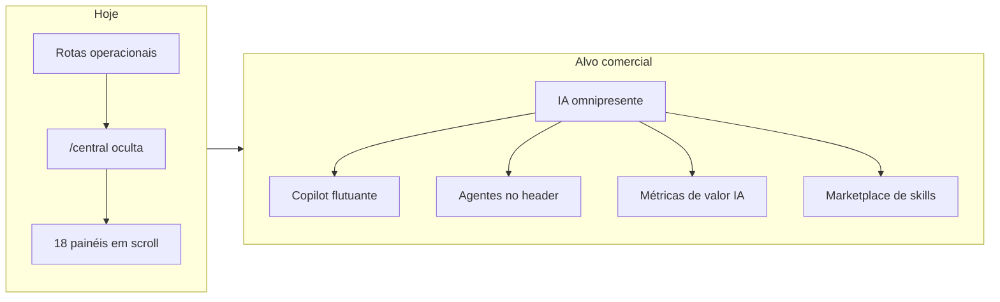

# Plano Comercial da IA — MedicFlow-AI

**Data:** 11 de junho de 2026  
**Objetivo:** Transformar a camada de IA em diferencial comercial claramente perceptível  
**Base:** [AUDITORIA_UX_IA_MEDICFLOW.md](./AUDITORIA_UX_IA_MEDICFLOW.md)  
**Restrição:** Plano de UX, narrativa e go-to-market — sem implementação neste documento

---

## 1. Diagnóstico comercial

### Situação atual

| Dimensão | Estado | Nota |
|----------|--------|:----:|
| Capacidade técnica de IA | 18 módulos; 1 LLM real; 17 heurísticos supervisionados | Forte |
| Percepção do cliente | IA concentrada em rota oculta; demos padrão omitem Copilot | Fraca |
| Prontidão para venda | Excelente em demo de 40 min com coordinator + OpenAI | Condicional |
| Risco de over-promise | Matching automático, IA clínica, IA financeira **não existem** | Controlável com narrativa |

### Gap central

> **O MedicFlow-AI é comercializado como plataforma inteligente, mas é experienciado como plataforma operacional com um painel avançado escondido.**

Evidência:
- Produto: `MedicFlow-AI` (`branding.ts`)
- Menu: nenhum item “IA” (`app-shell.tsx`)
- Demo 10 min: IA em “O que cortar” (`MEDICFLOW_DEMO_COMERCIAL.md`)

---

## 2. Posicionamento recomendado

### Proposta de valor (elevator — 30 segundos)

> “O MedicFlow-AI coloca uma **central de inteligência operacional** na gestão de plantões: a IA mede riscos de cobertura em tempo real, sugere ações, responde em português no Copiloto GPT e coordena agentes especializados — **sempre com o escalista no controle**, sem automação clínica e sem confirmar plantões sozinha.”

### Pilares comerciais (verificáveis na demo)

| Pilar | Prova na tela | Frase de venda |
|-------|---------------|----------------|
| **Antecipação** | Scoring + forecast + alertas | “A IA avisa antes do plantão ficar descoberto” |
| **Ação assistida** | Recomendações + propostas | “A IA sugere; o escalista decide” |
| **Conversa** | Copilot GPT + narrativa executiva | “Pergunte em português o que está em risco” |
| **Governança** | Agentes + sandbox + human-in-the-loop | “Nenhuma ação crítica sem aprovação humana” |
| **Explicabilidade** | Fingerprints, tool trace, referências | “Toda resposta é auditável — não é caixa preta” |

### O que NÃO prometer

| Promessa proibida | Alternativa honesta |
|-------------------|---------------------|
| “IA atribui plantões automaticamente” | “IA recomenda staffing; humano confirma” |
| “Matching inteligente médico-turno” | “Recomendações de pessoal; matching em roadmap” |
| “IA clínica / prontuário” | “IA operacional apenas — escalas e cobertura” |
| “Machine learning preditivo” | “Projeção heurística explicável + Copilot GPT” |
| “Funciona sem internet / sem OpenAI” | “17 módulos funcionam offline da OpenAI; Copilot é add-on” |

---

## 3. Personas e narrativa de IA

### Hospital (150–350 leitos)

| Dor | Recurso IA | Mensagem |
|-----|------------|----------|
| Plantão descoberto em UTI/PS | Scoring + alertas + recomendações | “Reduz risco assistencial antes do incidente” |
| Escalista sobrecarregado | Copilot GPT | “Um copiloto que lê toda a operação em segundos” |
| Diretoria sem visão operacional | Narrativa executiva | “Resumo para reunião de gestão em 1 clique” |
| Compliance / auditoria | Propostas supervisionadas + trilha | “IA nunca executa sem registro auditável” |

**Demo focus:** scoring crítico → recomendação urgente → pergunta ao Copilot sobre fim de semana.

### Cooperativa de médicos

| Dor | Recurso IA | Mensagem |
|-----|------------|----------|
| Pool multi-hospital | Analytics + agente de cobertura | “Visão consolidada de cobertura do pool” |
| SLA com hospitais | Alertas + forecast | “Antecipa ruptura antes de penalidade contratual” |
| Escala de coordenadores | Agentes + orquestração | “Especialistas virtuais por domínio — sem contratar analistas” |

**Demo focus:** alertas de cobertura → agente de cobertura → recomendação de staffing.

### Escalista (coordinator)

| Dor | Recurso IA | Mensagem |
|-----|------------|----------|
| “Onde está o fogo agora?” | Priorização + scoring | “A IA ordena o que merece atenção primeiro” |
| Decisão sob pressão | Copilot + contexto | “Pergunte; não precisa montar planilha mental” |
| Medo de automação | Human-in-the-loop | “Você aprova tudo — a IA só amplifica” |

**Demo focus:** perfil coordinator obrigatório; mostrar painéis completos.

### Administrador (tenant_admin)

| Dor | Recurso IA | Mensagem |
|-----|------------|----------|
| Governança institucional | Policy intelligence + planejamento | “IA sugere ajustes de política operacional” |
| ROI da plataforma | Memória + feedback | “A IA aprende o que funcionou no seu tenant” |
| Venda interna para diretoria | Narrativa executiva | “Traduza operação para linguagem de board” |

**Demo focus:** policy intelligence (overview) + narrativa executiva + KPIs no executivo.

### Médico (professional) — expectativa gerenciada

| O que vê hoje | O que vender |
|---------------|--------------|
| Alertas na central (se acessar) | “Você recebe alertas proativos de cobertura” |
| Sem Copilot / agentes | “IA trabalha para o escalista; você foca no plantão” |
| Plantões sem IA | Roadmap: badge de risco em plantões abertos |

**Não vender IA generativa para médicos na V1** — evita frustração por RBAC.

---

## 4. Pacotes comerciais sugeridos

| Pacote | Módulos IA incluídos | Posicionamento |
|--------|---------------------|----------------|
| **Operacional** | Scoring, alertas, recomendações (sem Copilot GPT) | “Inteligência heurística incluída” |
| **Operacional + IA** | Stack completa + Copilot GPT | “Copiloto GPT + agentes — add-on OpenAI” |
| **Enterprise** | Tudo + SLA Copilot + onboarding IA dedicado | “Central de IA como produto principal” |

**Transparência:** Copilot GPT requer `MEDFLOW_OPENAI_API_KEY` — custo OpenAI pode ser do cliente ou embutido no pacote +IA.

---

## 5. Roteiros de venda por duração

### 5 minutos — “Existe IA aqui?”

| Tempo | Ação |
|------:|------|
| 0:30 | Nome MedicFlow-AI + tagline |
| 2:00 | `/central` — scoring + 1 alerta crítico |
| 2:00 | Copilot — 1 pergunta pré-escrita |
| 0:30 | “Quer ver agentes e governança? Demo de 10 min” |

**Meta:** Cliente sai sabendo que **há IA real**, não só branding.

### 10 minutos — demo IA dedicada

Roteiro completo: [DEMO_IA_10_MINUTOS.md](./DEMO_IA_10_MINUTOS.md)

**Meta:** Valor da IA compreendido sem demo de 40 min.

### 20 minutos — operação + IA

| Bloco | Tempo | Conteúdo |
|-------|------:|----------|
| Captação | 5 min | `/plantoes` — humano no loop |
| Central IA | 8 min | Scoring → recomendações → Copilot → agente |
| Executivo | 5 min | KPIs + link central |
| CTA | 2 min | Piloto 30 dias |

### 40 minutos — ciclo completo (documentado)

Manter etapa 10 atual (`MEDICFLOW_DEMO_COMERCIAL.md`) — **não remover IA**.

**Melhoria:** renomear etapa 5 de “Central RT” para “Central de IA — monitoramento” e etapa 10 para “Copiloto e agentes”.

---

## 6. Checklist pré-venda e pré-demo

### D-1 (comercial + TI)

- [ ] `MEDFLOW_OPENAI_API_KEY` configurada no ambiente de demo
- [ ] Tenant com cenário vivo: ≥1 alerta de cobertura, scoring ≠ Saudável
- [ ] Credencial `coordinator` testada
- [ ] Navegador em 1920×1080; segunda tela
- [ ] Roteiro [DEMO_IA_10_MINUTOS.md](./DEMO_IA_10_MINUTOS.md) ensaiado
- [ ] Plano B: módulos heurísticos se OpenAI falhar

### Durante a demo

- [ ] Navegar para `/central` via link explícito (“Central de IA”) — **não depender do menu**
- [ ] Rolar até Copilot ou usar ancora `#ops-anchor-copilot-gpt`
- [ ] Usar pergunta sugerida: “Qual o maior risco operacional atual?”
- [ ] Mostrar badge “Sugerida (IA)” em proposta (se houver)
- [ ] Reforçar 3x: read-only, human-in-the-loop, não é clínica

### Pós-demo

- [ ] Enviar one-pager com 5 diferenciais IA (seção 2 deste doc)
- [ ] Propor piloto com KPI: “alertas críticos resolvidos em < X horas”
- [ ] Workshop técnico se TI perguntar sobre OpenAI, RLS, audit trail

---

## 7. Objeções e respostas

| Objeção | Resposta |
|---------|----------|
| “Não vi IA no sistema” | “A central de IA fica em `/central` — hoje o acesso é por link; no piloto priorizamos item no menu” |
| “É só ChatGPT?” | “O Copilot é uma camada. Abaixo há scoring, agentes, recomendações e orquestração com dados reais do tenant via 9 tools server-side” |
| “A IA confirma plantões?” | “Não. Política `no_autonomous_execution` em todos os agentes. Proposta → aprovação → sandbox → execução” |
| “E se a OpenAI cair?” | “17 módulos seguem funcionando. Copilot é add-on; operação não para” |
| “Médicos usam IA?” | “Na V1, médicos se beneficiam de alertas. Copilot é para escalistas e gestores” |
| “É machine learning?” | “Projeção heurística explicável hoje; Copilot GPT para linguagem natural. ML preditivo é roadmap” |

---

## 8. KPIs comerciais da IA

### Para piloto (30 dias)

| KPI | Como medir | Meta sugerida |
|-----|------------|---------------|
| Acessos à `/central` por semana | Analytics de rota | ≥5 por escalista |
| Perguntas ao Copilot | Logs server-side | ≥10 no piloto |
| Alertas críticos resolvidos < 4h | Timeline operacional | ≥80% |
| Recomendações com feedback | Painel de efetividade | ≥50% com resposta |
| NPS escalista sobre “utilidade da IA” | Pesquisa pós-piloto | ≥8/10 |

### Para contrato

| KPI | Narrativa de valor |
|-----|-------------------|
| Redução de plantões descobertos | “IA antecipou X rupturas” |
| Tempo médio de resposta a alertas | “De reativo a proativo” |
| Uso de narrativa executiva | “Diretoria consome IA sem treinamento” |

---

## 9. Roadmap comercial de UX (sem código — priorização)

### Sprint 1 — Quick wins (impacto imediato em vendas)

1. Item “Central de IA” no menu lateral
2. Roteiro 10 min com IA publicado e treinado no time comercial
3. Renomeação de rótulos críticos (scoring → índice de risco)
4. Passo IA explícito no demo guiado `/piloto`

### Sprint 2 — Ativação

1. Card na Home com resumo de risco IA
2. Abas ou reordenação na central
3. Artigos na Ajuda
4. Bloco “Resumo IA” no executivo

### Sprint 3 — Diferenciação

1. Landing com módulo IA
2. Sinais de IA em Plantões/Escalas
3. Pacote comercial “+IA” com pricing explícito
4. Métricas de valor (“riscos evitados”) no dashboard

---

## 10. Evolução: plataforma de IA de nova geração

### O que falta para parecer mais inteligente?

| Gap | Solução UX | Impacto |
|-----|------------|---------|
| IA reativa (usuário precisa abrir central) | Notificações + badges em fluxos diários | Proatividade percebida |
| Respostas só em texto | Gráficos e cards inline no Copilot | Wow factor |
| Jargão técnico | Camada de linguagem de negócio sobre rótulos | Clareza |
| Scroll infinito | Hub com abas e busca | Descoberta |

### O que falta para valor imediato?

| Gap | Solução |
|-----|---------|
| Primeiro login sem IA | Tour 60s “Conheça sua Central de IA” |
| Demo vazia | Seed de cenário crítico para staging |
| Marca vs. produto | Menu, Home e central alinhados à palavra “IA” |

### Visão “nova geração” (12–18 meses)

**Narrativa de investimento:** “Hoje entregamos copiloto supervisionado e agentes heurísticos. A arquitetura evolui para IA contextual em cada tela, mantendo human-in-the-loop como diferencial regulatório.”

---

## 11. Materiais de apoio recomendados

| Material | Status | Ação |
|----------|--------|------|
| Auditoria UX IA | ✅ Este ciclo | `AUDITORIA_UX_IA_MEDICFLOW.md` |
| Demo 10 min IA | ✅ Este ciclo | `DEMO_IA_10_MINUTOS.md` |
| Matriz IA comercial | Existente | Atualizar status “Central no menu” após quick win |
| Demo comercial 10/20/40 | Existente | **Revisar §8.2** — remover corte de IA ou criar variante “10 min + IA” |
| Pitch 15 min | Existente | Incluir 3 min de Copilot ao vivo |
| Casos de uso executivos | Existente | Adicionar parágrafo “Central de IA” por persona |

---

## 12. Resumo executivo para liderança

| Métrica | Valor |
|---------|:-----:|
| Nota UX da IA | **4,8 / 10** |
| Nota potencial comercial | **7,2 / 10** |
| Investimento mínimo para destravar vendas | Quick wins de menu + roteiro 10 min + rótulos |
| Risco se não agir | Cliente compra “operacional” e não “IA”; churn de expectativa |
| Maior alavanca | **Tornar `/central` a “Central de IA” visível no menu e na demo de primeira reunião** |

---

*Plano comercial baseado em evidências do sistema — junho/2026.*
