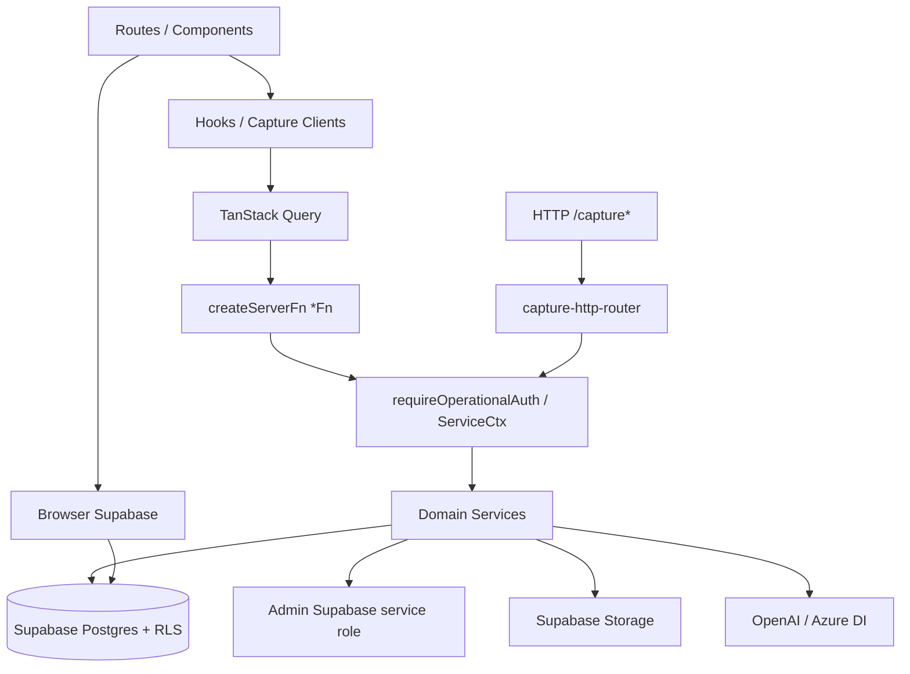

# EPC-00 — Architecture Audit

**Sprint:** EPC-00 — Baseline Arquitetural Enterprise  
**Modo:** Auditoria + Preparação (somente leitura)  
**Data:** 31/07/2026  
**Baseline código:** `medicflow-mvp-operational-v1.0.0` · commit `cb364c7`  
**Repositório auditado:** `MedFlow-IA/`  
**Impacto funcional:** nenhum — nenhum código, banco, API, UI ou fluxo foi alterado.

---

## 1. Sumário executivo

O MedicFlow opera hoje como **plataforma operacional hospitalar/cooperativa** (escalas, plantões, TISS, financeiro operacional, captura inteligente, Operations Manager). A stack é **TanStack Start + React 19 + Supabase + Cloudflare Workers**, com lógica de aplicação concentrada em **server functions** (`createServerFn`) e **services**, sem camada Repository clássica.

A arquitetura é **parcialmente em camadas**: a Captura Inteligente já apresenta fronteiras mais claras (services → engine → infrastructure → providers). O restante do sistema acopla-se diretamente a **Supabase (Postgres + Storage + Auth + RLS)** e a provedores externos (OpenAI, Azure Document Intelligence) via fetch.

**Veredito EPC-00:** o produto tem base suficiente para evoluir a Enterprise Platform Core, mas **não está pronto** para multi-cooperativa / multi-operadora / multi-storage / multi-banco / multi-OCR / multi-IA sem evolução arquitetural controlada nas sprints seguintes. Esta sprint apenas documenta o gap — **não corrige**.

---

## 2. Escopo da auditoria

| Incluído | Excluído (proibido nesta sprint) |
|----------|----------------------------------|
| Inventário de módulos, camadas, serviços, stores, providers | Implementar IA, Rule Engine, OCR novo |
| Mapeamento de dependências e acoplamentos | Alterar fluxos, UI, banco, APIs |
| Identificação de bloqueios Enterprise | Refatorar código |
| Contagens de validação | Mudança de comportamento funcional |

---

## 3. Estrutura do repositório

```
d:\Projetos\MedFlow-IA\                 ← workspace shell
├── MedFlow-IA\                         ← aplicação canônica (código real)
│   ├── src\
│   │   ├── routes\                     ← UI / rotas (25 arquivos)
│   │   ├── components\                 ← UI compartilhada (~71)
│   │   ├── hooks\                      ← application adapters (29)
│   │   ├── modules\capture\            ← único módulo formal (53 arquivos)
│   │   └── lib\                        ← domínio + services + infra (~508)
│   ├── supabase\migrations\            ← 30 migrations / RLS
│   ├── scripts\                        ← validação, RAG, testes capture
│   ├── knowledge\                      ← corpus RAG
│   └── docs\                           ← documentação (incl. este pacote)
├── medflow-dashboard\                  ← shell vazio (nested git)
└── supabase\.temp\                     ← metadata de link (não migrations)
```

---

## 4. Stack tecnológica

| Camada | Tecnologia |
|--------|------------|
| UI | React 19, Tailwind 4, Radix (mínimo), Lucide |
| Roteamento / SSR | TanStack Start + TanStack Router |
| Estado servidor | TanStack Query |
| Backend app | `createServerFn` (~217 ocorrências; ~173 `export const *Fn`) |
| Persistência | Supabase Postgres + RLS (~72 tabelas, ~190 policies) |
| Auth | Supabase Auth + SSR cookies |
| Storage | Supabase Storage (`clinical-documents`, `tenant-branding`) |
| Deploy | Cloudflare Workers (primário); Vercel preparado |
| OCR | Azure Document Intelligence (live); GPT-4o Vision / Tesseract (stubs) |
| IA | OpenAI Chat Completions + Embeddings (fetch HTTP) |
| Edge Functions Supabase | **0** |

---

## 5. Mapa de módulos

### 5.1 Módulo formal (`src/modules`)

| Módulo | Arquivos | Papel |
|--------|---------:|-------|
| `capture` | 53 | Captura Inteligente (UI module + clients) |

### 5.2 Domínios em `src/lib` (29 áreas)

`auth`, `capture`, `commercial`, `domain`, `env`, `errors`, `executive-dashboard`, `financial-closing`, `knowledge`, `medical-payout`, `monitoring`, `observability`, `operational`, `operational-observability`, `operational-reconciliation`, `operations`, `pilot-execution`, `production-release`, `queries`, `rag`, `realtime`, `routes`, `security`, `server`, `services`, `supabase`, `tiss`, `toast`, `assets`.

### 5.3 Superfícies de produto (rotas — 25)

| Domínio | Rotas |
|---------|-------|
| Shell / Auth | `__root`, `index`, `login*` |
| Operacional | `escalas`, `plantoes`, `operacao` |
| Financeiro | `financeiro*`, fechamento, conciliação, dashboard executivo |
| TISS | `tiss` |
| Captura | `captura`, `captura/revisao.$sessionId`, `processamento`, `analytics` |
| Ops / IA | `central`, `executivo` |
| Tenant / Piloto | `instituicao`, `perfil`, `piloto`, `lancamento`, `ajuda`, `site` |

### 5.4 Inventário funcional (35 módulos de produto)

Fonte alinhada a `docs/AUDITORIA_COMPLETA_MEDICFLOW.md` (31/07/2026):

| Status | Qtd |
|--------|----:|
| IMPLEMENTADO | 18 |
| IMPLEMENTADO PARCIALMENTE | 8 |
| PLACEHOLDER | 2 |
| NÃO IMPLEMENTADO | 7 |
| **Total inventário** | **35** |

---

## 6. Camadas atuais (as-is)

```
┌─────────────────────────────────────────────────────────────┐
│ UI                                                          │
│  routes / components / modules/*/components|pages           │
├─────────────────────────────────────────────────────────────┤
│ Application adapters                                        │
│  hooks / modules/*/services/*-client.ts / TanStack Query    │
├─────────────────────────────────────────────────────────────┤
│ Application / API                                           │
│  createServerFn (*Fn) / capture-http-router / health        │
├─────────────────────────────────────────────────────────────┤
│ Domain / Services                                           │
│  lib/services/** + lib/capture/**/services + operations     │
│  domain thin: multi-tenant convention + operations errors   │
├─────────────────────────────────────────────────────────────┤
│ Infrastructure (parcial)                                    │
│  server/supabase*, capture/infrastructure, OCR providers    │
├─────────────────────────────────────────────────────────────┤
│ Persistence                                                 │
│  Supabase Postgres + RLS (sem Repository clássico)          │
│  Stores: capture-session / processing-center / review       │
├─────────────────────────────────────────────────────────────┤
│ Storage                                                     │
│  Supabase Storage buckets (único mecanismo runtime)         │
├─────────────────────────────────────────────────────────────┤
│ External Services                                           │
│  OpenAI · Azure Document Intelligence · SMTP (não config.)  │
└─────────────────────────────────────────────────────────────┘
```

### Observações de camada

1. **Domain é fino** — `src/lib/domain` contém convenção multi-tenant e erros/enums de operations; regras de negócio estão majoritariamente em services.
2. **Sem Repository Pattern** — 0 classes `*Repository*`; persistência via `.from('table')` direto (~368 ocorrências em ~97 arquivos).
3. **Captura é o subdomain mais limpo** — OCR já tem interface `OcrProvider`; stores isolam sessão/processing/review.
4. **UI às vezes fala direto com Supabase** — ex.: upload de branding em `instituicao.tsx`.

---

## 7. Inventário quantitativo

| Item | Quantidade | Notas |
|------|----------:|-------|
| Módulos inventário produto | **35** | Inclui NÃO IMPLEMENTADO |
| Pacotes formais `src/modules` | **1** | `capture` |
| Domínios `src/lib` | **29** | pastas de topo |
| Rotas (`.tsx`) | **25** | |
| Componentes (`src/components`) | **71** | |
| Hooks (`src/hooks`) | **29** | +5 no módulo capture |
| Arquivos `*service*.ts` | **86** | |
| Pacotes em `lib/services` | **35** | |
| Services dentro de `lib/services` | **72** | |
| Repositories clássicos | **0** | |
| Stores (persistência abstrata) | **3** | capture |
| Providers (arquivos `*provider*`) | **8** | ver §9 |
| `createServerFn` | **217** | ocorrências |
| `export const *Fn` | **173** | APIs app |
| Migrations SQL | **30** | |
| Tabelas Postgres (est.) | **72** | todas com RLS |
| Policies RLS (est.) | **~190** | |
| Testes `*.test.ts` | **14** | capture/RAG |
| Edge Functions | **0** | |

---

## 8. Serviços (86 arquivos)

### 8.1 Captura / Operations (fora de `lib/services`) — 14

- Capture: preventive-audit, contract-intelligence, correction-assistant, learning-loop, ocr, tiss-parser, review-workspace, glosa-risk
- Operations: adaptive-prioritization, operational-analytics, operational-copilot-context, operational-recommendation, operational-scoring
- Module: `modules/capture/services/storage-service.ts`

### 8.2 Pacotes `lib/services` — 35 pastas / 72 services

| Pacote | Escopo |
|--------|--------|
| `tiss` (10) | guias, lotes, glosas, insurance, TUSS, XML export |
| `operations` (12) | agentes, orquestração, memória, policy, sandbox |
| `financial-closing` (5) | fechamento, snapshot, auditoria, competência |
| `medical-payout` (5) | repasse, produção, retenção |
| `reconciliation` (5) | conciliação, matching, divergências |
| `pilot-*` / release / readiness / smoke / security | go-live e operação |
| `tenant-settings` / `tenant-branding` | multi-tenant UI |
| demais | onboarding, help, export, reporting, commercial, demo |

---

## 9. Providers

| Arquivo | Tipo | Status |
|---------|------|--------|
| `tenant-branding-provider.tsx` | React Context | Ativo |
| `realtime-provider.tsx` | React Context | Ativo |
| `azure-document-intelligence-provider.ts` | OCR | **Implementado** |
| `gpt4-vision-provider.ts` | OCR | **Stub** |
| `tesseract-provider.ts` | OCR | **Stub** |
| `ocr/types/provider.ts` | Contrato OCR | Interface |
| `rag/embedding/openai-provider.ts` | Embeddings | Ativo (OpenAI) |
| `modules/capture/types/ocr-provider.ts` | Tipos módulo | Contrato |

**Total arquivos provider:** 8  
**Contratos plugáveis maduros:** OCR (`OcrProvider`)  
**Contratos ausentes/enterprise:** StoragePort, DatabasePort, AiProvider, TenantResolver, WorkflowEngine, RuleEngine

---

## 10. Repositories / Stores

| Artefato | Papel |
|----------|-------|
| `capture-session-store.ts` | Sessões de captura |
| `processing-center-store.ts` | Fila / centro de processamento |
| `review-workspace-store.ts` | Workspace de revisão |

Não há abstração de repositório para TISS, financeiro, scales, payouts ou tenants — o acesso é direto ao cliente Supabase.

---

## 11. Fluxo de dados (as-is)



**Caminho principal:** UI → Hook → Server Fn → Auth/ServiceCtx → Service → Supabase.  
**Caminho secundário:** UI → Browser Supabase (auth, branding upload).  
**Caminho captura HTTP:** `/capture` → router → mesmos services.

---

## 12. Multi-tenant / operadora / contrato / cooperativa

| Conceito | Situação atual |
|----------|----------------|
| **Tenant** | First-class (`tenant_id`, RLS, `ServiceCtx.tenantId`, branding, settings) |
| **Operadora** | Tabelas `insurance_providers` + services TISS + regras capture |
| **Contrato** | `insurance_contracts` / `insurance_rules` + contract intelligence com seed hardcoded (ex.: Unimed) |
| **Cooperativa** | Linguagem de produto; **sem entidade `cooperativa` dedicada** no modelo — mapeada implicitamente a tenant |
| **Workflows múltiplos** | Pipeline capture linear; sem workflow engine configurável por tenant |
| **Múltiplos bancos** | Um único Postgres Supabase |
| **Múltiplos storages** | Apenas Supabase Storage |
| **Múltiplos OCR** | Interface existe; runtime efetivo = Azure only |
| **Múltiplos IA** | OpenAI hardcoded via fetch; sem AiProvider registry |

---

## 13. Dependências externas

### 13.1 Runtime (package.json)

`@supabase/supabase-js`, `@supabase/ssr`, `@tanstack/*`, `react`/`react-dom`, Tailwind/Radix/Lucide, `@cloudflare/vite-plugin`.

### 13.2 Serviços externos (env-driven)

| Serviço | Variáveis / uso |
|---------|-----------------|
| Supabase | `VITE_SUPABASE_URL`, `VITE_SUPABASE_ANON_KEY`, `SUPABASE_SERVICE_ROLE_KEY` |
| OpenAI | `MEDFLOW_OPENAI_API_KEY` / `OPENAI_API_KEY`, model/embedding envs |
| Azure DI | `MEDFLOW_AZURE_DOCUMENT_INTELLIGENCE_*` |
| Cloudflare | `wrangler.jsonc` (account_id, staging host) |
| SMTP | Necessário para recovery; tipicamente não configurado |

### 13.3 Dependências críticas (bloqueiam Enterprise se não abstraídas)

1. **Supabase como persistence + auth + storage + realtime** (monolítico)
2. **RLS + helpers SQL** (`current_tenant_ids`, etc.) como fronteira de tenancy
3. **Bucket names e paths** acoplados ao domínio capture
4. **OpenAI** como único motor de Copilot/RAG embeddings
5. **Azure DI** como único OCR efetivo
6. **Server functions TanStack** como único estilo de API (acoplamento de plataforma)

---

## 14. Código hardcoded identificado (não corrigido)

| Item | Evidência |
|------|-----------|
| Buckets `clinical-documents`, `tenant-branding` | constantes / rotas |
| Regras de contrato seed Unimed (`operator: "123456"`, contratos nomeados) | `default-contract-rules.ts` |
| Primary OCR = `azure_document_intelligence` | `ocr-orchestrator.ts` |
| URLs OpenAI `https://api.openai.com/v1/...` | GPT + embeddings |
| Domínios staging `staging.medicflow.app.br` | `wrangler.jsonc`, `medflow-domains.ts` |
| Cloudflare `account_id` | `wrangler.jsonc` |
| Contato default `contato@medicflow.ai` | startup-checks |
| Google Fonts URLs | `__root.tsx`, CSP |
| KPIs ilustrativos no hub financeiro | rota `financeiro` (placeholder) |
| Modelo Azure `prebuilt-layout` | provider Azure |

---

## 15. Acoplamentos identificados (não corrigidos)

| Acoplamento | Severidade | Descrição |
|-------------|------------|-----------|
| Services → Supabase client | **Alta** | ~97 arquivos com `.from(...)`; sem port de persistência |
| Auth/tenancy → Supabase RLS | **Alta** | Isolamento depende de JWT + policies SQL |
| Storage → Supabase buckets | **Alta** | Sem StoragePort; paths PHI no bucket único |
| OCR runtime → Azure | **Média** | Interface existe; fallbacks stubs |
| Copilot/RAG → OpenAI | **Alta** | Sem AiProvider; URLs e payloads acoplados |
| UI → Storage direto | **Média** | Branding upload na rota |
| Regras → código TypeScript | **Alta** | Audit rules + contract rules embutidas; sem Rule Engine externo |
| Domínio → Tenant único flat | **Média** | Sem hierarquia cooperativa → unidades → contratos |
| Deploy → Cloudflare-specific | **Baixa/Média** | Também há caminho Vercel; worker assumptions |

---

## 16. Componentes compartilhados

| Área | Qtd / notas |
|------|-------------|
| `src/components/ui` | shadcn mínimo (avatar, button, input, label, switch) |
| `src/components/operational` | 23 — maior kit compartilhado |
| `src/components/pilot-launch` | 14 |
| Auth / shell / toast / branding / readiness | shell de plataforma |
| `src/lib/queries` | adapters, keys, result |
| `src/lib/auth` | RBAC, route-guard, auth context |

---

## 17. Pontos que impedem arquitetura Enterprise (somente identificação)

1. **Ausência de ports/adapters** para DB, Storage, OCR (parcial), AI, Messaging.
2. **Repository Pattern inexistente** — troca de banco exigiria reescrita ampla.
3. **Tenant model flat** — insuficiente para cooperativa → múltiplas instituições/contratos/workflows.
4. **Regras de negócio embutidas** em TS (audit, contract, alerts) — não configuráveis por tenant/operadora em runtime enterprise.
5. **Dependência monolítica de Supabase** (Auth+DB+Storage+Realtime).
6. **OCR/IA sem registry configurável por tenant** (apenas OCR interface parcial).
7. **Sem Workflow Engine** — pipelines fixos.
8. **Sem abstração de multi-database / read-replicas / data residency**.
9. **UI e Application misturam** acesso direto a infra em pontos pontuais.
10. **Domain layer insuficiente** para proteger invariantes enterprise.

---

## 18. O que já aponta na direção certa

- Interface `OcrProvider` + orchestrator
- `ServiceCtx` com `tenantId` + auth guards
- RLS em todas as tabelas
- Separação capture (stores + infrastructure folders)
- Feature flags em pilot-execution
- Pacote amplo de services de domínio operacional
- Contratos de tipos para audit/contract rules (ainda seed em código)

---

## 19. Validações obrigatórias (consolidadas)

| # | Validação | Resultado |
|---|-----------|-----------|
| 1 | Quantidade de módulos | **35** (inventário produto) · **1** formal `src/modules` · **29** domínios `lib` |
| 2 | Quantidade de serviços | **86** arquivos `*service*.ts` |
| 3 | Quantidade de repositories | **0** clássicos · **3** stores |
| 4 | Quantidade de providers | **8** arquivos (`*provider*`) |
| 5 | Dependências externas | Supabase, OpenAI, Azure DI, Cloudflare, (SMTP) |
| 6 | Dependências críticas | Supabase monolítico, RLS tenancy, OpenAI, Azure, buckets, ServerFns |
| 7 | Código hardcoded | Buckets, regras Unimed, OCR primary, URLs OpenAI, domínios CF, KPIs mock |
| 8 | Acoplamentos | Services↔Supabase, Storage, OCR/AI, rules-in-code, UI↔storage |
| 9 | Totalmente reutilizáveis | Ver `EPC-00_REUSE_MATRIX.md` |
| 10 | Precisarão evoluir | Ver `EPC-00_REUSE_MATRIX.md` |

---

## 20. Artefatos desta sprint

| Documento | Conteúdo |
|-----------|----------|
| `EPC-00_ARCHITECTURE_AUDIT.md` | Este relatório |
| `EPC-00_REUSE_MATRIX.md` | Classificação de reutilização |
| `EPC-00_TARGET_ARCHITECTURE.md` | Arquitetura-alvo Enterprise |
| `EPC-00_ROADMAP.md` | Árvore oficial + matriz de evolução |
| `EPC-00_RISK_ANALYSIS.md` | Riscos de regressão e controles |

---

## 21. Critério de sucesso EPC-00

| Critério | Status |
|----------|--------|
| Visão completa da arquitetura atual | **Atendido** |
| Arquitetura-alvo Enterprise definida | **Atendido** (doc target) |
| Roadmap técnico validado | **Atendido** (doc roadmap) |
| Zero impacto funcional | **Atendido** — documentação apenas |

**Próximo passo (fora desta sprint):** EPC-01 — introdução de ports/adapters e contratos do Core, sem mudar comportamento observável.
