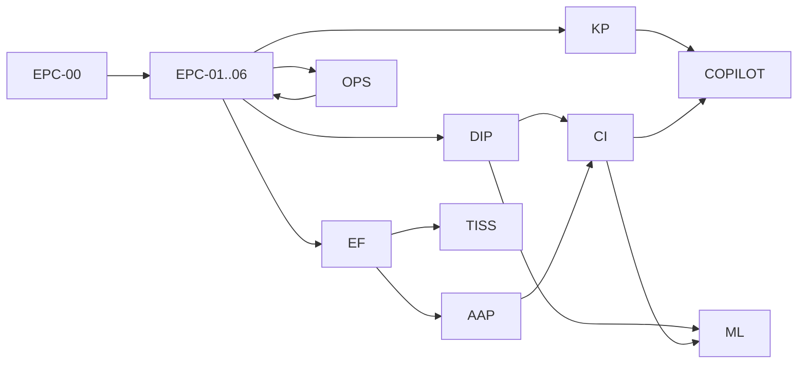

# EPC-00 — Enterprise Roadmap Tree & Evolution Matrix

**Sprint:** EPC-00 — Baseline Arquitetural Enterprise  
**Data:** 31/07/2026  
**Baseline:** `cb364c7` · `medicflow-mvp-operational-v1.0.0`  
**Natureza:** Roadmap técnico documental — sem implementação.

---

## 1. Árvore oficial do roadmap Enterprise

```
MEDICFLOW ENTERPRISE
│
├── EPC  Enterprise Platform Core
│     ├── EPC-00  Architecture Audit & Baseline          ← ESTA SPRINT
│     ├── EPC-01  Ports & Adapters skeleton (no behavior change)
│     ├── EPC-02  Org/Tenant context unification
│     ├── EPC-03  Persistence Port + Supabase adapter
│     ├── EPC-04  Storage Port + Supabase adapter
│     ├── EPC-05  Config / Feature / Provider bindings
│     └── EPC-06  Compatibility certification (parity MVP)
│
├── EF   Enterprise Foundation
│     ├── EF-01   Org hierarchy (cooperativa → instituição)
│     ├── EF-02   Multi-operadora registry
│     ├── EF-03   Multi-contrato versionado
│     ├── EF-04   Rule packs externos (substituir seeds hardcoded)
│     └── EF-05   Workflow profiles por contrato/tenant
│
├── DIP  Document Intelligence Platform
│     ├── DIP-01  OCR registry production (fallbacks reais)
│     ├── DIP-02  Parser port + multi-guide strategies
│     ├── DIP-03  Review/Processing as workflow steps
│     └── DIP-04  Capture analytics enterprise metrics
│
├── KP   Knowledge Platform
│     ├── KP-01   Embedding provider port
│     ├── KP-02   Vector store port (pgvector default)
│     ├── KP-03   Corpus governance multi-tenant
│     └── KP-04   RAG certification E2E
│
├── CI   Capture / Operational Intelligence
│     ├── CI-01   Risk engine configurável
│     ├── CI-02   Learning loop production feedback
│     ├── CI-03   Recommendation policies per tenant
│     └── CI-04   Contract intelligence dynamic packs
│
├── AAP  Audit & Appeals Platform
│     ├── AAP-01  Preventive audit rule engine runtime
│     ├── AAP-02  Denial audit unification
│     ├── AAP-03  Appeals workflow
│     └── AAP-04  Audit trail enterprise export
│
├── TISS Billing Exchange
│     ├── TISS-01 XML/ANS compliance path
│     ├── TISS-02 Operadora integration adapters
│     ├── TISS-03 Batch/return processing enterprise
│     └── TISS-04 api_ingest channel
│
├── OPS  Operations Platform
│     ├── OPS-01  Staging P0 clearance (mig/bucket/secrets/SMTP)
│     ├── OPS-02  Observability SLOs
│     ├── OPS-03  Multi-env promotion (staging → prod)
│     └── OPS-04  Chaos/resilience drills
│
├── COPILOT Assistants
│     ├── COPILOT-01 AiProvider port (OpenAI default)
│     ├── COPILOT-02 Tool sandbox hardening
│     ├── COPILOT-03 RAG-grounded answers certified
│     └── COPILOT-04 Tenant-scoped copilots
│
└── ML   Machine Learning
      ├── ML-01   Feature store / labeled datasets
      ├── ML-02   Denial risk supervised models
      ├── ML-03   OCR custom models
      └── ML-04   Scheduling optimization models
```

---

## 2. Dependências entre trilhas



**Regra de ouro:** nenhuma trilha de produto (TISS, DIP avançado, COPILOT, ML) altera o Core sem passar por contratos EPC.

---

## 3. Matriz de evolução por módulo

Legenda de risco/complexidade/prioridade: **Baixo | Médio | Alto | Crítico**

| Módulo / Trilha | Situação atual | Situação futura | Risco | Complexidade | Prioridade | Dependências |
|-----------------|----------------|-----------------|-------|--------------|------------|--------------|
| **EPC Core** | Services + ServerFns acoplados a Supabase | Ports/adapters + domain core | Alto | Alta | **P0** | — |
| **Tenancy / Org** | `tenant_id` flat + RLS | Hierarquia cooperativa/instituição/contrato | Crítico | Alta | **P0** | EPC |
| **Auth / RBAC** | Supabase Auth + roles | Auth port + capabilities por produto | Médio | Média | **P0** | EPC |
| **Persistence** | `.from()` direto (0 repos) | PersistencePort + repos | Alto | Alta | **P0** | EPC |
| **Storage** | Só Supabase buckets | StoragePort multi-backend | Alto | Média | **P0** | EPC |
| **Config / Flags** | Pilot flags + env | Provider bindings + config service | Médio | Média | **P1** | EPC |
| **EF Operadoras** | Tabelas insurance_* | Registry multi-operadora enterprise | Médio | Média | **P1** | EPC, EF |
| **EF Contratos** | CRUD + seeds Unimed | Contratos versionados + packs | Alto | Alta | **P1** | EF |
| **EF Workflows** | Pipeline linear capture | Workflow profiles | Alto | Alta | **P2** | EF, DIP |
| **DIP OCR** | Azure live; 2 stubs | Registry + fallbacks reais | Médio | Média | **P1** | EPC, DIP |
| **DIP Parser** | TISS parser service | ParserPort multi-estratégia | Médio | Média | **P1** | DIP |
| **DIP Review/Processing** | Stores + UI | Steps de workflow | Médio | Média | **P2** | DIP, EF |
| **CI Risk / Learning** | Heurístico + loop código | Config + feedback produção | Médio | Alta | **P2** | DIP, AAP |
| **AAP Audit rules** | Regras TS embutidas | Rule engine + packs | Alto | Alta | **P1** | EF |
| **AAP Denials/Appeals** | Services TISS | Plataforma unificada | Médio | Média | **P2** | TISS, AAP |
| **TISS Exchange** | Foundation + XML MVP | ANS + adapters operadora | Alto | Alta | **P2** | EF, EPC |
| **Financeiro ops** | Fechamento/repasse/concilição OK; hub mock | Capability financeira estável | Médio | Média | **P2** | EPC |
| **KP RAG** | pgvector + OpenAI embed | Ports multi-provider | Médio | Média | **P2** | EPC, KP |
| **COPILOT** | OpenAI tools acoplados | AiProvider + tenant scope | Alto | Alta | **P2** | EPC, KP, OPS |
| **OPS Platform** | Staging com P0 abertos | Multi-env certificado | Crítico* | Média | **P0** | — |
| **ML** | Inexistente | Serving + training pipelines | Alto | Alta | **P3** | CI, DIP, KP |
| **UI Apps** | Route-centric | Apps sobre Application API | Baixo** | Média | **P3** | EPC |
| **Integrações** | Env-only | Integration bus | Alto | Alta | **P2** | EPC, TISS |

\* Risco **operacional** atual (staging), não de design.  
\*\* Risco baixo **se** UI não for alterada enquanto ports nascem atrás das APIs.

---

## 4. Ondas de entrega (visão executiva)

### Onda 0 — Baseline (agora)

- EPC-00 docs (este pacote)
- Congelar comportamento MVP como contrato de regressão

### Onda 1 — Core sem mudança funcional

- EPC-01…06 + OPS-01
- Introduzir ports com adapters default
- Certificar paridade

### Onda 2 — Foundation multi-entidade

- EF-01…04
- AAP-01 (rule packs)
- DIP-01 (OCR registry)

### Onda 3 — Capabilities enterprise

- TISS-01…02, DIP-02…03, KP-01…04, COPILOT-01…03
- CI calibrado com dados reais

### Onda 4 — Intelligence & ML

- ML-01…04
- Otimização e modelos supervisionados

---

## 5. Relação com roadmap legado de produto

O roadmap de versões 1.0 / 1.1 / 1.2 / 2.0 em `ROADMAP_IMPLEMENTACAO_REAL.md` **permanece válido para produto/piloto**.

Este documento **não substitui** o roadmap de release operacional; ele define a **árvore estrutural Enterprise** que evita refatoração futura.

| Roadmap legado | Como encaixa na árvore Enterprise |
|----------------|-----------------------------------|
| v1.1 desbloqueio staging | **OPS-01** |
| v1.2 piloto cooperativa | **EF** + **DIP** + **CI** + seeds |
| v2.0 IA/RAG/ML | **KP** + **COPILOT** + **ML** |
| Capture certificado | Base de **DIP** |
| OM / Central | **OPS** + **COPILOT** |

---

## 6. Definição de pronto por trilha (alto nível)

| Trilha | DoD estrutural |
|--------|----------------|
| EPC | Domain sem imports de vendor; adapters default certificados |
| EF | Org/contrato/regra configuráveis sem deploy de código |
| DIP | Troca de OCR por config; pipeline como workflow |
| KP | RAG E2E multi-tenant certificado |
| CI | Risk/learning calibráveis por tenant |
| AAP | Rule packs versionados + audit export |
| TISS | Integração operadora via adapter |
| OPS | Staging/prod sem P0; SLOs |
| COPILOT | AiProvider + grounding RAG |
| ML | Modelo versionado com eval gate |

---

## 7. O que EPC-00 entrega vs. não entrega

| Entrega | Status |
|---------|--------|
| Árvore oficial EPC→ML | **Entregue** (este doc) |
| Matriz de evolução | **Entregue** |
| Implementação de ports | **Não** (proibido) |
| Mudança de UI/API/DB | **Não** (proibido) |
| Novas features usuário | **Não** (proibido) |

---

## 8. Próxima sprint recomendada

**EPC-01 — Ports & Adapters skeleton**

- Criar contratos vazios/adapters default **sem** alterar comportamento
- Extrair interfaces mínimas (`PersistencePort` draft, `StoragePort` draft, `AiProvider` draft)
- Manter 100% das rotas/services funcionando como hoje
- Suite de regressão smoke + capture:test:all como gate

Qualquer implementação concreta fica **fora** de EPC-00.
