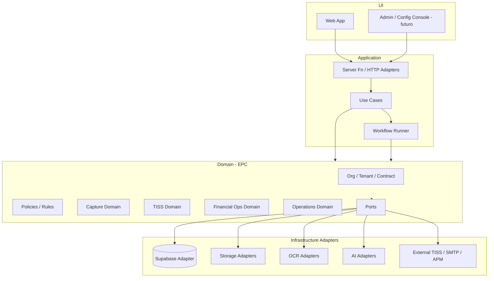

# EPC-00 — Target Architecture (Enterprise Platform Core)

**Sprint:** EPC-00 — Baseline Arquitetural Enterprise  
**Data:** 31/07/2026  
**Natureza:** Documentação de arquitetura-alvo — **sem alteração de código**  
**Compatibilidade:** deve preservar comportamento do MVP operacional atual via adapters default.

---

## 1. Visão

O MedicFlow deixa de evoluir como “um software específico” e passa a evoluir como **Enterprise Platform**:

> Uma plataforma multi-organização que orquestra operações de cooperativas/instituições, contratos com operadoras, workflows documentais/financeiros e motores pluggable (storage, DB, OCR, IA), sem acoplar o Domain Core a um único vendor.

O **Enterprise Platform Core (EPC)** é o núcleo estável. Produtos (Captura, TISS, Financeiro, OPS, Copilot, ML) são **capabilities** que plugam no Core.

---

## 2. Princípios-alvo

1. **Dependency Rule** — Domain não depende de Infrastructure; Infrastructure depende de Domain.
2. **Ports & Adapters** — toda I/O passa por interfaces versionadas.
3. **Multi-tenant by design** — tenancy/org hierarchy é cross-cutting, não afterthought.
4. **Config over code** — regras, workflows, providers e limites por organização/contrato.
5. **Compatibility first** — adapters default = Supabase + Azure OCR + OpenAI (comportamento atual).
6. **No big-bang rewrite** — strangler fig: ports atrás do código existente.
7. **Observability & audit** — toda mutação sensível é auditável e atribuível a tenant/ator.
8. **Fail closed on tenancy** — ausência de contexto de tenant é erro, nunca “all data”.

---

## 3. Camadas-alvo

```
┌────────────────────────────────────────────────────────────────┐
│ Presentation (UI Apps)                                         │
│  Web App (TanStack) · future Admin Console · APIs externas     │
├────────────────────────────────────────────────────────────────┤
│ Application (Use Cases / Orchestration)                        │
│  Commands · Queries · Workflow runners · Server Fn facades     │
├────────────────────────────────────────────────────────────────┤
│ Domain (Enterprise Platform Core)                              │
│  Entities · Value Objects · Domain Services · Policies         │
│  Ports (interfaces) · Domain Events                            │
├────────────────────────────────────────────────────────────────┤
│ Infrastructure (Adapters)                                      │
│  Supabase* · S3 · AzureBlob · OpenAI · AzureDI · Tesseract     │
│  Future: alternate DB · alternate LLM · message bus            │
├────────────────────────────────────────────────────────────────┤
│ Persistence / Storage / External                               │
│  Postgres · Object Storage · Vector Store · OCR · LLM APIs     │
└────────────────────────────────────────────────────────────────┘
  * adapter default na transição — não faz parte do Domain Core
```

### Mapeamento da arquitetura pedida

| Camada solicitada | Responsabilidade alvo |
|-------------------|------------------------|
| **UI** | Rotas/componentes; sem I/O de infra direta |
| **Application** | Use-cases; `*Fn` como adapters de transporte |
| **Domain** | Regras, entidades, ports; sem Supabase/OpenAI/Azure |
| **Infrastructure** | Implementações dos ports |
| **Persistence** | DB adapters (Postgres/Supabase hoje) |
| **Storage** | Object storage adapters |
| **External Services** | OCR, IA, SMTP, operadoras TISS, APM |

---

## 4. Building blocks do Enterprise Platform Core

### 4.1 Identity & Access

- AuthN adapter (Supabase Auth default; futuro SSO/OIDC)
- AuthZ: RBAC + capabilities por produto
- Session context: `Actor`, `OrgId`, `TenantId`, `Roles`, `ContractScope`

### 4.2 Organization & Tenancy

```
Cooperativa / Enterprise Account
 └── Institution / Tenant
      ├── Units (opcional)
      ├── Users / Professionals
      ├── Insurance Providers (operadoras)
      ├── Contracts (contratos)
      ├── Workflow Profiles
      └── Provider Bindings (OCR / AI / Storage)
```

**Nota:** hoje existe apenas `tenant`. A hierarquia acima é alvo — introdução em sprints EPC/EF **sem** quebrar `tenant_id` atual (compat layer).

### 4.3 Configuration Platform

- Feature flags (já existe base pilot)
- Provider bindings por tenant
- Limits / quotas
- Branding / locale
- Rule packs versionados

### 4.4 Persistence Ports

```ts
// Conceito documental — NÃO implementado nesta sprint
PersistencePort / UnitOfWork
Repository<TAggregate>
QueryPort (read models)
```

Default adapter: Supabase/Postgres + RLS.

### 4.5 Storage Ports

```ts
StoragePort {
  put / get / delete / signedUrl
  // path strategy: org/tenant/capability/object
}
```

Default: Supabase Storage buckets atuais.

### 4.6 Document Intelligence Ports

```ts
OcrProvider          // JÁ EXISTE
OcrProviderRegistry  // alvo: primary + fallbacks por tenant
ParserPort           // TISS/guide structuring
```

### 4.7 AI Ports

```ts
AiChatProvider
EmbeddingProvider
ToolExecutor (já há embrião em operations/copilot-gpt)
```

Default: OpenAI.

### 4.8 Rules & Policies

```ts
RuleDefinition (versioned)
RulePack (por operadora/contrato/tenant)
PolicyEvaluator
```

Hoje: regras TS embutidas → alvo: packs carregáveis (EF).

### 4.9 Workflow Engine (leve)

```ts
WorkflowDefinition
WorkflowInstance
StepHandlers (OCR → Parse → Audit → Risk → Review → …)
```

Não é BPMN completo na primeira onda; é orquestração configurável por tenant/contrato.

### 4.10 Integration Bus

- Outbound adapters (TISS webservice, webhooks, export)
- Inbound adapters (`api_ingest`, CSV, XML)
- Idempotency + audit

### 4.11 Observability

- Health (já existe)
- Structured logs / security audit (existe base)
- Metrics / SLOs por capability
- Trace correlation `tenantId` + `requestId`

---

## 5. Diagrama lógico alvo



---

## 6. Bounded contexts (alvo)

| Context | Responsabilidade | Pacotes atuais de origem |
|---------|------------------|--------------------------|
| **EPC** Platform | Tenancy, authz, config, ports, audit | `auth`, `domain`, `tenant-*`, `server`, `security` |
| **EF** Enterprise Foundation | Org hierarchy, contract registry, rule packs | `tiss/insurance*`, `capture/contract`, `capture/audit/rules` |
| **DIP** Document Intelligence | OCR, parse, review, processing | `lib/capture`, `modules/capture` |
| **KP** Knowledge Platform | RAG, embeddings, corpus | `lib/rag`, `knowledge` |
| **CI** Clinical/Ops Intelligence* | Scoring, risk, recommendations | capture risk + operations scoring |
| **AAP** Audit & Appeals | Preventive audit, denials, appeals | capture audit + tiss denial* |
| **TISS** Billing Exchange | Guias, lotes, XML/API operadora | `lib/services/tiss`, `lib/tiss` |
| **OPS** Operations Platform | Health, deploy, monitoring, pilot | operational-*, pilot-*, readiness |
| **COPILOT** Assistants | GPT tools, context, UX central | `operations/copilot*` |
| **ML** Machine Learning | Model training/serving, denial ML | (não existe — greenfield) |

\* Nome CI no roadmap Enterprise = inteligência de captura/risco operacional — **não** EHR clínico.

---

## 7. Contratos de compatibilidade (obrigatórios)

Durante a transição, o sistema **deve** manter:

| Compatibilidade | Estratégia |
|-----------------|------------|
| APIs `*Fn` existentes | Facades → novos use-cases; assinaturas estáveis |
| Schema Postgres atual | Adapters leem/escrevem mesmas tabelas |
| RLS | Permanece no adapter Supabase |
| Buckets atuais | Default StorageAdapter continua usando os mesmos nomes |
| OCR Azure primary | Default registry binding |
| OpenAI Copilot | Default AiChatProvider |
| Rotas UI | Sem mudança nesta fase; UI só muda em sprints de produto |

**Regra:** qualquer port novo nasce com **um adapter default** que reproduz o comportamento atual byte-a-byte do ponto de vista do usuário.

---

## 8. Multi-mecanismos (como o Core habilita)

| Mecanismo | Abordagem alvo |
|-----------|----------------|
| Múltiplas cooperativas | `EnterpriseAccount` + memberships |
| Múltiplas operadoras | `InsuranceProvider` registry por org |
| Múltiplos contratos | `Contract` versionado + rule packs |
| Múltiplos workflows | `WorkflowDefinition` por contrato/tenant |
| Múltiplos storages | `StoragePort` + binding config |
| Múltiplos bancos | `PersistencePort` + connection binding (fase tardia) |
| Múltiplos OCR | `OcrProviderRegistry` (estender o que já existe) |
| Múltiplos IAs | `AiProviderRegistry` |

---

## 9. Estrutura de pastas alvo (proposta documental)

Não criar nesta sprint — apenas referência para EPC-01+:

```
src/
  core/                     # EPC Domain + Ports
    tenancy/
    identity/
    config/
    ports/
  capabilities/
    capture/                # DIP (evolução de lib/capture + modules/capture)
    tiss/
    financial/
    operations/
    knowledge/
    copilot/
  adapters/
    persistence/supabase/
    storage/supabase/
    ocr/azure|openai|tesseract/
    ai/openai/
    messaging/
  apps/
    web/                    # routes, components (hoje src/routes)
```

Migração: **incremental** (strangler), nunca big-bang.

---

## 10. Quality attributes alvo

| Atributo | Meta |
|----------|------|
| Extensibilidade | Novo OCR/IA/Storage sem alterar Domain |
| Isolamento | Impossível ler cross-tenant sem privilege path auditado |
| Auditabilidade | Trilha completa de decisões de regra/IA |
| Escalabilidade | Workloads por capability; storage/DB substituíveis |
| Operabilidade | Health, readiness, feature flags, sandboxes |
| Testabilidade | Ports mockáveis; suites por capability |

---

## 11. Fora de escopo do Core

- EHR / prontuário clínico
- ERP financeiro completo (AP/AR/cashflow)
- Treino ML (fica em ML capability)
- UI redesign
- Troca imediata de vendor (Supabase permanece default)

---

## 12. Critério de “Core pronto”

O EPC estará estruturalmente pronto quando:

1. Domain não importar SDKs de Supabase/OpenAI/Azure.
2. Todo I/O passar por ports com adapters registrados.
3. Tenancy/org context for obrigatório em use-cases.
4. Provider bindings (OCR/AI/Storage) forem configuráveis por tenant.
5. Suites de regressão garantirem paridade com MVP atual.

**Estado em EPC-00:** critérios documentados; **0% implementados nesta sprint (esperado).**
